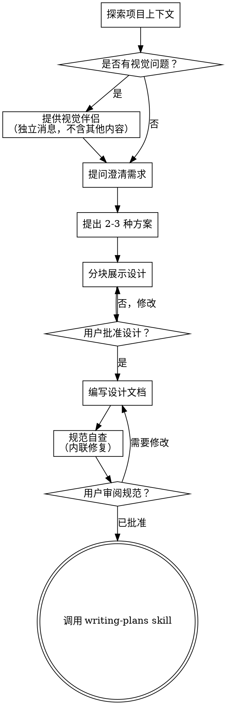

# 将创意构思为设计方案

通过自然的协作对话，将想法转化为完整的设计方案和规范。

从了解当前项目上下文开始，然后逐一提出问题来打磨想法。当明确了要构建什么之后，呈现设计方案并获得用户批准。

<HARD-GATE>
在呈现设计方案并获得用户批准之前，禁止调用任何实现类 skill、编写任何代码、搭建任何项目或采取任何实现行动。这条规则适用于每一个项目，无论你认为它有多简单。
</HARD-GATE>

## 反模式："这个太简单了，不需要设计"

每个项目都要走这个流程。待办列表、单函数工具、配置变更——全部都要。"简单"项目正是未经检验的假设导致最多返工的地方。设计方案可以很短（对于真正简单的项目几句话即可），但你必须呈现并获得批准。

## 检查清单

你必须为以下每一项创建任务并按顺序完成：

1. **探索项目上下文** — 检查文件、文档、近期提交
2. **提供视觉伴侣**（如果主题涉及视觉问题）— 独立发送一条消息，不要与澄清问题混在一起。详见下方的视觉伴侣章节。
3. **提问澄清需求** — 逐一提问，理解目的、约束和成功标准
4. **提出 2-3 种方案** — 附带权衡分析和你的推荐
5. **分块展示设计** — 根据复杂度决定详细程度，每块获得用户批准后再继续
6. **编写设计文档** — 保存到 `docs/superpowers/specs/YYYY-MM-DD-<主题>-design.md` 并提交
7. **规范自查** — 快速内联检查占位符、矛盾、歧义和范围（见下方说明）
8. **用户审核书面规范** — 在继续之前请用户审阅规范文件
9. **过渡到实现** — 调用 writing-plans skill 创建实现计划

## 流程

**最终状态是调用 writing-plans。** 不要调用 frontend-design、mcp-builder 或其他任何实现类 skill。brainstorming 之后唯一能调用的 skill 是 writing-plans。

## 流程详解

**理解想法：**

- 首先了解当前项目状态（文件、文档、近期提交）
- 在提问细节之前，先评估范围：如果需求涉及多个独立子系统（例如"构建一个包含聊天、文件存储、计费和分析的平台"），立即指出。不要把时间花在细化一个需要先分解的项目细节上。
- 如果项目太大无法在一个规范中完成，帮助用户拆分为子项目：哪些是独立部分、它们之间如何关联、应该按什么顺序构建。然后通过正常的设计流程对第一个子项目进行构思。每个子项目都有自己独立的规范 → 计划 → 实现周期。
- 对于范围合适的项目，每次提一个问题来打磨想法
- 在可能的情况下优先使用选择题，但开放性问题也可以
- 每条消息只提一个问题——如果一个主题需要深入探讨，拆分成多个问题
- 重点理解：目的、约束、成功标准

**探索方案：**

- 提出 2-3 种不同方案，附带权衡分析
- 以对话方式呈现选项，包含你的推荐和理由
- 先说你的推荐方案并解释原因

**展示设计：**

- 当你认为理解了要构建什么之后，呈现设计方案
- 根据复杂度决定每个部分的详略：简单的几句话即可，复杂的写到 200-300 字
- 每展示完一个部分就询问是否合理
- 覆盖：架构、组件、数据流、错误处理、测试
- 如果某些地方不合理，随时准备回溯澄清

**隔离性和清晰性设计：**

- 将系统拆分为更小的单元，每个单元有单一清晰的职责，通过定义良好的接口通信，可以独立理解和测试
- 对于每个单元，你应该能回答：它做什么、怎么用、依赖什么？
- 是否能不阅读内部实现就理解一个单元的功能？是否能修改内部实现而不影响调用方？如果答案是否定的，边界需要重新设计。
- 更小、边界清晰的单元也更适合你工作——你能更好地理解能在上下文中一次性容纳的代码，文件职责聚焦时你的编辑也更加可靠。当文件变得很大时，通常意味着它做的事情太多。

**在现有代码库中工作：**

- 在提出修改之前先探索现有结构。遵循现有模式。
- 如果现有代码的问题影响了当前工作（例如文件变得太大、边界不清晰、职责混杂），在设计中有针对性地包含改进方案——就像优秀开发者在修改代码时顺带提升代码质量一样。
- 不要提出无关的重构。专注于服务于当前目标的事情。

## 设计完成后

**文档：**

- 将验证通过的设计（规范）写入 `docs/superpowers/specs/YYYY-MM-DD-<主题>-design.md`
  - （用户对规范文件的存储位置偏好会覆盖此默认路径）
- 如果有可用的话，使用 elements-of-style:writing-clearly-and-concisely skill
- 将设计文档提交到 git

**规范自查：**
写完规范文档后，用全新的视角审视一遍：

1. **占位符扫描：** 是否有"TBD"、"TODO"、不完整的部分或模糊的需求？修复它们。
2. **内部一致性：** 各部分之间是否有矛盾？架构描述是否与功能描述匹配？
3. **范围检查：** 是否足够聚焦，适合单个实现计划？还是需要进一步分解？
4. **歧义检查：** 是否有任何需求可以有两种不同的解释？如果有，选定一种并明确说明。

修复发现的问题即可。无需重新审阅——修复后继续。

**用户审核关卡：**
在规范自查循环通过后，请用户审阅书面规范再继续：

> "规范已编写并提交到 `<路径>`。请审阅，如有需要修改的地方请告知，然后我们再开始编写实现计划。"

等待用户回复。如果用户要求修改，进行修改并重新运行规范自查循环。只有在用户批准后才能继续。

**实现：**

- 调用 writing-plans skill 创建详细的实现计划
- 不要调用任何其他 skill。writing-plans 是下一个步骤。

## 关键原则

- **一次只问一个问题** — 不要一次提多个问题让人应接不暇
- **优先选择题** — 在可能的情况下，选择题比开放性问题更容易回答
- **严格遵循 YAGNI** — 从所有设计中移除不必要的功能
- **探索替代方案** — 在确定方案之前，总是提出 2-3 种方案
- **增量确认** — 展示设计，获得批准后再继续
- **保持灵活** — 当某些内容不合理时，随时回溯澄清

## 视觉伴侣

一个基于浏览器的伴侣工具，用于在构思过程中展示原型图、图表和视觉选项。它是一种可用的工具，而不是一种模式。接受伴侣意味着在适合视觉化的问题上可以使用它；并不意味着每个问题都要通过浏览器展示。

**提供伴侣：** 当你预计即将讨论的问题涉及视觉内容（原型图、布局、图表）时，征得一次同意：
> "我们要讨论的某些内容如果我能通过浏览器展示给你看，可能会更容易解释。我可以在过程中制作原型图、图表、对比图和其他可视化内容。这个功能还比较新，并且可能消耗较多 token。想试试吗？（需要打开本地 URL）"

**这条提供消息必须独立发送。** 不要将其与澄清问题、上下文总结或任何其他内容混在一起。消息中只应包含上述提供文本，没有其他内容。等待用户回复后再继续。如果用户拒绝，以纯文本方式进行构思。

**逐问题决策：** 即使用户已经接受了伴侣，也要**针对每个问题**决定是使用浏览器还是终端。判断标准：**用户通过看比通过读能更好地理解这个问题吗？**

- **使用浏览器**展示**本质上是视觉的**内容——原型图、线框图、布局对比、架构图、并排视觉设计
- **使用终端**展示**本质上是文本的**内容——需求问题、概念性选择、权衡列表、A/B/C/D 文本选项、范围决策

关于 UI 主题的问题不自动等同于视觉问题。"在这个上下文中，'个性'指的是什么？" 是概念性问题——用终端。"哪种向导布局效果更好？" 是视觉性问题——用浏览器。

如果用户同意使用伴侣，在继续之前阅读详细指南：
`skills/brainstorming/visual-companion.md`
