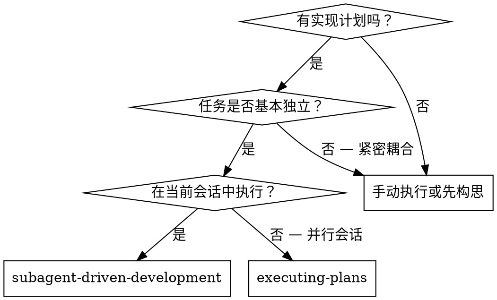
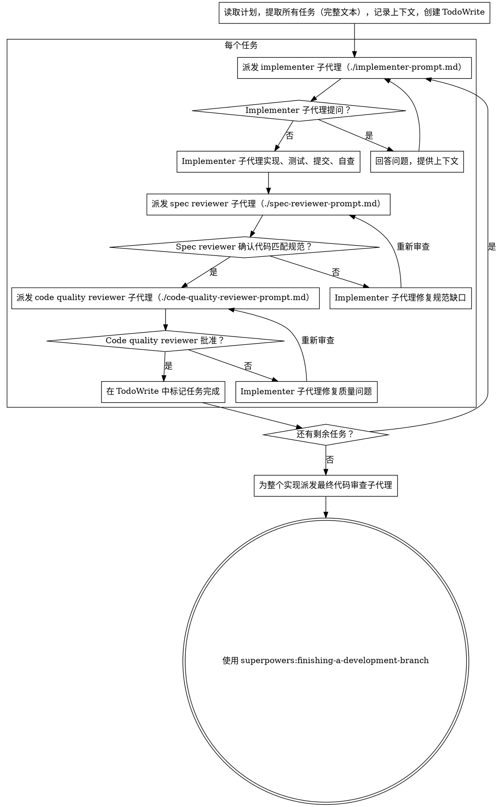

# Subagent-Driven Development（子代理驱动开发）

执行计划时，为每个任务派发全新的子代理，每个任务完成后进行两阶段审查：先规范合规审查，再代码质量审查。

**为什么用子代理：** 你将任务委派给具有隔离上下文的专用代理。通过精确构建它们的指令和上下文，确保它们保持专注并成功完成任务。它们**绝不应**继承你当前会话的上下文或历史——你需要精确构建它们所需的内容。这也为你保留了用于协调工作的上下文空间。

**核心原则：** 每个任务使用全新子代理 + 两阶段审查（规范合规 → 代码质量）= 高质量、快速迭代

**持续执行：** 不要在任务之间停下来与你的伙伴确认。不间断地执行计划中的所有任务。唯一需要停止的原因是：遇到无法解决的 BLOCKED 状态、确实阻碍进展的歧义、或者所有任务已完成。"要不要继续？"的提示和进度总结是在浪费他们的时间——他们让你执行计划，那就执行它。

## 何时使用



**vs. Executing Plans（并行会话）：**
- 同一会话（无上下文切换）
- 每个任务使用全新子代理（无上下文污染）
- 每个任务完成后两阶段审查：先规范合规，再代码质量
- 更快的迭代（任务之间无需人工介入）

## 流程



## 模型选择

使用能胜任每个角色的**最低成本模型**，以节省成本并提高速度。

**机械性实现任务**（独立函数、清晰的 spec、1-2 个文件）：使用快速、便宜的模型。当计划描述充分时，大多数实现任务都是机械性的。

**集成和判断类任务**（多文件协调、模式匹配、调试）：使用标准模型。

**架构、设计和审查任务**：使用最强大的可用模型。

**任务复杂度信号：**
- 涉及 1-2 个文件，spec 完整 → 便宜模型
- 涉及多个文件，有集成关注点 → 标准模型
- 需要设计判断力或广泛的代码库理解 → 最强大的模型

## 处理 Implementer 状态

Implementer 子代理会报告四种状态之一。需要恰当处理每种状态：

**DONE（完成）：** 进入规范合规审查。

**DONE_WITH_CONCERNS（完成但有顾虑）：** Implementer 完成了工作但标记了疑虑。在继续之前先阅读这些顾虑。如果顾虑涉及正确性或范围，在审查之前先处理它们。如果只是观察性意见（例如"这个文件变得有点大"），记录下来然后进入审查。

**NEEDS_CONTEXT（需要上下文）：** Implementer 需要未提供的信息。提供缺失的上下文后重新派发。

**BLOCKED（阻塞）：** Implementer 无法完成任务。评估阻塞原因：
1. 如果是上下文问题，提供更多上下文后用相同的模型重新派发
2. 如果任务需要更多推理能力，用更强的模型重新派发
3. 如果任务太大，拆分为更小的部分
4. 如果计划本身有误，上报给人类

**永远不要**忽视上报，或强行让同一个模型无变化地重试。如果 implementer 说它卡住了，说明某些地方需要改变。

## 提示模板

- `./implementer-prompt.md` — 派发 implementer 子代理的提示模板
- `./spec-reviewer-prompt.md` — 派发规范合规审查子代理的提示模板
- `./code-quality-reviewer-prompt.md` — 派发代码质量审查子代理的提示模板

## 示例工作流

```
你：我将使用 Subagent-Driven Development 来执行这个计划。

[一次性读取计划文件：docs/superpowers/plans/feature-plan.md]
[提取所有 5 个任务的完整文本和上下文]
[创建包含所有任务的 TodoWrite]

任务 1：Hook 安装脚本

[获取任务 1 的文本和上下文（已提取）]
[使用完整的任务文本 + 上下文派发实现子代理]

Implementer："在开始之前——这个 hook 应该安装在用户级别还是系统级别？"

你："用户级别（~/.config/superpowers/hooks/）"

Implementer："收到。现在开始实现..."
[稍后] Implementer：
  - 实现了 install-hook 命令
  - 添加了测试，5/5 通过
  - 自查：发现遗漏了 --force 标志，已添加
  - 已提交

[派发规范合规审查员]
Spec reviewer：✅ 规范合规 — 所有需求均满足，无多余内容

[获取 git SHA，派发代码质量审查员]
Code reviewer：优点：测试覆盖好，代码干净。问题：无。已批准。

[标记任务 1 完成]

任务 2：恢复模式

[获取任务 2 的文本和上下文（已提取）]
[使用完整的任务文本 + 上下文派发实现子代理]

Implementer：[无问题，直接开始]
Implementer：
  - 添加了 verify/repair 模式
  - 8/8 测试通过
  - 自查：一切正常
  - 已提交

[派发规范合规审查员]
Spec reviewer：❌ 问题：
  - 缺失：进度报告（规范要求"每 100 项报告一次"）
  - 多余：添加了 --json 标志（未要求）

[Implementer 修复问题]
Implementer：移除了 --json 标志，添加了进度报告

[Spec reviewer 重新审查]
Spec reviewer：✅ 现在规范合规了

[派发代码质量审查员]
Code reviewer：优点：扎实。问题（重要）：魔法数字（100）

[Implementer 修复]
Implementer：提取了 PROGRESS_INTERVAL 常量

[Code reviewer 重新审查]
Code reviewer：✅ 已批准

[标记任务 2 完成]

...

[所有任务完成后]
[派发最终代码审查员]
Final reviewer：所有需求已满足，可以合并

完成！
```

## 优势

**vs. 手动执行：**
- 子代理自然遵循 TDD
- 每个任务使用新上下文（无混淆）
- 可并行安全执行（子代理互不干扰）
- 子代理可以提问（工作中和开始前都可以）

**vs. Executing Plans：**
- 同一会话（无交接）
- 持续进展（无需等待）
- 审查检查点自动集成

**效率提升：**
- 无文件读取开销（controller 提供完整文本）
- Controller 精确筛选所需上下文
- 子代理一次性获得完整信息
- 问题在开始工作前就被提出（而非之后）

**质量关卡：**
- 自查在交接前发现问题
- 两阶段审查：规范合规、代码质量
- 审查循环确保修复确实有效
- 规范合规防止过度构建或构建不足
- 代码质量确保实现结构良好

**成本：**
- 更多的子代理调用（每个任务 1 个 implementer + 2 个审查员）
- Controller 需要做更多准备工作（提前提取所有任务）
- 审查循环增加迭代次数
- 但在早期发现问题（比后续调试更便宜）

## 红旗警示

**绝对禁止：**
- 未经用户明确同意在 main/master 分支上开始实现
- 跳过审查（规范合规或代码质量）
- 带着未修复的问题继续推进
- 并行派发多个 implementer 子代理（会产生冲突）
- 让子代理自行读取计划文件（应提供完整文本）
- 跳过场景设定上下文（子代理需要理解任务在整个项目中的位置）
- 忽视子代理的问题（必须先回答再让它们继续）
- 在规范合规上接受"差不多就行"（审查员发现了问题 = 还没完成）
- 跳过审查循环（审查员发现问题 → implementer 修复 → 重新审查）
- 让 implementer 的自查替代实际审查（两者都需要）
- **在规范合规未通过 ✅ 之前开始代码质量审查**（顺序错误）
- 在任一审查仍有未解决问题时进入下一个任务

**如果子代理提问：**
- 清晰完整地回答
- 在需要时提供额外上下文
- 不要催促它们进入实现

**如果审查员发现问题：**
- Implementer（同一子代理）修复问题
- 审查员重新审查
- 重复直到批准通过
- 不要跳过重新审查

**如果子代理任务失败：**
- 使用具体指令派发修复子代理
- 不要手动修复（会导致上下文污染）

## 集成

**必需的工作流技能：**
- **superpowers:using-git-worktrees** — 确保隔离的工作空间（创建一个或验证已有）
- **superpowers:writing-plans** — 创建本 skill 执行的计划
- **superpowers:requesting-code-review** — 供审查子代理使用的代码审查模板
- **superpowers:finishing-a-development-branch** — 所有任务完成后完成开发

**子代理应使用：**
- **superpowers:test-driven-development** — 子代理为每个任务遵循 TDD

**替代工作流：**
- **superpowers:executing-plans** — 用于并行会话而非同会话执行
