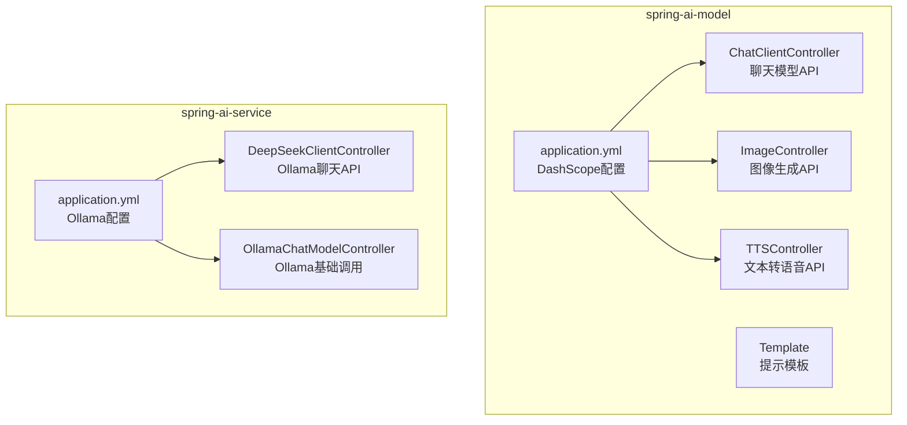
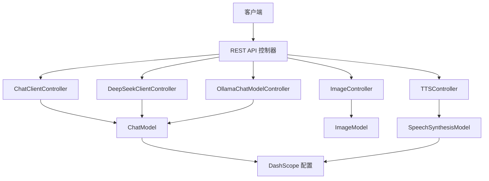
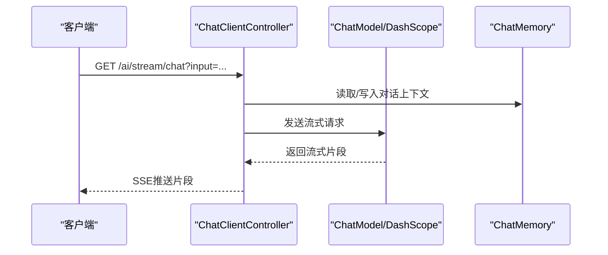
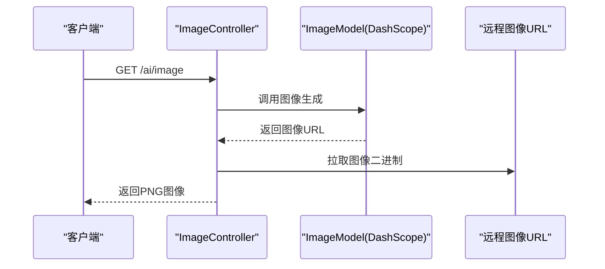
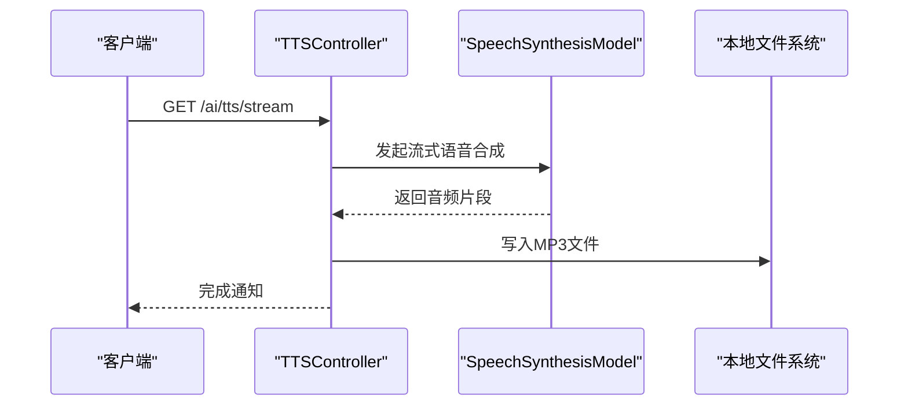
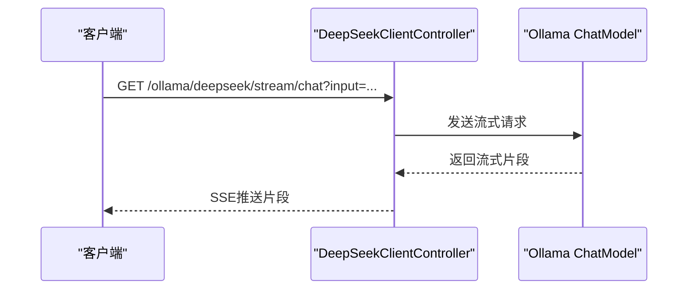
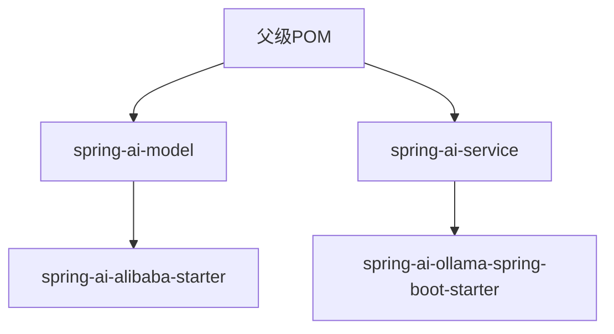

# AI模型API

<cite>
**本文引用的文件**
- [ChatClientController.java](file://spring-ai-model/src/main/java/cn/project/base/springaimodel/controller/ChatClientController.java)
- [ImageController.java](file://spring-ai-model/src/main/java/cn/project/base/springaimodel/controller/ImageController.java)
- [TTSController.java](file://spring-ai-model/src/main/java/cn/project/base/springaimodel/controller/TTSController.java)
- [Template.java](file://spring-ai-model/src/main/java/cn/project/base/springaimodel/domain/Template.java)
- [application.yml（spring-ai-model）](file://spring-ai-model/src/main/resources/application.yml)
- [DeepSeekClientController.java](file://spring-ai-service/src/main/java/cn/project/base/springaiservice/controller/DeepSeekClientController.java)
- [OllamaChatModelController.java](file://spring-ai-service/src/main/java/cn/project/base/springaiservice/controller/OllamaChatModelController.java)
- [application.yml（spring-ai-service）](file://spring-ai-service/src/main/resources/application.yml)
- [pom.xml](file://pom.xml)
</cite>

## 目录
1. [简介](#简介)
2. [项目结构](#项目结构)
3. [核心组件](#核心组件)
4. [架构总览](#架构总览)
5. [详细组件分析](#详细组件分析)
6. [依赖分析](#依赖分析)
7. [性能考虑](#性能考虑)
8. [故障排查指南](#故障排查指南)
9. [结论](#结论)
10. [附录](#附录)

## 简介
本文件为AI模型服务的API文档，覆盖以下能力：
- 聊天模型：提供非流式与流式两种调用方式，支持上下文记忆与提示模板。
- 图像生成：基于文本提示生成图片并直接返回二进制图像数据。
- 文本转语音：提供非流式与流式两种调用方式，支持参数化控制语速、音调、音量等。

文档同时说明：
- 不同AI模型的调用方式与参数配置（模型选择、采样策略等）。
- RESTful API的HTTP方法、URL模式、请求体格式与响应结构。
- 流式响应与非流式响应的区别与适用场景。
- 认证机制与速率限制说明（基于现有配置与框架默认行为）。
- 错误处理与常见异常的定位与修复建议。

## 项目结构
该仓库采用多模块结构，AI相关能力分布在两个子模块中：
- spring-ai-model：提供聊天、图像、TTS三类API的控制器与配置。
- spring-ai-service：提供基于Ollama的聊天模型调用示例。

图表来源
- [ChatClientController.java:28-142](file://spring-ai-model/src/main/java/cn/project/base/springaimodel/controller/ChatClientController.java#L28-L142)
- [ImageController.java:17-61](file://spring-ai-model/src/main/java/cn/project/base/springaimodel/controller/ImageController.java#L17-L61)
- [TTSController.java:29-115](file://spring-ai-model/src/main/java/cn/project/base/springaimodel/controller/TTSController.java#L29-L115)
- [Template.java:12-23](file://spring-ai-model/src/main/java/cn/project/base/springaimodel/domain/Template.java#L12-L23)
- [application.yml（spring-ai-model）:1-10](file://spring-ai-model/src/main/resources/application.yml#L1-L10)
- [DeepSeekClientController.java:15-60](file://spring-ai-service/src/main/java/cn/project/base/springaiservice/controller/DeepSeekClientController.java#L15-L60)
- [OllamaChatModelController.java:9-24](file://spring-ai-service/src/main/java/cn/project/base/springaiservice/controller/OllamaChatModelController.java#L9-L24)
- [application.yml（spring-ai-service）:1-13](file://spring-ai-service/src/main/resources/application.yml#L1-L13)

章节来源
- [pom.xml:11-22](file://pom.xml#L11-L22)

## 核心组件
- 聊天模型API（spring-ai-model）
  - 提供非流式与流式两种调用路径，支持上下文记忆与提示模板。
- 图像生成API（spring-ai-model）
  - 基于文本提示生成图片，直接返回二进制图像数据。
- 文本转语音API（spring-ai-model）
  - 支持非流式与流式两种调用，可配置语速、音调、音量等参数。
- Ollama聊天API（spring-ai-service）
  - 展示如何通过ChatClient与ChatModel进行非流式与流式调用。

章节来源
- [ChatClientController.java:52-142](file://spring-ai-model/src/main/java/cn/project/base/springaimodel/controller/ChatClientController.java#L52-L142)
- [ImageController.java:27-61](file://spring-ai-model/src/main/java/cn/project/base/springaimodel/controller/ImageController.java#L27-L61)
- [TTSController.java:43-115](file://spring-ai-model/src/main/java/cn/project/base/springaimodel/controller/TTSController.java#L43-L115)
- [DeepSeekClientController.java:43-59](file://spring-ai-service/src/main/java/cn/project/base/springaiservice/controller/DeepSeekClientController.java#L43-L59)
- [OllamaChatModelController.java:18-23](file://spring-ai-service/src/main/java/cn/project/base/springaiservice/controller/OllamaChatModelController.java#L18-L23)

## 架构总览
整体架构由Spring Boot应用承载，通过Spring AI与第三方模型服务（DashScope、Ollama）对接。控制器层暴露REST API，配置层集中管理模型参数与鉴权信息。

图表来源
- [ChatClientController.java:34-50](file://spring-ai-model/src/main/java/cn/project/base/springaimodel/controller/ChatClientController.java#L34-L50)
- [ImageController.java:20-26](file://spring-ai-model/src/main/java/cn/project/base/springaimodel/controller/ImageController.java#L20-L26)
- [TTSController.java:33-41](file://spring-ai-model/src/main/java/cn/project/base/springaimodel/controller/TTSController.java#L33-L41)
- [DeepSeekClientController.java:19-41](file://spring-ai-service/src/main/java/cn/project/base/springaiservice/controller/DeepSeekClientController.java#L19-L41)
- [OllamaChatModelController.java:12-16](file://spring-ai-service/src/main/java/cn/project/base/springaiservice/controller/OllamaChatModelController.java#L12-L16)
- [application.yml（spring-ai-model）:4-10](file://spring-ai-model/src/main/resources/application.yml#L4-L10)
- [application.yml（spring-ai-service）:4-8](file://spring-ai-service/src/main/resources/application.yml#L4-L8)

## 详细组件分析

### 聊天模型API
- 模型来源
  - DashScope（通过ChatModel与DashScopeChatOptions配置）。
  - Ollama（通过ChatClient与OllamaOptions配置）。
- 接口清单
  - GET /ai/simple/chat
    - 功能：非流式聊天调用。
    - 请求参数：input（查询文本）。
    - 响应：字符串（模型回复内容）。
  - GET /ai/stream/chat
    - 功能：流式聊天调用。
    - 请求参数：input（查询文本）。
    - 响应：SSE流（逐片文本片段）。
  - GET /ai/stream/pormpt/chat
    - 功能：使用Template构建的提示进行非流式调用。
    - 响应：AssistantMessage（模型回复内容）。
  - GET /ai/cache/pormpt/chat
    - 功能：启用内存对话记忆的多轮对话。
    - 响应：字符串（最终回复内容）。
- 参数与配置
  - 模型选择：在DashScope配置中指定模型名称；在Ollama配置中指定模型地址与模型名。
  - 采样策略：topP（采样阈值）在ChatClient默认选项中设置。
  - 上下文记忆：通过MessageChatMemoryAdvisor与InMemoryChatMemory实现。
- 流式与非流式
  - 非流式：一次性返回完整内容，适合短文本与快速响应。
  - 流式：按片段推送内容，适合长文本与实时展示。
- 使用示例
  - 非流式：GET /ai/simple/chat?input=你好
  - 流式：GET /ai/stream/chat?input=讲个笑话
  - 带提示模板：GET /ai/stream/pormpt/chat
  - 带上下文记忆：GET /ai/cache/pormpt/chat

图表来源
- [ChatClientController.java:63-68](file://spring-ai-model/src/main/java/cn/project/base/springaimodel/controller/ChatClientController.java#L63-L68)
- [application.yml（spring-ai-model）:8-9](file://spring-ai-model/src/main/resources/application.yml#L8-L9)

章节来源
- [ChatClientController.java:52-142](file://spring-ai-model/src/main/java/cn/project/base/springaimodel/controller/ChatClientController.java#L52-L142)
- [Template.java:12-23](file://spring-ai-model/src/main/java/cn/project/base/springaimodel/domain/Template.java#L12-L23)
- [application.yml（spring-ai-model）:4-10](file://spring-ai-model/src/main/resources/application.yml#L4-L10)
- [DeepSeekClientController.java:43-59](file://spring-ai-service/src/main/java/cn/project/base/springaiservice/controller/DeepSeekClientController.java#L43-L59)
- [OllamaChatModelController.java:18-23](file://spring-ai-service/src/main/java/cn/project/base/springaiservice/controller/OllamaChatModelController.java#L18-L23)

### 图像生成API
- 模型来源：DashScope图像生成模型。
- 接口清单
  - GET /ai/image
    - 功能：根据默认提示生成图片并直接返回二进制图像数据。
    - 响应：PNG图像（Content-Type: image/png）。
- 参数与配置
  - 模型选择：在DashScope配置中指定图像模型。
  - 默认提示：内置默认提示词。
- 使用示例
  - GET /ai/image

图表来源
- [ImageController.java:43-61](file://spring-ai-model/src/main/java/cn/project/base/springaimodel/controller/ImageController.java#L43-L61)
- [application.yml（spring-ai-model）:4-10](file://spring-ai-model/src/main/resources/application.yml#L4-L10)

章节来源
- [ImageController.java:27-61](file://spring-ai-model/src/main/java/cn/project/base/springaimodel/controller/ImageController.java#L27-L61)
- [application.yml（spring-ai-model）:4-10](file://spring-ai-model/src/main/resources/application.yml#L4-L10)

### 文本转语音API
- 模型来源：DashScope语音合成模型。
- 接口清单
  - GET /ai/tts/simple
    - 功能：非流式TTS，将音频写入本地文件。
    - 响应：无（写入MP3文件）。
  - GET /ai/tts/stream
    - 功能：流式TTS，边接收边写入本地文件。
    - 响应：无（写入MP3文件）。
- 参数与配置
  - 模型选择：在DashScope配置中指定TTS模型。
  - 语速、音调、音量：通过DashScopeSpeechSynthesisOptions配置。
- 使用示例
  - GET /ai/tts/simple
  - GET /ai/tts/stream

图表来源
- [TTSController.java:67-97](file://spring-ai-model/src/main/java/cn/project/base/springaimodel/controller/TTSController.java#L67-L97)
- [application.yml（spring-ai-model）:4-10](file://spring-ai-model/src/main/resources/application.yml#L4-L10)

章节来源
- [TTSController.java:43-115](file://spring-ai-model/src/main/java/cn/project/base/springaimodel/controller/TTSController.java#L43-L115)
- [application.yml（spring-ai-model）:4-10](file://spring-ai-model/src/main/resources/application.yml#L4-L10)

### Ollama聊天API（补充）
- 模型来源：Ollama本地模型。
- 接口清单
  - GET /ollama/deepseek/simple/chat
    - 功能：非流式聊天调用。
    - 请求参数：input（查询文本）。
    - 响应：字符串（模型回复内容）。
  - GET /ollama/deepseek/stream/chat
    - 功能：流式聊天调用。
    - 请求参数：input（查询文本）。
    - 响应：SSE流（逐片文本片段）。
  - GET ollama//simple/chat
    - 功能：通过ChatModel直接调用。
    - 响应：字符串（模型回复内容）。
- 参数与配置
  - 模型选择：在Ollama配置中指定模型地址与模型名。
  - 采样策略：topP在ChatClient默认选项中设置。
- 使用示例
  - GET /ollama/deepseek/simple/chat?input=你好
  - GET /ollama/deepseek/stream/chat?input=讲个故事
  - GET ollama//simple/chat

图表来源
- [DeepSeekClientController.java:54-58](file://spring-ai-service/src/main/java/cn/project/base/springaiservice/controller/DeepSeekClientController.java#L54-L58)
- [OllamaChatModelController.java:18-23](file://spring-ai-service/src/main/java/cn/project/base/springaiservice/controller/OllamaChatModelController.java#L18-L23)
- [application.yml（spring-ai-service）:5-8](file://spring-ai-service/src/main/resources/application.yml#L5-L8)

章节来源
- [DeepSeekClientController.java:43-59](file://spring-ai-service/src/main/java/cn/project/base/springaiservice/controller/DeepSeekClientController.java#L43-L59)
- [OllamaChatModelController.java:18-23](file://spring-ai-service/src/main/java/cn/project/base/springaiservice/controller/OllamaChatModelController.java#L18-L23)
- [application.yml（spring-ai-service）:1-13](file://spring-ai-service/src/main/resources/application.yml#L1-L13)

## 依赖分析
- 模块依赖
  - spring-ai-model：依赖Spring AI与DashScope集成。
  - spring-ai-service：依赖Spring AI与Ollama集成。
- 关键依赖
  - spring-ai-alibaba-starter：DashScope集成。
  - spring-ai-ollama-spring-boot-starter：Ollama集成。
  - langchain4j系列：可选的LangChain4J集成（用于其他模块）。

图表来源
- [pom.xml:36-102](file://pom.xml#L36-L102)

章节来源
- [pom.xml:36-102](file://pom.xml#L36-L102)

## 性能考虑
- 流式响应
  - 优先使用流式接口以降低首字节延迟，提升用户体验。
  - 注意客户端对SSE的支持与缓冲策略。
- 上下文记忆
  - 合理设置检索长度与对话ID，避免过长的历史上下文导致响应变慢。
- 本地文件写入
  - TTS流式写入需关注磁盘IO与文件句柄管理，建议在生产环境使用临时目录与清理策略。
- 模型选择
  - 根据任务复杂度选择合适模型，大模型在长文本与多轮对话上表现更好，但延迟更高。

## 故障排查指南
- 401/403未授权
  - 检查DashScope API Key是否正确配置。
  - 章节来源
    - [application.yml（spring-ai-model）:5-6](file://spring-ai-model/src/main/resources/application.yml#L5-L6)
- 500内部错误
  - 图像生成：检查远程图像URL可达性与网络超时。
    - 章节来源
      - [ImageController.java:49-58](file://spring-ai-model/src/main/java/cn/project/base/springaimodel/controller/ImageController.java#L49-L58)
  - TTS流式写入：检查目标目录权限与磁盘空间。
    - 章节来源
      - [TTSController.java:76-96](file://spring-ai-model/src/main/java/cn/project/base/springaimodel/controller/TTSController.java#L76-L96)
- 响应为空或内容异常
  - 聊天模型：确认输入参数与模型可用性。
    - 章节来源
      - [ChatClientController.java:56-58](file://spring-ai-model/src/main/java/cn/project/base/springaimodel/controller/ChatClientController.java#L56-L58)
- 流式连接中断
  - 检查客户端SSE支持与网络稳定性。
    - 章节来源
      - [ChatClientController.java:63-68](file://spring-ai-model/src/main/java/cn/project/base/springaimodel/controller/ChatClientController.java#L63-L68)

## 结论
本API文档梳理了聊天模型、图像生成与文本转语音三大能力的REST接口与参数配置，明确了流式与非流式的差异与适用场景，并提供了基于DashScope与Ollama的调用示例。结合上下文记忆与提示模板，可在多轮对话与复杂场景中获得更佳效果。建议在生产环境中完善鉴权、限流与监控策略，并根据业务负载选择合适的模型与参数。

## 附录
- 最佳实践
  - 使用流式接口提升交互体验。
  - 对话场景中启用上下文记忆并合理设置检索长度。
  - TTS音频写入建议使用临时目录并在销毁时清理。
- 速率限制
  - 本仓库未显式配置速率限制策略，建议在网关或业务层增加限流与熔断措施。
- 认证机制
  - DashScope通过配置文件中的API Key进行认证。
    - 章节来源
      - [application.yml（spring-ai-model）:5-6](file://spring-ai-model/src/main/resources/application.yml#L5-L6)