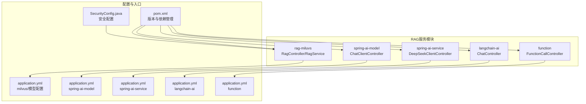
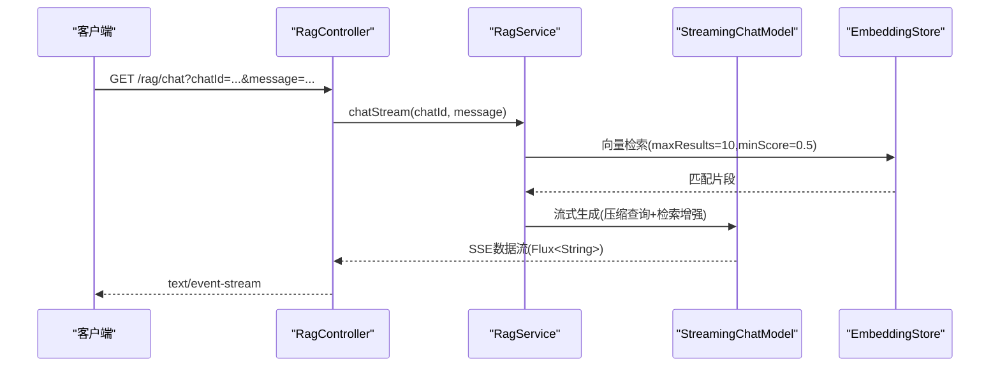
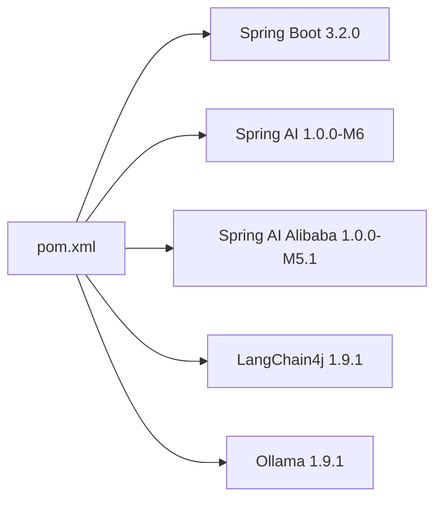

# API参考

<cite>
**本文引用的文件**
- [RagController.java](file://rag-miluvs/src/main/java/cn/project/base/ragmiluvs/controller/RagController.java)
- [RagService.java](file://rag-miluvs/src/main/java/cn/project/base/ragmiluvs/service/RagService.java)
- [Customer.java](file://rag-miluvs/src/main/java/cn/project/base/ragmiluvs/service/Customer.java)
- [application.yml（milvus）](file://rag-miluvs/src/main/resources/application.yml)
- [ChatController.java](file://langchain-ai/src/main/java/cn/project/base/langchainai/controller/ChatController.java)
- [application.yml（langchain-ai）](file://langchain-ai/src/main/resources/application.yml)
- [ChatClientController.java](file://spring-ai-model/src/main/java/cn/project/base/springaimodel/controller/ChatClientController.java)
- [Template.java](file://spring-ai-model/src/main/java/cn/project/base/springaimodel/domain/Template.java)
- [application.yml（spring-ai-model）](file://spring-ai-model/src/main/resources/application.yml)
- [DeepSeekClientController.java](file://spring-ai-service/src/main/java/cn/project/base/springaiservice/controller/DeepSeekClientController.java)
- [application.yml（spring-ai-service）](file://spring-ai-service/src/main/resources/application.yml)
- [FunctionCallController.java](file://function/src/main/java/cn/project/base/function/controller/FunctionCallController.java)
- [application.yml（function）](file://function/src/main/resources/application.yml)
- [TestController.java](file://rag-service/src/main/java/cn/project/base/ragservice/controller/TestController.java)
- [SecurityConfig.java](file://spring-admin-service/src/main/java/cn/project/base/springadminservice/config/SecurityConfig.java)
- [pom.xml](file://pom.xml)
</cite>

## 目录
1. [简介](#简介)
2. [项目结构](#项目结构)
3. [核心组件](#核心组件)
4. [架构总览](#架构总览)
5. [详细组件分析](#详细组件分析)
6. [依赖分析](#依赖分析)
7. [性能考虑](#性能考虑)
8. [故障排查指南](#故障排查指南)
9. [结论](#结论)
10. [附录](#附录)

## 简介
本文件为RAG服务系统的完整API参考文档，覆盖各模块公开HTTP接口的规范、请求参数、响应格式、SSE流式响应处理、认证与授权机制、版本与兼容性说明、常见使用场景与最佳实践、参数校验规则与错误码定义。文档严格依据仓库中实际存在的控制器与配置文件整理，避免臆测。

## 项目结构
该工程采用多模块聚合结构，核心与演示模块如下：
- rag-miluvs：LangChain4j + Milvus向量检索增强（RAG）
- spring-ai-model：Spring AI DashScope模型封装与示例
- spring-ai-service：Spring AI Ollama本地模型封装与示例
- langchain-ai：LangChain4j DashScope模型封装与示例
- function：函数调用示例（含JSON流式返回）
- spring-admin-service：Spring Boot Admin安全配置示例
- 其他模块：演示与集成示例

图表来源
- [pom.xml:1-171](file://pom.xml#L1-L171)
- [application.yml（milvus）:1-24](file://rag-miluvs/src/main/resources/application.yml#L1-L24)
- [application.yml（spring-ai-model）:1-10](file://spring-ai-model/src/main/resources/application.yml#L1-L10)
- [application.yml（spring-ai-service）:1-13](file://spring-ai-service/src/main/resources/application.yml#L1-L13)
- [application.yml（langchain-ai）:1-1](file://langchain-ai/src/main/resources/application.yml#L1-L1)
- [application.yml（function）:1-14](file://function/src/main/resources/application.yml#L1-L14)
- [SecurityConfig.java:1-45](file://spring-admin-service/src/main/java/cn/project/base/springadminservice/config/SecurityConfig.java#L1-L45)

章节来源
- [pom.xml:1-171](file://pom.xml#L1-L171)

## 核心组件
- RagController：提供RAG初始化与SSE流式聊天接口
- RagService：封装LangChain4j检索增强与流式生成
- ChatClientController：Spring AI ChatClient封装，提供简单与流式对话
- DeepSeekClientController：Ollama本地模型封装，提供简单与流式对话
- ChatController：LangChain4j DashScope模型封装，提供简单对话
- FunctionCallController：函数调用示例，返回JSON流
- SecurityConfig：Spring Security示例配置（登录页、放行路径、CSRF禁用）

章节来源
- [RagController.java:1-29](file://rag-miluvs/src/main/java/cn/project/base/ragmiluvs/controller/RagController.java#L1-L29)
- [RagService.java:1-118](file://rag-miluvs/src/main/java/cn/project/base/ragmiluvs/service/RagService.java#L1-L118)
- [ChatClientController.java:1-142](file://spring-ai-model/src/main/java/cn/project/base/springaimodel/controller/ChatClientController.java#L1-L142)
- [DeepSeekClientController.java:1-60](file://spring-ai-service/src/main/java/cn/project/base/springaiservice/controller/DeepSeekClientController.java#L1-L60)
- [ChatController.java:1-36](file://langchain-ai/src/main/java/cn/project/base/langchainai/controller/ChatController.java#L1-L36)
- [FunctionCallController.java:1-76](file://function/src/main/java/cn/project/base/function/controller/FunctionCallController.java#L1-L76)
- [SecurityConfig.java:1-45](file://spring-admin-service/src/main/java/cn/project/base/springadminservice/config/SecurityConfig.java#L1-L45)

## 架构总览
RAG服务由“控制器层”“服务层”“外部模型与向量库”三部分组成。控制器负责HTTP路由与SSE流式输出；服务层负责RAG检索增强与流式生成；外部依赖包括DashScope与Ollama模型、Milvus向量库。

图表来源
- [RagController.java:24-27](file://rag-miluvs/src/main/java/cn/project/base/ragmiluvs/controller/RagController.java#L24-L27)
- [RagService.java:57-90](file://rag-miluvs/src/main/java/cn/project/base/ragmiluvs/service/RagService.java#L57-L90)

## 详细组件分析

### RAG服务接口
- 路径与方法
  - GET /rag/dbinit
  - GET /rag/chat（SSE流式响应）

- 请求参数
  - chatId：可选，字符串，默认值为"1"
  - message：必填，字符串

- 响应
  - /rag/dbinit：文本响应"OK"
  - /rag/chat：text/event-stream，逐块返回模型生成内容

- 认证与授权
  - 当前控制器未声明显式鉴权注解；若需保护，建议结合全局安全配置或在控制器上增加鉴权注解

- 错误处理
  - 控制器未显式抛出异常；服务层内部捕获异常并打印堆栈，建议在生产环境统一异常处理与日志策略

- 示例
  - 成功请求（SSE）
    - 方法：GET
    - URL：/rag/chat?message=xxx
    - 响应头：Content-Type: text/event-stream
    - 响应体：事件流，每块为一段生成内容
  - 初始化
    - 方法：GET
    - URL：/rag/dbinit
    - 响应：OK

- 参数校验规则
  - message：必填，非空
  - chatId：可选，字符串类型

- 版本与兼容性
  - 模块版本：见pom.xml属性与依赖管理
  - 模型版本：DashScope qwen-plus；嵌入模型text-embedding-v2；向量库Milvus地址与端口在配置中定义

章节来源
- [RagController.java:18-27](file://rag-miluvs/src/main/java/cn/project/base/ragmiluvs/controller/RagController.java#L18-L27)
- [RagService.java:57-90](file://rag-miluvs/src/main/java/cn/project/base/ragmiluvs/service/RagService.java#L57-L90)
- [Customer.java:8-16](file://rag-miluvs/src/main/java/cn/project/base/ragmiluvs/service/Customer.java#L8-L16)
- [application.yml（milvus）:1-24](file://rag-miluvs/src/main/resources/application.yml#L1-L24)
- [pom.xml:24-35](file://pom.xml#L24-L35)

### Spring AI ChatClient接口
- 路径与方法
  - GET /ai/simple/chat
  - GET /ai/stream/chat
  - GET /ai/stream/pormpt/chat
  - GET /ai/cache/pormpt/chat

- 请求参数
  - input：必填，字符串

- 响应
  - /ai/simple/chat：文本响应
  - /ai/stream/chat：text/event-stream，逐块返回模型生成内容
  - /ai/stream/pormpt/chat：单次响应（AssistantMessage）
  - /ai/cache/pormpt/chat：文本响应（基于内存对话记忆）

- 认证与授权
  - 未声明显式鉴权注解；如需保护，建议结合全局安全配置

- 错误处理
  - 未显式抛出异常；建议在生产环境统一异常处理

- 示例
  - 成功请求（SSE）
    - 方法：GET
    - URL：/ai/stream/chat?input=xxx
    - 响应头：Content-Type: text/event-stream
    - 响应体：事件流，每块为一段生成内容

- 参数校验规则
  - input：必填，非空

- 版本与兼容性
  - 模块版本：见pom.xml属性与依赖管理
  - 模型版本：DashScope deepseek-v3 或 qwen-plus（按配置选择）

章节来源
- [ChatClientController.java:55-99](file://spring-ai-model/src/main/java/cn/project/base/springaimodel/controller/ChatClientController.java#L55-L99)
- [ChatClientController.java:107-139](file://spring-ai-model/src/main/java/cn/project/base/springaimodel/controller/ChatClientController.java#L107-L139)
- [Template.java:12-22](file://spring-ai-model/src/main/java/cn/project/base/springaimodel/domain/Template.java#L12-L22)
- [application.yml（spring-ai-model）:1-10](file://spring-ai-model/src/main/resources/application.yml#L1-L10)
- [pom.xml:29-34](file://pom.xml#L29-L34)

### Ollama DeepSeek接口
- 路径与方法
  - GET /ollama/deepseek/simple/chat
  - GET /ollama/deepseek/stream/chat

- 请求参数
  - input：必填，字符串

- 响应
  - /ollama/deepseek/simple/chat：文本响应
  - /ollama/deepseek/stream/chat：text/event-stream，逐块返回模型生成内容

- 认证与授权
  - 未声明显式鉴权注解；如需保护，建议结合全局安全配置

- 错误处理
  - 未显式抛出异常；建议在生产环境统一异常处理

- 示例
  - 成功请求（SSE）
    - 方法：GET
    - URL：/ollama/deepseek/stream/chat?input=xxx
    - 响应头：Content-Type: text/event-stream
    - 响应体：事件流，每块为一段生成内容

- 参数校验规则
  - input：必填，非空

- 版本与兼容性
  - 模块版本：见pom.xml属性与依赖管理
  - 模型版本：Ollama deepseek-r1:14b

章节来源
- [DeepSeekClientController.java:46-58](file://spring-ai-service/src/main/java/cn/project/base/springaiservice/controller/DeepSeekClientController.java#L46-L58)
- [application.yml（spring-ai-service）:1-13](file://spring-ai-service/src/main/resources/application.yml#L1-L13)
- [pom.xml:29-34](file://pom.xml#L29-L34)

### LangChain4j DashScope接口
- 路径与方法
  - GET /hello

- 请求参数
  - message：可选，字符串，默认值为"请给我讲一个笑话"

- 响应
  - 文本响应

- 认证与授权
  - 未声明显式鉴权注解；如需保护，建议结合全局安全配置

- 错误处理
  - 未显式抛出异常；建议在生产环境统一异常处理

- 示例
  - 成功请求
    - 方法：GET
    - URL：/hello?message=xxx
    - 响应：文本

- 参数校验规则
  - message：可选，字符串类型

- 版本与兼容性
  - 模块版本：见pom.xml属性与依赖管理
  - 模型版本：DashScope qwen-plus

章节来源
- [ChatController.java:18-21](file://langchain-ai/src/main/java/cn/project/base/langchainai/controller/ChatController.java#L18-L21)
- [application.yml（langchain-ai）:1-1](file://langchain-ai/src/main/resources/application.yml#L1-L1)
- [pom.xml:29-34](file://pom.xml#L29-L34)

### 函数调用接口（JSON流）
- 路径与方法
  - GET /ai/chat

- 请求参数
  - userMessage：必填，字符串

- 响应
  - APPLICATION_STREAM_JSON：逐块返回JSON片段

- 认证与授权
  - 未声明显式鉴权注解；如需保护，建议结合全局安全配置

- 错误处理
  - 未显式抛出异常；建议在生产环境统一异常处理

- 示例
  - 成功请求（JSON流）
    - 方法：GET
    - URL：/ai/chat?userMessage=xxx
    - 响应头：Content-Type: application/x-json-stream
    - 响应体：事件流，每块为一段JSON

- 参数校验规则
  - userMessage：必填，非空

- 版本与兼容性
  - 模块版本：见pom.xml属性与依赖管理
  - 模型版本：DashScope qwen-plus

章节来源
- [FunctionCallController.java:33-49](file://function/src/main/java/cn/project/base/function/controller/FunctionCallController.java#L33-L49)
- [application.yml（function）:1-14](file://function/src/main/resources/application.yml#L1-L14)
- [pom.xml:29-34](file://pom.xml#L29-L34)

### 安全与认证（Spring Boot Admin示例）
- 登录页面：/login
- 放行路径：/login, /assets/**
- 管理端口：/manage/**
- 健康检查：/actuator/**
- CSRF：已禁用
- 默认用户：admin/admin（开发示例，生产请使用加密密码）

章节来源
- [SecurityConfig.java:19-28](file://spring-admin-service/src/main/java/cn/project/base/springadminservice/config/SecurityConfig.java#L19-L28)
- [SecurityConfig.java:37-42](file://spring-admin-service/src/main/java/cn/project/base/springadminservice/config/SecurityConfig.java#L37-L42)

## 依赖分析
- 版本与依赖管理
  - Spring Boot：3.2.0
  - Spring AI：1.0.0-M6
  - Spring AI Alibaba：1.0.0-M5.1
  - LangChain4j：1.9.1
  - Ollama：1.9.1
  - Boot Admin：3.3.4

图表来源
- [pom.xml:24-101](file://pom.xml#L24-L101)

章节来源
- [pom.xml:24-101](file://pom.xml#L24-L101)

## 性能考虑
- SSE流式输出
  - 所有流式接口均使用Flux<String>，建议客户端以事件流方式消费，避免阻塞
- 向量检索
  - 检索参数maxResults与minScore影响召回质量与延迟，建议结合业务调优
- 模型调用
  - 本地Ollama与云端DashScope存在网络与延迟差异，建议在生产环境评估并发与超时策略
- 缓存与会话
  - 建议在控制器层引入请求级缓存与会话ID复用，减少重复计算

## 故障排查指南
- 常见问题
  - /rag/chat无响应：确认向量库连接正常、嵌入模型可用、检索结果非空
  - /ai/stream/chat无响应：确认DashScope API密钥有效、网络可达
  - /ollama/deepseek/stream/chat无响应：确认Ollama服务运行、模型已拉取
  - /ai/chat返回空：确认函数启用与参数传递正确
- 日志与监控
  - 建议开启相应模块的日志级别，定位异常
  - 生产环境建议接入统一日志与指标监控

## 结论
本API参考文档梳理了RAG服务系统中各模块的公开接口，明确了SSE流式响应的处理方式、认证与授权现状、版本与兼容性信息，并提供了常见使用场景与最佳实践建议。建议在生产环境中补充统一异常处理、参数校验与安全防护策略。

## 附录

### API清单与规范摘要
- /rag/dbinit
  - 方法：GET
  - 参数：无
  - 响应：文本"OK"
- /rag/chat
  - 方法：GET
  - 参数：chatId（可选，默认"1"）、message（必填）
  - 响应：text/event-stream
- /ai/simple/chat
  - 方法：GET
  - 参数：input（必填）
  - 响应：文本
- /ai/stream/chat
  - 方法：GET
  - 参数：input（必填）
  - 响应：text/event-stream
- /ai/stream/pormpt/chat
  - 方法：GET
  - 参数：无
  - 响应：单次响应（AssistantMessage）
- /ai/cache/pormpt/chat
  - 方法：GET
  - 参数：无
  - 响应：文本
- /ollama/deepseek/simple/chat
  - 方法：GET
  - 参数：input（必填）
  - 响应：文本
- /ollama/deepseek/stream/chat
  - 方法：GET
  - 参数：input（必填）
  - 响应：text/event-stream
- /hello
  - 方法：GET
  - 参数：message（可选，默认值）
  - 响应：文本
- /ai/chat（函数调用）
  - 方法：GET
  - 参数：userMessage（必填）
  - 响应：application/x-json-stream

### SSE（Server-Sent Events）流式响应说明
- 客户端需以EventSource或类似机制接收text/event-stream
- 每个事件块对应模型生成的一段内容
- 建议客户端实现断线重连与错误恢复策略

### 认证与授权机制
- 当前控制器未声明显式鉴权注解
- 如需保护，可在控制器或全局安全配置中增加鉴权策略
- 示例安全配置中默认用户为admin/admin，仅作演示用途

### 版本与兼容性
- 模块版本与依赖版本详见pom.xml
- 模型版本与配置详见各模块application.yml