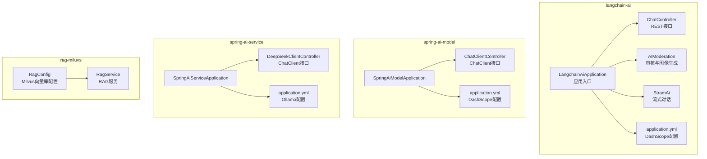
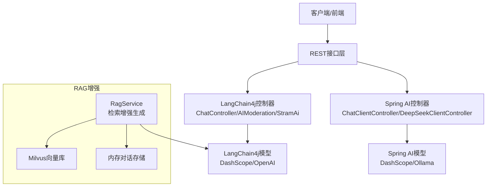
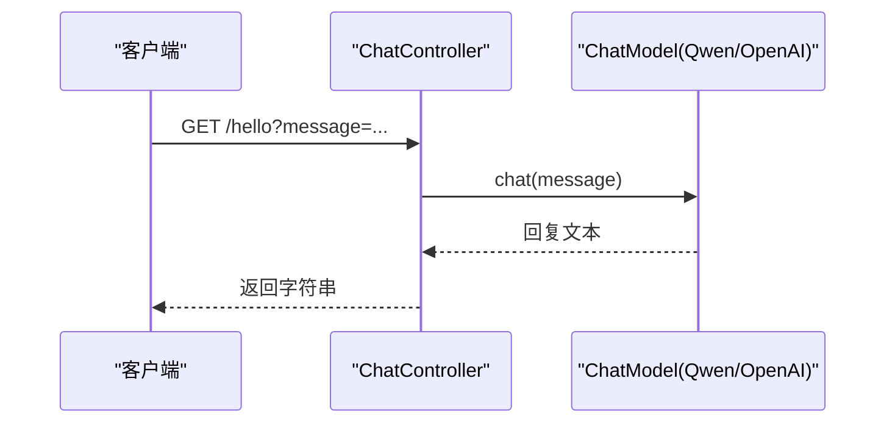
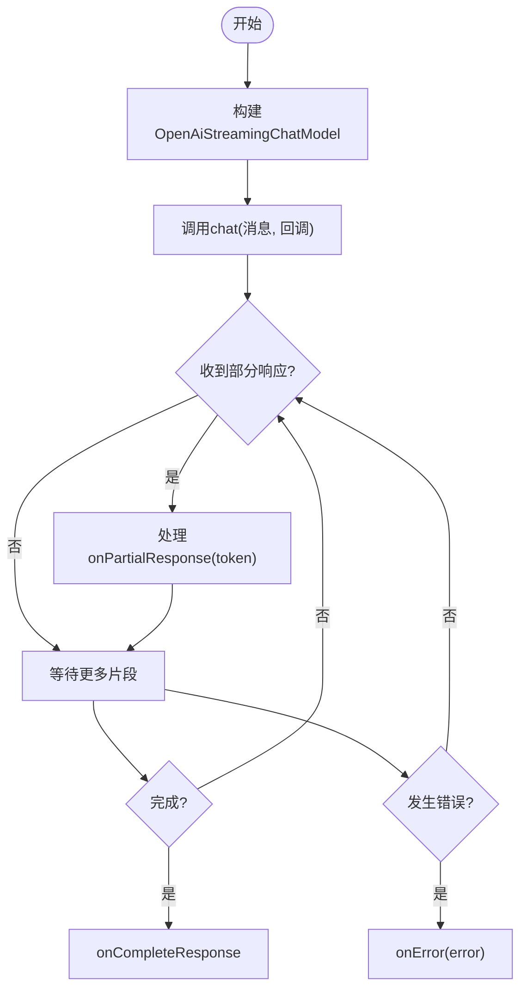
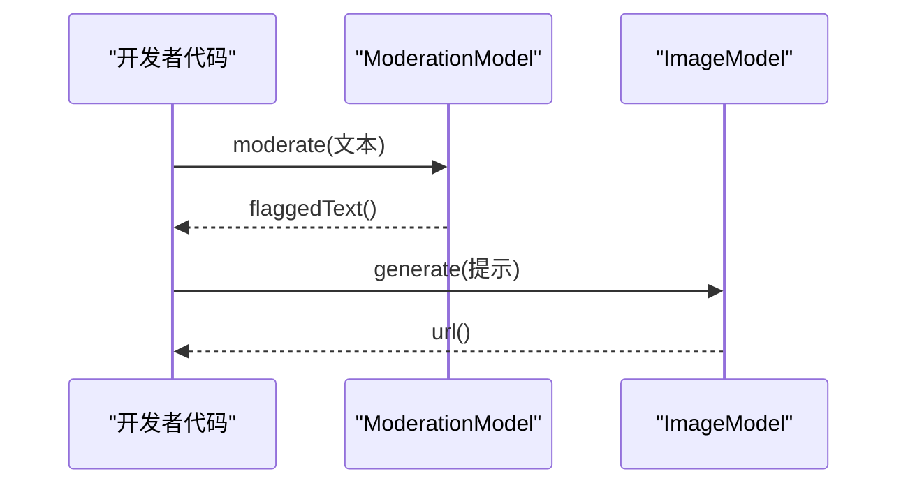
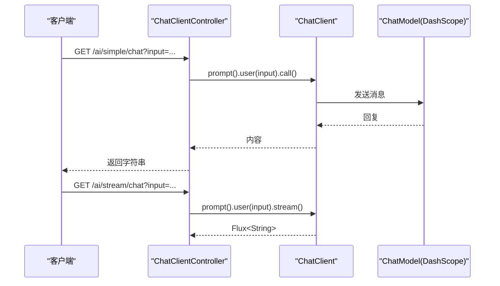
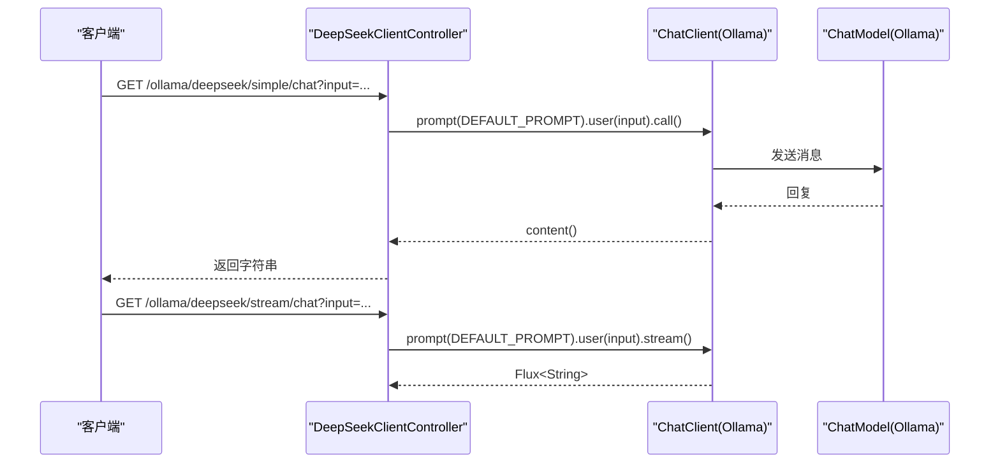
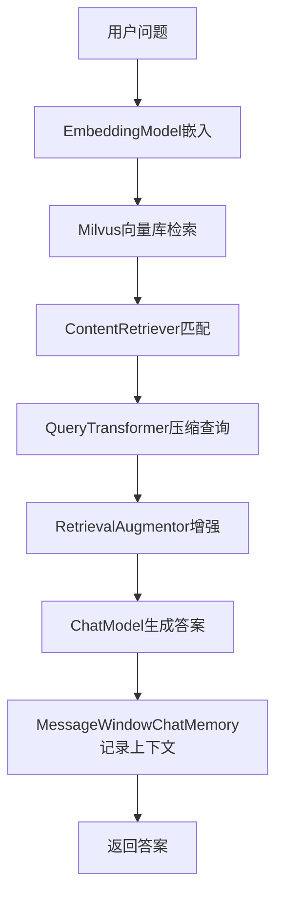
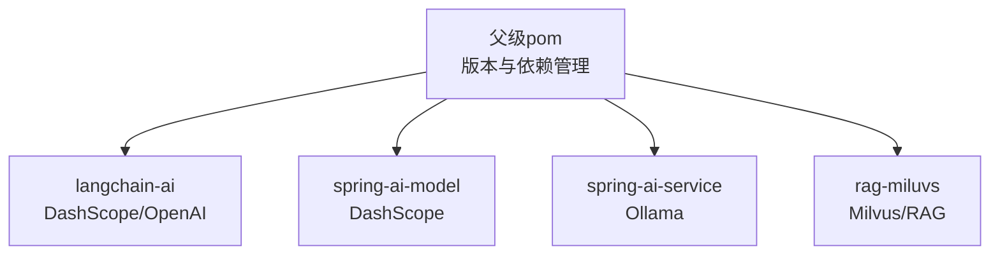

# LangChain集成API

<cite>
**本文引用的文件**
- [LangchainAiApplication.java](file://langchain-ai/src/main/java/cn/project/base/langchainai/LangchainAiApplication.java)
- [application.yml](file://langchain-ai/src/main/resources/application.yml)
- [ChatController.java](file://langchain-ai/src/main/java/cn/project/base/langchainai/controller/ChatController.java)
- [AIModeration.java](file://langchain-ai/src/main/java/cn/project/base/langchainai/controller/AIModeration.java)
- [StramAi.java](file://langchain-ai/src/main/java/cn/project/base/langchainai/controller/StramAi.java)
- [pom.xml](file://langchain-ai/pom.xml)
- [pom.xml](file://pom.xml)
- [ChatClientController.java](file://spring-ai-model/src/main/java/cn/project/base/springaimodel/controller/ChatClientController.java)
- [application.yml](file://spring-ai-model/src/main/resources/application.yml)
- [DeepSeekClientController.java](file://spring-ai-service/src/main/java/cn/project/base/springaiservice/controller/DeepSeekClientController.java)
- [application.yml](file://spring-ai-service/src/main/resources/application.yml)
- [RagService.java](file://rag-miluvs/src/main/java/cn/project/base/ragmiluvs/service/RagService.java)
- [RagConfig.java](file://rag-miluvs/src/main/java/cn/project/base/ragmiluvs/config/RagConfig.java)
- [McpClent.java](file://spring-ai-mcp/src/main/java/cn/project/base/springaimcp/controller/McpClent.java)
</cite>

## 目录
1. [简介](#简介)
2. [项目结构](#项目结构)
3. [核心组件](#核心组件)
4. [架构总览](#架构总览)
5. [详细组件分析](#详细组件分析)
6. [依赖分析](#依赖分析)
7. [性能考虑](#性能考虑)
8. [故障排除指南](#故障排除指南)
9. [结论](#结论)
10. [附录](#附录)

## 简介
本文件面向在Spring Boot环境中集成LangChain4j与Spring AI的开发者，系统性梳理LangChain集成的API与使用方式，覆盖链式调用、提示工程、AI审核、流式AI处理等能力，并给出配置选项、最佳实践、调用示例与故障排除建议。项目采用多模块聚合结构，langchain-ai模块演示LangChain4j与DashScope/OpenAI模型的直接集成；spring-ai-model与spring-ai-service模块展示Spring AI的ChatClient与Ollama等模型的集成；rag-miluvs模块提供RAG检索增强生成的完整流程。

## 项目结构
项目采用Maven多模块结构，顶层pom统一管理版本与依赖，各子模块专注于不同能力域：
- langchain-ai：LangChain4j与DashScope/OpenAI模型的直接集成示例
- spring-ai-model：Spring AI ChatClient与DashScope模型集成
- spring-ai-service：Spring AI ChatClient与Ollama模型集成
- rag-miluvs：LangChain4j RAG检索增强生成（Milvus向量库）
- spring-ai-mcp：Spring AI MCP客户端占位模块

**图表来源**
- [LangchainAiApplication.java:11-28](file://langchain-ai/src/main/java/cn/project/base/langchainai/LangchainAiApplication.java#L11-L28)
- [application.yml:1-15](file://langchain-ai/src/main/resources/application.yml#L1-L15)
- [ChatController.java:1-36](file://langchain-ai/src/main/java/cn/project/base/langchainai/controller/ChatController.java#L1-L36)
- [AIModeration.java:1-29](file://langchain-ai/src/main/java/cn/project/base/langchainai/controller/AIModeration.java#L1-L29)
- [StramAi.java:1-47](file://langchain-ai/src/main/java/cn/project/base/langchainai/controller/StramAi.java#L1-L47)
- [ChatClientController.java:27-70](file://spring-ai-model/src/main/java/cn/project/base/springaimodel/controller/ChatClientController.java#L27-L70)
- [application.yml:1-10](file://spring-ai-model/src/main/resources/application.yml#L1-L10)
- [DeepSeekClientController.java:1-59](file://spring-ai-service/src/main/java/cn/project/base/springaiservice/controller/DeepSeekClientController.java#L1-L59)
- [application.yml:1-13](file://spring-ai-service/src/main/resources/application.yml#L1-L13)
- [RagService.java:60-92](file://rag-miluvs/src/main/java/cn/project/base/ragmiluvs/service/RagService.java#L60-L92)
- [RagConfig.java:16-39](file://rag-miluvs/src/main/java/cn/project/base/ragmiluvs/config/RagConfig.java#L16-L39)

**章节来源**
- [pom.xml:11-22](file://pom.xml#L11-L22)
- [pom.xml:19-58](file://langchain-ai/pom.xml#L19-L58)

## 核心组件
- LangChain4j集成（langchain-ai）
  - ChatController：基于注入的ChatModel提供REST接口，支持GET请求并返回模型回复
  - AIModeration：演示ModerationModel与ImageModel的使用，支持文本审核与文生图
  - StramAi：演示OpenAiStreamingChatModel的流式对话回调处理
- Spring AI集成（spring-ai-model、spring-ai-service）
  - ChatClientController：基于ChatClient封装的简洁调用与流式调用接口
  - DeepSeekClientController：基于ChatClient与Ollama的上下文记忆与流式对话
- RAG检索增强（rag-miluvs）
  - RagService：结合EmbeddingStoreContentRetriever与DefaultRetrievalAugmentor实现RAG
  - RagConfig：配置Milvus向量库与内存对话存储

**章节来源**
- [ChatController.java:10-21](file://langchain-ai/src/main/java/cn/project/base/langchainai/controller/ChatController.java#L10-L21)
- [AIModeration.java:11-28](file://langchain-ai/src/main/java/cn/project/base/langchainai/controller/AIModeration.java#L11-L28)
- [StramAi.java:7-46](file://langchain-ai/src/main/java/cn/project/base/langchainai/controller/StramAi.java#L7-L46)
- [ChatClientController.java:27-70](file://spring-ai-model/src/main/java/cn/project/base/springaimodel/controller/ChatClientController.java#L27-L70)
- [DeepSeekClientController.java:15-59](file://spring-ai-service/src/main/java/cn/project/base/springaiservice/controller/DeepSeekClientController.java#L15-L59)
- [RagService.java:60-92](file://rag-miluvs/src/main/java/cn/project/base/ragmiluvs/service/RagService.java#L60-L92)
- [RagConfig.java:25-39](file://rag-miluvs/src/main/java/cn/project/base/ragmiluvs/config/RagConfig.java#L25-L39)

## 架构总览
LangChain4j与Spring AI在本项目中分别承担“底层模型能力”与“高层客户端封装”的角色：
- LangChain4j：直接对接DashScope/OpenAI等模型，适合细粒度控制与原生能力使用
- Spring AI：通过ChatClient统一抽象，简化提示工程、上下文记忆与流式处理

**图表来源**
- [ChatController.java:10-21](file://langchain-ai/src/main/java/cn/project/base/langchainai/controller/ChatController.java#L10-L21)
- [AIModeration.java:11-28](file://langchain-ai/src/main/java/cn/project/base/langchainai/controller/AIModeration.java#L11-L28)
- [StramAi.java:7-46](file://langchain-ai/src/main/java/cn/project/base/langchainai/controller/StramAi.java#L7-L46)
- [ChatClientController.java:27-70](file://spring-ai-model/src/main/java/cn/project/base/springaimodel/controller/ChatClientController.java#L27-L70)
- [DeepSeekClientController.java:15-59](file://spring-ai-service/src/main/java/cn/project/base/springaiservice/controller/DeepSeekClientController.java#L15-L59)
- [RagService.java:60-92](file://rag-miluvs/src/main/java/cn/project/base/ragmiluvs/service/RagService.java#L60-L92)

## 详细组件分析

### LangChain4j聊天接口（ChatController）
- 功能概述
  - 注入ChatModel，提供GET /hello接口，接收message参数并返回模型回复
  - 支持通过QwenChatModel构建本地化模型实例，设置温度、topK、topP等参数
- 调用序列

**图表来源**
- [ChatController.java:18-21](file://langchain-ai/src/main/java/cn/project/base/langchainai/controller/ChatController.java#L18-L21)
- [ChatController.java:24-34](file://langchain-ai/src/main/java/cn/project/base/langchainai/controller/ChatController.java#L24-L34)

**章节来源**
- [ChatController.java:10-36](file://langchain-ai/src/main/java/cn/project/base/langchainai/controller/ChatController.java#L10-L36)

### LangChain4j流式AI处理（StramAi）
- 功能概述
  - 使用OpenAiStreamingChatModel发起流式对话，通过StreamingChatResponseHandler处理onPartialResponse与onError
- 流程图

**图表来源**
- [StramAi.java:7-46](file://langchain-ai/src/main/java/cn/project/base/langchainai/controller/StramAi.java#L7-L46)

**章节来源**
- [StramAi.java:7-47](file://langchain-ai/src/main/java/cn/project/base/langchainai/controller/StramAi.java#L7-L47)

### LangChain4j AI审核与图像生成（AIModeration）
- 功能概述
  - 使用ModerationModel对输入文本进行敏感内容审核
  - 使用ImageModel生成图像并返回URL
- 调用序列

**图表来源**
- [AIModeration.java:11-28](file://langchain-ai/src/main/java/cn/project/base/langchainai/controller/AIModeration.java#L11-L28)

**章节来源**
- [AIModeration.java:1-29](file://langchain-ai/src/main/java/cn/project/base/langchainai/controller/AIModeration.java#L1-L29)

### Spring AI ChatClient接口（spring-ai-model）
- 功能概述
  - 通过ChatClient封装ChatModel，提供简洁的prompt().user().call()/stream()接口
  - 支持默认Options（如DashScope的topP）与流式输出
- 调用序列

**图表来源**
- [ChatClientController.java:27-70](file://spring-ai-model/src/main/java/cn/project/base/springaimodel/controller/ChatClientController.java#L27-L70)

**章节来源**
- [ChatClientController.java:27-141](file://spring-ai-model/src/main/java/cn/project/base/springaimodel/controller/ChatClientController.java#L27-L141)
- [application.yml:1-10](file://spring-ai-model/src/main/resources/application.yml#L1-L10)

### Spring AI ChatClient与Ollama（spring-ai-service）
- 功能概述
  - 通过ChatClient与Ollama模型集成，支持上下文记忆（MessageChatMemoryAdvisor）与流式输出
  - 默认Options设置（如OllamaOptions.topP）
- 调用序列

**图表来源**
- [DeepSeekClientController.java:15-59](file://spring-ai-service/src/main/java/cn/project/base/springaiservice/controller/DeepSeekClientController.java#L15-L59)

**章节来源**
- [DeepSeekClientController.java:1-59](file://spring-ai-service/src/main/java/cn/project/base/springaiservice/controller/DeepSeekClientController.java#L1-L59)
- [application.yml:1-13](file://spring-ai-service/src/main/resources/application.yml#L1-L13)

### RAG检索增强生成（rag-miluvs）
- 功能概述
  - 使用EmbeddingStoreContentRetriever从Milvus检索相关段落
  - 通过DefaultRetrievalAugmentor与CompressingQueryTransformer提升检索质量
  - 结合MessageWindowChatMemory实现对话上下文
- 流程图

**图表来源**
- [RagService.java:60-92](file://rag-miluvs/src/main/java/cn/project/base/ragmiluvs/service/RagService.java#L60-L92)
- [RagConfig.java:25-39](file://rag-miluvs/src/main/java/cn/project/base/ragmiluvs/config/RagConfig.java#L25-L39)

**章节来源**
- [RagService.java:1-92](file://rag-miluvs/src/main/java/cn/project/base/ragmiluvs/service/RagService.java#L1-L92)
- [RagConfig.java:16-39](file://rag-miluvs/src/main/java/cn/project/base/ragmiluvs/config/RagConfig.java#L16-L39)

## 依赖分析
- 版本与依赖管理
  - 顶层pom统一管理Spring Boot、Spring AI、LangChain4j版本
  - langchain-ai模块引入langchain4j-community-dashscope与langchain4j-open-ai启动器
  - spring-ai-model引入spring-ai-alibaba启动器
  - spring-ai-service引入spring-ai-ollama启动器
- 依赖关系图

**图表来源**
- [pom.xml:24-101](file://pom.xml#L24-L101)
- [pom.xml:39-57](file://langchain-ai/pom.xml#L39-L57)
- [pom.xml:19-52](file://spring-ai-model/pom.xml#L19-L52)
- [pom.xml:20-44](file://spring-ai-service/pom.xml#L20-L44)

**章节来源**
- [pom.xml:24-101](file://pom.xml#L24-L101)
- [pom.xml:39-57](file://langchain-ai/pom.xml#L39-L57)
- [pom.xml:19-52](file://spring-ai-model/pom.xml#L19-L52)
- [pom.xml:20-44](file://spring-ai-service/pom.xml#L20-L44)

## 性能考虑
- 模型参数调优
  - 温度、topK、topP等参数影响生成稳定性与多样性，需结合业务场景权衡
- 流式处理
  - 使用StreamingChatResponseHandler降低首字节延迟，改善用户体验
- 向量检索
  - 合理设置maxResults与minScore，避免过多无关内容影响生成质量
- 上下文管理
  - 控制MessageWindowChatMemory的最大消息数，平衡上下文长度与性能

## 故障排除指南
- 配置项检查
  - langchain-ai：确认DashScope API Key与模型名正确
  - spring-ai-model：确认DashScope API Key与模型选项
  - spring-ai-service：确认Ollama基础地址与模型名
- 运行日志
  - 启动后查看应用日志输出的访问地址，确认端口与服务状态
- 错误处理
  - 流式回调中的onError用于捕获异常，需在生产环境记录并上报
  - RAG检索失败时检查Milvus连接参数与集合维度

**章节来源**
- [LangchainAiApplication.java:17-28](file://langchain-ai/src/main/java/cn/project/base/langchainai/LangchainAiApplication.java#L17-L28)
- [application.yml:7-15](file://langchain-ai/src/main/resources/application.yml#L7-L15)
- [application.yml:1-10](file://spring-ai-model/src/main/resources/application.yml#L1-L10)
- [application.yml:1-13](file://spring-ai-service/src/main/resources/application.yml#L1-L13)
- [StramAi.java:39-42](file://langchain-ai/src/main/java/cn/project/base/langchainai/controller/StramAi.java#L39-L42)

## 结论
本项目提供了LangChain4j与Spring AI在Spring Boot环境下的完整集成方案：从基础聊天、流式对话、AI审核与图像生成，到RAG检索增强与上下文记忆。通过合理的配置与组件划分，既能满足快速开发需求，又能在复杂场景中保持可扩展性与高性能。

## 附录

### API规范与调用示例

- LangChain4j聊天接口
  - 方法：GET
  - 路径：/hello
  - 查询参数：message（默认值：请给我讲一个笑话）
  - 返回：字符串（模型回复）
  - 示例路径：[ChatController.java:18-21](file://langchain-ai/src/main/java/cn/project/base/langchainai/controller/ChatController.java#L18-L21)

- Spring AI ChatClient简单调用
  - 方法：GET
  - 路径：/ai/simple/chat
  - 查询参数：input
  - 返回：字符串（模型回复）
  - 示例路径：[ChatClientController.java:55-58](file://spring-ai-model/src/main/java/cn/project/base/springaimodel/controller/ChatClientController.java#L55-L58)

- Spring AI ChatClient流式调用
  - 方法：GET
  - 路径：/ai/stream/chat
  - 查询参数：input
  - 返回：Flux<String>（流式片段）
  - 示例路径：[ChatClientController.java:63-68](file://spring-ai-model/src/main/java/cn/project/base/springaimodel/controller/ChatClientController.java#L63-L68)

- Spring AI Ollama简单调用
  - 方法：GET
  - 路径：/ollama/deepseek/simple/chat
  - 查询参数：input
  - 返回：字符串（模型回复）
  - 示例路径：[DeepSeekClientController.java:46-49](file://spring-ai-service/src/main/java/cn/project/base/springaiservice/controller/DeepSeekClientController.java#L46-L49)

- Spring AI Ollama流式调用
  - 方法：GET
  - 路径：/ollama/deepseek/stream/chat
  - 查询参数：input
  - 返回：Flux<String>（流式片段）
  - 示例路径：[DeepSeekClientController.java:54-58](file://spring-ai-service/src/main/java/cn/project/base/springaiservice/controller/DeepSeekClientController.java#L54-L58)

- LangChain4j流式对话
  - 触发：调用OpenAiStreamingChatModel.chat(...)
  - 回调：onPartialResponse(token)、onError(error)
  - 示例路径：[StramAi.java:13-43](file://langchain-ai/src/main/java/cn/project/base/langchainai/controller/StramAi.java#L13-L43)

- AI审核与图像生成
  - 文本审核：ModerationModel.moderate(text)
  - 图像生成：ImageModel.generate(prompt)
  - 示例路径：[AIModeration.java:13-27](file://langchain-ai/src/main/java/cn/project/base/langchainai/controller/AIModeration.java#L13-L27)

### 配置选项与最佳实践
- 配置文件位置
  - langchain-ai：application.yml（DashScope模型名与API Key）
  - spring-ai-model：application.yml（DashScope API Key与模型选项）
  - spring-ai-service：application.yml（Ollama基础地址与模型）
- 最佳实践
  - 明确区分LangChain4j与Spring AI的适用场景：前者适合原生能力与细粒度控制，后者适合高层封装与统一接口
  - 在RAG场景中合理设置检索参数与上下文长度，避免噪声信息干扰
  - 对流式输出进行编码设置与异常处理，保证客户端稳定消费

**章节来源**
- [application.yml:1-15](file://langchain-ai/src/main/resources/application.yml#L1-L15)
- [application.yml:1-10](file://spring-ai-model/src/main/resources/application.yml#L1-L10)
- [application.yml:1-13](file://spring-ai-service/src/main/resources/application.yml#L1-L13)