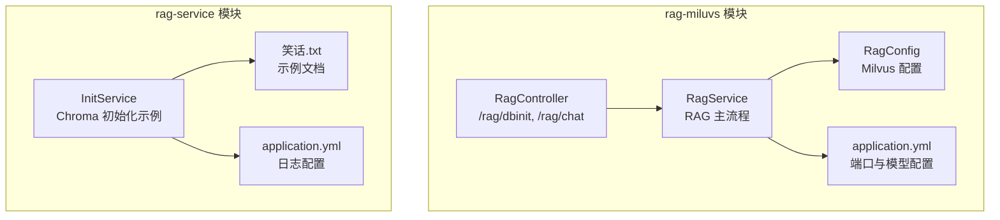
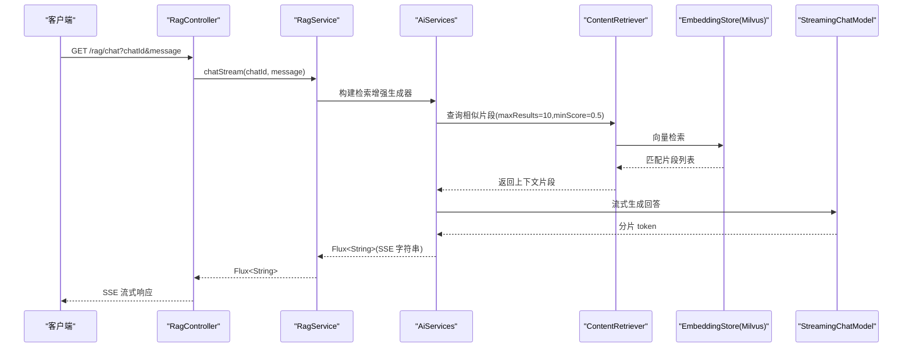
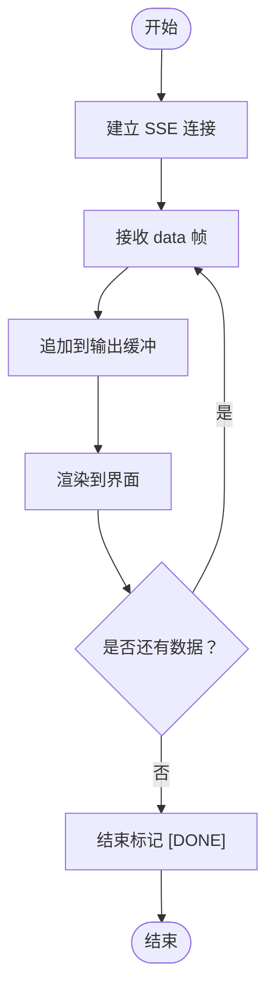
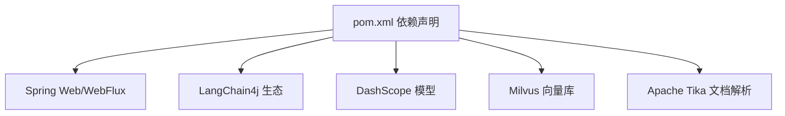

# RAG问答API

<cite>
**本文引用的文件**
- [RagController.java](file://rag-miluvs/src/main/java/cn/project/base/ragmiluvs/controller/RagController.java)
- [RagService.java](file://rag-miluvs/src/main/java/cn/project/base/ragmiluvs/service/RagService.java)
- [Customer.java](file://rag-miluvs/src/main/java/cn/project/base/ragmiluvs/service/Customer.java)
- [RagConfig.java](file://rag-miluvs/src/main/java/cn/project/base/ragmiluvs/config/RagConfig.java)
- [application.yml](file://rag-miluvs/src/main/resources/application.yml)
- [pom.xml](file://rag-miluvs/pom.xml)
- [InitService.java](file://rag-service/src/main/java/cn/project/base/ragservice/service/InitService.java)
- [application.yml](file://rag-service/src/main/resources/application.yml)
- [笑话.txt](file://rag-service/src/main/resources/笑话.txt)
</cite>

## 目录
1. [简介](#简介)
2. [项目结构](#项目结构)
3. [核心组件](#核心组件)
4. [架构总览](#架构总览)
5. [详细组件分析](#详细组件分析)
6. [依赖分析](#依赖分析)
7. [性能考虑](#性能考虑)
8. [故障排查指南](#故障排查指南)
9. [结论](#结论)
10. [附录](#附录)

## 简介
本文件为 RAG 问答系统的 API 文档，聚焦于两条核心接口：
- 数据库初始化接口：用于将本地文档解析、切片、向量化后写入向量数据库，供后续问答检索使用。
- 流式问答接口：基于 SSE（Server-Sent Events）实现的流式问答，支持按会话 ID 维持上下文。

文档将详细说明接口规范、参数定义、SSE 响应机制、错误处理、客户端集成方式，并给出 curl 示例与 JavaScript 客户端集成思路。

## 项目结构
本仓库包含多个子模块，本次文档关注与 RAG 功能直接相关的模块与文件：
- rag-miluvs 模块：提供 /rag 路径下的数据库初始化与流式问答接口，使用 LangChain4j 与 Milvus 向量数据库。
- rag-service 模块：提供向量数据库初始化的演示服务（Chroma），便于理解 RAG 的数据准备流程。

图表来源
- [RagController.java:1-29](file://rag-miluvs/src/main/java/cn/project/base/ragmiluvs/controller/RagController.java#L1-L29)
- [RagService.java:1-118](file://rag-miluvs/src/main/java/cn/project/base/ragmiluvs/service/RagService.java#L1-L118)
- [RagConfig.java:1-55](file://rag-miluvs/src/main/java/cn/project/base/ragmiluvs/config/RagConfig.java#L1-L55)
- [application.yml:1-24](file://rag-miluvs/src/main/resources/application.yml#L1-L24)
- [InitService.java:1-153](file://rag-service/src/main/java/cn/project/base/ragservice/service/InitService.java#L1-L153)
- [application.yml:1-9](file://rag-service/src/main/resources/application.yml#L1-L9)
- [笑话.txt:1-1](file://rag-service/src/main/resources/笑话.txt#L1-L1)

章节来源
- [RagController.java:1-29](file://rag-miluvs/src/main/java/cn/project/base/ragmiluvs/controller/RagController.java#L1-L29)
- [RagService.java:1-118](file://rag-miluvs/src/main/java/cn/project/base/ragmiluvs/service/RagService.java#L1-L118)
- [RagConfig.java:1-55](file://rag-miluvs/src/main/java/cn/project/base/ragmiluvs/config/RagConfig.java#L1-L55)
- [application.yml:1-24](file://rag-miluvs/src/main/resources/application.yml#L1-L24)
- [InitService.java:1-153](file://rag-service/src/main/java/cn/project/base/ragservice/service/InitService.java#L1-L153)
- [application.yml:1-9](file://rag-service/src/main/resources/application.yml#L1-L9)
- [笑话.txt:1-1](file://rag-service/src/main/resources/笑话.txt#L1-L1)

## 核心组件
- 接口控制器：提供 /rag/dbinit（GET）与 /rag/chat（GET，SSE）两个端点。
- 服务层：封装 RAG 主流程，包括检索增强、上下文记忆、流式输出。
- 配置层：定义 Milvus 向量数据库连接参数与内存聊天存储。
- 应用配置：定义服务端口、模型与 API Key 等运行时参数。

章节来源
- [RagController.java:12-28](file://rag-miluvs/src/main/java/cn/project/base/ragmiluvs/controller/RagController.java#L12-L28)
- [RagService.java:36-90](file://rag-miluvs/src/main/java/cn/project/base/ragmiluvs/service/RagService.java#L36-L90)
- [RagConfig.java:17-53](file://rag-miluvs/src/main/java/cn/project/base/ragmiluvs/config/RagConfig.java#L17-L53)
- [application.yml:1-24](file://rag-miluvs/src/main/resources/application.yml#L1-L24)

## 架构总览
RAG 问答的整体调用链路如下：

图表来源
- [RagController.java:24-27](file://rag-miluvs/src/main/java/cn/project/base/ragmiluvs/controller/RagController.java#L24-L27)
- [RagService.java:57-90](file://rag-miluvs/src/main/java/cn/project/base/ragmiluvs/service/RagService.java#L57-L90)
- [RagConfig.java:32-52](file://rag-miluvs/src/main/java/cn/project/base/ragmiluvs/config/RagConfig.java#L32-L52)

## 详细组件分析

### 接口一：数据库初始化 /rag/dbinit（GET）
- 方法：GET
- 路径：/rag/dbinit
- 功能：读取 classpath:documents 下的文档资源，解析、切片、向量化后写入 Milvus 向量数据库。
- 返回：字符串“OK”表示完成。
- 使用场景：首次部署或更新知识库时执行，确保向量数据库中有可检索的语料。

请求示例
- curl
  - curl -X GET http://localhost:8099/rag/dbinit

响应示例
- 成功
  - HTTP/1.1 200 OK
  - 内容：OK

章节来源
- [RagController.java:18-22](file://rag-miluvs/src/main/java/cn/project/base/ragmiluvs/controller/RagController.java#L18-L22)
- [RagService.java:95-116](file://rag-miluvs/src/main/java/cn/project/base/ragmiluvs/service/RagService.java#L95-L116)

### 接口二：流式问答 /rag/chat（GET，SSE）
- 方法：GET
- 路径：/rag/chat
- 参数
  - chatId（可选，默认值：1）：会话标识，用于区分不同对话上下文。
  - message（必填）：用户问题。
- 响应：text/event-stream，逐片返回大模型生成的 token，客户端以 SSE 方式接收。
- 上下文：基于 MessageWindowChatMemory 维护最近 N 条消息，提升多轮对话连贯性。
- 检索增强：使用 EmbeddingStoreContentRetriever 从 Milvus 中检索与问题最相关的片段，再交给 LLM 生成最终回答。

请求示例
- curl
  - curl -N -X GET "http://localhost:8099/rag/chat?chatId=1&message=什么是RAG"

- JavaScript（浏览器端）
  - 使用 EventSource 或 fetch + ReadableStream（取决于环境）订阅 /rag/chat 的 SSE 流，逐条拼接收到的文本片段。

响应示例
- 成功
  - HTTP/1.1 200 OK
  - Content-Type: text/event-stream
  - 数据帧示例（多条，每条以 data: 开头，以空行结尾）：
    - data: 片段1
    - data: 片段2
    - data: 片段N
    - data: [DONE]

- 错误
  - 当缺少必要参数或内部异常时，HTTP 状态码可能为 4xx/5xx，建议客户端捕获并提示用户重试。

章节来源
- [RagController.java:24-27](file://rag-miluvs/src/main/java/cn/project/base/ragmiluvs/controller/RagController.java#L24-L27)
- [RagService.java:57-90](file://rag-miluvs/src/main/java/cn/project/base/ragmiluvs/service/RagService.java#L57-L90)
- [Customer.java:8-16](file://rag-miluvs/src/main/java/cn/project/base/ragmiluvs/service/Customer.java#L8-L16)

### 流式传输工作原理与客户端处理
- 工作原理
  - 服务端通过 Reactor Flux 将大模型的生成过程拆分为多个 token 片段，逐个推送至客户端。
  - 客户端以 SSE 订阅，持续接收 data: 前缀的数据帧，直到收到结束标记（如 [DONE]）。
- 客户端处理建议
  - 事件缓冲：累积收到的片段，实时更新 UI。
  - 错误处理：监听网络异常与 HTTP 错误码，提供重试与降级策略。
  - 结束判断：识别结束标记，停止渲染并允许用户继续提问。

图表来源
- [RagController.java:24-27](file://rag-miluvs/src/main/java/cn/project/base/ragmiluvs/controller/RagController.java#L24-L27)
- [RagService.java:57-90](file://rag-miluvs/src/main/java/cn/project/base/ragmiluvs/service/RagService.java#L57-L90)

### 向量数据库初始化（重要性与使用场景）
- 重要性
  - RAG 的效果高度依赖高质量的语料与高效的向量检索。初始化阶段将文档切片并嵌入向量，写入 Milvus，使后续问答能快速召回相关片段。
- 使用场景
  - 新知识库上线：先执行 /rag/dbinit，完成向量化入库。
  - 知识库更新：在新增文档后重新执行初始化，保证检索新鲜度。
- 参考实现
  - rag-service 模块中的 InitService 展示了基于 Chroma 的初始化流程，可作为理解 RAG 数据准备的参考。

章节来源
- [RagService.java:95-116](file://rag-miluvs/src/main/java/cn/project/base/ragmiluvs/service/RagService.java#L95-L116)
- [InitService.java:38-109](file://rag-service/src/main/java/cn/project/base/ragservice/service/InitService.java#L38-L109)
- [application.yml:1-9](file://rag-service/src/main/resources/application.yml#L1-L9)
- [笑话.txt:1-1](file://rag-service/src/main/resources/笑话.txt#L1-L1)

## 依赖分析
- 模块与依赖
  - rag-miluvs 依赖 Spring Web/WebFlux、LangChain4j、DashScope 模型、Milvus 向量存储与 Apache Tika 文档解析。
  - 模块通过 application.yml 注入模型与 Milvus 连接参数。
- 关键 Bean
  - ChatMemoryStore：内存聊天存储，用于维护会话上下文。
  - EmbeddingStore：Milvus 向量存储，负责向量检索。

图表来源
- [pom.xml:36-94](file://rag-miluvs/pom.xml#L36-L94)

章节来源
- [pom.xml:1-163](file://rag-miluvs/pom.xml#L1-L163)
- [RagConfig.java:25-52](file://rag-miluvs/src/main/java/cn/project/base/ragmiluvs/config/RagConfig.java#L25-L52)
- [application.yml:1-24](file://rag-miluvs/src/main/resources/application.yml#L1-L24)

## 性能考虑
- 向量检索参数
  - maxResults：控制召回片段数量，影响速度与召回质量的平衡。
  - minScore：过滤低相关度片段，减少无关上下文对生成的影响。
- 文档切片
  - 切片长度与重叠度需结合业务语义与模型 token 上限权衡，避免过长导致上下文截断，过短导致语义碎片化。
- 流式输出
  - SSE 逐 token 推送有利于降低首字延迟，但需注意客户端渲染频率与网络抖动带来的体验波动。
- 存储与一致性
  - Milvus 的一致性级别与自动刷新策略会影响写入后可见性与查询性能，可根据场景调整。

## 故障排查指南
- 无法连接 Milvus
  - 检查 application.yml 中 host/port 是否正确，网络连通性是否正常。
- 未找到文档资源
  - /rag/dbinit 依赖 classpath:documents 下的文件，请确认资源路径与打包方式。
- SSE 连接中断
  - 检查服务端日志与网络超时设置，客户端需具备重连与错误提示能力。
- 问答无上下文
  - 确认 chatId 是否一致，以及 ChatMemoryStore 的持久化策略（当前为内存存储）。

章节来源
- [application.yml:7-24](file://rag-miluvs/src/main/resources/application.yml#L7-L24)
- [RagService.java:95-116](file://rag-miluvs/src/main/java/cn/project/base/ragmiluvs/service/RagService.java#L95-L116)
- [RagConfig.java:25-29](file://rag-miluvs/src/main/java/cn/project/base/ragmiluvs/config/RagConfig.java#L25-L29)

## 结论
本文档梳理了 RAG 问答系统的两条核心接口：/rag/dbinit 与 /rag/chat。前者负责将知识库初始化到 Milvus，后者提供基于 SSE 的流式问答能力。通过合理的检索参数、文档切片策略与客户端渲染优化，可在保证响应速度的同时提升问答质量。建议在生产环境中结合持久化存储与监控告警，持续优化检索与生成效果。

## 附录

### API 规范汇总
- /rag/dbinit（GET）
  - 参数：无
  - 返回：字符串“OK”
  - 用途：初始化向量数据库
- /rag/chat（GET，SSE）
  - 参数：
    - chatId（可选，默认 1）
    - message（必填）
  - 返回：text/event-stream，逐 token 推送回答片段
  - 用途：流式问答

章节来源
- [RagController.java:18-27](file://rag-miluvs/src/main/java/cn/project/base/ragmiluvs/controller/RagController.java#L18-L27)

### curl 示例
- 初始化知识库
  - curl -X GET http://localhost:8099/rag/dbinit
- 发起流式问答
  - curl -N -X GET "http://localhost:8099/rag/chat?chatId=1&message=什么是RAG"

### JavaScript 客户端集成要点
- 使用 EventSource 订阅 /rag/chat，逐条处理 data 帧并拼接输出。
- 对网络异常与 HTTP 错误码进行捕获与提示。
- 在收到结束标记后停止渲染并允许继续提问。