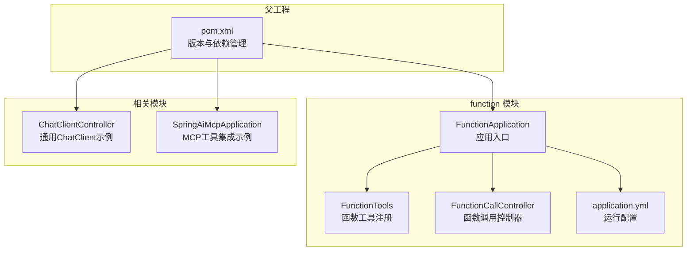
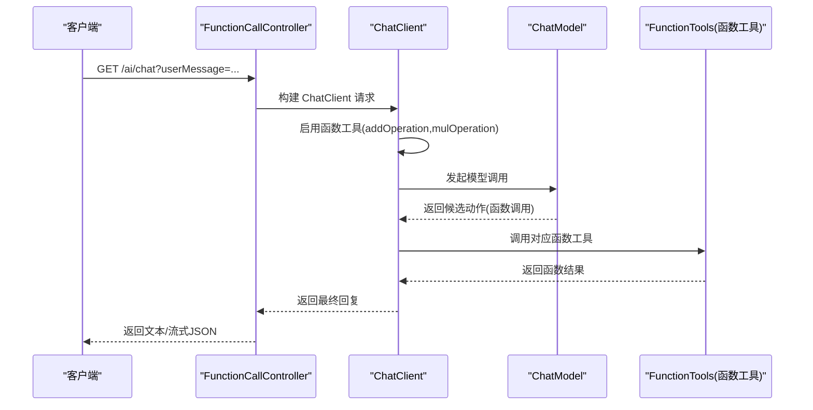
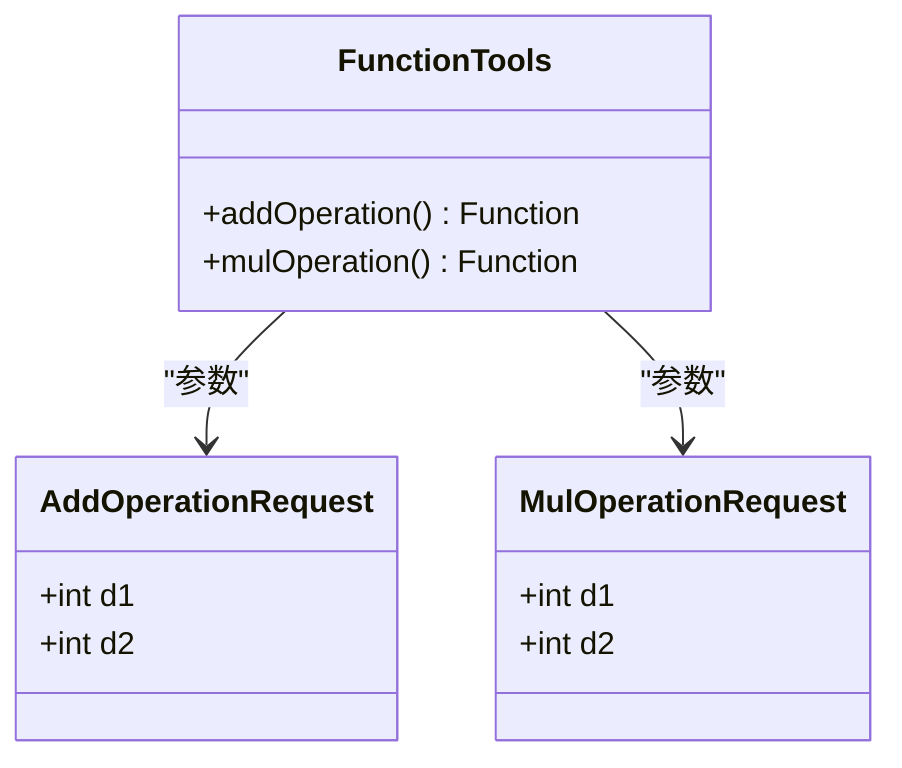
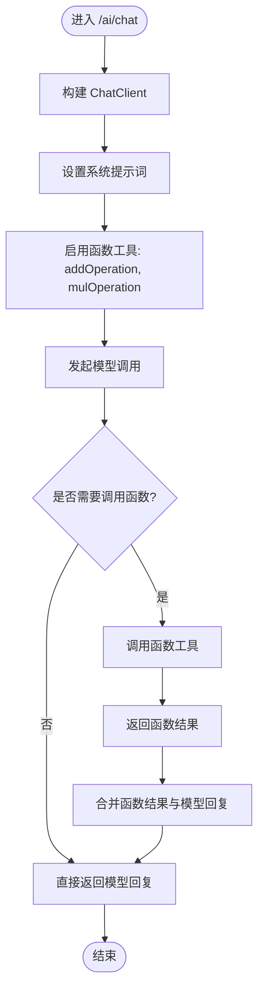
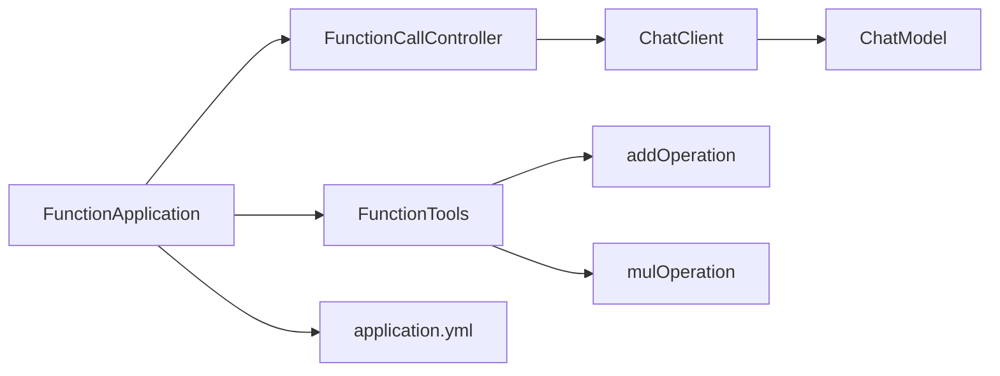

# 函数调用API

<cite>
**本文引用的文件**
- [FunctionApplication.java](file://function/src/main/java/cn/project/base/function/FunctionApplication.java)
- [FunctionTools.java](file://function/src/main/java/cn/project/base/function/config/FunctionTools.java)
- [FunctionCallController.java](file://function/src/main/java/cn/project/base/function/controller/FunctionCallController.java)
- [application.yml](file://function/src/main/resources/application.yml)
- [pom.xml](file://function/pom.xml)
- [ChatClientController.java](file://spring-ai-model/src/main/java/cn/project/base/springaimodel/controller/ChatClientController.java)
- [SpringAiMcpApplication.java](file://spring-ai-mcp/src/main/java/cn/project/base/springaimcp/SpringAiMcpApplication.java)
- [pom.xml](file://pom.xml)
</cite>

## 目录
1. [简介](#简介)
2. [项目结构](#项目结构)
3. [核心组件](#核心组件)
4. [架构总览](#架构总览)
5. [详细组件分析](#详细组件分析)
6. [依赖分析](#依赖分析)
7. [性能考量](#性能考量)
8. [故障排查指南](#故障排查指南)
9. [结论](#结论)
10. [附录](#附录)

## 简介
本文件面向“函数调用API”的使用与扩展，聚焦于函数工具的注册与调用接口规范，涵盖以下要点：
- 函数工具的配置方式与注册机制（函数名称、描述、参数定义、返回值格式）
- 函数调用的请求格式与响应结构（同步与异步/流式差异）
- 函数工具的生命周期管理与错误处理策略
- 自定义函数工具的开发指南与集成示例
- 安全考虑与权限控制建议
- 实际调用示例与调试方法

该系统基于 Spring Boot 与 Spring AI Alibaba Starter，结合本地或云端大模型服务，通过 ChatClient 的函数调用能力实现“函数即工具”的可插拔扩展。

## 项目结构
函数调用子系统位于独立模块中，主要由应用入口、函数工具注册、HTTP 控制器与配置组成；同时在父工程中统一管理版本与依赖。

图表来源
- [FunctionApplication.java:1-14](file://function/src/main/java/cn/project/base/function/FunctionApplication.java#L1-L14)
- [FunctionTools.java:1-40](file://function/src/main/java/cn/project/base/function/config/FunctionTools.java#L1-L40)
- [FunctionCallController.java:1-76](file://function/src/main/java/cn/project/base/function/controller/FunctionCallController.java#L1-L76)
- [application.yml:1-14](file://function/src/main/resources/application.yml#L1-L14)
- [pom.xml:1-85](file://function/pom.xml#L1-L85)
- [ChatClientController.java:1-142](file://spring-ai-model/src/main/java/cn/project/base/springaimodel/controller/ChatClientController.java#L1-L142)
- [SpringAiMcpApplication.java:1-36](file://spring-ai-mcp/src/main/java/cn/project/base/springaimcp/SpringAiMcpApplication.java#L1-L36)
- [pom.xml:1-171](file://pom.xml#L1-L171)

章节来源
- [FunctionApplication.java:1-14](file://function/src/main/java/cn/project/base/function/FunctionApplication.java#L1-L14)
- [FunctionTools.java:1-40](file://function/src/main/java/cn/project/base/function/config/FunctionTools.java#L1-L40)
- [FunctionCallController.java:1-76](file://function/src/main/java/cn/project/base/function/controller/FunctionCallController.java#L1-L76)
- [application.yml:1-14](file://function/src/main/resources/application.yml#L1-L14)
- [pom.xml:1-85](file://function/pom.xml#L1-L85)
- [pom.xml:1-171](file://pom.xml#L1-L171)

## 核心组件
- 应用入口：负责启动 Spring Boot 应用，加载配置与组件。
- 函数工具注册：通过 Spring 配置类以 Bean 方式注册函数工具，标注函数描述，供 ChatClient 调用。
- 函数调用控制器：提供 HTTP 接口，使用 ChatClient 构建提示词、启用函数工具并发起调用，支持流式输出。
- 运行配置：定义端口、AI 服务提供商与模型选择等。

章节来源
- [FunctionApplication.java:1-14](file://function/src/main/java/cn/project/base/function/FunctionApplication.java#L1-L14)
- [FunctionTools.java:1-40](file://function/src/main/java/cn/project/base/function/config/FunctionTools.java#L1-L40)
- [FunctionCallController.java:1-76](file://function/src/main/java/cn/project/base/function/controller/FunctionCallController.java#L1-L76)
- [application.yml:1-14](file://function/src/main/resources/application.yml#L1-L14)

## 架构总览
函数调用API采用“控制器-工具注册-模型服务”三层协作：
- 控制器层：接收用户消息，构建 ChatClient 请求，启用函数工具并发起调用。
- 工具层：以 Spring Bean 形式注册函数工具，提供名称、描述与实现。
- 模型层：通过 Spring AI Alibaba Starter 或其他适配器对接大模型服务。

图表来源
- [FunctionCallController.java:33-49](file://function/src/main/java/cn/project/base/function/controller/FunctionCallController.java#L33-L49)
- [FunctionTools.java:21-37](file://function/src/main/java/cn/project/base/function/config/FunctionTools.java#L21-L37)

## 详细组件分析

### 函数工具注册与生命周期
- 注册方式：通过配置类以 @Bean 方法注册函数工具，方法签名形如 Function<请求类型, 返回类型>。
- 函数名称：由 @Bean 方法名决定（例如 addOperation、mulOperation）。
- 函数描述：通过 @Description 注解提供中文描述，便于模型理解工具用途。
- 参数定义：请求类型为 record 类型，字段即为函数参数；返回类型为具体数据类型。
- 生命周期：作为 Spring Bean，在应用启动时注册到容器，随应用生命周期存在。

图表来源
- [FunctionTools.java:15-37](file://function/src/main/java/cn/project/base/function/config/FunctionTools.java#L15-L37)

章节来源
- [FunctionTools.java:1-40](file://function/src/main/java/cn/project/base/function/config/FunctionTools.java#L1-L40)

### 函数调用控制器与请求流程
- 接口路径：GET /ai/chat
- 请求参数：userMessage（用户输入）
- 响应类型：流式 JSON（APPLICATION_STREAM_JSON_VALUE）
- 处理流程：
  - 构建 ChatClient
  - 设置系统提示词（指导模型调用函数工具）
  - 启用函数工具（addOperation、mulOperation）
  - 发起调用并返回内容

图表来源
- [FunctionCallController.java:33-49](file://function/src/main/java/cn/project/base/function/controller/FunctionCallController.java#L33-L49)

章节来源
- [FunctionCallController.java:1-76](file://function/src/main/java/cn/project/base/function/controller/FunctionCallController.java#L1-L76)

### 配置与运行参数
- 端口：server.port
- AI 提供商与模型：spring.ai.dashscope.chat.options.model
- API Key：spring.ai.dashscope.api-key

章节来源
- [application.yml:1-14](file://function/src/main/resources/application.yml#L1-L14)

### 依赖与版本管理
- function 模块依赖 Spring Boot Web 与 Spring AI Alibaba Starter
- 父工程统一管理 Spring AI、LangChain4J、Ollama 等版本

章节来源
- [pom.xml:23-43](file://function/pom.xml#L23-L43)
- [pom.xml:24-102](file://pom.xml#L24-L102)

## 依赖分析
函数调用API的关键依赖关系如下：

图表来源
- [FunctionCallController.java:30-49](file://function/src/main/java/cn/project/base/function/controller/FunctionCallController.java#L30-L49)
- [FunctionTools.java:21-37](file://function/src/main/java/cn/project/base/function/config/FunctionTools.java#L21-L37)
- [FunctionApplication.java:1-14](file://function/src/main/java/cn/project/base/function/FunctionApplication.java#L1-L14)
- [application.yml:1-14](file://function/src/main/resources/application.yml#L1-L14)

章节来源
- [FunctionCallController.java:1-76](file://function/src/main/java/cn/project/base/function/controller/FunctionCallController.java#L1-L76)
- [FunctionTools.java:1-40](file://function/src/main/java/cn/project/base/function/config/FunctionTools.java#L1-L40)
- [FunctionApplication.java:1-14](file://function/src/main/java/cn/project/base/function/FunctionApplication.java#L1-L14)
- [application.yml:1-14](file://function/src/main/resources/application.yml#L1-L14)

## 性能考量
- 流式输出：控制器使用 APPLICATION_STREAM_JSON_VALUE，适合长文本与实时反馈场景。
- 函数调用开销：函数工具为本地计算，延迟取决于函数实现复杂度与模型调用往返时间。
- 并发与连接：HTTP 客户端与模型服务的并发限制需结合部署环境评估。
- 日志与监控：建议在函数工具中增加必要的日志与指标埋点，便于定位性能瓶颈。

## 故障排查指南
- 模型服务不可达：检查 AI 提供商配置与网络连通性。
- 函数未被识别：确认函数名称与 @Bean 方法名一致，且已在 ChatClient 中启用。
- 参数类型不匹配：确保请求 record 字段与函数签名一致。
- 权限与安全：若涉及外部服务调用，需在网关或控制器层增加鉴权与限流。
- 调试建议：
  - 打开控制器与工具类的日志级别，观察函数调用链路。
  - 使用最小化用户输入复现问题，逐步缩小范围。
  - 对比流式与非流式响应，验证模型与工具交互是否正常。

## 结论
函数调用API通过 Spring AI 的 ChatClient 与函数工具注册机制，实现了“函数即工具”的可插拔扩展。开发者可通过简单的配置与 Bean 注册快速接入自定义函数，并在控制器中以统一接口对外提供服务。建议在生产环境中完善安全策略、监控与限流，并对函数工具进行充分测试与文档化。

## 附录

### API 规范

- 基础信息
  - 基础路径：/ai
  - 默认字符集：UTF-8

- 接口定义
  - 方法：GET
  - 路径：/ai/chat
  - 查询参数：
    - userMessage：用户输入文本
  - 响应类型：流式 JSON（APPLICATION_STREAM_JSON_VALUE）

- 请求示例
  - curl 示例（仅示意，不含具体参数值）：
    - curl -i "http://localhost:8080/ai/chat?userMessage=..."

- 响应说明
  - 同步响应：返回最终文本内容
  - 异步/流式响应：以流式 JSON 返回，逐段推送内容

- 错误码
  - 400：请求参数缺失或无效
  - 500：模型服务异常或函数工具内部异常

章节来源
- [FunctionCallController.java:33-49](file://function/src/main/java/cn/project/base/function/controller/FunctionCallController.java#L33-L49)
- [application.yml:1-14](file://function/src/main/resources/application.yml#L1-L14)

### 函数工具注册规范

- 函数命名
  - 采用 @Bean 方法名作为函数名称
- 函数描述
  - 使用 @Description 注解提供中文描述
- 参数定义
  - 使用 record 类型定义请求参数
- 返回值
  - 返回值类型需与函数签名一致

章节来源
- [FunctionTools.java:15-37](file://function/src/main/java/cn/project/base/function/config/FunctionTools.java#L15-L37)

### 自定义函数工具开发指南

- 步骤
  - 在配置类中新增 @Bean 方法，返回 Function<请求类型, 返回类型>
  - 使用 record 定义请求参数
  - 添加 @Description 注解描述函数用途
  - 在控制器中通过 ChatClient.functions(...) 启用该函数
- 集成示例
  - 参考模块内现有 addOperation 与 mulOperation 的实现与启用方式

章节来源
- [FunctionTools.java:21-37](file://function/src/main/java/cn/project/base/function/config/FunctionTools.java#L21-L37)
- [FunctionCallController.java:46-47](file://function/src/main/java/cn/project/base/function/controller/FunctionCallController.java#L46-L47)

### 安全考虑与权限控制

- 认证与授权
  - 在网关或控制器层增加鉴权校验
  - 对敏感函数工具设置访问白名单
- 速率限制
  - 对 /ai/chat 接口实施限流，防止滥用
- 输入校验
  - 对 userMessage 进行长度与内容校验
- 输出脱敏
  - 对函数返回值进行必要脱敏处理

### 实际调用示例与调试方法

- 示例
  - 调用路径：GET /ai/chat?userMessage=...
  - 控制台示例：参考控制器内的 main 方法，演示了与外部服务的 HTTP 调用方式
- 调试
  - 打开日志，观察函数工具调用日志
  - 使用最小化输入复现问题
  - 对比流式与非流式响应，确认交互链路

章节来源
- [FunctionCallController.java:50-74](file://function/src/main/java/cn/project/base/function/controller/FunctionCallController.java#L50-L74)