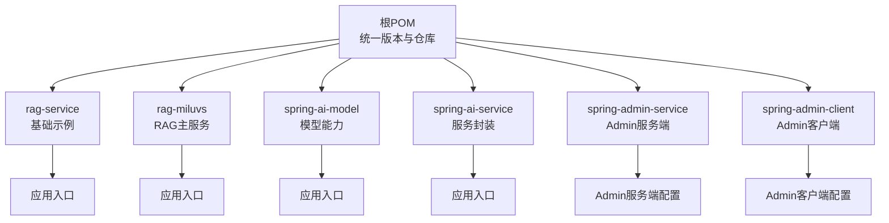
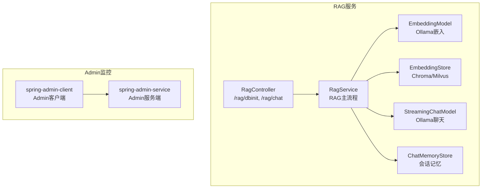
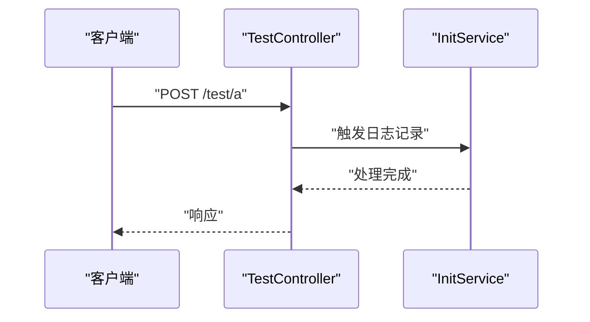
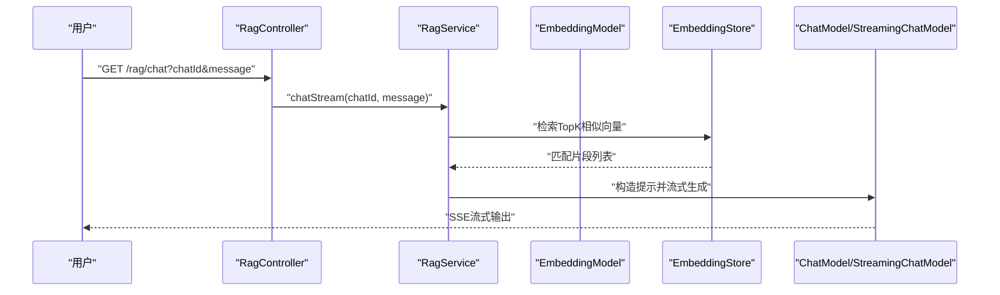
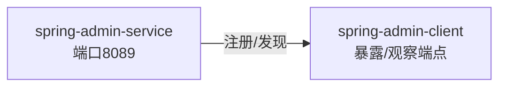
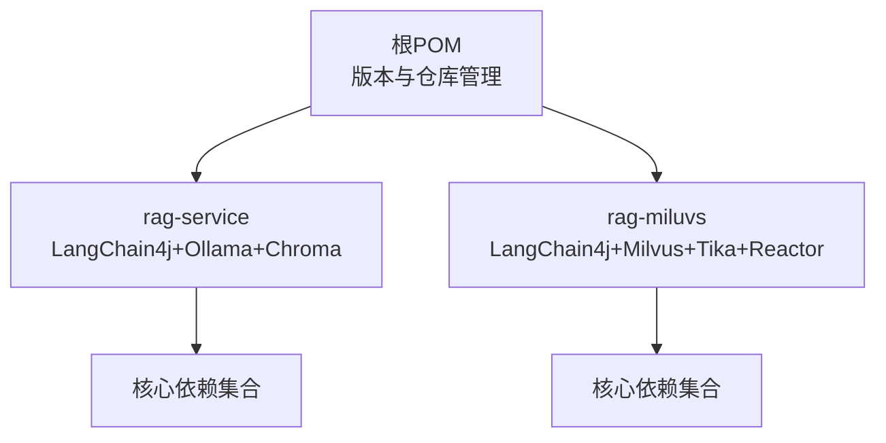

# 开发指南

<cite>
**本文引用的文件**
- [pom.xml](file://pom.xml)
- [rag-service/pom.xml](file://rag-service/pom.xml)
- [rag-service/src/main/resources/application.yml](file://rag-service/src/main/resources/application.yml)
- [rag-service/src/main/java/cn/project/base/ragservice/RagServiceApplication.java](file://rag-service/src/main/java/cn/project/base/ragservice/RagServiceApplication.java)
- [rag-service/src/main/java/cn/project/base/ragservice/controller/TestController.java](file://rag-service/src/main/java/cn/project/base/ragservice/controller/TestController.java)
- [rag-service/src/main/java/cn/project/base/ragservice/service/InitService.java](file://rag-service/src/main/java/cn/project/base/ragservice/service/InitService.java)
- [rag-service/src/test/java/cn/project/base/ragservice/RagServiceApplicationTests.java](file://rag-service/src/test/java/cn/project/base/ragservice/RagServiceApplicationTests.java)
- [rag-miluvs/pom.xml](file://rag-miluvs/pom.xml)
- [rag-miluvs/src/main/java/cn/project/base/ragmiluvs/RagMiluvsApplication.java](file://rag-miluvs/src/main/java/cn/project/base/ragmiluvs/RagMiluvsApplication.java)
- [rag-miluvs/src/main/java/cn/project/base/ragmiluvs/controller/RagController.java](file://rag-miluvs/src/main/java/cn/project/base/ragmiluvs/controller/RagController.java)
- [rag-miluvs/src/main/java/cn/project/base/ragmiluvs/service/RagService.java](file://rag-miluvs/src/main/java/cn/project/base/ragmiluvs/service/RagService.java)
- [spring-admin-service/src/main/resources/application.yml](file://spring-admin-service/src/main/resources/application.yml)
- [spring-admin-client/src/main/resources/application.yml](file://spring-admin-client/src/main/resources/application.yml)
- [spring-ai-model/src/main/java/cn/project/base/springaimodel/SpringAiModelApplication.java](file://spring-ai-model/src/main/java/cn/project/base/springaimodel/SpringAiModelApplication.java)
- [spring-ai-service/src/main/java/cn/project/base/springaiservice/SpringAiServiceApplication.java](file://spring-ai-service/src/main/java/cn/project/base/springaiservice/SpringAiServiceApplication.java)
</cite>

## 目录
1. [简介](#简介)
2. [项目结构](#项目结构)
3. [核心组件](#核心组件)
4. [架构总览](#架构总览)
5. [详细组件分析](#详细组件分析)
6. [依赖分析](#依赖分析)
7. [性能考虑](#性能考虑)
8. [故障排查指南](#故障排查指南)
9. [结论](#结论)
10. [附录](#附录)

## 简介
本开发指南面向RAG服务项目，提供从开发环境搭建、代码结构与命名约定、单元与集成测试、代码审查与质量保障、常见开发任务操作、版本控制与分支管理、性能与压力测试，以及开发工具与效率提升等全链路实践建议。项目采用多模块Maven聚合工程，核心围绕LangChain4j与Spring Boot构建RAG能力，并辅以Spring Boot Admin监控客户端与服务端。

## 项目结构
项目采用多模块聚合结构，顶层POM统一管理版本与仓库，各子模块按功能域拆分，例如：
- rag-service：基础RAG示例与演示入口
- rag-miluvs：基于LangChain4j Milvus与流式对话的RAG服务
- spring-ai-model：AI模型相关能力模块
- spring-ai-service：AI服务调用封装模块
- spring-admin-service：Spring Boot Admin服务端
- spring-admin-client：Spring Boot Admin客户端
- 其他模块：function、langchain-ai等

图表来源
- [pom.xml:11-22](file://pom.xml#L11-L22)
- [rag-service/pom.xml:1-100](file://rag-service/pom.xml#L1-L100)
- [rag-miluvs/pom.xml:1-163](file://rag-miluvs/pom.xml#L1-L163)

章节来源
- [pom.xml:1-171](file://pom.xml#L1-L171)
- [rag-service/pom.xml:1-100](file://rag-service/pom.xml#L1-L100)
- [rag-miluvs/pom.xml:1-163](file://rag-miluvs/pom.xml#L1-L163)

## 核心组件
- 应用入口与启动
  - rag-service：应用入口类负责启动Spring Boot应用
  - rag-miluvs：应用入口类负责启动RAG服务
  - spring-ai-model、spring-ai-service：分别提供模型与服务封装能力
  - spring-admin-service：Admin服务端，监听固定端口
  - spring-admin-client：Admin客户端，注册到Admin服务端并暴露监控端点

- 配置与日志
  - rag-service：通过application.yml设置应用名、日志配置与特定包日志级别
  - spring-admin-client：配置Admin服务端地址、暴露管理端点、健康检查细节与信息元数据

- 控制器与服务
  - rag-service：提供简单测试接口用于验证服务可用性
  - rag-miluvs：提供RAG初始化与流式对话接口，内部通过LangChain4j整合嵌入模型、向量存储与聊天模型

章节来源
- [rag-service/src/main/java/cn/project/base/ragservice/RagServiceApplication.java:1-14](file://rag-service/src/main/java/cn/project/base/ragservice/RagServiceApplication.java#L1-L14)
- [rag-miluvs/src/main/java/cn/project/base/ragmiluvs/RagMiluvsApplication.java:1-14](file://rag-miluvs/src/main/java/cn/project/base/ragmiluvs/RagMiluvsApplication.java#L1-L14)
- [spring-admin-service/src/main/resources/application.yml:1-6](file://spring-admin-service/src/main/resources/application.yml#L1-L6)
- [spring-admin-client/src/main/resources/application.yml:1-36](file://spring-admin-client/src/main/resources/application.yml#L1-L36)
- [rag-service/src/main/resources/application.yml:1-9](file://rag-service/src/main/resources/application.yml#L1-L9)
- [rag-service/src/main/java/cn/project/base/ragservice/controller/TestController.java:1-17](file://rag-service/src/main/java/cn/project/base/ragservice/controller/TestController.java#L1-L17)
- [rag-miluvs/src/main/java/cn/project/base/ragmiluvs/controller/RagController.java:1-29](file://rag-miluvs/src/main/java/cn/project/base/ragmiluvs/controller/RagController.java#L1-L29)

## 架构总览
整体架构由多个Spring Boot微服务组成，其中RAG服务通过LangChain4j对接本地或远程Ollama嵌入模型与聊天模型，并将文档切片后存入向量数据库（示例中涉及Chroma与Milvus），最终在用户提问时执行检索增强生成（RAG）并返回流式响应。

图表来源
- [rag-miluvs/src/main/java/cn/project/base/ragmiluvs/controller/RagController.java:1-29](file://rag-miluvs/src/main/java/cn/project/base/ragmiluvs/controller/RagController.java#L1-L29)
- [rag-miluvs/src/main/java/cn/project/base/ragmiluvs/service/RagService.java:1-118](file://rag-miluvs/src/main/java/cn/project/base/ragmiluvs/service/RagService.java#L1-L118)
- [spring-admin-service/src/main/resources/application.yml:1-6](file://spring-admin-service/src/main/resources/application.yml#L1-L6)
- [spring-admin-client/src/main/resources/application.yml:1-36](file://spring-admin-client/src/main/resources/application.yml#L1-L36)

## 详细组件分析

### rag-service 模块
- 应用入口与配置
  - 应用入口类负责启动Spring Boot
  - application.yml设置应用名、日志配置与mybatis日志级别
- 控制器
  - 提供简单POST测试接口，便于快速验证服务可用性
- 初始化服务
  - 展示了完整的RAG流程：文档加载、分段、向量化、写入向量库、检索、与LLM交互
  - 使用Ollama嵌入与聊天模型、Chroma向量库、Prompt模板与用户消息交互

图表来源
- [rag-service/src/main/java/cn/project/base/ragservice/controller/TestController.java:12-16](file://rag-service/src/main/java/cn/project/base/ragservice/controller/TestController.java#L12-L16)
- [rag-service/src/main/java/cn/project/base/ragservice/service/InitService.java:38-109](file://rag-service/src/main/java/cn/project/base/ragservice/service/InitService.java#L38-L109)

章节来源
- [rag-service/src/main/java/cn/project/base/ragservice/RagServiceApplication.java:1-14](file://rag-service/src/main/java/cn/project/base/ragservice/RagServiceApplication.java#L1-L14)
- [rag-service/src/main/resources/application.yml:1-9](file://rag-service/src/main/resources/application.yml#L1-L9)
- [rag-service/src/main/java/cn/project/base/ragservice/controller/TestController.java:1-17](file://rag-service/src/main/java/cn/project/base/ragservice/controller/TestController.java#L1-L17)
- [rag-service/src/main/java/cn/project/base/ragservice/service/InitService.java:1-153](file://rag-service/src/main/java/cn/project/base/ragservice/service/InitService.java#L1-L153)

### rag-miluvs 模块
- 控制器
  - /rag/dbinit：初始化向量库，导入文档并切片嵌入
  - /rag/chat：流式对话接口，返回SSE事件流
- 服务
  - RAG主流程：构建AiServices，配置聊天模型与嵌入模型，使用EmbeddingStoreContentRetriever检索，结合CompressingQueryTransformer压缩查询，最终返回流式响应
  - 文档导入：扫描classpath:documents目录，解析文档、分段、嵌入并批量写入向量库

图表来源
- [rag-miluvs/src/main/java/cn/project/base/ragmiluvs/controller/RagController.java:24-27](file://rag-miluvs/src/main/java/cn/project/base/ragmiluvs/controller/RagController.java#L24-L27)
- [rag-miluvs/src/main/java/cn/project/base/ragmiluvs/service/RagService.java:57-90](file://rag-miluvs/src/main/java/cn/project/base/ragmiluvs/service/RagService.java#L57-L90)

章节来源
- [rag-miluvs/src/main/java/cn/project/base/ragmiluvs/controller/RagController.java:1-29](file://rag-miluvs/src/main/java/cn/project/base/ragmiluvs/controller/RagController.java#L1-L29)
- [rag-miluvs/src/main/java/cn/project/base/ragmiluvs/service/RagService.java:1-118](file://rag-miluvs/src/main/java/cn/project/base/ragmiluvs/service/RagService.java#L1-L118)

### Admin监控模块
- spring-admin-service：Admin服务端，配置应用名与端口
- spring-admin-client：Admin客户端，配置Admin服务端URL、暴露管理端点、健康检查细节与信息元数据

图表来源
- [spring-admin-service/src/main/resources/application.yml:1-6](file://spring-admin-service/src/main/resources/application.yml#L1-L6)
- [spring-admin-client/src/main/resources/application.yml:1-36](file://spring-admin-client/src/main/resources/application.yml#L1-L36)

章节来源
- [spring-admin-service/src/main/resources/application.yml:1-6](file://spring-admin-service/src/main/resources/application.yml#L1-L6)
- [spring-admin-client/src/main/resources/application.yml:1-36](file://spring-admin-client/src/main/resources/application.yml#L1-L36)

## 依赖分析
- 版本与仓库
  - 顶层POM统一管理Java与Spring生态版本，集中声明Spring Boot、Spring AI、LangChain4j、Spring Boot Admin等依赖版本
  - 通过依赖管理确保子模块一致性，避免版本漂移
- 子模块依赖
  - rag-service：引入LangChain4j核心、OpenAI适配、Ollama适配、Chroma客户端、Web Starter、Lombok、测试依赖
  - rag-miluvs：引入Web、WebFlux、Spring AI Ollama Starter、LangChain4j相关Starter、Milvus适配、Apache Tika解析器、Reactor等

图表来源
- [pom.xml:24-102](file://pom.xml#L24-L102)
- [rag-service/pom.xml:23-80](file://rag-service/pom.xml#L23-L80)
- [rag-miluvs/pom.xml:36-95](file://rag-miluvs/pom.xml#L36-L95)

章节来源
- [pom.xml:1-171](file://pom.xml#L1-L171)
- [rag-service/pom.xml:1-100](file://rag-service/pom.xml#L1-L100)
- [rag-miluvs/pom.xml:1-163](file://rag-miluvs/pom.xml#L1-L163)

## 性能考虑
- 向量检索优化
  - 调整EmbeddingStoreContentRetriever的maxResults与minScore，平衡召回与质量
  - 使用CompressingQueryTransformer压缩查询，减少噪声，提升检索质量
- 流式响应
  - 使用Reactor Flux实现SSE流式输出，降低首字节延迟，改善用户体验
- 嵌入与存储
  - 批量嵌入与批量写入向量库，减少网络往返与I/O开销
- 模型与资源
  - 合理配置Ollama模型与本地资源占用，避免过载
- 监控与可观测性
  - 通过Spring Boot Admin监控服务状态、健康检查与指标

## 故障排查指南
- 启动与端口
  - 确认Admin服务端端口配置正确，客户端可正常注册
- 日志与配置
  - 检查application.yml中的日志配置是否生效，必要时调整日志级别
- 依赖与版本
  - 若出现类冲突或版本不兼容，优先核对顶层POM的版本管理与子模块依赖范围
- RAG流程
  - 文档导入失败：检查classpath:documents目录是否存在、文件权限与解析器支持格式
  - 向量检索无结果：确认嵌入模型与向量库连通性、集合名称一致、minScore阈值合理
  - 流式对话异常：检查StreamingChatModel配置与网络连通性

章节来源
- [spring-admin-service/src/main/resources/application.yml:1-6](file://spring-admin-service/src/main/resources/application.yml#L1-L6)
- [spring-admin-client/src/main/resources/application.yml:1-36](file://spring-admin-client/src/main/resources/application.yml#L1-L36)
- [rag-miluvs/src/main/java/cn/project/base/ragmiluvs/service/RagService.java:95-116](file://rag-miluvs/src/main/java/cn/project/base/ragmiluvs/service/RagService.java#L95-L116)
- [pom.xml:24-102](file://pom.xml#L24-L102)

## 结论
本指南提供了RAG服务项目的开发与运维实践路径，涵盖环境搭建、代码结构、测试、质量保障、版本管理、性能与监控等方面。建议团队在开发过程中遵循统一的版本管理与依赖约束，持续完善测试覆盖与监控告警，确保系统稳定性与可扩展性。

## 附录

### 开发环境搭建与IDE配置
- JDK与Maven
  - 使用JDK 21与Maven 3.6+，确保settings.xml配置阿里云镜像加速
- IDE建议
  - IntelliJ IDEA：启用Lombok注解处理、Spring Boot插件、Maven自动导入
  - 插件推荐：Save Actions、SonarLint、Checkstyle、SpotBugs
- 运行与调试
  - 分模块运行各Spring Boot应用，优先启动Admin服务端再启动Admin客户端
  - 为RAG服务设置断点，逐步验证文档导入、向量检索与对话生成链路

### 代码规范与命名约定
- 包与模块
  - 采用cn.project.base.{模块名}的包结构，保持模块边界清晰
- 类与接口
  - 控制器以Controller结尾，服务以Service结尾，应用入口以Application结尾
- 配置
  - application.yml集中管理配置，避免硬编码端口与地址
- 日志
  - 使用SLF4J与Logback，按模块设置日志级别，避免生产环境泄露敏感信息

### 单元测试与集成测试
- 单元测试
  - 使用JUnit 5与Spring Boot Test，针对服务层逻辑编写测试用例
  - 示例：RagServiceApplicationTests用于验证上下文加载
- 集成测试
  - 通过@SpringBootTest启动完整上下文，结合Mock或真实外部服务（如Ollama、向量库）
  - 对RAG流程的关键节点（导入文档、检索、对话）编写端到端测试

章节来源
- [rag-service/src/test/java/cn/project/base/ragservice/RagServiceApplicationTests.java:1-14](file://rag-service/src/test/java/cn/project/base/ragservice/RagServiceApplicationTests.java#L1-L14)

### 代码审查清单与质量保证流程
- 代码审查清单
  - 依赖版本一致性、日志完整性、异常处理与资源释放、配置外化、安全与敏感信息脱敏
- 质量保证流程
  - 提交前本地静态检查（Checkstyle/SpotBugs）、单元测试通过、集成测试覆盖关键路径
  - CI流水线执行全量测试与依赖扫描，发布前进行安全扫描与性能回归

### 常见开发任务操作指南
- 添加新功能
  - 在对应模块新增Controller与Service，注入所需依赖，编写单元与集成测试
  - 更新application.yml与必要的配置类，确保可配置项对外暴露
- 修改现有模块
  - 保持接口稳定，通过版本号与配置开关平滑演进
  - 修改依赖时同步更新顶层POM版本管理
- 修复Bug
  - 编写最小复现用例，定位问题模块与依赖版本
  - 修复后补充回归测试，避免同类问题再次发生

### 版本控制与分支管理策略
- 分支策略
  - 主分支保护，Hotfix分支用于紧急修复，Feature分支用于新功能开发
- 提交规范
  - 规范化的提交信息，包含模块、变更类型与简要描述
- 发布流程
  - 通过CI打包与测试，打Tag并发布至制品库，更新版本号与变更日志

### 性能测试与压力测试
- 场景设计
  - 设计RAG检索与对话的并发场景，模拟多用户同时请求
- 工具与指标
  - 使用JMeter或Gatling进行压测，关注吞吐量、P95/P99延迟、错误率与资源占用
- 优化建议
  - 调整向量库阈值与批处理大小，优化模型推理与网络I/O

### 开发工具推荐与效率提升技巧
- 工具推荐
  - Postman/JetBrains Gateway：API调试与远程开发
  - Docker：容器化部署与本地服务编排
  - Prometheus/Grafana：指标采集与可视化
- 效率技巧
  - 使用Lombok减少样板代码，启用IDE自动格式化与保存动作
  - 将重复逻辑抽取为通用组件，统一异常与日志处理