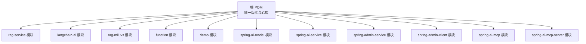
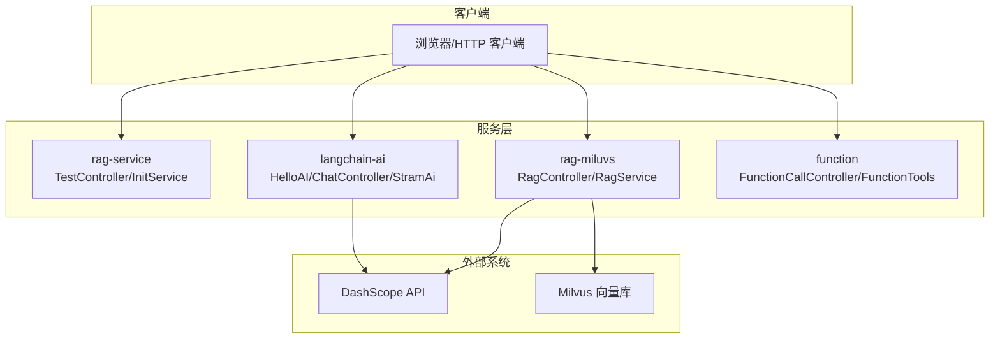
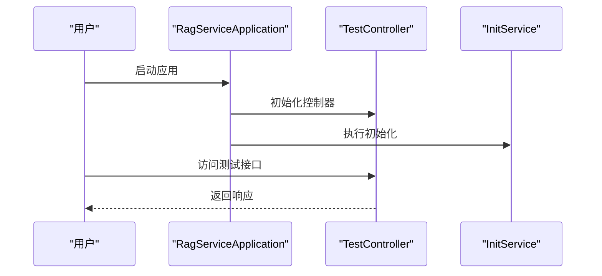
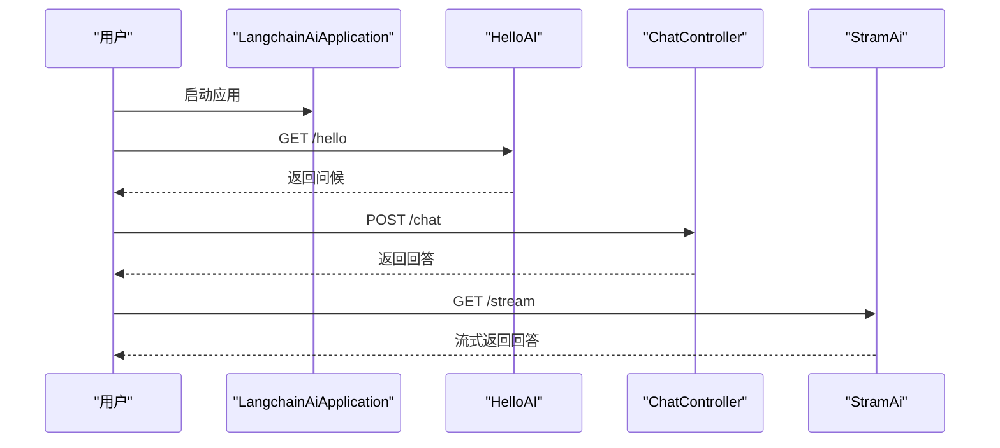
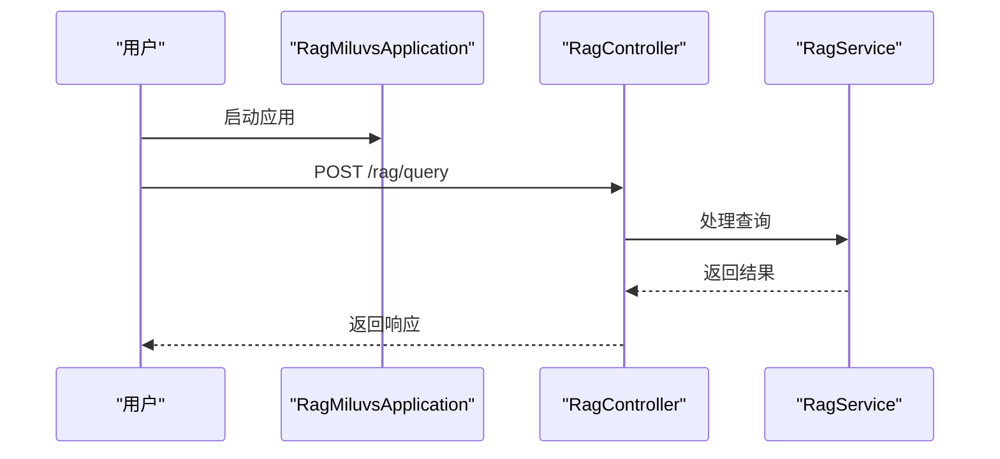
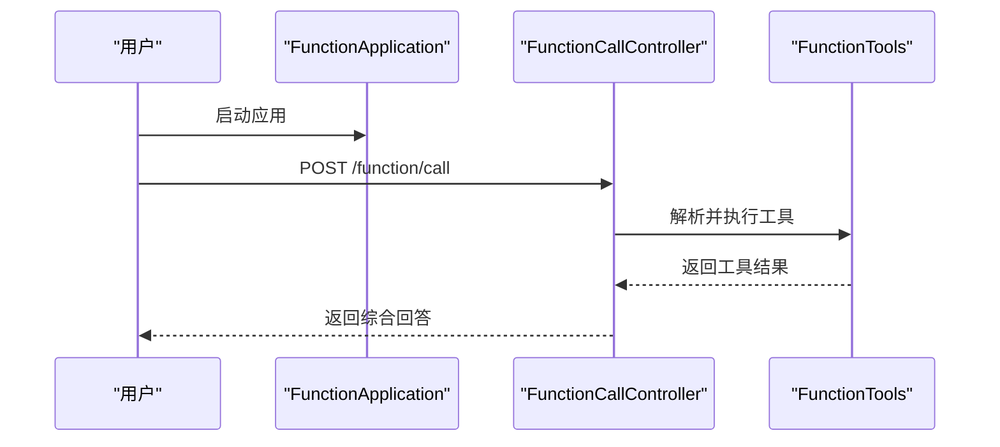
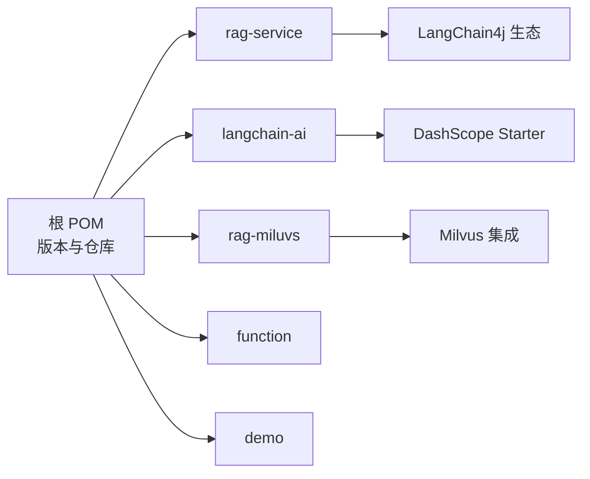

# 快速开始

<cite>
**本文引用的文件**
- [pom.xml](file://pom.xml)
- [rag-service/pom.xml](file://rag-service/pom.xml)
- [langchain-ai/pom.xml](file://langchain-ai/pom.xml)
- [rag-miluvs/pom.xml](file://rag-miluvs/pom.xml)
- [demo/pom.xml](file://demo/pom.xml)
- [function/pom.xml](file://function/pom.xml)
- [rag-service/src/main/java/cn/project/base/ragservice/RagServiceApplication.java](file://rag-service/src/main/java/cn/project/base/ragservice/RagServiceApplication.java)
- [langchain-ai/src/main/java/cn/project/base/langchainai/LangchainAiApplication.java](file://langchain-ai/src/main/java/cn/project/base/langchainai/LangchainAiApplication.java)
- [rag-miluvs/src/main/java/cn/project/base/ragmiluvs/RagMiluvsApplication.java](file://rag-miluvs/src/main/java/cn/project/base/ragmiluvs/RagMiluvsApplication.java)
- [demo/src/main/java/com/example/demo/DemoApplication.java](file://demo/src/main/java/com/example/demo/DemoApplication.java)
- [function/src/main/java/cn/project/base/function/FunctionApplication.java](file://function/src/main/java/cn/project/base/function/FunctionApplication.java)
- [rag-service/src/main/resources/application.yml](file://rag-service/src/main/resources/application.yml)
- [langchain-ai/src/main/resources/application.yml](file://langchain-ai/src/main/resources/application.yml)
- [rag-miluvs/src/main/resources/application.yml](file://rag-miluvs/src/main/resources/application.yml)
- [demo/src/main/resources/application.properties](file://demo/src/main/resources/application.properties)
- [function/src/main/resources/application.yml](file://function/src/main/resources/application.yml)
- [rag-service/src/main/java/cn/project/base/ragservice/controller/TestController.java](file://rag-service/src/main/java/cn/project/base/ragservice/controller/TestController.java)
- [rag-service/src/main/java/cn/project/base/ragservice/service/InitService.java](file://rag-service/src/main/java/cn/project/base/ragservice/service/InitService.java)
- [langchain-ai/src/main/java/cn/project/base/langchainai/controller/HelloAI.java](file://langchain-ai/src/main/java/cn/project/base/langchainai/controller/HelloAI.java)
- [langchain-ai/src/main/java/cn/project/base/langchainai/controller/ChatController.java](file://langchain-ai/src/main/java/cn/project/base/langchainai/controller/ChatController.java)
- [langchain-ai/src/main/java/cn/project/base/langchainai/controller/StramAi.java](file://langchain-ai/src/main/java/cn/project/base/langchainai/controller/StramAi.java)
- [function/src/main/java/cn/project/base/function/controller/FunctionCallController.java](file://function/src/main/java/cn/project/base/function/controller/FunctionCallController.java)
- [function/src/main/java/cn/project/base/function/config/FunctionTools.java](file://function/src/main/java/cn/project/base/function/config/FunctionTools.java)
- [rag-miluvs/src/main/java/cn/project/base/ragmiluvs/controller/RagController.java](file://rag-miluvs/src/main/java/cn/project/base/ragmiluvs/controller/RagController.java)
- [rag-miluvs/src/main/java/cn/project/base/ragmiluvs/service/RagService.java](file://rag-miluvs/src/main/java/cn/project/base/ragmiluvs/service/RagService.java)
- [spring-ai-model/src/main/java/cn/project/base/springaimodel/SpringAiModelApplication.java](file://spring-ai-model/src/main/java/cn/project/base/springaimodel/SpringAiModelApplication.java)
- [spring-ai-service/src/main/java/cn/project/base/springaiservice/SpringAiServiceApplication.java](file://spring-ai-service/src/main/java/cn/project/base/springaiservice/SpringAiServiceApplication.java)
- [spring-admin-service/src/main/java/cn/project/base/springadminservice/SpringAdminServiceApplication.java](file://spring-admin-service/src/main/java/cn/project/base/springadminservice/SpringAdminServiceApplication.java)
- [spring-admin-client/src/main/java/cn/project/base/springadminclient/SpringAdminClientApplication.java](file://spring-admin-client/src/main/java/cn/project/base/springadminclient/SpringAdminClientApplication.java)
- [spring-ai-mcp/src/main/java/cn/project/base/springaimcp/SpringAiMcpApplication.java](file://spring-ai-mcp/src/main/java/cn/project/base/springaimcp/SpringAiMcpApplication.java)
- [spring-ai-mcp-server/src/main/java/cn/project/base/springaimcpserver/SpringAiMcpServerApplication.java](file://spring-ai-mcp-server/src/main/java/cn/project/base/springaimcpserver/SpringAiMcpServerApplication.java)
</cite>

## 目录
1. [简介](#简介)
2. [项目结构](#项目结构)
3. [核心组件](#核心组件)
4. [架构总览](#架构总览)
5. [详细组件分析](#详细组件分析)
6. [依赖关系分析](#依赖关系分析)
7. [性能与资源建议](#性能与资源建议)
8. [故障排查指南](#故障排查指南)
9. [结论](#结论)
10. [附录：命令行与示例](#附录命令行与示例)

## 简介
本指南面向首次接触 RAG 服务项目的开发者，目标是在 30 分钟内完成从环境准备到启动首个服务实例的全流程。你将学会：
- 安装 JDK 21、配置 Maven（含国内镜像）与常用开发工具
- 克隆仓库、构建与启动各模块
- 运行一个简单的 Hello World 示例，体验基础问答能力
- 面向常见启动问题的排查方法
- 覆盖 Windows/Linux/macOS 的具体命令行示例

## 项目结构
该仓库采用多模块聚合工程组织，顶层 POM 声明了统一的 Java 版本与依赖版本策略，并在子模块中按功能拆分（如 rag-service、langchain-ai、rag-miluvs、function 等）。每个模块均包含独立的 Spring Boot 应用入口类与配置文件。

图表来源
- [pom.xml:11-22](file://pom.xml#L11-L22)
- [pom.xml:24-35](file://pom.xml#L24-L35)

章节来源
- [pom.xml:1-171](file://pom.xml#L1-L171)

## 核心组件
- rag-service：提供基础 RAG 能力与测试接口，应用名为 rag-service，默认日志配置指向本地开发配置。
- langchain-ai：基于 LangChain4j 的 AI 服务示例，内置 DashScope 配置，端口默认 8080。
- rag-miluvs：集成 Milvus 向量数据库与 DashScope 的 RAG 示例，端口默认 8099。
- function：函数调用示例模块，演示工具注册与调用流程。
- demo：最小可运行示例，便于验证本地环境与 Maven 构建链路。
- spring-ai-model、spring-ai-service、spring-admin-*、spring-ai-mcp*：扩展模块，分别覆盖模型服务、AI 服务、监控与 MCP 协议相关能力。

章节来源
- [rag-service/src/main/resources/application.yml:1-9](file://rag-service/src/main/resources/application.yml#L1-L9)
- [langchain-ai/src/main/resources/application.yml:1-15](file://langchain-ai/src/main/resources/application.yml#L1-L15)
- [rag-miluvs/src/main/resources/application.yml:1-24](file://rag-miluvs/src/main/resources/application.yml#L1-L24)
- [function/src/main/resources/application.yml:1-14](file://function/src/main/resources/application.yml#L1-L14)

## 架构总览
下图展示了各模块的职责与典型交互路径（以 Hello World 为例）：

图表来源
- [rag-service/src/main/java/cn/project/base/ragservice/controller/TestController.java](file://rag-service/src/main/java/cn/project/base/ragservice/controller/TestController.java)
- [rag-service/src/main/java/cn/project/base/ragservice/service/InitService.java](file://rag-service/src/main/java/cn/project/base/ragservice/service/InitService.java)
- [langchain-ai/src/main/java/cn/project/base/langchainai/controller/HelloAI.java](file://langchain-ai/src/main/java/cn/project/base/langchainai/controller/HelloAI.java)
- [langchain-ai/src/main/java/cn/project/base/langchainai/controller/ChatController.java](file://langchain-ai/src/main/java/cn/project/base/langchainai/controller/ChatController.java)
- [langchain-ai/src/main/java/cn/project/base/langchainai/controller/StramAi.java](file://langchain-ai/src/main/java/cn/project/base/langchainai/controller/StramAi.java)
- [rag-miluvs/src/main/java/cn/project/base/ragmiluvs/controller/RagController.java](file://rag-miluvs/src/main/java/cn/project/base/ragmiluvs/controller/RagController.java)
- [rag-miluvs/src/main/java/cn/project/base/ragmiluvs/service/RagService.java](file://rag-miluvs/src/main/java/cn/project/base/ragmiluvs/service/RagService.java)
- [function/src/main/java/cn/project/base/function/controller/FunctionCallController.java](file://function/src/main/java/cn/project/base/function/controller/FunctionCallController.java)
- [function/src/main/java/cn/project/base/function/config/FunctionTools.java](file://function/src/main/java/cn/project/base/function/config/FunctionTools.java)

## 详细组件分析

### rag-service 模块
- 应用入口：RagServiceApplication
- 默认配置：application.yml 中声明应用名与本地日志配置
- 典型接口：TestController 提供基础测试路由；InitService 可用于初始化逻辑
- 启动方式：直接运行入口类或通过 Maven 插件启动

图表来源
- [rag-service/src/main/java/cn/project/base/ragservice/RagServiceApplication.java:1-14](file://rag-service/src/main/java/cn/project/base/ragservice/RagServiceApplication.java#L1-L14)
- [rag-service/src/main/java/cn/project/base/ragservice/controller/TestController.java](file://rag-service/src/main/java/cn/project/base/ragservice/controller/TestController.java)
- [rag-service/src/main/java/cn/project/base/ragservice/service/InitService.java](file://rag-service/src/main/java/cn/project/base/ragservice/service/InitService.java)

章节来源
- [rag-service/src/main/resources/application.yml:1-9](file://rag-service/src/main/resources/application.yml#L1-L9)
- [rag-service/pom.xml:1-100](file://rag-service/pom.xml#L1-L100)

### langchain-ai 模块
- 应用入口：LangchainAiApplication（带启动日志输出）
- 配置要点：server.port=8080；DashScope API Key 与模型名称已预设
- 控制器示例：HelloAI、ChatController、StramAi 展示基础问答与流式对话
- 启动方式：运行入口类或通过 Maven 插件启动

图表来源
- [langchain-ai/src/main/java/cn/project/base/langchainai/LangchainAiApplication.java:1-31](file://langchain-ai/src/main/java/cn/project/base/langchainai/LangchainAiApplication.java#L1-L31)
- [langchain-ai/src/main/java/cn/project/base/langchainai/controller/HelloAI.java](file://langchain-ai/src/main/java/cn/project/base/langchainai/controller/HelloAI.java)
- [langchain-ai/src/main/java/cn/project/base/langchainai/controller/ChatController.java](file://langchain-ai/src/main/java/cn/project/base/langchainai/controller/ChatController.java)
- [langchain-ai/src/main/java/cn/project/base/langchainai/controller/StramAi.java](file://langchain-ai/src/main/java/cn/project/base/langchainai/controller/StramAi.java)

章节来源
- [langchain-ai/src/main/resources/application.yml:1-15](file://langchain-ai/src/main/resources/application.yml#L1-L15)
- [langchain-ai/pom.xml:1-99](file://langchain-ai/pom.xml#L1-L99)

### rag-miluvs 模块
- 应用入口：RagMiluvsApplication
- 配置要点：server.port=8099；Milvus 地址与端口；DashScope API Key 与多种模型配置
- 控制器与服务：RagController 提供对外接口；RagService 实现检索与生成逻辑
- 启动方式：运行入口类或通过 Maven 插件启动

图表来源
- [rag-miluvs/src/main/java/cn/project/base/ragmiluvs/RagMiluvsApplication.java:1-14](file://rag-miluvs/src/main/java/cn/project/base/ragmiluvs/RagMiluvsApplication.java#L1-L14)
- [rag-miluvs/src/main/java/cn/project/base/ragmiluvs/controller/RagController.java](file://rag-miluvs/src/main/java/cn/project/base/ragmiluvs/controller/RagController.java)
- [rag-miluvs/src/main/java/cn/project/base/ragmiluvs/service/RagService.java](file://rag-miluvs/src/main/java/cn/project/base/ragmiluvs/service/RagService.java)

章节来源
- [rag-miluvs/src/main/resources/application.yml:1-24](file://rag-miluvs/src/main/resources/application.yml#L1-L24)
- [rag-miluvs/pom.xml:1-163](file://rag-miluvs/pom.xml#L1-L163)

### function 模块
- 应用入口：FunctionApplication
- 配置要点：server.port=8080；DashScope API Key 与模型选项
- 功能：FunctionCallController 演示函数调用流程；FunctionTools 注册可用工具
- 启动方式：运行入口类或通过 Maven 插件启动

图表来源
- [function/src/main/java/cn/project/base/function/FunctionApplication.java:1-14](file://function/src/main/java/cn/project/base/function/FunctionApplication.java#L1-L14)
- [function/src/main/java/cn/project/base/function/controller/FunctionCallController.java](file://function/src/main/java/cn/project/base/function/controller/FunctionCallController.java)
- [function/src/main/java/cn/project/base/function/config/FunctionTools.java](file://function/src/main/java/cn/project/base/function/config/FunctionTools.java)

章节来源
- [function/src/main/resources/application.yml:1-14](file://function/src/main/resources/application.yml#L1-L14)
- [function/pom.xml:1-67](file://function/pom.xml#L1-L67)

### demo 模块
- 应用入口：DemoApplication
- 配置要点：最小化 application.properties
- 作用：验证本地 JDK 21、Maven 与 IDE 工具链是否正常

章节来源
- [demo/src/main/resources/application.properties:1-2](file://demo/src/main/resources/application.properties#L1-L2)
- [demo/pom.xml:1-67](file://demo/pom.xml#L1-L67)

## 依赖关系分析
- 顶层 POM 统一管理 Java 21、Spring Boot 3.2、Spring AI 与 LangChain4j 版本，并引入阿里云与 Spring Snapshots 仓库加速依赖解析。
- 子模块各自声明所需依赖，如 rag-service 引入 LangChain4j、OpenAI、Chroma 客户端与 Ollama；langchain-ai 引入 DashScope 与 OpenAI Starter；rag-miluvs 引入 Milvus 与 DashScope Starter。

图表来源
- [pom.xml:24-35](file://pom.xml#L24-L35)
- [pom.xml:140-170](file://pom.xml#L140-L170)
- [rag-service/pom.xml:23-80](file://rag-service/pom.xml#L23-L80)
- [langchain-ai/pom.xml:19-58](file://langchain-ai/pom.xml#L19-L58)
- [rag-miluvs/pom.xml:36-95](file://rag-miluvs/pom.xml#L36-L95)

章节来源
- [pom.xml:1-171](file://pom.xml#L1-L171)
- [rag-service/pom.xml:1-100](file://rag-service/pom.xml#L1-L100)
- [langchain-ai/pom.xml:1-99](file://langchain-ai/pom.xml#L1-L99)
- [rag-miluvs/pom.xml:1-163](file://rag-miluvs/pom.xml#L1-L163)
- [function/pom.xml:1-67](file://function/pom.xml#L1-L67)
- [demo/pom.xml:1-67](file://demo/pom.xml#L1-L67)

## 性能与资源建议
- JDK 与内存：建议使用 JDK 21 并为开发机预留至少 2GB JVM 堆空间；根据模块数量与并发访问适当调整。
- 依赖下载：启用阿里云镜像可显著提升依赖解析速度；若网络受限，可离线缓存常用依赖。
- 数据库与模型：Milvus 与 DashScope API 需稳定网络；建议在本地或内网部署 Milvus 以降低延迟。
- 日志级别：开发阶段可开启 DEBUG 观察链路，生产环境建议调整为 INFO 或 WARN。

## 故障排查指南
- 端口冲突
  - 现象：启动时报端口占用错误
  - 排查：检查 langchain-ai（8080）、rag-miluvs（8099）等端口是否被占用，修改对应模块的 server.port
  - 参考配置
    - [langchain-ai/src/main/resources/application.yml:4-5](file://langchain-ai/src/main/resources/application.yml#L4-L5)
    - [rag-miluvs/src/main/resources/application.yml:4-5](file://rag-miluvs/src/main/resources/application.yml#L4-L5)
- 依赖解析失败
  - 现象：Maven 下载依赖超时或失败
  - 排查：确认已配置阿里云镜像与 Spring Snapshots 仓库；必要时清理本地仓库缓存后重试
  - 参考配置
    - [pom.xml:140-170](file://pom.xml#L140-L170)
- API 密钥无效
  - 现象：DashScope 相关接口报错
  - 排查：核对 application.yml 中的 api-key 与模型名称是否正确
  - 参考配置
    - [langchain-ai/src/main/resources/application.yml:10-12](file://langchain-ai/src/main/resources/application.yml#L10-L12)
    - [rag-miluvs/src/main/resources/application.yml:15-22](file://rag-miluvs/src/main/resources/application.yml#L15-L22)
    - [function/src/main/resources/application.yml:8-12](file://function/src/main/resources/application.yml#L8-L12)
- 向量库连接失败
  - 现象：Milvus 连接超时或认证失败
  - 排查：核对 host、port 与网络连通性；确认 Milvus 服务状态
  - 参考配置
    - [rag-miluvs/src/main/resources/application.yml:7-9](file://rag-miluvs/src/main/resources/application.yml#L7-L9)
- 日志级别过高导致性能下降
  - 现象：开发阶段日志过多影响吞吐
  - 排查：调整 application.yml 中 logging.level 或临时关闭 DEBUG
  - 参考配置
    - [rag-service/src/main/resources/application.yml:6-8](file://rag-service/src/main/resources/application.yml#L6-L8)

章节来源
- [langchain-ai/src/main/resources/application.yml:1-15](file://langchain-ai/src/main/resources/application.yml#L1-L15)
- [rag-miluvs/src/main/resources/application.yml:1-24](file://rag-miluvs/src/main/resources/application.yml#L1-L24)
- [function/src/main/resources/application.yml:1-14](file://function/src/main/resources/application.yml#L1-L14)
- [rag-service/src/main/resources/application.yml:1-9](file://rag-service/src/main/resources/application.yml#L1-L9)

## 结论
通过本指南，你已经完成了环境准备、项目构建与模块启动，并掌握了基础的 Hello World 示例与常见问题排查方法。建议在完成基础验证后，逐步替换配置中的示例密钥与地址，接入真实数据源与模型服务，完善本地开发与调试流程。

## 附录：命令行与示例

### 环境准备
- 安装 JDK 21
  - Windows：下载并安装 JDK 21，设置 JAVA_HOME 与 PATH
  - Linux：使用包管理器安装 openjdk-21 或手动安装
  - macOS：使用 Homebrew 安装 openjdk@21
- 安装 Maven
  - Windows/Linux/macOS：下载 Maven 二进制包，配置 MAVEN_HOME 与 PATH
- 配置国内镜像（可选）
  - 在 Maven setting.xml 中添加阿里云镜像与 Spring Snapshots 仓库
  - 参考根 POM 中的仓库配置
    - [pom.xml:140-170](file://pom.xml#L140-L170)

### 克隆与构建
- 克隆仓库
  - 使用 Git 克隆到本地目录
- 构建项目
  - 进入仓库根目录，执行构建命令以编译所有模块
  - 参考各模块的 Maven 插件配置
    - [pom.xml:111-138](file://pom.xml#L111-L138)

### 启动各模块
- 启动 demo（验证环境）
  - 运行入口类或使用 Maven 插件
  - 参考
    - [demo/src/main/java/com/example/demo/DemoApplication.java:1-14](file://demo/src/main/java/com/example/demo/DemoApplication.java#L1-L14)
- 启动 langchain-ai（Hello World 示例）
  - 运行入口类或使用 Maven 插件
  - 访问 /hello 获取问候；/chat 发送消息；/stream 获取流式回答
  - 参考
    - [langchain-ai/src/main/java/cn/project/base/langchainai/LangchainAiApplication.java:1-31](file://langchain-ai/src/main/java/cn/project/base/langchainai/LangchainAiApplication.java#L1-L31)
- 启动 rag-miluvs（Milvus + DashScope）
  - 运行入口类或使用 Maven 插件
  - 参考
    - [rag-miluvs/src/main/java/cn/project/base/ragmiluvs/RagMiluvsApplication.java:1-14](file://rag-miluvs/src/main/java/cn/project/base/ragmiluvs/RagMiluvsApplication.java#L1-L14)
- 启动 function（函数调用示例）
  - 运行入口类或使用 Maven 插件
  - 参考
    - [function/src/main/java/cn/project/base/function/FunctionApplication.java:1-14](file://function/src/main/java/cn/project/base/function/FunctionApplication.java#L1-L14)
- 启动 rag-service（基础 RAG）
  - 运行入口类或使用 Maven 插件
  - 参考
    - [rag-service/src/main/java/cn/project/base/ragservice/RagServiceApplication.java:1-14](file://rag-service/src/main/java/cn/project/base/ragservice/RagServiceApplication.java#L1-L14)

### Hello World 示例（基于 langchain-ai）
- 访问 /hello 获取问候
- 发送消息到 /chat 获取回答
- 访问 /stream 获取流式回答
- 参考
  - [langchain-ai/src/main/java/cn/project/base/langchainai/controller/HelloAI.java](file://langchain-ai/src/main/java/cn/project/base/langchainai/controller/HelloAI.java)
  - [langchain-ai/src/main/java/cn/project/base/langchainai/controller/ChatController.java](file://langchain-ai/src/main/java/cn/project/base/langchainai/controller/ChatController.java)
  - [langchain-ai/src/main/java/cn/project/base/langchainai/controller/StramAi.java](file://langchain-ai/src/main/java/cn/project/base/langchainai/controller/StramAi.java)

### 常见启动问题与解决
- 端口冲突：修改对应模块的 server.port
  - 参考
    - [langchain-ai/src/main/resources/application.yml:4-5](file://langchain-ai/src/main/resources/application.yml#L4-L5)
    - [rag-miluvs/src/main/resources/application.yml:4-5](file://rag-miluvs/src/main/resources/application.yml#L4-L5)
- 依赖解析失败：检查仓库配置与网络
  - 参考
    - [pom.xml:140-170](file://pom.xml#L140-L170)
- API 密钥无效：核对 api-key 与模型名称
  - 参考
    - [langchain-ai/src/main/resources/application.yml:10-12](file://langchain-ai/src/main/resources/application.yml#L10-L12)
    - [rag-miluvs/src/main/resources/application.yml:15-22](file://rag-miluvs/src/main/resources/application.yml#L15-L22)
    - [function/src/main/resources/application.yml:8-12](file://function/src/main/resources/application.yml#L8-L12)
- 向量库连接失败：核对 host/port 与网络
  - 参考
    - [rag-miluvs/src/main/resources/application.yml:7-9](file://rag-miluvs/src/main/resources/application.yml#L7-L9)