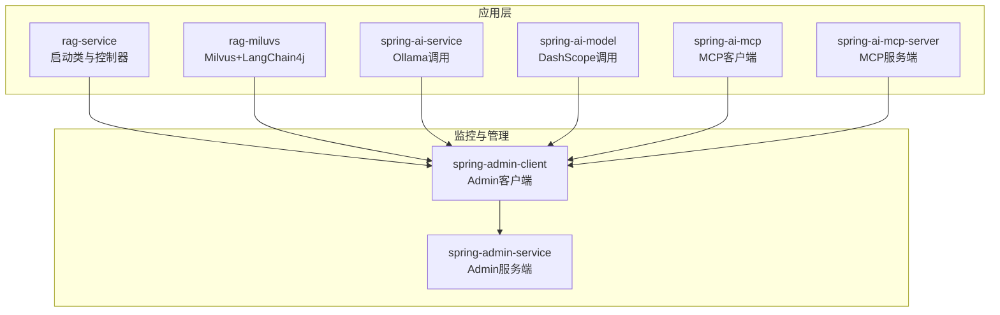
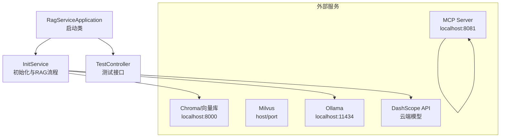
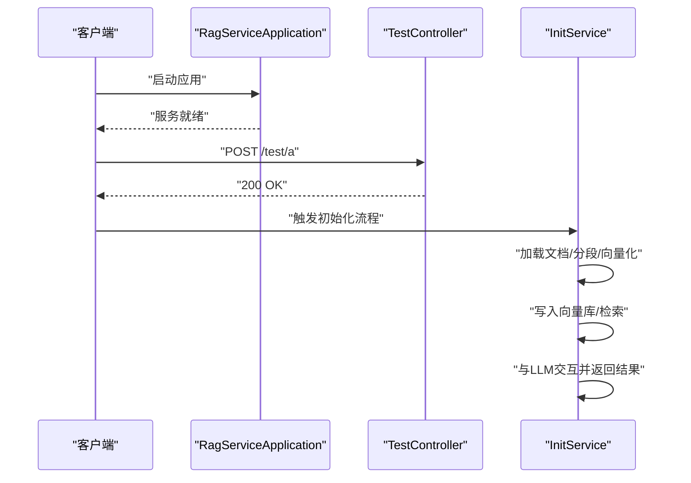
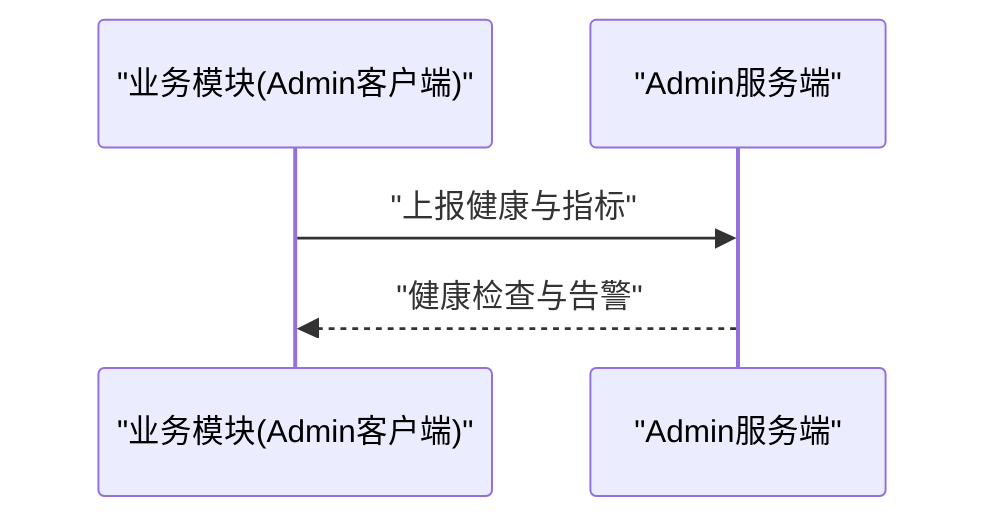
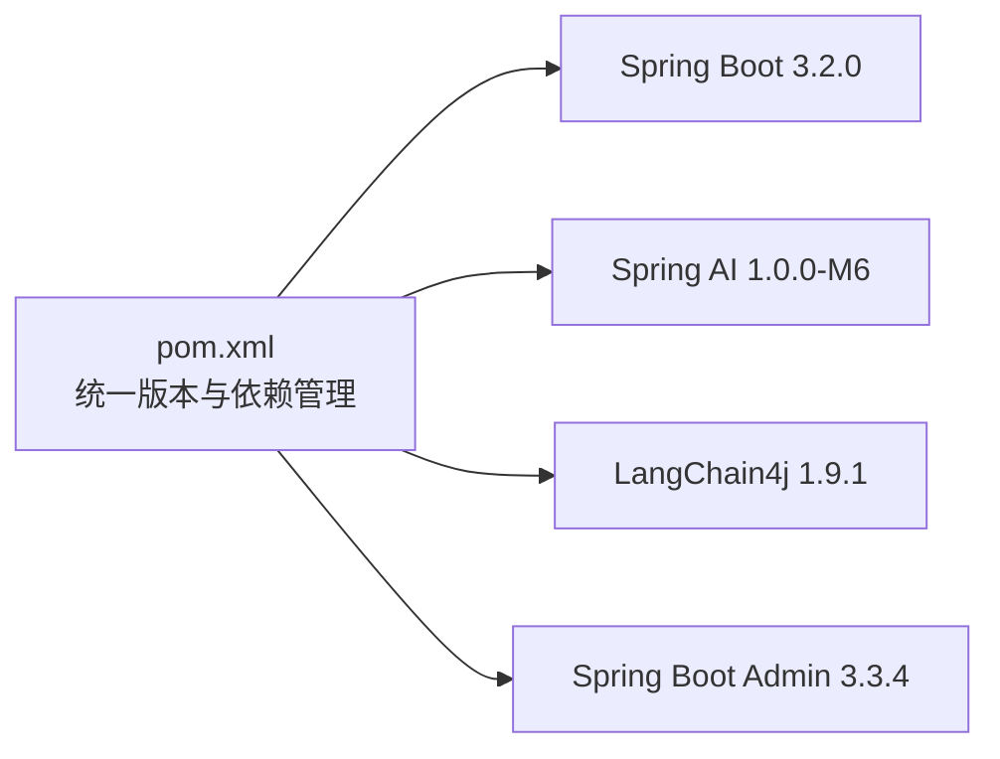

# 故障排除

<cite>
**本文引用的文件**
- [pom.xml](file://pom.xml)
- [RagServiceApplication.java](file://rag-service/src/main/java/cn/project/base/ragservice/RagServiceApplication.java)
- [application.yml（rag-service）](file://rag-service/src/main/resources/application.yml)
- [InitService.java](file://rag-service/src/main/java/cn/project/base/ragservice/service/InitService.java)
- [TestController.java](file://rag-service/src/main/java/cn/project/base/ragservice/controller/TestController.java)
- [SpringAdminServiceApplication.java](file://spring-admin-service/src/main/java/cn/project/base/springadminservice/SpringAdminServiceApplication.java)
- [application.yml（spring-admin-service）](file://spring-admin-service/src/main/resources/application.yml)
- [SpringAdminClientApplication.java](file://spring-admin-client/src/main/java/cn/project/base/springadminclient/SpringAdminClientApplication.java)
- [application.yml（spring-admin-client）](file://spring-admin-client/src/main/resources/application.yml)
- [RagMiluvsApplication.java](file://rag-miluvs/src/main/java/cn/project/base/ragmiluvs/RagMiluvsApplication.java)
- [application.yml（rag-miluvs）](file://rag-miluvs/src/main/resources/application.yml)
- [SpringAiServiceApplication.java](file://spring-ai-service/src/main/java/cn/project/base/springaiservice/SpringAiServiceApplication.java)
- [application.yml（spring-ai-service）](file://spring-ai-service/src/main/resources/application.yml)
- [SpringAiModelApplication.java](file://spring-ai-model/src/main/java/cn/project/base/springaimodel/SpringAiModelApplication.java)
- [application.yml（spring-ai-model）](file://spring-ai-model/src/main/resources/application.yml)
- [SpringAiMcpApplication.java](file://spring-ai-mcp/src/main/java/cn/project/base/springaimcp/SpringAiMcpApplication.java)
- [application.yml（spring-ai-mcp）](file://spring-ai-mcp/src/main/resources/application.yml)
- [OpenMeteoService.java](file://spring-ai-mcp-server/src/main/java/cn/project/base/springaimcpserver/OpenMeteoService.java)
- [application.yml（spring-ai-mcp-server）](file://spring-ai-mcp-server/src/main/resources/application.yml)
</cite>

## 目录
1. [简介](#简介)
2. [项目结构](#项目结构)
3. [核心组件](#核心组件)
4. [架构总览](#架构总览)
5. [详细组件分析](#详细组件分析)
6. [依赖分析](#依赖分析)
7. [性能考虑](#性能考虑)
8. [故障排除指南](#故障排除指南)
9. [结论](#结论)
10. [附录](#附录)

## 简介
本指南面向RAG服务项目的运维与开发人员，系统化梳理启动失败、连接超时、内存不足、性能问题等常见故障的诊断与处理流程。文档结合实际模块配置与代码入口，提供可操作的排查步骤、日志分析方法、监控与健康检查手段（Spring Boot Admin），以及紧急恢复与回滚策略。

## 项目结构
该项目采用多模块聚合工程，核心模块包括：
- rag-service：应用主模块，包含启动类、测试接口与初始化服务示例
- spring-admin-service：Spring Boot Admin服务端
- spring-admin-client：各业务模块的Admin客户端
- rag-miluvs：集成Milvus向量数据库与LangChain4j DashScope模型
- spring-ai-service：Ollama本地模型调用示例
- spring-ai-model：DashScope模型调用示例
- spring-ai-mcp 与 spring-ai-mcp-server：MCP协议客户端与服务端示例

图表来源
- [RagServiceApplication.java:1-14](file://rag-service/src/main/java/cn/project/base/ragservice/RagServiceApplication.java#L1-L14)
- [SpringAdminServiceApplication.java:1-16](file://spring-admin-service/src/main/java/cn/project/base/springadminservice/SpringAdminServiceApplication.java#L1-L16)
- [SpringAdminClientApplication.java:1-14](file://spring-admin-client/src/main/java/cn/project/base/springadminclient/SpringAdminClientApplication.java#L1-L14)
- [RagMiluvsApplication.java:1-14](file://rag-miluvs/src/main/java/cn/project/base/ragmiluvs/RagMiluvsApplication.java#L1-L14)
- [SpringAiServiceApplication.java](file://spring-ai-service/src/main/java/cn/project/base/springaiservice/SpringAiServiceApplication.java)
- [SpringAiModelApplication.java](file://spring-ai-model/src/main/java/cn/project/base/springaimodel/SpringAiModelApplication.java)
- [SpringAiMcpApplication.java](file://spring-ai-mcp/src/main/java/cn/project/base/springaimcp/SpringAiMcpApplication.java)
- [OpenMeteoService.java](file://spring-ai-mcp-server/src/main/java/cn/project/base/springaimcpserver/OpenMeteoService.java)

章节来源
- [pom.xml:11-22](file://pom.xml#L11-L22)

## 核心组件
- 应用启动类与入口
  - rag-service：应用主入口，负责启动Spring Boot应用上下文
  - spring-admin-service：启用Admin服务端，提供Web界面
  - spring-admin-client：注册到Admin服务端，暴露Actuator端点
  - 其他模块：按需启动，分别承载RAG、向量检索、本地模型、云端模型与MCP协议能力

- 关键配置要点
  - 日志：通过application.yml指定Logback配置与日志级别
  - 端口：各模块独立端口，避免冲突
  - 远程服务地址：如Chroma、Milvus、Ollama、DashScope、MCP服务器等均在各自模块的配置文件中声明

章节来源
- [RagServiceApplication.java:1-14](file://rag-service/src/main/java/cn/project/base/ragservice/RagServiceApplication.java#L1-L14)
- [application.yml（rag-service）:1-9](file://rag-service/src/main/resources/application.yml#L1-L9)
- [application.yml（spring-admin-service）:1-6](file://spring-admin-service/src/main/resources/application.yml#L1-L6)
- [application.yml（spring-admin-client）:1-36](file://spring-admin-client/src/main/resources/application.yml#L1-L36)
- [application.yml（rag-miluvs）:1-24](file://rag-miluvs/src/main/resources/application.yml#L1-L24)
- [application.yml（spring-ai-service）:1-13](file://spring-ai-service/src/main/resources/application.yml#L1-L13)
- [application.yml（spring-ai-model）:1-10](file://spring-ai-model/src/main/resources/application.yml#L1-L10)
- [application.yml（spring-ai-mcp）:1-35](file://spring-ai-mcp/src/main/resources/application.yml#L1-L35)
- [application.yml（spring-ai-mcp-server）:1-13](file://spring-ai-mcp-server/src/main/resources/application.yml#L1-L13)

## 架构总览
下图展示各模块间的关系与典型调用路径，便于定位问题来源。

图表来源
- [RagServiceApplication.java:1-14](file://rag-service/src/main/java/cn/project/base/ragservice/RagServiceApplication.java#L1-L14)
- [TestController.java:1-17](file://rag-service/src/main/java/cn/project/base/ragservice/controller/TestController.java#L1-L17)
- [InitService.java:38-109](file://rag-service/src/main/java/cn/project/base/ragservice/service/InitService.java#L38-L109)
- [application.yml（rag-miluvs）:7-23](file://rag-miluvs/src/main/resources/application.yml#L7-L23)
- [application.yml（spring-ai-service）:4-8](file://spring-ai-service/src/main/resources/application.yml#L4-L8)
- [application.yml（spring-ai-model）:4-9](file://spring-ai-model/src/main/resources/application.yml#L4-L9)
- [application.yml（spring-ai-mcp）:19-21](file://spring-ai-mcp/src/main/resources/application.yml#L19-L21)

## 详细组件分析

### rag-service 模块
- 启动类与控制器
  - 启动类负责应用上下文初始化
  - 测试控制器提供基础接口用于连通性验证
- 初始化服务（InitService）
  - 负责文档加载、分段、向量化、写入向量库、检索与与LLM交互的完整链路
  - 使用本地Ollama与Chroma作为默认依赖

图表来源
- [RagServiceApplication.java:1-14](file://rag-service/src/main/java/cn/project/base/ragservice/RagServiceApplication.java#L1-L14)
- [TestController.java:12-15](file://rag-service/src/main/java/cn/project/base/ragservice/controller/TestController.java#L12-L15)
- [InitService.java:38-109](file://rag-service/src/main/java/cn/project/base/ragservice/service/InitService.java#L38-L109)

章节来源
- [RagServiceApplication.java:1-14](file://rag-service/src/main/java/cn/project/base/ragservice/RagServiceApplication.java#L1-L14)
- [TestController.java:1-17](file://rag-service/src/main/java/cn/project/base/ragservice/controller/TestController.java#L1-L17)
- [InitService.java:1-153](file://rag-service/src/main/java/cn/project/base/ragservice/service/InitService.java#L1-L153)

### spring-admin-service 与 spring-admin-client
- Admin服务端启用Web界面，展示各客户端的健康状态与指标
- Admin客户端注册到Admin服务端，暴露Actuator端点供监控

图表来源
- [SpringAdminServiceApplication.java:7-13](file://spring-admin-service/src/main/java/cn/project/base/springadminservice/SpringAdminServiceApplication.java#L7-L13)
- [SpringAdminClientApplication.java:6-11](file://spring-admin-client/src/main/java/cn/project/base/springadminclient/SpringAdminClientApplication.java#L6-L11)
- [application.yml（spring-admin-client）:5-17](file://spring-admin-client/src/main/resources/application.yml#L5-L17)

章节来源
- [application.yml（spring-admin-service）:1-6](file://spring-admin-service/src/main/resources/application.yml#L1-L6)
- [application.yml（spring-admin-client）:1-36](file://spring-admin-client/src/main/resources/application.yml#L1-L36)

### rag-miluvs 模块
- 集成LangChain4j与DashScope模型，配置向量库连接参数
- 提供独立端口，便于隔离与调试

章节来源
- [RagMiluvsApplication.java:1-14](file://rag-miluvs/src/main/java/cn/project/base/ragmiluvs/RagMiluvsApplication.java#L1-L14)
- [application.yml（rag-miluvs）:1-24](file://rag-miluvs/src/main/resources/application.yml#L1-L24)

### spring-ai-service 与 spring-ai-model
- spring-ai-service：配置Ollama本地模型地址与模型名
- spring-ai-model：配置DashScope API Key与模型选项

章节来源
- [application.yml（spring-ai-service）:1-13](file://spring-ai-service/src/main/resources/application.yml#L1-L13)
- [application.yml（spring-ai-model）:1-10](file://spring-ai-model/src/main/resources/application.yml#L1-L10)

### spring-ai-mcp 与 spring-ai-mcp-server
- spring-ai-mcp：配置MCP客户端，包含请求超时、连接类型与SSE服务器地址
- spring-ai-mcp-server：配置MCP服务端名称、版本与端口

章节来源
- [application.yml（spring-ai-mcp）:1-35](file://spring-ai-mcp/src/main/resources/application.yml#L1-L35)
- [application.yml（spring-ai-mcp-server）:1-13](file://spring-ai-mcp-server/src/main/resources/application.yml#L1-L13)

## 依赖分析
- 版本与依赖管理
  - 统一管理Spring Boot、Spring AI、LangChain4j、Spring Boot Admin等版本
  - Maven仓库包含阿里云镜像与Spring快照仓库，确保依赖拉取稳定

图表来源
- [pom.xml:24-101](file://pom.xml#L24-L101)

章节来源
- [pom.xml:1-171](file://pom.xml#L1-L171)

## 性能考虑
- 线程与资源
  - 控制并发请求与批处理大小，避免向量库与LLM调用造成瞬时高负载
- 缓存与预热
  - 对常用模型与向量库连接进行预热，减少首次延迟
- 日志级别
  - 生产环境建议降低日志级别，避免I/O成为瓶颈
- 网络与超时
  - 为远程服务设置合理超时与重试策略，避免阻塞线程池

## 故障排除指南

### 一、启动失败
- 常见原因
  - 端口被占用或不一致
  - 依赖服务未启动（如Ollama、Chroma、Milvus、MCP Server）
  - 配置文件错误或缺失
- 排查步骤
  1) 检查各模块端口是否冲突
     - 参考：[application.yml（spring-admin-service）:4-5](file://spring-admin-service/src/main/resources/application.yml#L4-L5)、[application.yml（rag-miluvs）:4-5](file://rag-miluvs/src/main/resources/application.yml#L4-L5)、[application.yml（spring-ai-mcp-server）:1-2](file://spring-ai-mcp-server/src/main/resources/application.yml#L1-L2)
  2) 确认依赖服务可用
     - Ollama：[application.yml（spring-ai-service）:5-6](file://spring-ai-service/src/main/resources/application.yml#L5-L6)、[InitService.java:59-62](file://rag-service/src/main/java/cn/project/base/ragservice/service/InitService.java#L59-L62)
     - Chroma：[InitService.java:65-71](file://rag-service/src/main/java/cn/project/base/ragservice/service/InitService.java#L65-L71)
     - Milvus：[application.yml（rag-miluvs）:7-9](file://rag-miluvs/src/main/resources/application.yml#L7-L9)
     - MCP Server：[application.yml（spring-ai-mcp）:18-21](file://spring-ai-mcp/src/main/resources/application.yml#L18-L21)、[application.yml（spring-ai-mcp-server）:1-13](file://spring-ai-mcp-server/src/main/resources/application.yml#L1-L13)
  3) 校验配置文件语法与字段
     - 特别关注密钥、URL、模型名等关键项
  4) 查看启动日志
     - 使用Logback配置：[application.yml（rag-service）:4-5](file://rag-service/src/main/resources/application.yml#L4-L5)

章节来源
- [application.yml（spring-admin-service）:4-5](file://spring-admin-service/src/main/resources/application.yml#L4-L5)
- [application.yml（rag-miluvs）:4-5](file://rag-miluvs/src/main/resources/application.yml#L4-L5)
- [application.yml（spring-ai-mcp-server）:1-2](file://spring-ai-mcp-server/src/main/resources/application.yml#L1-L2)
- [application.yml（spring-ai-service）:5-6](file://spring-ai-service/src/main/resources/application.yml#L5-L6)
- [InitService.java:59-71](file://rag-service/src/main/java/cn/project/base/ragservice/service/InitService.java#L59-L71)
- [application.yml（rag-service）:4-5](file://rag-service/src/main/resources/application.yml#L4-L5)

### 二、连接超时
- 现象
  - 访问外部服务（Ollama、Chroma、DashScope、Milvus、MCP）出现超时
- 排查步骤
  1) 检查网络连通性与防火墙
  2) 校验服务地址与端口
     - Ollama：[application.yml（spring-ai-service）:5-6](file://spring-ai-service/src/main/resources/application.yml#L5-L6)、[InitService.java:59-62](file://rag-service/src/main/java/cn/project/base/ragservice/service/InitService.java#L59-L62)
     - Chroma：[InitService.java:65-71](file://rag-service/src/main/java/cn/project/base/ragservice/service/InitService.java#L65-L71)
     - Milvus：[application.yml（rag-miluvs）:7-9](file://rag-miluvs/src/main/resources/application.yml#L7-L9)
     - DashScope：[application.yml（spring-ai-model）:4-6](file://spring-ai-model/src/main/resources/application.yml#L4-L6)
     - MCP：[application.yml（spring-ai-mcp）:18-21](file://spring-ai-mcp/src/main/resources/application.yml#L18-L21)
  3) 设置合理的超时与重试策略
  4) 使用curl或浏览器访问服务端点验证可达性

章节来源
- [application.yml（spring-ai-service）:5-6](file://spring-ai-service/src/main/resources/application.yml#L5-L6)
- [InitService.java:59-71](file://rag-service/src/main/java/cn/project/base/ragservice/service/InitService.java#L59-L71)
- [application.yml（rag-miluvs）:7-9](file://rag-miluvs/src/main/resources/application.yml#L7-L9)
- [application.yml（spring-ai-model）:4-6](file://spring-ai-model/src/main/resources/application.yml#L4-L6)
- [application.yml（spring-ai-mcp）:18-21](file://spring-ai-mcp/src/main/resources/application.yml#L18-L21)

### 三、内存不足
- 现象
  - 应用频繁GC、OOM或响应缓慢
- 处理建议
  1) 调整JVM堆大小与GC参数
  2) 减少批量向量化与检索规模
  3) 优化分段策略，降低单次处理的数据量
  4) 使用流式或分页方式处理大结果集
  5) 开启监控与内存快照，定位泄漏点

### 四、性能问题
- 现象
  - 响应时间长、吞吐量低
- 排查步骤
  1) 分析慢查询与慢日志（向量库与LLM）
  2) 评估模型推理耗时，必要时切换更小模型或启用缓存
  3) 优化网络路径与DNS解析
  4) 使用压测工具模拟峰值流量，定位瓶颈

### 五、网络连接问题
- 现象
  - 无法访问外部服务或跨模块通信失败
- 排查步骤
  1) 使用ping/trace路由追踪
  2) 检查代理与安全组规则
  3) 校验服务间域名解析与hosts映射
  4) 在客户端侧增加连接池与健康探测

### 六、数据库/向量库连接问题
- 现象
  - 写入失败、检索无结果或超时
- 排查步骤
  1) 校验Chroma/Milvus地址与端口
     - Chroma：[InitService.java:65-71](file://rag-service/src/main/java/cn/project/base/ragservice/service/InitService.java#L65-L71)
     - Milvus：[application.yml（rag-miluvs）:7-9](file://rag-miluvs/src/main/resources/application.yml#L7-L9)
  2) 确认集合/表存在且权限正确
  3) 查看库服务状态与磁盘空间
  4) 降低批量写入频率与大小

章节来源
- [InitService.java:65-71](file://rag-service/src/main/java/cn/project/base/ragservice/service/InitService.java#L65-L71)
- [application.yml（rag-miluvs）:7-9](file://rag-miluvs/src/main/resources/application.yml#L7-L9)

### 七、AI模型连接问题
- 现象
  - 模型调用失败、鉴权错误或响应异常
- 排查步骤
  1) 校验API Key与模型名
     - DashScope：[application.yml（spring-ai-model）:4-6](file://spring-ai-model/src/main/resources/application.yml#L4-L6)
     - Ollama：[application.yml（spring-ai-service）:5-6](file://spring-ai-service/src/main/resources/application.yml#L5-L6)
  2) 确认模型已下载与运行
  3) 查看模型服务日志与限流状态
  4) 降级到轻量模型或启用本地缓存

章节来源
- [application.yml（spring-ai-model）:4-6](file://spring-ai-model/src/main/resources/application.yml#L4-L6)
- [application.yml（spring-ai-service）:5-6](file://spring-ai-service/src/main/resources/application.yml#L5-L6)

### 八、使用Spring Boot Admin进行健康检查与监控
- 启动顺序
  1) 先启动Admin服务端：[SpringAdminServiceApplication.java:10-12](file://spring-admin-service/src/main/java/cn/project/base/springadminservice/SpringAdminServiceApplication.java#L10-L12)
  2) 再启动Admin客户端模块：[SpringAdminClientApplication.java:9-11](file://spring-admin-client/src/main/java/cn/project/base/springadminclient/SpringAdminClientApplication.java#L9-L11)
- 关键配置
  - 客户端注册地址与端点暴露：[application.yml（spring-admin-client）:5-17](file://spring-admin-client/src/main/resources/application.yml#L5-L17)
  - 服务端端口：[application.yml（spring-admin-service）:4-5](file://spring-admin-service/src/main/resources/application.yml#L4-L5)
- 健康检查
  - 访问Admin Web界面，查看各模块健康状态、指标与日志

章节来源
- [SpringAdminServiceApplication.java:10-12](file://spring-admin-service/src/main/java/cn/project/base/springadminservice/SpringAdminServiceApplication.java#L10-L12)
- [SpringAdminClientApplication.java:9-11](file://spring-admin-client/src/main/java/cn/project/base/springadminclient/SpringAdminClientApplication.java#L9-L11)
- [application.yml（spring-admin-client）:5-17](file://spring-admin-client/src/main/resources/application.yml#L5-L17)
- [application.yml（spring-admin-service）:4-5](file://spring-admin-service/src/main/resources/application.yml#L4-L5)

### 九、日志分析与问题定位
- 日志配置
  - Logback配置文件路径：[application.yml（rag-service）:4-5](file://rag-service/src/main/resources/application.yml#L4-L5)
  - 日志级别示例：[application.yml（rag-service）:6-7](file://rag-service/src/main/resources/application.yml#L6-L7)
- 分析方法
  1) 关注启动阶段的连接与依赖初始化日志
  2) 定位异常栈与错误码，结合对应配置文件核对参数
  3) 使用Admin界面查看实时健康与指标

章节来源
- [application.yml（rag-service）:4-7](file://rag-service/src/main/resources/application.yml#L4-L7)

### 十、紧急恢复与回滚策略
- 快速回退
  - 切换到上一个稳定版本的Docker镜像或部署包
- 降级方案
  - 临时关闭高耗能功能（如向量化与模型推理）
  - 使用本地轻量模型或禁用流式输出
- 清理与修复
  - 清理向量库中的异常数据
  - 重启依赖服务（Ollama、Chroma、Milvus、MCP Server）
- 监控与告警
  - 在Admin中开启关键指标告警，缩短MTTR

## 结论
通过系统化的启动检查、连接验证、日志分析与监控手段，可快速定位并解决RAG服务中的常见问题。建议在生产环境中严格控制日志级别、设置合理的超时与重试策略，并利用Spring Boot Admin实现持续可观测性。

## 附录

### A. 常用命令与工具
- curl验证外部服务可达性
- jstack/jmap分析JVM状态
- Admin Web界面查看健康与指标

### B. 关键配置清单
- 端口与服务地址：[application.yml（spring-admin-service）:4-5](file://spring-admin-service/src/main/resources/application.yml#L4-L5)、[application.yml（rag-miluvs）:4-5](file://rag-miluvs/src/main/resources/application.yml#L4-L5)、[application.yml（spring-ai-mcp-server）:1-2](file://spring-ai-mcp-server/src/main/resources/application.yml#L1-L2)
- 模型与API Key：[application.yml（spring-ai-model）:4-6](file://spring-ai-model/src/main/resources/application.yml#L4-L6)、[application.yml（spring-ai-service）:4-6](file://spring-ai-service/src/main/resources/application.yml#L4-L6)
- Admin客户端配置：[application.yml（spring-admin-client）:5-17](file://spring-admin-client/src/main/resources/application.yml#L5-L17)