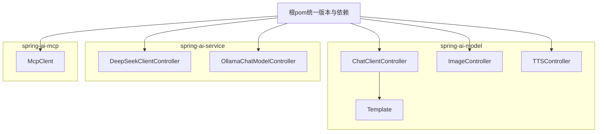
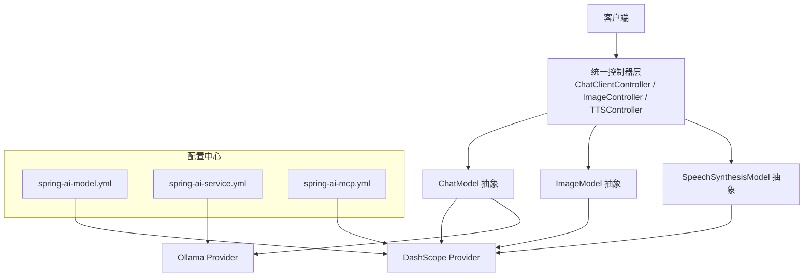
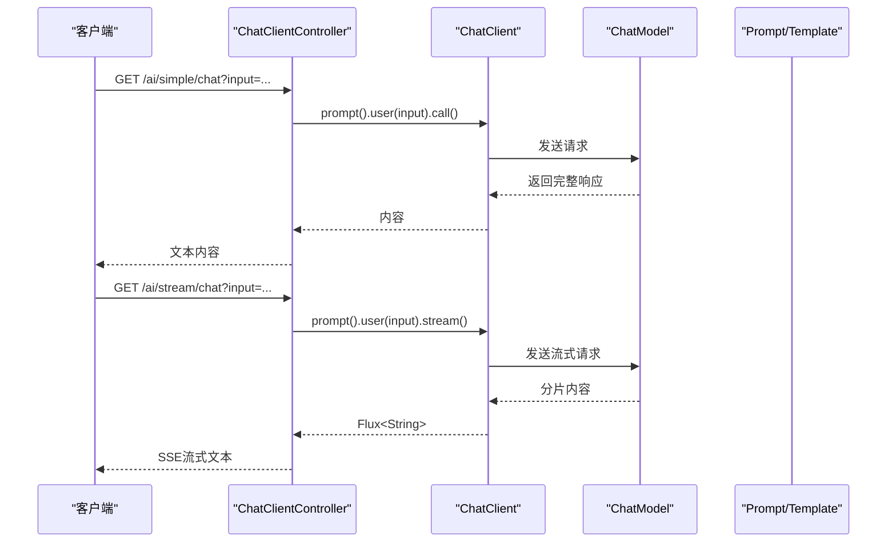
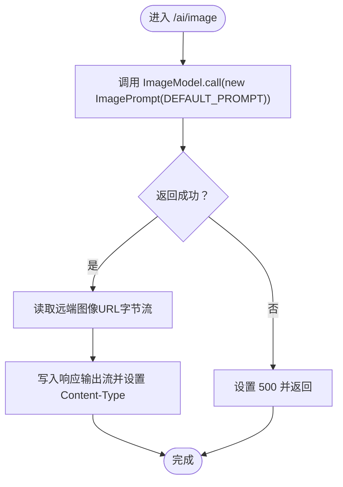
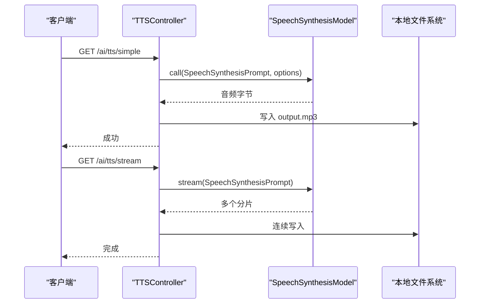
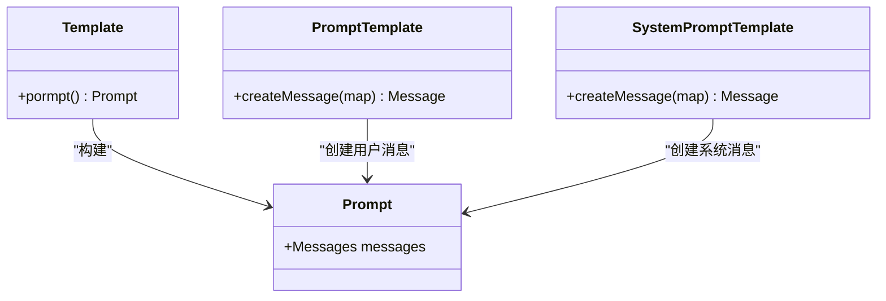
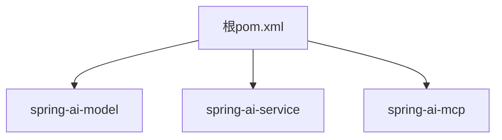

# AI模型集成模块

<cite>
**本文引用的文件**
- [ChatClientController.java](file://spring-ai-model/src/main/java/cn/project/base/springaimodel/controller/ChatClientController.java)
- [ImageController.java](file://spring-ai-model/src/main/java/cn/project/base/springaimodel/controller/ImageController.java)
- [TTSController.java](file://spring-ai-model/src/main/java/cn/project/base/springaimodel/controller/TTSController.java)
- [Template.java](file://spring-ai-model/src/main/java/cn/project/base/springaimodel/domain/Template.java)
- [application.yml（spring-ai-model）](file://spring-ai-model/src/main/resources/application.yml)
- [application.yml（spring-ai-service）](file://spring-ai-service/src/main/resources/application.yml)
- [DeepSeekClientController.java](file://spring-ai-service/src/main/java/cn/project/base/springaiservice/controller/DeepSeekClientController.java)
- [OllamaChatModelController.java](file://spring-ai-service/src/main/java/cn/project/base/springaiservice/controller/OllamaChatModelController.java)
- [McpClent.java](file://spring-ai-mcp/src/main/java/cn/project/base/springaimcp/controller/McpClent.java)
- [application.yml（spring-ai-mcp）](file://spring-ai-mcp/src/main/resources/application.yml)
- [pom.xml](file://pom.xml)
</cite>

## 目录
1. [简介](#简介)
2. [项目结构](#项目结构)
3. [核心组件](#核心组件)
4. [架构总览](#架构总览)
5. [详细组件分析](#详细组件分析)
6. [依赖分析](#依赖分析)
7. [性能考虑](#性能考虑)
8. [故障排除指南](#故障排除指南)
9. [结论](#结论)
10. [附录](#附录)

## 简介
本文件面向“AI模型集成模块”，系统性阐述基于Spring AI生态的多模型支持架构与统一接口设计，重点覆盖以下方面：
- ChatClientController的统一接口与请求路由机制
- 图像生成与文本转语音功能的实现细节
- Template类在提示模板设计中的作用
- 多模型配置示例与使用指南
- 流式响应与异步调用的实现方式
- 性能优化建议与故障排除指导

该模块采用分层设计：控制器层暴露REST接口，领域层提供提示模板，配置层集中管理模型参数与提供商密钥，服务层通过ChatModel/ImageModel/SpeechSynthesisModel等抽象适配不同后端（DashScope、Ollama等）。

## 项目结构
本仓库为多模块Maven聚合工程，AI相关模块集中在spring-ai-model、spring-ai-service、spring-ai-mcp等子模块中。核心模块与职责概览：
- spring-ai-model：统一的AI能力入口，提供聊天、图像生成、TTS等控制器与提示模板
- spring-ai-service：面向具体模型（如Ollama/DashScope）的服务封装与演示
- spring-ai-mcp：MCP客户端示例配置与日志级别设置
- 根pom：统一版本管理与依赖声明

图表来源
- [ChatClientController.java:1-142](file://spring-ai-model/src/main/java/cn/project/base/springaimodel/controller/ChatClientController.java#L1-L142)
- [ImageController.java:1-61](file://spring-ai-model/src/main/java/cn/project/base/springaimodel/controller/ImageController.java#L1-L61)
- [TTSController.java:1-115](file://spring-ai-model/src/main/java/cn/project/base/springaimodel/controller/TTSController.java#L1-L115)
- [Template.java:1-23](file://spring-ai-model/src/main/java/cn/project/base/springaimodel/domain/Template.java#L1-L23)
- [DeepSeekClientController.java:1-60](file://spring-ai-service/src/main/java/cn/project/base/springaiservice/controller/DeepSeekClientController.java#L1-L60)
- [OllamaChatModelController.java:1-24](file://spring-ai-service/src/main/java/cn/project/base/springaiservice/controller/OllamaChatModelController.java#L1-L24)
- [McpClent.java:1-16](file://spring-ai-mcp/src/main/java/cn/project/base/springaimcp/controller/McpClent.java#L1-L16)
- [pom.xml:1-171](file://pom.xml#L1-L171)

章节来源
- [pom.xml:1-171](file://pom.xml#L1-L171)

## 核心组件
- ChatClientController：统一的聊天入口，支持同步与流式响应；内置提示模板调用与内存对话缓存示例
- ImageController：文生图能力封装，直接返回图像字节流
- TTSController：文本转语音能力封装，支持同步与流式写入本地音频文件
- Template：提示模板工厂，封装用户消息与系统消息的构建流程
- 配置文件：分别在各模块的application.yml中声明模型提供商密钥、基础地址与默认模型

章节来源
- [ChatClientController.java:1-142](file://spring-ai-model/src/main/java/cn/project/base/springaimodel/controller/ChatClientController.java#L1-L142)
- [ImageController.java:1-61](file://spring-ai-model/src/main/java/cn/project/base/springaimodel/controller/ImageController.java#L1-L61)
- [TTSController.java:1-115](file://spring-ai-model/src/main/java/cn/project/base/springaimodel/controller/TTSController.java#L1-L115)
- [Template.java:1-23](file://spring-ai-model/src/main/java/cn/project/base/springaimodel/domain/Template.java#L1-L23)
- [application.yml（spring-ai-model）:1-10](file://spring-ai-model/src/main/resources/application.yml#L1-L10)
- [application.yml（spring-ai-service）:1-13](file://spring-ai-service/src/main/resources/application.yml#L1-L13)
- [application.yml（spring-ai-mcp）:1-35](file://spring-ai-mcp/src/main/resources/application.yml#L1-L35)

## 架构总览
整体架构围绕“统一控制器 + 抽象模型适配 + 配置中心”的思路展开：
- 控制器层：对外提供REST接口，屏蔽底层模型差异
- 模型层：通过ChatModel、ImageModel、SpeechSynthesisModel等抽象对接不同提供商
- 配置层：在application.yml中集中配置API Key、模型名、基础地址等
- 提示模板层：通过Template统一构建Prompt，提升可维护性与复用性

图表来源
- [ChatClientController.java:1-142](file://spring-ai-model/src/main/java/cn/project/base/springaimodel/controller/ChatClientController.java#L1-L142)
- [ImageController.java:1-61](file://spring-ai-model/src/main/java/cn/project/base/springaimodel/controller/ImageController.java#L1-L61)
- [TTSController.java:1-115](file://spring-ai-model/src/main/java/cn/project/base/springaimodel/controller/TTSController.java#L1-L115)
- [application.yml（spring-ai-model）:1-10](file://spring-ai-model/src/main/resources/application.yml#L1-L10)
- [application.yml（spring-ai-service）:1-13](file://spring-ai-service/src/main/resources/application.yml#L1-L13)
- [application.yml（spring-ai-mcp）:1-35](file://spring-ai-mcp/src/main/resources/application.yml#L1-L35)

## 详细组件分析

### ChatClientController 组件分析
- 统一接口设计
  - 同步聊天：通过ChatClient.prompt().user(input).call()获取完整响应
  - 流式聊天：通过stream()返回Flux<String>，逐段推送内容
  - 提示模板调用：通过Template.pormpt()构建Prompt，统一系统与用户消息
  - 对话缓存：基于MessageChatMemoryAdvisor与InMemoryChatMemory实现上下文记忆
- 请求路由机制
  - 路径前缀统一为“/ai”，分别映射到简单聊天、流式聊天、模板聊天、带缓存的聊天等端点
- 错误处理与编码
  - 流式响应需设置字符集；缓存示例通过UUID区分会话并限制检索条数
- 与模型适配
  - 构造ChatClient时注入ChatModel，并设置默认选项（如DashScope的topP）

图表来源
- [ChatClientController.java:55-68](file://spring-ai-model/src/main/java/cn/project/base/springaimodel/controller/ChatClientController.java#L55-L68)
- [Template.java:13-21](file://spring-ai-model/src/main/java/cn/project/base/springaimodel/domain/Template.java#L13-L21)

章节来源
- [ChatClientController.java:1-142](file://spring-ai-model/src/main/java/cn/project/base/springaimodel/controller/ChatClientController.java#L1-L142)
- [Template.java:1-23](file://spring-ai-model/src/main/java/cn/project/base/springaimodel/domain/Template.java#L1-L23)

### ImageController 组件分析
- 功能概述
  - 接收默认提示词，调用ImageModel生成图像
  - 将远端图像URL的内容读取并直接写入HTTP响应输出流
- 输出控制
  - 设置Content-Type为PNG；异常时返回服务器错误状态码
- 适用场景
  - 快速原型、演示与内部工具中直接返回图像字节流

图表来源
- [ImageController.java:43-59](file://spring-ai-model/src/main/java/cn/project/base/springaimodel/controller/ImageController.java#L43-L59)

章节来源
- [ImageController.java:1-61](file://spring-ai-model/src/main/java/cn/project/base/springaimodel/controller/ImageController.java#L1-L61)

### TTSController 组件分析
- 功能概述
  - 同步TTS：将语音字节写入本地MP3文件
  - 流式TTS：订阅流式响应，边接收边写入本地文件
- 参数配置
  - 通过DashScopeSpeechSynthesisOptions设置语速、音调、音量等
- 生命周期管理
  - 应用启动时创建输出目录；销毁时清理临时目录
- 异常处理
  - 文件IO与线程等待异常均向上抛出或转换为运行时异常

图表来源
- [TTSController.java:43-97](file://spring-ai-model/src/main/java/cn/project/base/springaimodel/controller/TTSController.java#L43-L97)

章节来源
- [TTSController.java:1-115](file://spring-ai-model/src/main/java/cn/project/base/springaimodel/controller/TTSController.java#L1-L115)

### Template 类与提示模板设计
- 设计目的
  - 将用户消息与系统消息封装为Prompt，便于复用与演进
- 关键点
  - 使用PromptTemplate与SystemPromptTemplate分别构建用户与系统消息
  - 将变量注入到模板中，形成可参数化的提示词
- 与控制器协作
  - ChatClientController通过Template.pormpt()统一构建对话上下文

图表来源
- [Template.java:12-22](file://spring-ai-model/src/main/java/cn/project/base/springaimodel/domain/Template.java#L12-L22)

章节来源
- [Template.java:1-23](file://spring-ai-model/src/main/java/cn/project/base/springaimodel/domain/Template.java#L1-L23)

### 多模型支持与配置示例
- DashScope（阿里）配置
  - 在spring-ai-model的application.yml中设置API Key与默认模型名
  - ChatClientController通过DashScopeChatOptions设置topP等参数
- Ollama配置
  - 在spring-ai-service的application.yml中设置base-url与模型名
  - DeepSeekClientController与OllamaChatModelController演示ChatClient与ChatModel两种调用路径
- MCP客户端配置
  - spring-ai-mcp的application.yml启用MCP客户端、设置连接与超时参数，并开启DEBUG日志

章节来源
- [application.yml（spring-ai-model）:1-10](file://spring-ai-model/src/main/resources/application.yml#L1-L10)
- [application.yml（spring-ai-service）:1-13](file://spring-ai-service/src/main/resources/application.yml#L1-L13)
- [application.yml（spring-ai-mcp）:1-35](file://spring-ai-mcp/src/main/resources/application.yml#L1-L35)
- [DeepSeekClientController.java:1-60](file://spring-ai-service/src/main/java/cn/project/base/springaiservice/controller/DeepSeekClientController.java#L1-L60)
- [OllamaChatModelController.java:1-24](file://spring-ai-service/src/main/java/cn/project/base/springaiservice/controller/OllamaChatModelController.java#L1-L24)
- [McpClent.java:1-16](file://spring-ai-mcp/src/main/java/cn/project/base/springaimcp/controller/McpClent.java#L1-L16)

## 依赖分析
- 版本与依赖管理
  - 根pom统一管理Spring Boot、Spring AI、Spring AI Alibaba、LangChain4j等版本
  - 通过dependencyManagement集中声明starter依赖，避免版本冲突
- 模块间耦合
  - spring-ai-model对Spring AI抽象（ChatClient、ChatModel、ImageModel、SpeechSynthesisModel）进行封装
  - spring-ai-service通过ChatClient与ChatModel直接演示不同提供商的使用方式
  - spring-ai-mcp提供MCP客户端示例，便于扩展外部工具协议

图表来源
- [pom.xml:36-101](file://pom.xml#L36-L101)

章节来源
- [pom.xml:1-171](file://pom.xml#L1-L171)

## 性能考虑
- 流式传输
  - ChatClientController与TTSController均采用流式响应，降低首字延迟与内存占用
- 缓存与上下文
  - 使用MessageChatMemoryAdvisor与InMemoryChatMemory实现对话上下文复用，减少重复上下文开销
- I/O优化
  - ImageController直接从远端URL读取并写入响应流，避免中间存储
- 资源管理
  - TTSController在应用启动时创建输出目录，在销毁时清理，避免磁盘碎片与权限问题

## 故障排除指南
- 常见问题定位
  - API Key与模型配置：检查对应模块的application.yml是否正确配置
  - 网络与代理：确认Ollama或DashScope可达，必要时配置代理
  - 字符集与编码：流式响应需设置字符集，避免中文乱码
- 日志级别
  - spring-ai-service与spring-ai-mcp示例中已开启DEBUG日志，便于排查模型调用链路
- 异常处理
  - ImageController在读取远端图像失败时返回500
  - TTSController在文件IO与线程等待中捕获异常并抛出运行时异常

章节来源
- [application.yml（spring-ai-service）:9-13](file://spring-ai-service/src/main/resources/application.yml#L9-L13)
- [application.yml（spring-ai-mcp）:29-35](file://spring-ai-mcp/src/main/resources/application.yml#L29-L35)
- [ImageController.java:56-58](file://spring-ai-model/src/main/java/cn/project/base/springaimodel/controller/ImageController.java#L56-L58)
- [TTSController.java:94-96](file://spring-ai-model/src/main/java/cn/project/base/springaimodel/controller/TTSController.java#L94-L96)

## 结论
本模块通过统一的控制器与抽象模型适配，实现了对多种AI能力（聊天、图像生成、语音合成）的一致接入。借助Template提示模板与流式响应机制，既保证了开发效率，也兼顾了性能与可维护性。结合多模块配置与日志策略，可快速扩展至更多模型提供商与业务场景。

## 附录
- 快速开始
  - 启动spring-ai-model与spring-ai-service，访问对应控制器端点
  - 修改application.yml中的API Key与模型名以适配目标提供商
- 扩展建议
  - 自定义ChatMemory实现（如Redis）以支持分布式会话
  - 引入鉴权与限流中间件保护后端模型
  - 将提示模板迁移至外部资源文件，支持热更新