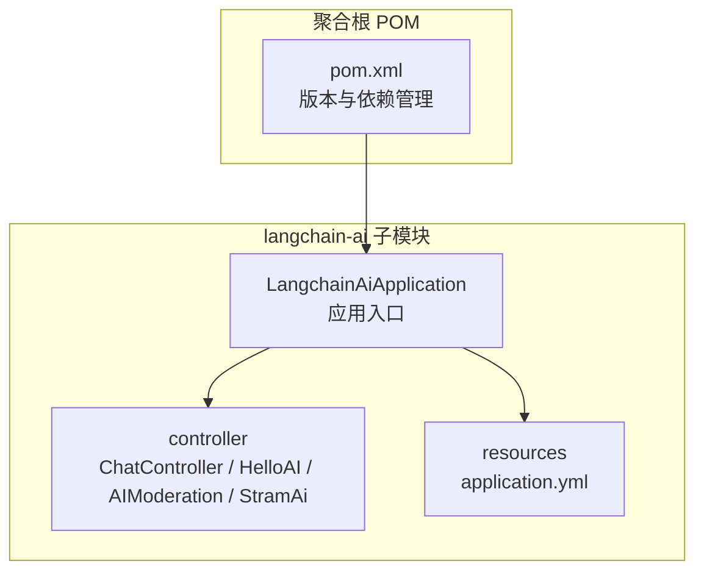
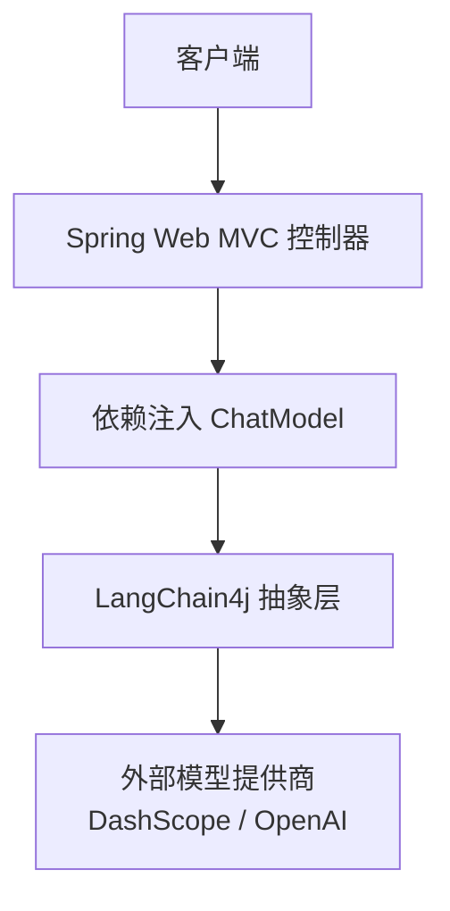
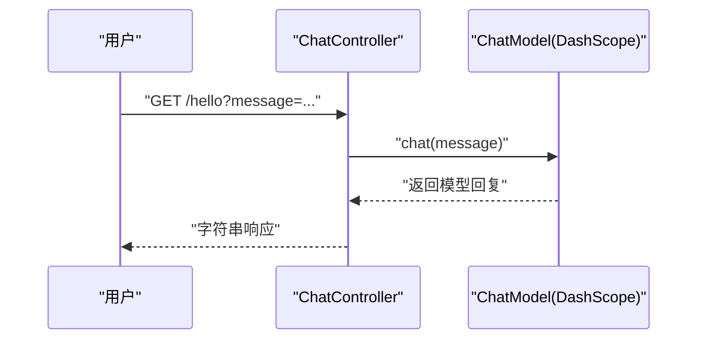
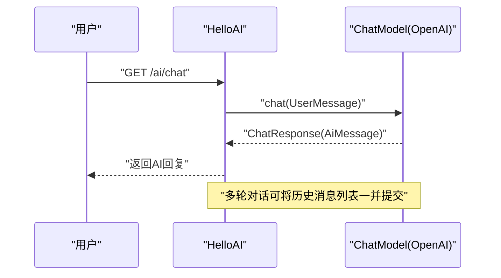
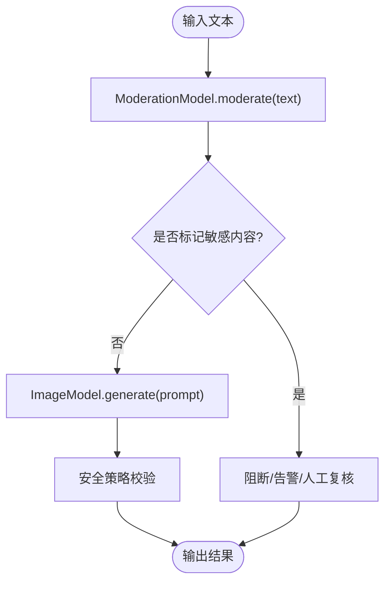
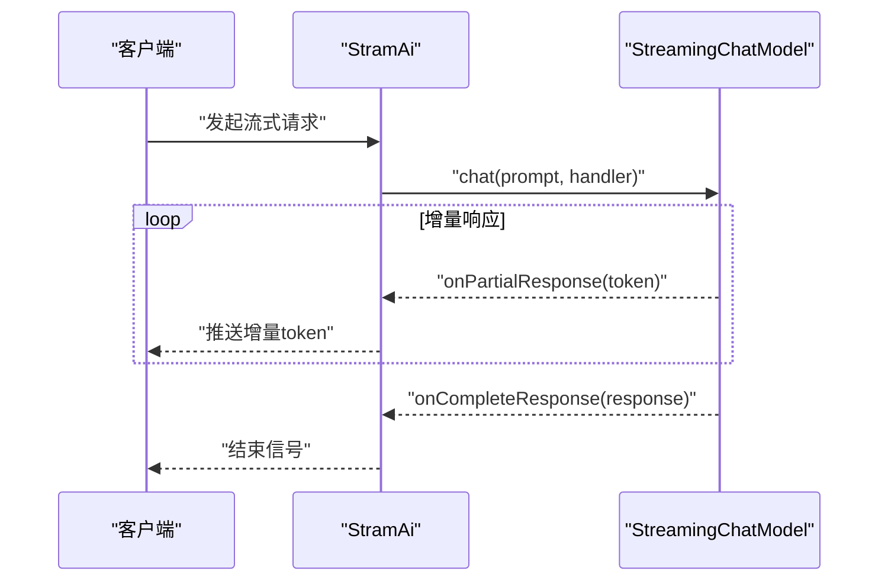
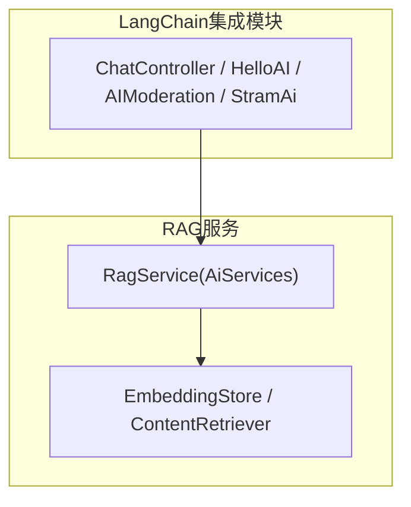
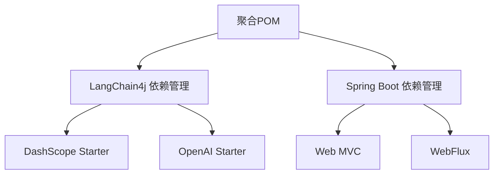

# LangChain集成模块

<cite>
**本文引用的文件**
- [LangchainAiApplication.java](file://langchain-ai/src/main/java/cn/project/base/langchainai/LangchainAiApplication.java)
- [application.yml](file://langchain-ai/src/main/resources/application.yml)
- [pom.xml](file://langchain-ai/pom.xml)
- [ChatController.java](file://langchain-ai/src/main/java/cn/project/base/langchainai/controller/ChatController.java)
- [AIModeration.java](file://langchain-ai/src/main/java/cn/project/base/langchainai/controller/AIModeration.java)
- [HelloAI.java](file://langchain-ai/src/main/java/cn/project/base/langchainai/controller/HelloAI.java)
- [StramAi.java](file://langchain-ai/src/main/java/cn/project/base/langchainai/controller/StramAi.java)
- [RagService.java](file://rag-miluvs/src/main/java/cn/project/base/ragmiluvs/service/RagService.java)
- [RagController.java](file://rag-miluvs/src/main/java/cn/project/base/ragmiluvs/controller/RagController.java)
- [pom.xml](file://pom.xml)
</cite>

## 目录
1. [简介](#简介)
2. [项目结构](#项目结构)
3. [核心组件](#核心组件)
4. [架构总览](#架构总览)
5. [详细组件分析](#详细组件分析)
6. [依赖分析](#依赖分析)
7. [性能考虑](#性能考虑)
8. [故障排查指南](#故障排查指南)
9. [结论](#结论)
10. [附录](#附录)

## 简介
本文件为LangChain集成模块的技术文档，聚焦LangChain4j在项目中的应用与集成方式，系统性阐述ChatController的链式调用设计与对话管理机制；文档化AIModeration的人工智能内容审核与安全策略；说明HelloAI与StramAi的演示功能与使用场景；提供LangChain链式调用的实际开发示例与模板；解释提示工程的最佳实践与模板设计原则；并给出流式AI交互的实现细节与性能优化建议。

## 项目结构
LangChain集成模块位于langchain-ai子工程，采用Spring Boot标准目录组织，包含应用入口、控制器与配置资源。同时，项目根级聚合POM统一管理各子模块的依赖版本，确保LangChain4j生态组件的一致性与可维护性。

图表来源
- [LangchainAiApplication.java:1-31](file://langchain-ai/src/main/java/cn/project/base/langchainai/LangchainAiApplication.java#L1-L31)
- [application.yml:1-15](file://langchain-ai/src/main/resources/application.yml#L1-L15)
- [pom.xml:1-99](file://langchain-ai/pom.xml#L1-L99)
- [pom.xml:1-171](file://pom.xml#L1-L171)

章节来源
- [LangchainAiApplication.java:1-31](file://langchain-ai/src/main/java/cn/project/base/langchainai/LangchainAiApplication.java#L1-L31)
- [application.yml:1-15](file://langchain-ai/src/main/resources/application.yml#L1-L15)
- [pom.xml:1-99](file://langchain-ai/pom.xml#L1-L99)
- [pom.xml:1-171](file://pom.xml#L1-L171)

## 核心组件
- 应用入口与启动日志：LangchainAiApplication负责启动Spring Boot应用并在控制台输出访问地址，便于快速验证服务可用性。
- 控制器层：
  - ChatController：基于DashScope Qwen模型的REST接口，提供GET /hello端点，接收message参数并返回模型回复。
  - HelloAI：基于OpenAI ChatModel的演示控制器，展示单轮与多轮对话消息类型与上下文传递。
  - AIModeration：演示文本审核与图像生成能力，展示ModerationModel与ImageModel的使用。
  - StramAi：演示OpenAI Streaming Chat Model的流式响应处理。
- 配置层：application.yml集中配置服务端口、LangChain4j DashScope模型参数与日志级别。

章节来源
- [LangchainAiApplication.java:1-31](file://langchain-ai/src/main/java/cn/project/base/langchainai/LangchainAiApplication.java#L1-L31)
- [ChatController.java:1-36](file://langchain-ai/src/main/java/cn/project/base/langchainai/controller/ChatController.java#L1-L36)
- [HelloAI.java:1-53](file://langchain-ai/src/main/java/cn/project/base/langchainai/controller/HelloAI.java#L1-L53)
- [AIModeration.java:1-29](file://langchain-ai/src/main/java/cn/project/base/langchainai/controller/AIModeration.java#L1-L29)
- [StramAi.java:1-47](file://langchain-ai/src/main/java/cn/project/base/langchainai/controller/StramAi.java#L1-L47)
- [application.yml:1-15](file://langchain-ai/src/main/resources/application.yml#L1-L15)

## 架构总览
LangChain集成模块采用Spring Web MVC与LangChain4j Starter进行解耦，通过依赖注入装配ChatModel实例，控制器仅负责HTTP请求映射与参数解析，核心推理由LangChain4j抽象层完成。配置文件集中管理模型提供商参数，便于切换与扩展。

图表来源
- [ChatController.java:1-36](file://langchain-ai/src/main/java/cn/project/base/langchainai/controller/ChatController.java#L1-L36)
- [HelloAI.java:1-53](file://langchain-ai/src/main/java/cn/project/base/langchainai/controller/HelloAI.java#L1-L53)
- [application.yml:7-12](file://langchain-ai/src/main/resources/application.yml#L7-L12)

## 详细组件分析

### ChatController：链式调用与对话管理
- 设计模式
  - 控制器通过构造函数注入ChatModel，遵循依赖倒置原则，便于替换底层模型实现。
  - GET /hello端点采用参数驱动，简化调用流程，适合快速演示与集成测试。
- 对话管理机制
  - 当前实现为单轮对话，未显式维护会话上下文。
  - 若需多轮对话，可参考HelloAI中使用消息列表的方式，将历史消息与当前问题一并提交至模型。
- 链式调用
  - ChatModel.chat(message)即为一次链式调用的最小单元，返回字符串结果。
  - 可通过构建器模式设置温度、采样参数等，以适配不同业务场景。

图表来源
- [ChatController.java:18-21](file://langchain-ai/src/main/java/cn/project/base/langchainai/controller/ChatController.java#L18-L21)

章节来源
- [ChatController.java:1-36](file://langchain-ai/src/main/java/cn/project/base/langchainai/controller/ChatController.java#L1-L36)

### HelloAI：多轮对话与消息类型
- 功能概述
  - 展示UserMessage、AiMessage等消息类型的使用，以及多轮对话的历史消息拼接。
  - 通过ChatResponse获取AI消息，实现连续问答。
- 模板设计原则
  - 将系统提示与用户输入分离，明确角色边界，提升模型输出一致性。
  - 历史消息列表长度应受控，避免超出上下文窗口或影响性能。

图表来源
- [HelloAI.java:20-49](file://langchain-ai/src/main/java/cn/project/base/langchainai/controller/HelloAI.java#L20-L49)

章节来源
- [HelloAI.java:1-53](file://langchain-ai/src/main/java/cn/project/base/langchainai/controller/HelloAI.java#L1-L53)

### AIModeration：内容审核与安全策略
- 审核能力
  - 使用ModerationModel对输入文本进行敏感内容检测，返回标记状态。
  - 使用ImageModel生成图像，便于内容安全策略下的图像生成与合规检查。
- 安全策略建议
  - 在接入生产环境前，务必配置真实API密钥与后端代理，避免硬编码。
  - 结合业务规则对flaggedText进行拦截或二次审核，确保输出合规。
  - 对图像生成结果进行水印、元数据校验与访问控制。

图表来源
- [AIModeration.java:13-27](file://langchain-ai/src/main/java/cn/project/base/langchainai/controller/AIModeration.java#L13-L27)

章节来源
- [AIModeration.java:1-29](file://langchain-ai/src/main/java/cn/project/base/langchainai/controller/AIModeration.java#L1-L29)

### StramAi：流式AI交互实现
- 实现细节
  - 使用OpenAiStreamingChatModel与StreamingChatResponseHandler实现增量token回调。
  - 支持onPartialResponse与onCompleteResponse钩子，便于前端逐字渲染与结束处理。
- 性能优化建议
  - 合理设置缓冲区大小与刷新频率，避免频繁I/O。
  - 在高并发场景下，结合线程池与背压策略，确保吞吐稳定。
  - 对异常进行分类处理，避免单次错误导致连接中断。

图表来源
- [StramAi.java:8-45](file://langchain-ai/src/main/java/cn/project/base/langchainai/controller/StramAi.java#L8-L45)

章节来源
- [StramAi.java:1-47](file://langchain-ai/src/main/java/cn/project/base/langchainai/controller/StramAi.java#L1-L47)

### LangChain链式调用模板与最佳实践
- 模板设计原则
  - 明确系统提示(system)与用户输入(user)，保持角色清晰。
  - 控制历史消息长度，避免上下文冗余与成本上升。
  - 参数化温度、采样等超参，按场景动态调整。
- 实际开发示例路径
  - 单轮对话：参考ChatController的chat方法调用。
  - 多轮对话：参考HelloAI中将历史消息列表作为上下文提交。
  - 流式交互：参考StramAi中StreamingChatResponseHandler的实现。

章节来源
- [ChatController.java:18-21](file://langchain-ai/src/main/java/cn/project/base/langchainai/controller/ChatController.java#L18-L21)
- [HelloAI.java:31-49](file://langchain-ai/src/main/java/cn/project/base/langchainai/controller/HelloAI.java#L31-L49)
- [StramAi.java:13-43](file://langchain-ai/src/main/java/cn/project/base/langchainai/controller/StramAi.java#L13-L43)

### 与RAG服务的对比与协同
- 对比
  - LangChain集成模块侧重模型接入与演示，RAG服务通过AiServices与EmbeddingStore实现检索增强生成。
- 协同
  - LangChain集成模块可作为前置网关，负责内容审核与预处理；RAG服务负责知识检索与增强生成，二者可组合形成完整的问答链路。

图表来源
- [RagService.java:57-90](file://rag-miluvs/src/main/java/cn/project/base/ragmiluvs/service/RagService.java#L57-L90)
- [RagController.java:24-27](file://rag-miluvs/src/main/java/cn/project/base/ragmiluvs/controller/RagController.java#L24-L27)

章节来源
- [RagService.java:1-118](file://rag-miluvs/src/main/java/cn/project/base/ragmiluvs/service/RagService.java#L1-L118)
- [RagController.java:1-29](file://rag-miluvs/src/main/java/cn/project/base/ragmiluvs/controller/RagController.java#L1-L29)

## 依赖分析
- LangChain4j生态
  - DashScope Spring Boot Starter：用于接入阿里云百炼Qwen系列模型。
  - OpenAI Spring Boot Starter：用于接入OpenAI模型族。
  - langchain4j-core：LangChain4j核心API与抽象。
- Spring生态
  - spring-boot-starter-web：Web MVC基础。
  - spring-boot-starter-webflux：响应式流式处理支持。
- 版本管理
  - 聚合POM统一管理LangChain4j与Spring AI版本，确保兼容性与可升级性。

图表来源
- [pom.xml:36-102](file://pom.xml#L36-L102)
- [pom.xml:39-57](file://langchain-ai/pom.xml#L39-L57)

章节来源
- [pom.xml:1-171](file://pom.xml#L1-L171)
- [pom.xml:1-99](file://langchain-ai/pom.xml#L1-L99)

## 性能考虑
- 模型参数调优
  - 温度、topK、topP等参数直接影响响应稳定性与多样性，需结合业务场景权衡。
- 上下文管理
  - 控制历史消息长度与压缩策略，减少无效上下文带来的延迟与成本。
- 流式传输
  - 合理设置缓冲与刷新策略，避免频繁网络往返；在高并发场景下引入背压与限流。
- 缓存与预热
  - 对常用提示与模板进行缓存，降低重复计算开销；对长耗时初始化进行预热。
- 日志与监控
  - 记录关键指标（延迟、吞吐、错误率），结合APM进行性能分析与瓶颈定位。

## 故障排查指南
- 端口与启动
  - 检查application.yml中的server.port配置，确认端口占用与防火墙放行。
- 模型鉴权
  - 确认DashScope与OpenAI的API Key配置正确，避免硬编码到源码中。
- 异常处理
  - 在流式响应中捕获onError回调，记录错误堆栈并进行重试或降级。
- 审核策略
  - 对ModerationModel返回的flaggedText进行业务规则匹配，必要时触发人工复核。

章节来源
- [application.yml:4-15](file://langchain-ai/src/main/resources/application.yml#L4-L15)
- [ChatController.java:24-34](file://langchain-ai/src/main/java/cn/project/base/langchainai/controller/ChatController.java#L24-L34)
- [AIModeration.java:13-18](file://langchain-ai/src/main/java/cn/project/base/langchainai/controller/AIModeration.java#L13-L18)
- [StramAi.java:40-42](file://langchain-ai/src/main/java/cn/project/base/langchainai/controller/StramAi.java#L40-L42)

## 结论
LangChain集成模块通过Spring Boot与LangChain4j Starter实现了对多模型提供商的统一接入，控制器层以极简方式暴露API，便于快速集成与扩展。结合内容审核与流式交互能力，可满足从演示到生产的多样化需求。建议在生产环境中进一步完善安全策略、性能优化与可观测性建设，并与RAG服务协同构建端到端的智能问答体系。

## 附录
- 快速启动
  - 运行LangchainAiApplication，访问控制台输出的服务地址进行验证。
- 配置要点
  - application.yml中server.port与LangChain4j模型参数需按实际环境调整。
- 扩展建议
  - 引入ChatMemory实现多轮对话持久化；
  - 增加AOP或Advisor进行日志与限流；
  - 对外提供统一的API网关与鉴权层。