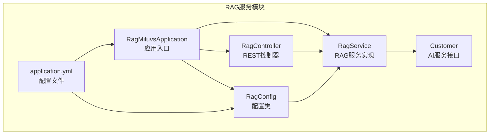
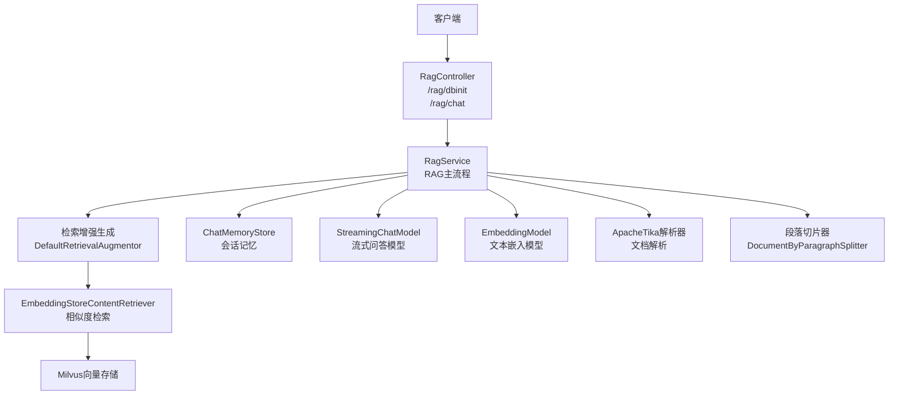
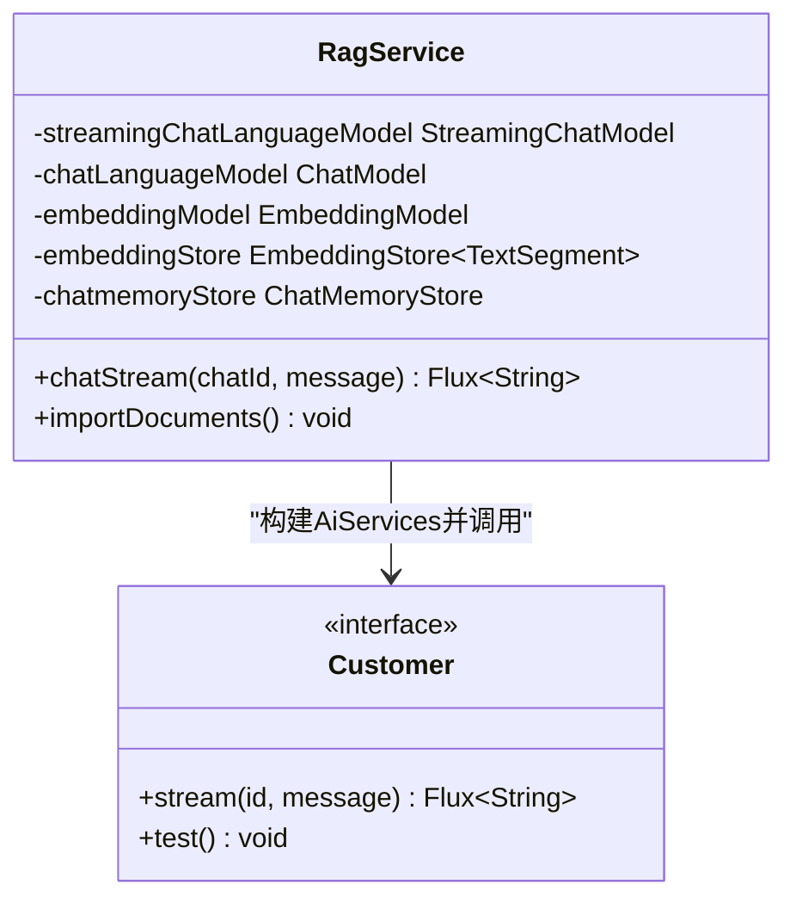
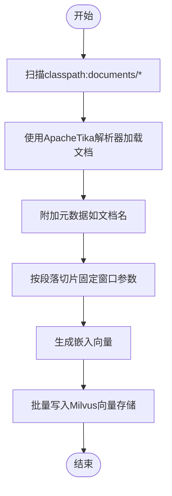
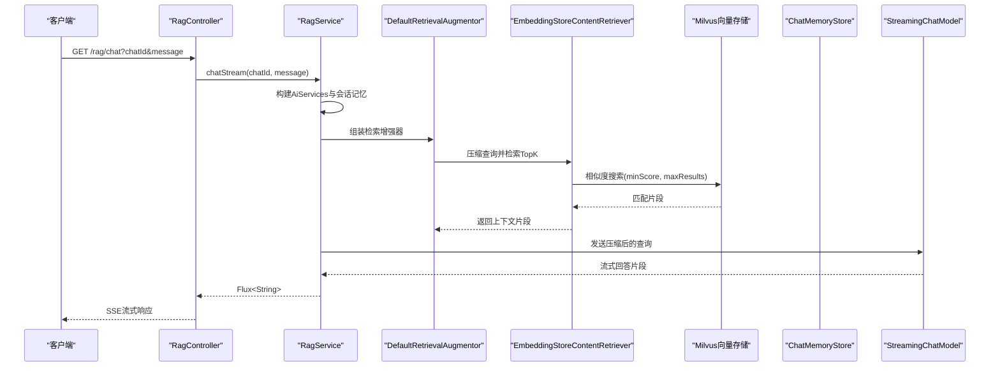
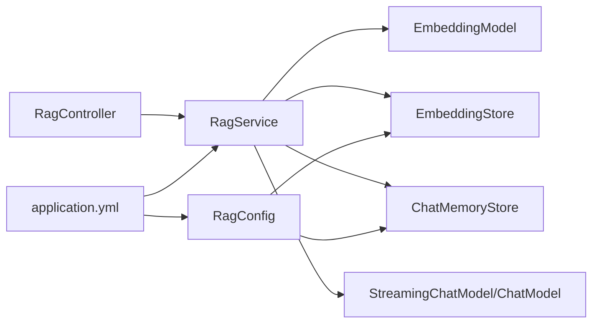

# RAG服务模块

<cite>
**本文档引用的文件**
- [RagMiluvsApplication.java](file://rag-miluvs/src/main/java/cn/project/base/ragmiluvs/RagMiluvsApplication.java)
- [RagConfig.java](file://rag-miluvs/src/main/java/cn/project/base/ragmiluvs/config/RagConfig.java)
- [RagController.java](file://rag-miluvs/src/main/java/cn/project/base/ragmiluvs/controller/RagController.java)
- [RagService.java](file://rag-miluvs/src/main/java/cn/project/base/ragmiluvs/service/RagService.java)
- [Customer.java](file://rag-miluvs/src/main/java/cn/project/base/ragmiluvs/service/Customer.java)
- [application.yml](file://rag-miluvs/src/main/resources/application.yml)
- [application.yml](file://rag-service/src/main/resources/application.yml)
- [笑话.txt](file://rag-service/src/main/resources/笑话.txt)
</cite>

## 目录
1. [简介](#简介)
2. [项目结构](#项目结构)
3. [核心组件](#核心组件)
4. [架构总览](#架构总览)
5. [详细组件分析](#详细组件分析)
6. [依赖分析](#依赖分析)
7. [性能考虑](#性能考虑)
8. [故障排除指南](#故障排除指南)
9. [结论](#结论)
10. [附录](#附录)

## 简介
本文件面向RAG服务模块，系统性阐述基于LangChain4j与Milvus的检索增强生成（RAG）实现方案。内容涵盖文档导入、向量化处理、相似度检索与问答生成的完整流程；深入解析RagService类的文档解析、切片算法、向量嵌入生成与向量存储机制；说明RagController的API接口设计（含SSE流式响应）、参数校验与错误处理；文档化RagConfig配置类的作用与配置项；提供可操作的调用示例与与向量数据库集成方式及性能优化策略。

## 项目结构
RAG服务模块位于独立的子工程中，采用Spring Boot应用结构，包含配置、控制器、服务层与资源文件。核心模块由以下文件构成：
- 应用入口：RagMiluvsApplication
- 配置：RagConfig（定义聊天记忆存储与Milvus向量存储）
- 控制器：RagController（提供数据库初始化与SSE问答接口）
- 服务：RagService（RAG主流程、文档导入与向量化）
- 接口：Customer（定义系统消息与流式问答方法）
- 资源：application.yml（应用端口、Milvus连接信息、模型配置）

图表来源
- [RagMiluvsApplication.java:1-14](file://rag-miluvs/src/main/java/cn/project/base/ragmiluvs/RagMiluvsApplication.java#L1-L14)
- [RagConfig.java:1-55](file://rag-miluvs/src/main/java/cn/project/base/ragmiluvs/config/RagConfig.java#L1-L55)
- [RagController.java:1-29](file://rag-miluvs/src/main/java/cn/project/base/ragmiluvs/controller/RagController.java#L1-L29)
- [RagService.java:1-118](file://rag-miluvs/src/main/java/cn/project/base/ragmiluvs/service/RagService.java#L1-L118)
- [Customer.java:1-17](file://rag-miluvs/src/main/java/cn/project/base/ragmiluvs/service/Customer.java#L1-L17)
- [application.yml](file://rag-miluvs/src/main/resources/application.yml)

章节来源
- [RagMiluvsApplication.java:1-14](file://rag-miluvs/src/main/java/cn/project/base/ragmiluvs/RagMiluvsApplication.java#L1-L14)
- [application.yml](file://rag-miluvs/src/main/resources/application.yml)

## 核心组件
- RagConfig：负责创建聊天记忆存储与Milvus向量存储实例，设置集合名、维度、索引类型、距离度量、一致性级别等关键参数。
- RagService：封装RAG主流程（检索增强生成）、文档导入与向量化、会话记忆管理与流式问答输出。
- RagController：提供两个HTTP端点：/rag/dbinit（初始化向量库）、/rag/chat（SSE流式问答）。
- Customer：定义系统提示词与流式问答方法，作为AiServices的接口契约。
- application.yml：定义应用端口、Milvus连接参数以及DashScope模型配置（包含问答模型、流式问答模型与嵌入模型）。

章节来源
- [RagConfig.java:1-55](file://rag-miluvs/src/main/java/cn/project/base/ragmiluvs/config/RagConfig.java#L1-L55)
- [RagService.java:1-118](file://rag-miluvs/src/main/java/cn/project/base/ragmiluvs/service/RagService.java#L1-L118)
- [RagController.java:1-29](file://rag-miluvs/src/main/java/cn/project/base/ragmiluvs/controller/RagController.java#L1-L29)
- [Customer.java:1-17](file://rag-miluvs/src/main/java/cn/project/base/ragmiluvs/service/Customer.java#L1-L17)
- [application.yml](file://rag-miluvs/src/main/resources/application.yml)

## 架构总览
RAG服务采用“控制器-服务-配置”的分层架构，结合LangChain4j的检索增强生成能力与Milvus向量数据库，实现从文档导入到流式问答的完整链路。

图表来源
- [RagController.java:18-27](file://rag-miluvs/src/main/java/cn/project/base/ragmiluvs/controller/RagController.java#L18-L27)
- [RagService.java:57-90](file://rag-miluvs/src/main/java/cn/project/base/ragmiluvs/service/RagService.java#L57-L90)
- [RagConfig.java:32-53](file://rag-miluvs/src/main/java/cn/project/base/ragmiluvs/config/RagConfig.java#L32-L53)

## 详细组件分析

### RagService 类实现详解
RagService是RAG功能的核心实现，承担以下职责：
- 文档导入与向量化：扫描classpath下的文档资源，使用ApacheTika解析器加载文档，按段落切片，生成嵌入向量并批量写入Milvus。
- 检索增强生成：构建EmbeddingStoreContentRetriever，设置最大返回条数与最小相似度阈值；通过CompressingQueryTransformer压缩历史对话与当前问题，提升检索质量；使用DefaultRetrievalAugmentor组合检索器与查询转换器。
- 流式问答：通过AiServices.Builder绑定StreamingChatModel与ChatModel，并为每个chatId创建独立的MessageWindowChatMemory，最终返回Flux<String>以SSE形式逐字输出答案。

图表来源
- [RagService.java:36-118](file://rag-miluvs/src/main/java/cn/project/base/ragmiluvs/service/RagService.java#L36-L118)
- [Customer.java:8-17](file://rag-miluvs/src/main/java/cn/project/base/ragmiluvs/service/Customer.java#L8-L17)

章节来源
- [RagService.java:57-90](file://rag-miluvs/src/main/java/cn/project/base/ragmiluvs/service/RagService.java#L57-L90)
- [RagService.java:95-116](file://rag-miluvs/src/main/java/cn/project/base/ragmiluvs/service/RagService.java#L95-L116)

### 文档导入与向量化流程
文档导入流程包括：资源扫描、文档解析、段落切片、嵌入生成与批量写入向量库。该流程确保知识库数据被正确切分与向量化，便于后续相似度检索。

图表来源
- [RagService.java:95-116](file://rag-miluvs/src/main/java/cn/project/base/ragmiluvs/service/RagService.java#L95-L116)

章节来源
- [RagService.java:95-116](file://rag-miluvs/src/main/java/cn/project/base/ragmiluvs/service/RagService.java#L95-L116)

### 检索增强生成与流式问答序列
RAG主流程通过AiServices构建具备检索增强能力的问答服务，结合会话记忆与流式模型，实现SSE逐字输出。

图表来源
- [RagController.java:24-27](file://rag-miluvs/src/main/java/cn/project/base/ragmiluvs/controller/RagController.java#L24-L27)
- [RagService.java:57-90](file://rag-miluvs/src/main/java/cn/project/base/ragmiluvs/service/RagService.java#L57-L90)

章节来源
- [RagController.java:24-27](file://rag-miluvs/src/main/java/cn/project/base/ragmiluvs/controller/RagController.java#L24-L27)
- [RagService.java:57-90](file://rag-miluvs/src/main/java/cn/project/base/ragmiluvs/service/RagService.java#L57-L90)

### RagController API 设计
- /rag/dbinit：GET请求，触发RagService.importDocuments()，将classpath下文档导入向量库。
- /rag/chat：GET请求，SSE流式响应，返回Flux<String>。支持chatId（会话标识，默认1）与message（用户问题）两个参数。

章节来源
- [RagController.java:18-27](file://rag-miluvs/src/main/java/cn/project/base/ragmiluvs/controller/RagController.java#L18-L27)

### RagConfig 配置类
- 聊天记忆存储：默认使用内存聊天记忆存储（InMemoryChatMemoryStore），适合演示与轻量场景。
- 向量存储：通过MilvusEmbeddingStore连接远程Milvus，设置集合名、维度、索引类型（FLAT）、距离度量（COSINE）、一致性级别、自动刷新、字段映射等。
- 外部依赖：通过application.yml提供Milvus主机与端口，以及DashScope模型的API Key与模型名。

章节来源
- [RagConfig.java:25-53](file://rag-miluvs/src/main/java/cn/project/base/ragmiluvs/config/RagConfig.java#L25-L53)
- [application.yml](file://rag-miluvs/src/main/resources/application.yml)

### Customer 接口
- 定义系统提示词（SystemMessage），限定回答范围与风格。
- 定义流式问答方法stream(@MemoryId String id, @UserMessage String message)，返回Flux<String>用于SSE输出。
- 提供test()占位方法，便于扩展。

章节来源
- [Customer.java:8-17](file://rag-miluvs/src/main/java/cn/project/base/ragmiluvs/service/Customer.java#L8-L17)

## 依赖分析
RAG服务模块的关键依赖关系如下：
- RagController依赖RagService注入，提供HTTP接口。
- RagService依赖StreamingChatModel、ChatModel、EmbeddingModel、EmbeddingStore与ChatMemoryStore。
- RagConfig提供EmbeddingStore与ChatMemoryStore的Bean定义。
- application.yml提供Milvus与模型配置。

图表来源
- [RagController.java:15-16](file://rag-miluvs/src/main/java/cn/project/base/ragmiluvs/controller/RagController.java#L15-L16)
- [RagService.java:39-48](file://rag-miluvs/src/main/java/cn/project/base/ragmiluvs/service/RagService.java#L39-L48)
- [RagConfig.java:25-53](file://rag-miluvs/src/main/java/cn/project/base/ragmiluvs/config/RagConfig.java#L25-L53)
- [application.yml](file://rag-miluvs/src/main/resources/application.yml)

章节来源
- [RagController.java:15-16](file://rag-miluvs/src/main/java/cn/project/base/ragmiluvs/controller/RagController.java#L15-L16)
- [RagService.java:39-48](file://rag-miluvs/src/main/java/cn/project/base/ragmiluvs/service/RagService.java#L39-L48)
- [RagConfig.java:25-53](file://rag-miluvs/src/main/java/cn/project/base/ragmiluvs/config/RagConfig.java#L25-L53)
- [application.yml](file://rag-miluvs/src/main/resources/application.yml)

## 性能考虑
- 相似度检索优化
  - 索引类型：当前使用FLAT索引，适合小规模或演示场景；在大规模数据时建议评估IVF/IVF_FLAT/HNSW等索引以降低查询延迟。
  - 距离度量：Cosine适用于高维语义向量；若特征分布特殊可评估Euclidean。
  - 检索参数：maxResults与minScore需根据召回率与准确率权衡调整。
- 向量化与存储
  - 批量写入：importDocuments采用批量添加向量，减少网络往返开销。
  - 自动刷新：autoFlushOnInsert简化开发但可能影响吞吐；生产环境可关闭自动刷新，改为显式flush。
- 查询压缩
  - 使用CompressingQueryTransformer将历史对话与问题压缩为单一查询，有助于提升检索质量与降低上下文长度。
- 流式输出
  - SSE逐字输出降低首字延迟，改善用户体验；注意下游客户端的缓冲与重连策略。
- 会话记忆
  - MessageWindowChatMemory限制消息数量，避免上下文过长导致性能下降与成本上升。

## 故障排除指南
- Milvus连接失败
  - 检查application.yml中的host与port是否正确，确认网络可达与防火墙放行。
  - 若启用认证，需在RagConfig中补充用户名与密码配置。
- 文档导入异常
  - 确认classpath:documents/路径存在且包含可解析的文档；ApacheTika解析器支持常见格式（PDF、Word、Excel等）。
  - 观察日志中“导入文档的名称为”与“导入文档到向量数据库完成”等节点，定位具体失败步骤。
- 相似度检索结果为空
  - 调整minScore阈值或maxResults数量；检查向量维度与索引类型是否匹配。
- 流式问答无输出
  - 确认StreamingChatModel已正确注入并可用；检查DashScope API Key与模型名配置。
- 会话错乱
  - 确保chatId传入一致；不同chatId对应不同会话记忆。

章节来源
- [RagConfig.java:32-53](file://rag-miluvs/src/main/java/cn/project/base/ragmiluvs/config/RagConfig.java#L32-L53)
- [RagService.java:95-116](file://rag-miluvs/src/main/java/cn/project/base/ragmiluvs/service/RagService.java#L95-L116)
- [application.yml](file://rag-miluvs/src/main/resources/application.yml)

## 结论
本RAG服务模块基于LangChain4j与Milvus实现了完整的检索增强生成链路，具备清晰的分层结构与可扩展的配置体系。通过文档导入、向量化、相似度检索与流式问答的协同，满足了实时、可解释的智能问答需求。建议在生产环境中进一步优化索引策略、调整检索参数与会话记忆容量，并完善监控与告警机制。

## 附录

### 实际使用示例（调用方式）
- 初始化向量库
  - 请求：GET http://localhost:8099/rag/dbinit
  - 说明：触发RagService.importDocuments()，将classpath:documents/下的文档导入Milvus。
- 流式问答
  - 请求：GET http://localhost:8099/rag/chat?chatId=1&message=你好
  - 说明：返回SSE流式响应，逐字输出模型回答；chatId用于区分不同会话的记忆上下文。

章节来源
- [RagController.java:18-27](file://rag-miluvs/src/main/java/cn/project/base/ragmiluvs/controller/RagController.java#L18-L27)

### 配置项说明
- 应用与服务器
  - spring.application.name：应用名称
  - server.port：服务端口
- Milvus连接
  - milvus.host：Milvus主机地址
  - milvus.port：Milvus端口
- 模型配置（DashScope）
  - langchain4j.community.dashscope.chat-model.model-name：问答模型名称
  - langchain4j.community.dashscope.chat-model.api-key：问答模型API Key
  - langchain4j.community.dashscope.streaming-chat-model.model-name：流式问答模型名称
  - langchain4j.community.dashscope.streaming-chat-model.api-key：流式问答模型API Key
  - langchain4j.community.dashscope.embedding-model.model-name：嵌入模型名称
  - langchain4j.community.dashscope.embedding-model.api-key：嵌入模型API Key

章节来源
- [application.yml](file://rag-miluvs/src/main/resources/application.yml)