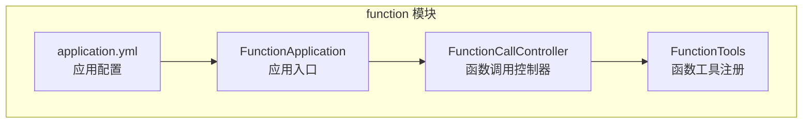
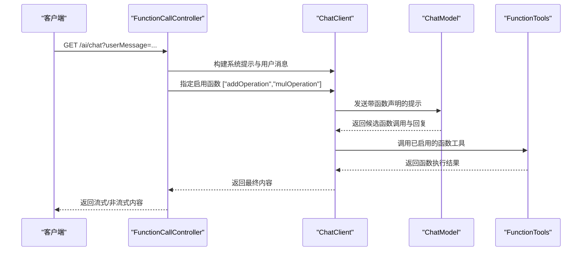
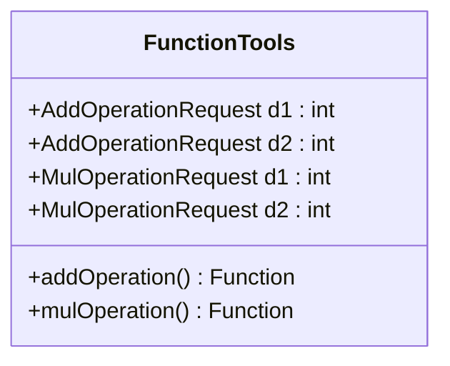
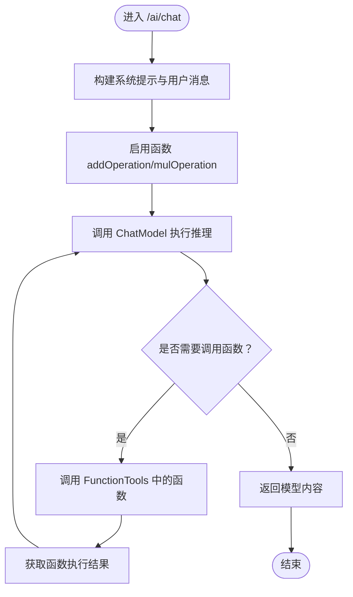
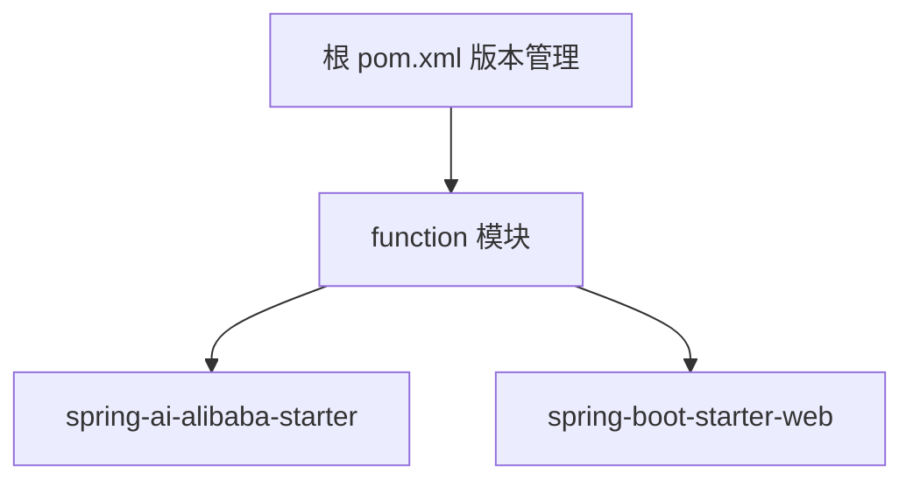

# 函数调用模块

<cite>
**本文引用的文件**   
- [FunctionTools.java](file://function/src/main/java/cn/project/base/function/config/FunctionTools.java)
- [FunctionCallController.java](file://function/src/main/java/cn/project/base/function/controller/FunctionCallController.java)
- [FunctionApplication.java](file://function/src/main/java/cn/project/base/function/FunctionApplication.java)
- [application.yml](file://function/src/main/resources/application.yml)
- [pom.xml（function 模块）](file://function/pom.xml)
- [pom.xml（根项目）](file://pom.xml)
- [SecurityConfig.java](file://spring-admin-service/src/main/java/cn/project/base/springadminservice/config/SecurityConfig.java)
- [logback-dev.xml](file://rag-service/src/main/resources/logback-dev.xml)
</cite>

## 目录
1. [简介](#简介)
2. [项目结构](#项目结构)
3. [核心组件](#核心组件)
4. [架构总览](#架构总览)
5. [详细组件分析](#详细组件分析)
6. [依赖分析](#依赖分析)
7. [性能考虑](#性能考虑)
8. [故障排查指南](#故障排查指南)
9. [结论](#结论)
10. [附录](#附录)

## 简介
本文件为函数调用模块的实现文档，聚焦以下目标：
- FunctionTools 类的函数工具注册机制与工具函数开发规范
- FunctionCallController 的 API 设计：请求格式、参数传递与结果处理
- 函数调用的安全机制与权限控制策略
- 自定义函数工具的开发指南与最佳实践
- 函数调用的执行流程与错误处理机制
- 外部 API 集成的实际案例与配置示例
- 函数调用的监控与日志记录功能

该模块基于 Spring Boot 与 Spring AI Alibaba Starter，提供基于函数调用的算术计算能力，并演示如何通过 ChatClient 启用自定义函数。

## 项目结构
函数调用模块位于 function 子工程，采用标准 Spring Boot 结构：
- config：函数工具注册与配置
- controller：对外暴露的 REST 接口
- resources：应用配置与资源
- 测试与启动入口省略于本文件分析范围

图表来源
- [FunctionApplication.java:1-14](file://function/src/main/java/cn/project/base/function/FunctionApplication.java#L1-L14)
- [FunctionTools.java:1-40](file://function/src/main/java/cn/project/base/function/config/FunctionTools.java#L1-L40)
- [FunctionCallController.java:1-76](file://function/src/main/java/cn/project/base/function/controller/FunctionCallController.java#L1-L76)
- [application.yml:1-14](file://function/src/main/resources/application.yml#L1-L14)

章节来源
- [FunctionApplication.java:1-14](file://function/src/main/java/cn/project/base/function/FunctionApplication.java#L1-L14)
- [FunctionTools.java:1-40](file://function/src/main/java/cn/project/base/function/config/FunctionTools.java#L1-L40)
- [FunctionCallController.java:1-76](file://function/src/main/java/cn/project/base/function/controller/FunctionCallController.java#L1-L76)
- [application.yml:1-14](file://function/src/main/resources/application.yml#L1-L14)

## 核心组件
- FunctionTools：通过 Spring 配置类注册函数工具 Bean，提供加法与乘法两个函数，分别对应不同的请求载荷类型。
- FunctionCallController：提供 /ai/chat 接口，使用 ChatClient 构建系统提示与用户消息，启用自定义函数并返回模型回复。
- FunctionApplication：Spring Boot 应用入口。
- application.yml：配置服务端口与 DashScope AI 服务参数（API Key、模型名等）。

章节来源
- [FunctionTools.java:1-40](file://function/src/main/java/cn/project/base/function/config/FunctionTools.java#L1-L40)
- [FunctionCallController.java:1-76](file://function/src/main/java/cn/project/base/function/controller/FunctionCallController.java#L1-L76)
- [FunctionApplication.java:1-14](file://function/src/main/java/cn/project/base/function/FunctionApplication.java#L1-L14)
- [application.yml:1-14](file://function/src/main/resources/application.yml#L1-L14)

## 架构总览
函数调用模块的运行链路如下：
- 客户端请求进入 FunctionCallController 的 /ai/chat 接口
- 控制器通过 ChatClient 构建系统提示与用户消息
- 启用自定义函数 addOperation 与 mulOperation
- 调用 ChatModel 执行推理，返回模型回复内容

图表来源
- [FunctionCallController.java:33-49](file://function/src/main/java/cn/project/base/function/controller/FunctionCallController.java#L33-L49)
- [FunctionTools.java:21-37](file://function/src/main/java/cn/project/base/function/config/FunctionTools.java#L21-L37)

## 详细组件分析

### FunctionTools：函数工具注册机制与开发规范
- 注册方式
  - 使用 Spring 配置类与 @Bean 方法注册函数工具，方法名即函数名称，方法返回值为 Function<T, R>，其中 T 为请求载荷类型，R 为返回值类型。
  - 使用 @Description 提供函数描述，便于在函数声明中展示用途。
- 请求载荷与返回值
  - 请求载荷建议使用 Java Record 以保证不可变性与简洁性；Record 字段即为函数的参数。
  - 返回值为纯数据类型，避免在函数内部直接进行网络 I/O 或复杂副作用。
- 日志与可观测性
  - 函数内部可记录日志，便于追踪函数调用与参数。
- 开发规范
  - 函数名称全局唯一，建议使用小写+下划线或驼峰风格，保持与 ChatClient 中 .functions(...) 一致。
  - 请求载荷字段尽量简单，避免嵌套过深；必要时拆分为多个函数。
  - 函数实现应幂等、无副作用或具备完善的补偿机制。
  - 对异常进行捕获并转换为可预期的返回值或错误信息，避免抛出未处理异常导致调用失败。

图表来源
- [FunctionTools.java:15-37](file://function/src/main/java/cn/project/base/function/config/FunctionTools.java#L15-L37)

章节来源
- [FunctionTools.java:1-40](file://function/src/main/java/cn/project/base/function/config/FunctionTools.java#L1-L40)

### FunctionCallController：API 设计与调用流程
- 接口定义
  - 路径：/ai/chat
  - 方法：GET
  - 响应类型：application/stream+json（服务器推送）
  - 查询参数：userMessage（用户输入）
- 请求处理流程
  - 构建系统提示：限定角色为“算术计算器代理”，明确支持加法与乘法，并要求在调用前收集必要参数。
  - 构建用户消息：来自查询参数 userMessage。
  - 启用函数：.functions("addOperation", "mulOperation") 显式声明可用函数。
  - 调用 ChatModel 并返回内容。
- 参数传递与结果处理
  - 参数传递：通过 ChatClient 的 prompt/user/functions 等 API 将参数与函数声明注入到模型推理中。
  - 结果处理：返回模型内容，支持流式输出。
- 错误处理
  - 当函数调用失败或模型返回异常时，需在上层进行捕获与降级处理（例如回退到普通文本回复）。

图表来源
- [FunctionCallController.java:33-49](file://function/src/main/java/cn/project/base/function/controller/FunctionCallController.java#L33-L49)
- [FunctionTools.java:21-37](file://function/src/main/java/cn/project/base/function/config/FunctionTools.java#L21-L37)

章节来源
- [FunctionCallController.java:1-76](file://function/src/main/java/cn/project/base/function/controller/FunctionCallController.java#L1-L76)

### 安全机制与权限控制策略
- 当前模块未内置鉴权与授权逻辑，建议结合 Spring Security 实现统一的安全策略：
  - 在网关或服务入口配置基于路径的访问控制（如仅允许特定 IP 或令牌校验）。
  - 对 /ai/chat 等关键接口增加登录态校验与权限校验。
  - 对外部模型服务的调用增加超时与熔断策略，防止雪崩。
- 示例参考
  - 可参考 spring-admin-service 中的 SecurityConfig，定义放行路径与认证规则，再在函数模块中复用或扩展。

章节来源
- [SecurityConfig.java:1-44](file://spring-admin-service/src/main/java/cn/project/base/springadminservice/config/SecurityConfig.java#L1-L44)

### 自定义函数工具开发指南与最佳实践
- 新增函数步骤
  - 在 FunctionTools 中新增 @Bean 方法，返回 Function<请求载荷, 返回值>。
  - 使用 Java Record 定义请求载荷，字段即函数参数。
  - 在 ChatClient 中通过 .functions(...) 明确启用新函数。
- 最佳实践
  - 幂等性：函数实现尽量无副作用，或提供补偿措施。
  - 参数校验：在函数内部对输入进行校验，返回明确的错误信息。
  - 超时与重试：若函数涉及外部调用，设置超时与重试策略。
  - 日志与追踪：为每个函数调用记录关键上下文（如 trace_id、请求参数、执行耗时）。
  - 文档化：使用 @Description 提供函数用途说明，便于前端与运营理解。

章节来源
- [FunctionTools.java:1-40](file://function/src/main/java/cn/project/base/function/config/FunctionTools.java#L1-L40)
- [FunctionCallController.java:44-47](file://function/src/main/java/cn/project/base/function/controller/FunctionCallController.java#L44-L47)

### 外部 API 集成案例与配置示例
- DashScope 配置
  - 在 application.yml 中配置 api-key 与模型名，用于 Spring AI Alibaba Starter 连接 DashScope。
- HTTP 客户端示例
  - 控制台中提供了使用 Apache HttpClient 调用本地 Ollama API 的示例，可作为集成外部 LLM 的参考模式（如更换 URL 与 JSON 载荷）。

章节来源
- [application.yml:1-14](file://function/src/main/resources/application.yml#L1-L14)
- [FunctionCallController.java:50-74](file://function/src/main/java/cn/project/base/function/controller/FunctionCallController.java#L50-L74)

### 监控与日志记录
- 日志配置
  - 可参考 rag-service 模块中的 logback-dev.xml，配置控制台与滚动文件输出、按级别分拣与 API 专属日志文件。
- 建议
  - 为函数调用与 ChatClient 调用增加结构化日志，包含请求 ID、函数名、参数、耗时、结果状态等。
  - 对异常与慢调用进行告警，结合外部监控系统（如 Prometheus/Grafana）实现可视化。

章节来源
- [logback-dev.xml:1-208](file://rag-service/src/main/resources/logback-dev.xml#L1-L208)

## 依赖分析
- 模块依赖
  - function 模块依赖 Spring Boot Web 与 spring-ai-alibaba-starter，用于提供 Web 接口与 AI 服务集成。
  - 根 pom.xml 统一管理 Spring Boot、Spring AI、LangChain4j 等版本，确保兼容性。
- 外部依赖
  - DashScope API Key 与模型配置在 application.yml 中声明，用于连接云端模型服务。
  - 可通过替换 ChatModel 或引入其他 Starter（如 Ollama）实现本地或混合部署。

图表来源
- [pom.xml（function 模块）:23-43](file://function/pom.xml#L23-L43)
- [pom.xml（根项目）:24-101](file://pom.xml#L24-L101)

章节来源
- [pom.xml（function 模块）:1-85](file://function/pom.xml#L1-L85)
- [pom.xml（根项目）:1-171](file://pom.xml#L1-L171)

## 性能考虑
- 函数执行
  - 将 CPU 密集型计算放在函数内，避免阻塞主线程；若涉及外部 I/O，建议异步化与连接池化。
- 模型调用
  - 合理设置超时时间与并发度，避免模型侧限流导致整体延迟上升。
- 日志与监控
  - 控制日志量级，避免高频函数调用产生大量 IO；对关键路径埋点统计耗时与成功率。

## 故障排查指南
- 常见问题
  - 函数未生效：确认 ChatClient 中 .functions(...) 与 @Bean 方法名一致，且函数可见性为 public。
  - 参数解析失败：检查请求载荷字段与模型函数声明是否匹配。
  - 权限不足：若启用安全策略，请确认访问令牌或登录态有效。
- 排查步骤
  - 查看函数调用日志与模型返回日志，定位失败环节。
  - 使用最小化用户输入复现问题，逐步缩小范围。
  - 对外部 API 调用增加超时与重试，观察是否为网络抖动导致。

章节来源
- [FunctionCallController.java:33-49](file://function/src/main/java/cn/project/base/function/controller/FunctionCallController.java#L33-L49)
- [FunctionTools.java:21-37](file://function/src/main/java/cn/project/base/function/config/FunctionTools.java#L21-L37)

## 结论
函数调用模块通过 FunctionTools 与 FunctionCallController 实现了从 API 到函数执行的完整闭环。借助 Spring AI Alibaba Starter，模块可快速对接多种模型服务。建议在生产环境中补充鉴权、限流、熔断与完善的日志监控体系，以提升安全性与稳定性。

## 附录
- 快速启动
  - 运行 FunctionApplication 启动服务，默认端口由 application.yml 配置。
- 配置要点
  - 在 application.yml 中填写 DashScope API Key 与模型名。
  - 如需本地模型，可在 ChatModel 配置中切换至 Ollama 或其他适配器。

章节来源
- [FunctionApplication.java:1-14](file://function/src/main/java/cn/project/base/function/FunctionApplication.java#L1-L14)
- [application.yml:1-14](file://function/src/main/resources/application.yml#L1-L14)