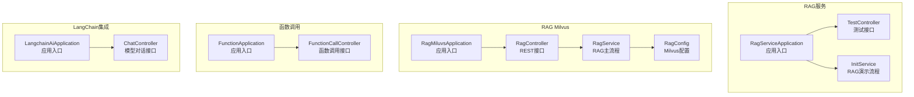
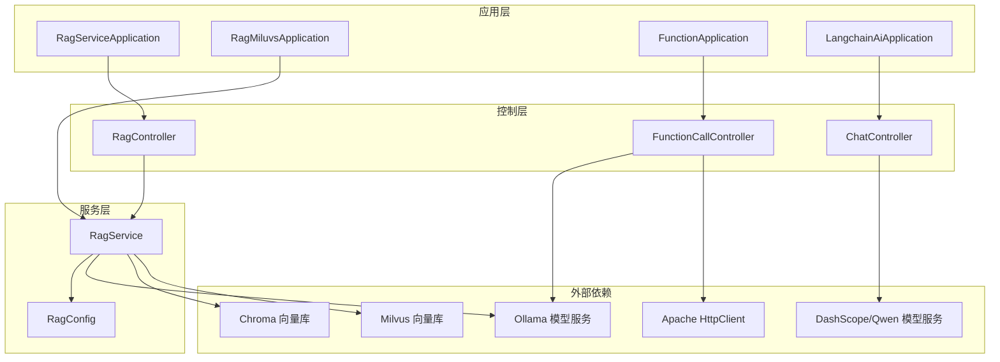
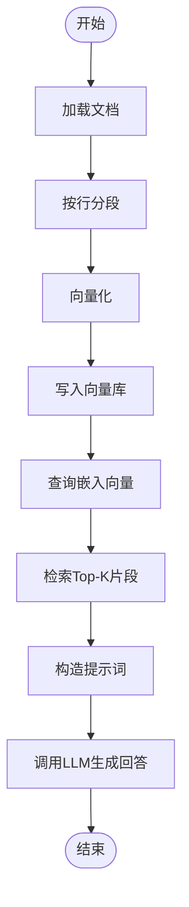
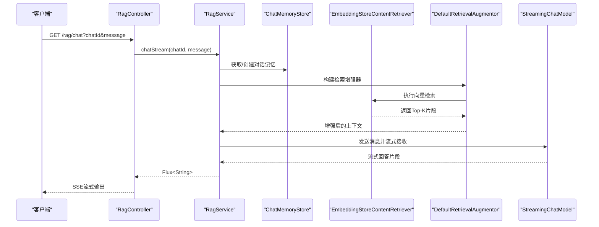
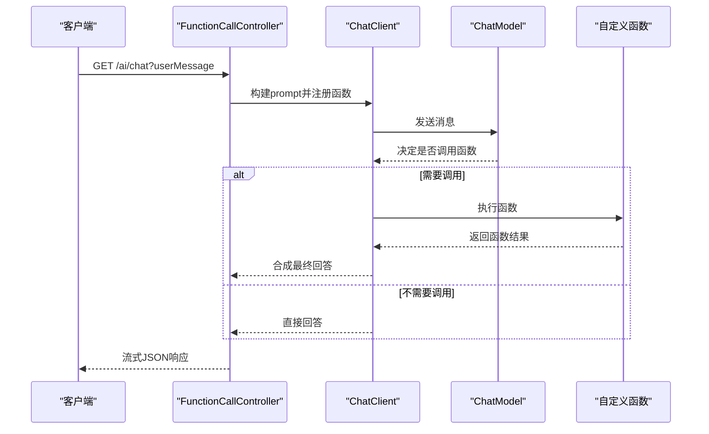
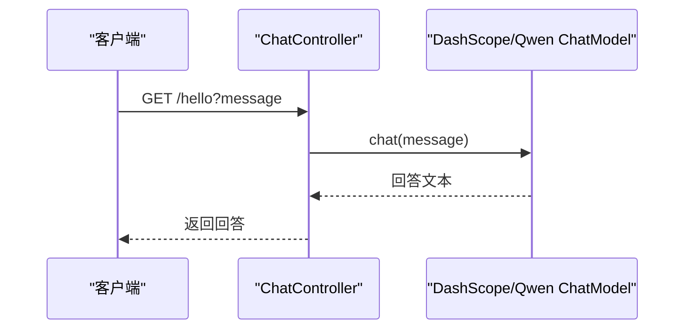

# 核心模块

<cite>
**本文引用的文件**
- [RagServiceApplication.java](file://rag-service/src/main/java/cn/project/base/ragservice/RagServiceApplication.java)
- [TestController.java](file://rag-service/src/main/java/cn/project/base/ragservice/controller/TestController.java)
- [InitService.java](file://rag-service/src/main/java/cn/project/base/ragservice/service/InitService.java)
- [application.yml](file://rag-service/src/main/resources/application.yml)
- [RagMiluvsApplication.java](file://rag-miluvs/src/main/java/cn/project/base/ragmiluvs/RagMiluvsApplication.java)
- [RagController.java](file://rag-miluvs/src/main/java/cn/project/base/ragmiluvs/controller/RagController.java)
- [RagService.java](file://rag-miluvs/src/main/java/cn/project/base/ragmiluvs/service/RagService.java)
- [RagConfig.java](file://rag-miluvs/src/main/java/cn/project/base/ragmiluvs/config/RagConfig.java)
- [FunctionApplication.java](file://function/src/main/java/cn/project/base/function/FunctionApplication.java)
- [FunctionCallController.java](file://function/src/main/java/cn/project/base/function/controller/FunctionCallController.java)
- [LangchainAiApplication.java](file://langchain-ai/src/main/java/cn/project/base/langchainai/LangchainAiApplication.java)
- [ChatController.java](file://langchain-ai/src/main/java/cn/project/base/langchainai/controller/ChatController.java)
- [SpringAiModelApplication.java](file://spring-ai-model/src/main/java/cn/project/base/springaimodel/SpringAiModelApplication.java)
- [SpringAiServiceApplication.java](file://spring-ai-service/src/main/java/cn/project/base/springaiservice/SpringAiServiceApplication.java)
- [pom.xml](file://pom.xml)
</cite>

## 目录
1. [引言](#引言)
2. [项目结构](#项目结构)
3. [核心组件](#核心组件)
4. [架构总览](#架构总览)
5. [详细组件分析](#详细组件分析)
6. [依赖分析](#依赖分析)
7. [性能考虑](#性能考虑)
8. [故障排查指南](#故障排查指南)
9. [结论](#结论)
10. [附录](#附录)

## 引言
本文件面向RAG服务的核心模块，系统性梳理以下子系统的能力边界、实现细节与协作关系：
- RAG服务模块：负责文档解析、分段、向量化、向量检索与RAG增强问答的完整流程。
- AI模型集成模块：对接本地或云端模型（如Ollama、DashScope/Qwen），提供对话与推理能力。
- 函数调用模块：演示如何在对话中启用函数调用（如加法、乘法），并结合LLM完成任务。
- LangChain集成模块：展示LangChain4j生态在Spring Boot中的装配与使用。

文档同时给出模块级API说明、配置项、参数与返回值定义，并提供可落地的最佳实践与扩展建议。

## 项目结构
该仓库采用多模块聚合工程组织，核心模块包括：
- rag-service：RAG流程的演示与基础入口
- rag-miluvs：基于Milvus的RAG实现，包含控制器、服务与配置
- function：函数调用示例模块
- langchain-ai：LangChain4j模型接入示例
- spring-ai-model、spring-ai-service：Spring AI生态相关模块
- spring-ai-mcp、spring-ai-mcp-server：MCP协议相关模块
- spring-admin-client、spring-admin-service：监控客户端与服务端



图表来源
- [RagServiceApplication.java:1-14](file://rag-service/src/main/java/cn/project/base/ragservice/RagServiceApplication.java#L1-L14)
- [TestController.java:1-17](file://rag-service/src/main/java/cn/project/base/ragservice/controller/TestController.java#L1-L17)
- [InitService.java:1-153](file://rag-service/src/main/java/cn/project/base/ragservice/service/InitService.java#L1-L153)
- [RagMiluvsApplication.java:1-14](file://rag-miluvs/src/main/java/cn/project/base/ragmiluvs/RagMiluvsApplication.java#L1-L14)
- [RagController.java:1-29](file://rag-miluvs/src/main/java/cn/project/base/ragmiluvs/controller/RagController.java#L1-L29)
- [RagService.java:1-118](file://rag-miluvs/src/main/java/cn/project/base/ragmiluvs/service/RagService.java#L1-L118)
- [RagConfig.java:1-55](file://rag-miluvs/src/main/java/cn/project/base/ragmiluvs/config/RagConfig.java#L1-L55)
- [FunctionApplication.java:1-14](file://function/src/main/java/cn/project/base/function/FunctionApplication.java#L1-L14)
- [FunctionCallController.java:1-76](file://function/src/main/java/cn/project/base/function/controller/FunctionCallController.java#L1-L76)
- [LangchainAiApplication.java:1-31](file://langchain-ai/src/main/java/cn/project/base/langchainai/LangchainAiApplication.java#L1-L31)
- [ChatController.java:1-36](file://langchain-ai/src/main/java/cn/project/base/langchainai/controller/ChatController.java#L1-L36)

章节来源
- [pom.xml:11-22](file://pom.xml#L11-L22)

## 核心组件
本节聚焦四大核心模块的功能定位与职责边界：

- RAG服务模块（rag-service）
  - 职责：演示完整的RAG流程，包括文档加载、按行分段、向量化、写入Chroma、检索与与LLM交互。
  - 关键类：RagServiceApplication、TestController、InitService。
  - 特点：以演示为主，便于理解RAG各阶段的衔接与数据流。

- RAG Milvus模块（rag-miluvs）
  - 职责：提供生产化RAG能力，包含REST接口、向量检索增强、对话记忆、文档导入与向量化。
  - 关键类：RagController、RagService、RagConfig。
  - 特点：使用LangChain4j的AiServices与RetrievalAugmentor，集成Milvus向量库与内存对话存储。

- 函数调用模块（function）
  - 职责：演示如何在对话中启用函数调用，结合ChatClient与ChatModel实现工具调用。
  - 关键类：FunctionApplication、FunctionCallController。
  - 特点：通过函数名注册启用，LLM在对话中自动决定是否调用工具。

- LangChain集成模块（langchain-ai）
  - 职责：展示LangChain4j模型接入（如Qwen），提供简单对话接口。
  - 关键类：LangchainAiApplication、ChatController。
  - 特点：通过构造模型实例直接调用，适合快速验证模型能力。

章节来源
- [RagServiceApplication.java:1-14](file://rag-service/src/main/java/cn/project/base/ragservice/RagServiceApplication.java#L1-L14)
- [RagMiluvsApplication.java:1-14](file://rag-miluvs/src/main/java/cn/project/base/ragmiluvs/RagMiluvsApplication.java#L1-L14)
- [FunctionApplication.java:1-14](file://function/src/main/java/cn/project/base/function/FunctionApplication.java#L1-L14)
- [LangchainAiApplication.java:1-31](file://langchain-ai/src/main/java/cn/project/base/langchainai/LangchainAiApplication.java#L1-L31)

## 架构总览
下图展示了四个核心模块在系统中的位置与交互关系，以及与外部组件（模型服务、向量库、HTTP客户端）的协作。



图表来源
- [RagController.java:1-29](file://rag-miluvs/src/main/java/cn/project/base/ragmiluvs/controller/RagController.java#L1-L29)
- [RagService.java:1-118](file://rag-miluvs/src/main/java/cn/project/base/ragmiluvs/service/RagService.java#L1-L118)
- [RagConfig.java:1-55](file://rag-miluvs/src/main/java/cn/project/base/ragmiluvs/config/RagConfig.java#L1-L55)
- [FunctionCallController.java:1-76](file://function/src/main/java/cn/project/base/function/controller/FunctionCallController.java#L1-L76)
- [ChatController.java:1-36](file://langchain-ai/src/main/java/cn/project/base/langchainai/controller/ChatController.java#L1-L36)

## 详细组件分析

### RAG服务模块（rag-service）
- 应用入口与测试接口
  - 应用入口：启动Spring Boot应用。
  - 测试接口：提供POST /test/a用于日志输出与健康检查。
- RAG演示流程（InitService）
  - 文档加载：从资源目录加载文档。
  - 分段策略：按行分段，便于检索与上下文控制。
  - 向量化：使用Ollama嵌入模型生成向量。
  - 向量存储：写入Chroma向量库。
  - 检索增强：查询嵌入向量，匹配最相似片段。
  - 与LLM交互：将检索到的上下文拼接提示词，调用Ollama聊天模型生成回答。



图表来源
- [InitService.java:38-109](file://rag-service/src/main/java/cn/project/base/ragservice/service/InitService.java#L38-L109)

章节来源
- [RagServiceApplication.java:1-14](file://rag-service/src/main/java/cn/project/base/ragservice/RagServiceApplication.java#L1-L14)
- [TestController.java:1-17](file://rag-service/src/main/java/cn/project/base/ragservice/controller/TestController.java#L1-L17)
- [InitService.java:1-153](file://rag-service/src/main/java/cn/project/base/ragservice/service/InitService.java#L1-L153)
- [application.yml:1-9](file://rag-service/src/main/resources/application.yml#L1-L9)

### RAG Milvus模块（rag-miluvs）
- 控制层（RagController）
  - /rag/dbinit：触发文档导入与向量化入库。
  - /rag/chat：以SSE流式返回RAG增强问答结果。
- 服务层（RagService）
  - 对话记忆：基于内存存储的MessageWindowChatMemory。
  - 检索增强：EmbeddingStoreContentRetriever + DefaultRetrievalAugmentor。
  - 查询压缩：CompressingQueryTransformer提升检索质量。
  - 流式对话：StreamingChatModel与AiServices构建流式响应。
- 配置层（RagConfig）
  - 注入ChatMemoryStore与Milvus EmbeddingStore Bean。
  - Milvus集合参数：主机、端口、维度、索引类型、度量方式、一致性级别等。



图表来源
- [RagController.java:18-27](file://rag-miluvs/src/main/java/cn/project/base/ragmiluvs/controller/RagController.java#L18-L27)
- [RagService.java:57-90](file://rag-miluvs/src/main/java/cn/project/base/ragmiluvs/service/RagService.java#L57-L90)
- [RagConfig.java:25-53](file://rag-miluvs/src/main/java/cn/project/base/ragmiluvs/config/RagConfig.java#L25-L53)

章节来源
- [RagMiluvsApplication.java:1-14](file://rag-miluvs/src/main/java/cn/project/base/ragmiluvs/RagMiluvsApplication.java#L1-L14)
- [RagController.java:1-29](file://rag-miluvs/src/main/java/cn/project/base/ragmiluvs/controller/RagController.java#L1-L29)
- [RagService.java:1-118](file://rag-miluvs/src/main/java/cn/project/base/ragmiluvs/service/RagService.java#L1-L118)
- [RagConfig.java:1-55](file://rag-miluvs/src/main/java/cn/project/base/ragmiluvs/config/RagConfig.java#L1-L55)

### 函数调用模块（function）
- 控制层（FunctionCallController）
  - /ai/chat：以流式JSON返回LLM对话结果。
  - 通过ChatClient启用函数调用（如addOperation、mulOperation）。
  - 系统提示词引导LLM在需要时调用工具函数。
- 外部HTTP客户端
  - 提供示例代码展示如何直接调用Ollama API。



图表来源
- [FunctionCallController.java:33-49](file://function/src/main/java/cn/project/base/function/controller/FunctionCallController.java#L33-L49)

章节来源
- [FunctionApplication.java:1-14](file://function/src/main/java/cn/project/base/function/FunctionApplication.java#L1-L14)
- [FunctionCallController.java:1-76](file://function/src/main/java/cn/project/base/function/controller/FunctionCallController.java#L1-L76)

### LangChain集成模块（langchain-ai）
- 控制层（ChatController）
  - /hello：基于DashScope/Qwen模型进行对话。
  - 支持温度、TopK、TopP等参数微调。
- 应用入口（LangchainAiApplication）
  - 输出应用运行信息与访问地址。



图表来源
- [ChatController.java:18-21](file://langchain-ai/src/main/java/cn/project/base/langchainai/controller/ChatController.java#L18-L21)

章节来源
- [LangchainAiApplication.java:1-31](file://langchain-ai/src/main/java/cn/project/base/langchainai/LangchainAiApplication.java#L1-L31)
- [ChatController.java:1-36](file://langchain-ai/src/main/java/cn/project/base/langchainai/controller/ChatController.java#L1-L36)

## 依赖分析
- 项目采用Maven聚合工程，统一管理Spring Boot、Spring AI与LangChain4j版本。
- 关键依赖范围：
  - langchain4j：核心RAG与模型抽象
  - langchain4j-ollama：本地Ollama模型适配
  - langchain4j-chroma：Chroma向量库适配
  - spring-ai-ollama-spring-boot-starter：Spring AI对Ollama的自动装配
  - langchain4j-community-dashscope-spring-boot-starter：DashScope/Qwen接入

```mermaid
graph LR
POM["pom.xml 依赖管理"] --> LCJ["langchain4j 生态"]
POM --> SAI["Spring AI 生态"]
LCJ --> OLL["langchain4j-ollama"]
LCJ --> CHR["langchain4j-chroma"]
SAI --> OLL Starter["spring-ai-ollama-starter"]
LCJ --> DSK["langchain4j-community-dashscope-starter"]
```

图表来源
- [pom.xml:36-101](file://pom.xml#L36-L101)

章节来源
- [pom.xml:1-171](file://pom.xml#L1-L171)

## 性能考虑
- 向量检索参数调优
  - maxResults：控制召回数量，影响上下文长度与延迟。
  - minScore：过滤低相关片段，提升回答质量。
- 分段策略
  - 段长与重叠度需平衡上下文完整性与检索效率。
- 流式输出
  - 使用Flux进行SSE流式传输，降低首字节延迟。
- 向量库选择
  - Milvus适合高维向量与复杂查询；Chroma适合轻量场景与快速原型。
- 模型选择
  - 本地Ollama适合隐私与离线场景；云端模型适合高质量与稳定性。

## 故障排查指南
- 启动与端口
  - 检查LangChain应用的端口输出与访问URL。
- 向量库连接
  - 确认Milvus或Chroma服务可达，配置正确。
- 模型服务
  - 确认Ollama或DashScope服务可用，模型已拉取。
- 日志与配置
  - 查看application.yml中的日志配置与调试级别。
- 函数调用
  - 确认函数名已在ChatClient中注册，系统提示词明确要求调用工具。

章节来源
- [LangchainAiApplication.java:15-28](file://langchain-ai/src/main/java/cn/project/base/langchainai/LangchainAiApplication.java#L15-L28)
- [application.yml:4-8](file://rag-service/src/main/resources/application.yml#L4-L8)

## 结论
本仓库以多模块形式提供了从RAG演示到生产化实现、从本地模型到云端模型、从纯对话到函数调用的完整能力谱系。RAG Milvus模块展示了可扩展的检索增强问答流水线，函数调用模块演示了工具集成的自动化路径，LangChain集成模块提供了多样化的模型接入方案。通过合理的参数调优与流式输出策略，可在保证响应速度的同时提升回答质量。

## 附录

### 模块级API与参数说明

- RAG Milvus /rag 接口
  - GET /rag/dbinit
    - 功能：导入并向量化文档至向量库
    - 返回：字符串“OK”
  - GET /rag/chat
    - 参数：
      - chatId：对话标识（可选，默认值见实现）
      - message：用户问题
    - 返回：SSE流式字符串，逐片段推送回答

- 函数调用 /ai 接口
  - GET /ai/chat
    - 参数：userMessage（用户输入）
    - 返回：流式JSON字符串，包含LLM回答与可能的函数调用结果

- LangChain 对话 /hello 接口
  - GET /hello
    - 参数：message（默认值见实现）
    - 返回：模型回答文本

章节来源
- [RagController.java:18-27](file://rag-miluvs/src/main/java/cn/project/base/ragmiluvs/controller/RagController.java#L18-L27)
- [FunctionCallController.java:33-49](file://function/src/main/java/cn/project/base/function/controller/FunctionCallController.java#L33-L49)
- [ChatController.java:18-21](file://langchain-ai/src/main/java/cn/project/base/langchainai/controller/ChatController.java#L18-L21)

### 配置项与扩展点

- RAG Milvus 配置（RagConfig）
  - milvus.host/port：Milvus连接参数
  - collectionName/dimension/indexType/metricType：集合与索引配置
  - consistencyLevel/autoFlushOnInsert/idFieldName/...：向量字段映射与一致性策略

- 日志与应用配置（application.yml）
  - spring.application.name：应用名
  - logging.config：日志配置文件
  - logging.level.*：日志级别

- 最佳实践
  - 将文档导入与向量化封装为批处理任务，避免在线请求阻塞。
  - 使用查询压缩与检索过滤提升召回质量与速度。
  - 对话记忆按会话ID隔离，结合过期清理策略。
  - 函数调用前先在系统提示词中明确约束与示例。

章节来源
- [RagConfig.java:20-53](file://rag-miluvs/src/main/java/cn/project/base/ragmiluvs/config/RagConfig.java#L20-L53)
- [application.yml:1-9](file://rag-service/src/main/resources/application.yml#L1-L9)