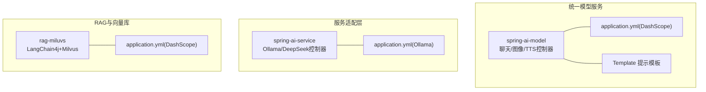
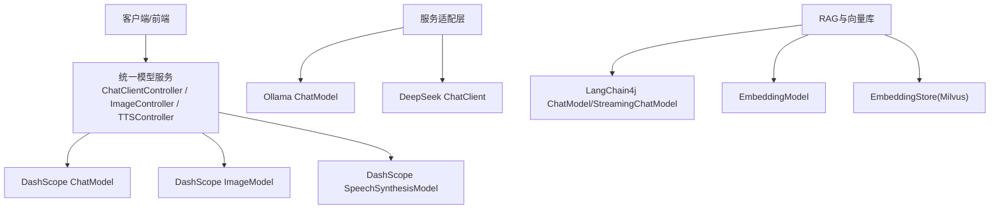
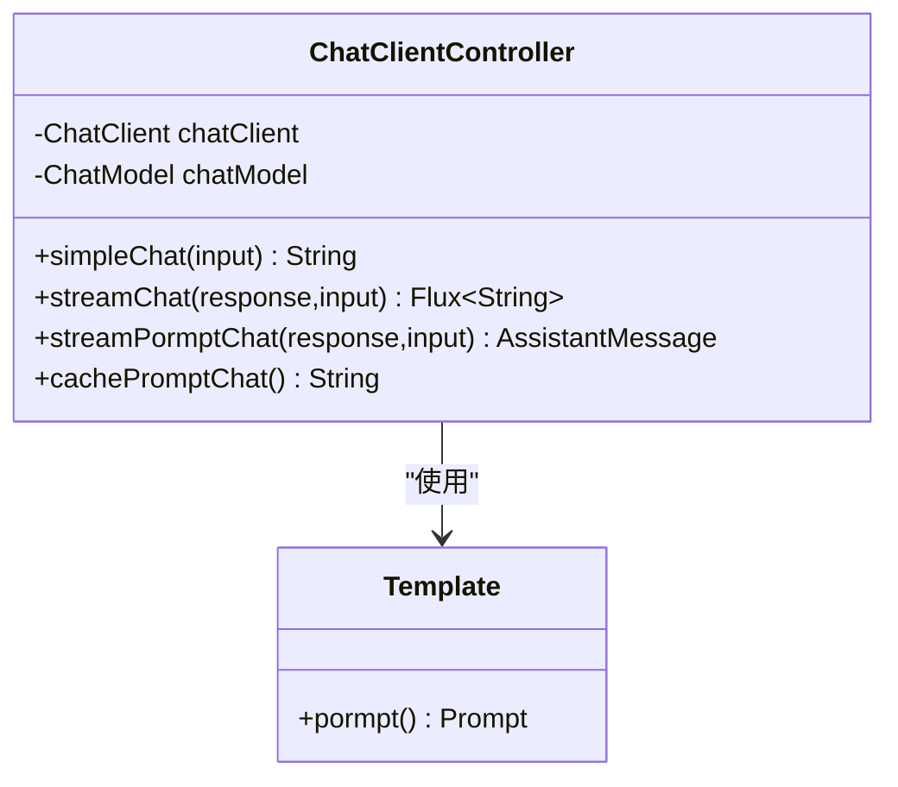
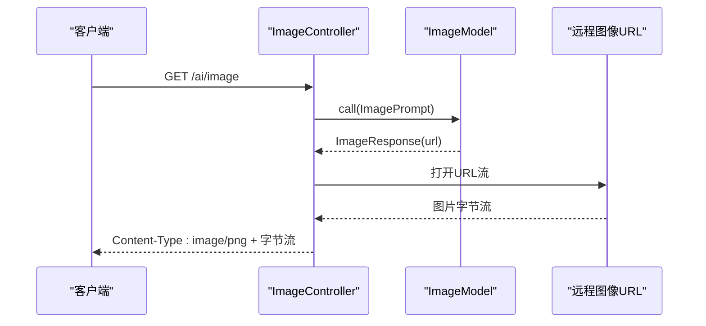
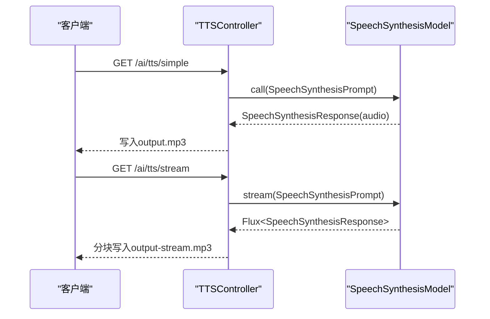
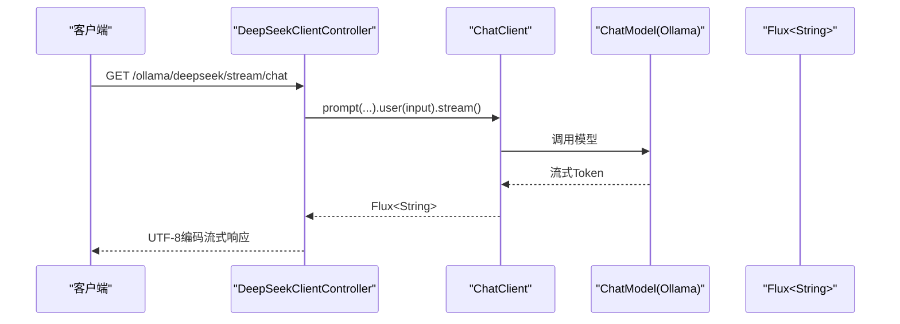
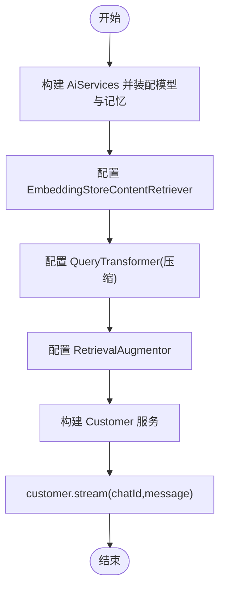
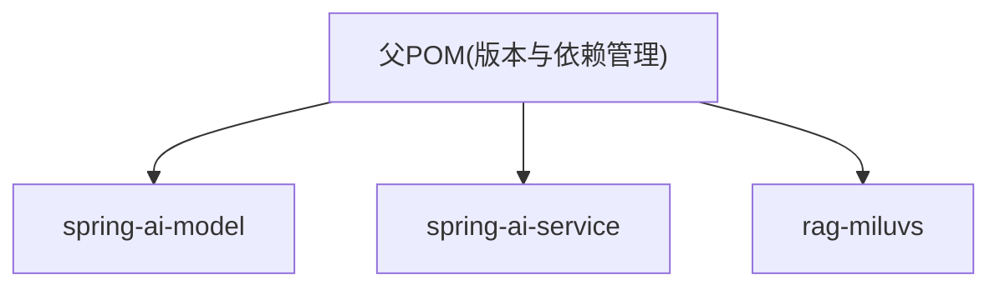

# AI模型架构

<cite>
**本文引用的文件**
- [ChatClientController.java](file://spring-ai-model/src/main/java/cn/project/base/springaimodel/controller/ChatClientController.java)
- [ImageController.java](file://spring-ai-model/src/main/java/cn/project/base/springaimodel/controller/ImageController.java)
- [TTSController.java](file://spring-ai-model/src/main/java/cn/project/base/springaimodel/controller/TTSController.java)
- [Template.java](file://spring-ai-model/src/main/java/cn/project/base/springaimodel/domain/Template.java)
- [application.yml（spring-ai-model）](file://spring-ai-model/src/main/resources/application.yml)
- [OllamaChatModelController.java](file://spring-ai-service/src/main/java/cn/project/base/springaiservice/controller/OllamaChatModelController.java)
- [DeepSeekClientController.java](file://spring-ai-service/src/main/java/cn/project/base/springaiservice/controller/DeepSeekClientController.java)
- [application.yml（spring-ai-service）](file://spring-ai-service/src/main/resources/application.yml)
- [RagService.java](file://rag-miluvs/src/main/java/cn/project/base/ragmiluvs/service/RagService.java)
- [application.yml（rag-miluvs）](file://rag-miluvs/src/main/resources/application.yml)
- [pom.xml](file://pom.xml)
</cite>

## 目录
1. [简介](#简介)
2. [项目结构](#项目结构)
3. [核心组件](#核心组件)
4. [架构总览](#架构总览)
5. [详细组件分析](#详细组件分析)
6. [依赖分析](#依赖分析)
7. [性能考虑](#性能考虑)
8. [故障排查指南](#故障排查指南)
9. [结论](#结论)
10. [附录](#附录)

## 简介
本技术文档围绕AI模型集成架构展开，重点说明Spring AI框架在本仓库中的集成方式与多模型支持架构，覆盖Ollama、DeepSeek、DashScope等不同后端的统一接口设计；深入解析ChatClientController中的模型抽象层、工厂模式思想与动态模型切换机制；阐述图像生成与TTS语音合成的实现架构；详解流式响应处理机制（SSE与Reactor流）；并提供模型配置管理、性能监控与错误处理的最佳实践，以及模型选择策略与成本优化建议。

## 项目结构
本仓库采用多模块聚合工程组织，核心模块包括：
- spring-ai-model：统一的AI能力对外暴露，包含聊天、图像生成、TTS等控制器，以及DashScope相关配置与模板。
- spring-ai-service：面向Ollama与DeepSeek的模型接入示例，展示ChatModel与ChatClient的使用。
- rag-miluvs：LangChain4j+Milvus的RAG实现，演示检索增强生成与流式对话。
- 其他模块：langchain-ai、spring-ai-mcp、spring-ai-mcp-server等，用于扩展与协议对接。

图表来源
- [spring-ai-model/src/main/resources/application.yml:1-10](file://spring-ai-model/src/main/resources/application.yml#L1-L10)
- [spring-ai-service/src/main/resources/application.yml:1-13](file://spring-ai-service/src/main/resources/application.yml#L1-L13)
- [rag-miluvs/src/main/resources/application.yml:1-24](file://rag-miluvs/src/main/resources/application.yml#L1-L24)

章节来源
- [pom.xml:11-22](file://pom.xml#L11-L22)
- [spring-ai-model/src/main/resources/application.yml:1-10](file://spring-ai-model/src/main/resources/application.yml#L1-L10)
- [spring-ai-service/src/main/resources/application.yml:1-13](file://spring-ai-service/src/main/resources/application.yml#L1-L13)
- [rag-miluvs/src/main/resources/application.yml:1-24](file://rag-miluvs/src/main/resources/application.yml#L1-L24)

## 核心组件
- 聊天抽象层（ChatClient/ChatModel）：统一入口封装不同后端模型，支持同步与流式调用，具备默认选项与顾问（Advisor）扩展点。
- 图像生成（ImageModel）：基于文本提示生成图像，返回URL并直接透传图片字节流。
- 语音合成（SpeechSynthesisModel）：支持离线与流式音频输出，可配置语速、音调、音量等参数。
- 提示模板（Template）：封装系统提示与用户提示，便于多轮对话与风格控制。
- RAG服务（LangChain4j）：结合嵌入模型、向量库与检索增强生成，提供流式对话能力。

章节来源
- [ChatClientController.java:38-50](file://spring-ai-model/src/main/java/cn/project/base/springaimodel/controller/ChatClientController.java#L38-L50)
- [ImageController.java:23-25](file://spring-ai-model/src/main/java/cn/project/base/springaimodel/controller/ImageController.java#L23-L25)
- [TTSController.java:39-41](file://spring-ai-model/src/main/java/cn/project/base/springaimodel/controller/TTSController.java#L39-L41)
- [Template.java:12-22](file://spring-ai-model/src/main/java/cn/project/base/springaimodel/domain/Template.java#L12-L22)
- [RagService.java:57-90](file://rag-miluvs/src/main/java/cn/project/base/ragmiluvs/service/RagService.java#L57-L90)

## 架构总览
整体架构由“统一模型服务”“服务适配层”“RAG与向量库”三层组成。统一模型服务通过Spring AI的ChatClient/ChatModel、ImageModel、SpeechSynthesisModel对外提供统一接口；服务适配层分别对接Ollama与DeepSeek，展示不同后端的配置与调用差异；RAG模块通过LangChain4j整合嵌入与向量库，实现检索增强生成与流式对话。

图表来源
- [ChatClientController.java:38-50](file://spring-ai-model/src/main/java/cn/project/base/springaimodel/controller/ChatClientController.java#L38-L50)
- [ImageController.java:23-25](file://spring-ai-model/src/main/java/cn/project/base/springaimodel/controller/ImageController.java#L23-L25)
- [TTSController.java:39-41](file://spring-ai-model/src/main/java/cn/project/base/springaimodel/controller/TTSController.java#L39-L41)
- [OllamaChatModelController.java:12-16](file://spring-ai-service/src/main/java/cn/project/base/springaiservice/controller/OllamaChatModelController.java#L12-L16)
- [DeepSeekClientController.java:21-40](file://spring-ai-service/src/main/java/cn/project/base/springaiservice/controller/DeepSeekClientController.java#L21-L40)
- [RagService.java:57-90](file://rag-miluvs/src/main/java/cn/project/base/ragmiluvs/service/RagService.java#L57-L90)

## 详细组件分析

### ChatClient 控制器与模型抽象层
- 统一入口：通过ChatClient.builder注入ChatModel，构建统一的聊天客户端实例。
- 默认选项：为DashScope模型设置默认参数（如topP），体现“工厂模式”的参数化配置思想。
- 同步与流式：提供/get接口的同步调用与/stream接口的Flux流式调用，统一返回内容。
- 提示模板：通过Template封装系统提示与用户提示，支持多轮对话与风格控制。
- 记忆与顾问：通过MessageChatMemoryAdvisor与SimpleLoggerAdvisor扩展上下文记忆与日志记录。

图表来源
- [ChatClientController.java:38-50](file://spring-ai-model/src/main/java/cn/project/base/springaimodel/controller/ChatClientController.java#L38-L50)
- [Template.java:12-22](file://spring-ai-model/src/main/java/cn/project/base/springaimodel/domain/Template.java#L12-L22)

章节来源
- [ChatClientController.java:38-50](file://spring-ai-model/src/main/java/cn/project/base/springaimodel/controller/ChatClientController.java#L38-L50)
- [ChatClientController.java:55-68](file://spring-ai-model/src/main/java/cn/project/base/springaimodel/controller/ChatClientController.java#L55-L68)
- [ChatClientController.java:94-99](file://spring-ai-model/src/main/java/cn/project/base/springaimodel/controller/ChatClientController.java#L94-L99)
- [ChatClientController.java:107-139](file://spring-ai-model/src/main/java/cn/project/base/springaimodel/controller/ChatClientController.java#L107-L139)
- [Template.java:12-22](file://spring-ai-model/src/main/java/cn/project/base/springaimodel/domain/Template.java#L12-L22)

### 图像生成控制器
- 输入：默认文本提示，可替换为动态参数。
- 输出：从ImageResponse中提取URL，拉取图片字节流并通过HTTP响应直接写出。
- 异常处理：捕获IO异常并返回服务器内部错误状态码。

图表来源
- [ImageController.java:43-59](file://spring-ai-model/src/main/java/cn/project/base/springaimodel/controller/ImageController.java#L43-L59)

章节来源
- [ImageController.java:23-25](file://spring-ai-model/src/main/java/cn/project/base/springaimodel/controller/ImageController.java#L23-L25)
- [ImageController.java:43-59](file://spring-ai-model/src/main/java/cn/project/base/springaimodel/controller/ImageController.java#L43-L59)

### TTS语音合成控制器
- 离线合成：构建DashScopeSpeechSynthesisOptions，调用SpeechSynthesisModel生成音频并写入本地MP3文件。
- 流式合成：使用Flux订阅流式响应，按块写入文件，使用CountDownLatch等待完成信号。
- 生命周期：ApplicationRunner确保输出目录存在，@PreDestroy清理临时文件。

图表来源
- [TTSController.java:43-65](file://spring-ai-model/src/main/java/cn/project/base/springaimodel/controller/TTSController.java#L43-L65)
- [TTSController.java:67-97](file://spring-ai-model/src/main/java/cn/project/base/springaimodel/controller/TTSController.java#L67-L97)

章节来源
- [TTSController.java:39-41](file://spring-ai-model/src/main/java/cn/project/base/springaimodel/controller/TTSController.java#L39-L41)
- [TTSController.java:43-65](file://spring-ai-model/src/main/java/cn/project/base/springaimodel/controller/TTSController.java#L43-L65)
- [TTSController.java:67-97](file://spring-ai-model/src/main/java/cn/project/base/springaimodel/controller/TTSController.java#L67-L97)
- [TTSController.java:99-112](file://spring-ai-model/src/main/java/cn/project/base/springaimodel/controller/TTSController.java#L99-L112)

### Ollama 与 DeepSeek 集成
- OllamaChatModelController：直接注入ChatModel，调用call执行简单问答。
- DeepSeekClientController：通过ChatClient.builder配置MessageChatMemoryAdvisor、SimpleLoggerAdvisor与OllamaOptions（如topP），支持同步与流式调用。

图表来源
- [DeepSeekClientController.java:54-58](file://spring-ai-service/src/main/java/cn/project/base/springaiservice/controller/DeepSeekClientController.java#L54-L58)

章节来源
- [OllamaChatModelController.java:12-16](file://spring-ai-service/src/main/java/cn/project/base/springaiservice/controller/OllamaChatModelController.java#L12-L16)
- [DeepSeekClientController.java:21-40](file://spring-ai-service/src/main/java/cn/project/base/springaiservice/controller/DeepSeekClientController.java#L21-L40)
- [DeepSeekClientController.java:54-58](file://spring-ai-service/src/main/java/cn/project/base/springaiservice/controller/DeepSeekClientController.java#L54-L58)

### RAG 服务与流式对话
- AiServices装配：注入StreamingChatModel与ChatModel，配置MessageWindowChatMemory与ChatMemoryStore。
- 检索增强：EmbeddingStoreContentRetriever结合EmbeddingModel与EmbeddingStore，设置最大结果数与最小相似度。
- 查询压缩：CompressingQueryTransformer将用户问题与上下文压缩为独立查询，提升检索质量。
- 流式输出：返回Flux<String>，前端可接收增量内容。

图表来源
- [RagService.java:57-90](file://rag-miluvs/src/main/java/cn/project/base/ragmiluvs/service/RagService.java#L57-L90)

章节来源
- [RagService.java:57-90](file://rag-miluvs/src/main/java/cn/project/base/ragmiluvs/service/RagService.java#L57-L90)

## 依赖分析
- 版本与依赖管理：父POM统一管理Spring Boot、Spring AI、LangChain4j、Spring AI Alibaba等版本。
- 模块依赖：spring-ai-model与spring-ai-service分别引入DashScope与Ollama的Spring Boot Starter，实现自动装配。
- 日志与调试：各模块application.yml开启相应包的日志级别，便于定位问题。

图表来源
- [pom.xml:36-101](file://pom.xml#L36-L101)

章节来源
- [pom.xml:24-35](file://pom.xml#L24-L35)
- [pom.xml:36-101](file://pom.xml#L36-L101)
- [spring-ai-model/src/main/resources/application.yml:1-10](file://spring-ai-model/src/main/resources/application.yml#L1-L10)
- [spring-ai-service/src/main/resources/application.yml:1-13](file://spring-ai-service/src/main/resources/application.yml#L1-L13)
- [rag-miluvs/src/main/resources/application.yml:1-24](file://rag-miluvs/src/main/resources/application.yml#L1-L24)

## 性能考虑
- 流式响应优先：在长文本与大模型调用场景，优先使用Flux/Reactive流式输出，降低首字节延迟与内存占用。
- 缓存与记忆：合理设置ChatMemory的检索大小与会话ID，避免上下文过长导致的性能下降。
- 参数调优：根据业务场景调整topP、温度、最大令牌数等参数，平衡质量与速度。
- 资源隔离：将图像生成与TTS等I/O密集型任务与CPU密集型推理任务分离，避免相互影响。
- 监控与日志：开启对应包的日志级别，结合指标埋点观察延迟、吞吐与错误率。

## 故障排查指南
- 模型连接失败：检查application.yml中的base-url、API Key与模型名是否正确。
- 流式输出乱码：确认响应字符集设置为UTF-8，前端以正确的编码解析流。
- IO异常：图像生成与TTS写文件时捕获异常并返回服务器内部错误，检查网络可达性与磁盘权限。
- 上下文丢失：确保在使用MessageChatMemoryAdvisor时传入稳定的对话ID与合适的检索大小。
- 日志定位：根据模块application.yml开启对应包的日志级别，快速定位问题。

章节来源
- [ImageController.java:49-58](file://spring-ai-model/src/main/java/cn/project/base/springaimodel/controller/ImageController.java#L49-L58)
- [TTSController.java:99-112](file://spring-ai-model/src/main/java/cn/project/base/springaimodel/controller/TTSController.java#L99-L112)
- [ChatClientController.java:115-138](file://spring-ai-model/src/main/java/cn/project/base/springaimodel/controller/ChatClientController.java#L115-L138)

## 结论
本架构通过Spring AI的统一抽象层，实现了对DashScope、Ollama、DeepSeek等多模型的统一接入与扩展；结合LangChain4j的RAG能力，提供了检索增强与流式对话的完整链路。通过合理的配置管理、流式处理与监控告警，可在保证用户体验的同时实现成本优化与稳定性保障。

## 附录
- 模型选择策略：根据任务类型（对话/生成/语音）与SLA要求（延迟/准确性/成本）选择合适模型；在DashScope与Ollama之间按需切换。
- 成本优化建议：启用流式输出减少等待时间；限制上下文长度与最大令牌数；批量与缓存策略降低重复调用；在低峰期执行大规模嵌入导入。