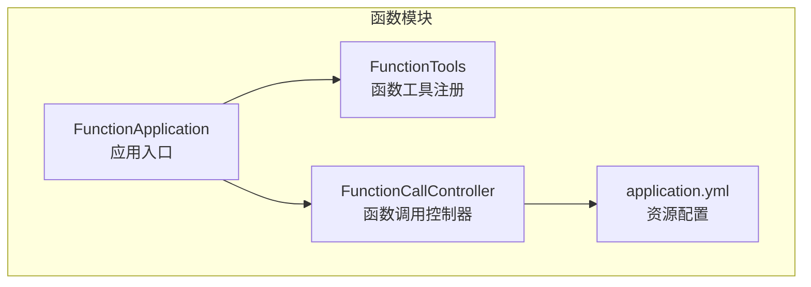
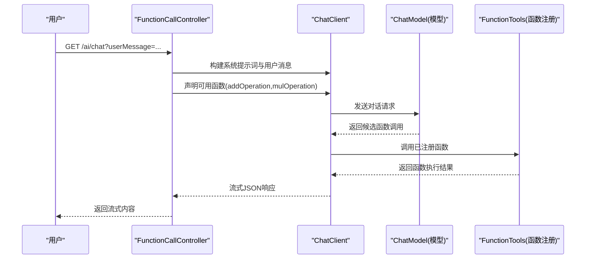
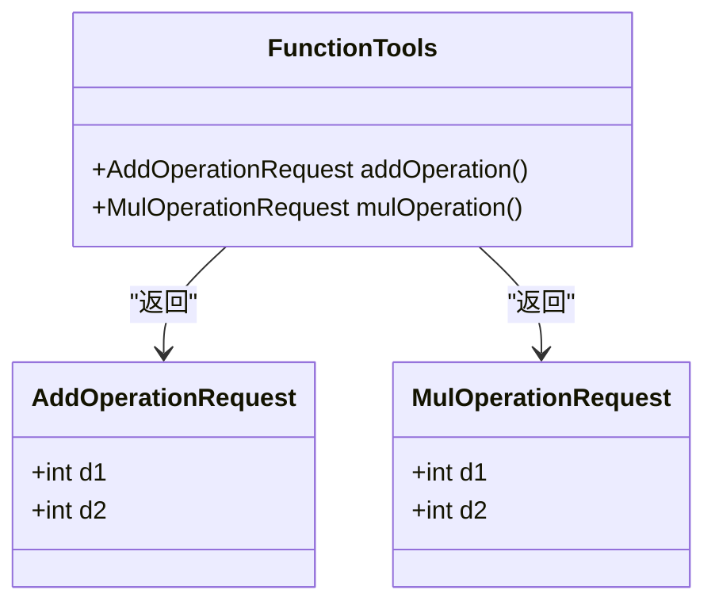
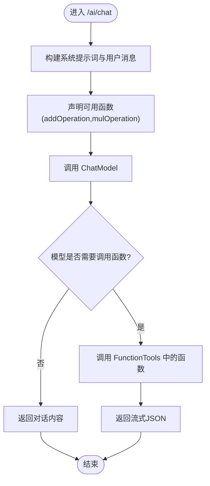
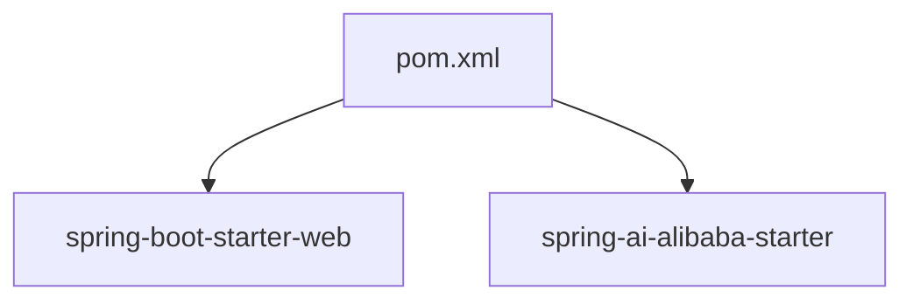

# 函数调用架构

<cite>
**本文档引用的文件**
- [FunctionTools.java](file://function/src/main/java/cn/project/base/function/config/FunctionTools.java)
- [FunctionCallController.java](file://function/src/main/java/cn/project/base/function/controller/FunctionCallController.java)
- [FunctionApplication.java](file://function/src/main/java/cn/project/base/function/FunctionApplication.java)
- [application.yml](file://function/src/main/resources/application.yml)
- [pom.xml](file://function/pom.xml)
</cite>

## 目录
1. [简介](#简介)
2. [项目结构](#项目结构)
3. [核心组件](#核心组件)
4. [架构总览](#架构总览)
5. [详细组件分析](#详细组件分析)
6. [依赖分析](#依赖分析)
7. [性能考虑](#性能考虑)
8. [故障排除指南](#故障排除指南)
9. [结论](#结论)
10. [附录](#附录)

## 简介
本文件面向函数调用系统架构，围绕 FunctionTools 配置类中的函数工具注册机制、FunctionCallController 控制器的 API 设计与执行流程、安全机制（权限控制、输入验证、输出过滤）、异步处理与错误恢复策略，以及自定义函数工具的开发指南与最佳实践进行深入技术解析。同时提供监控指标与性能优化建议，帮助读者快速理解并扩展该系统。

## 项目结构
函数调用模块采用标准 Spring Boot 结构，主要由以下层次组成：
- 配置层：通过 Java 配置类注册函数工具，使用 Spring Bean 容器管理函数实例。
- 控制器层：提供 REST 接口，集成 Spring AI ChatClient 进行函数调用与对话流式响应。
- 应用入口：Spring Boot 启动类负责应用初始化与运行。
- 资源配置：application.yml 提供服务端口与 AI 模型配置。

图表来源
- [FunctionApplication.java:1-14](file://function/src/main/java/cn/project/base/function/FunctionApplication.java#L1-L14)
- [FunctionTools.java:11-39](file://function/src/main/java/cn/project/base/function/config/FunctionTools.java#L11-L39)
- [FunctionCallController.java:25-49](file://function/src/main/java/cn/project/base/function/controller/FunctionCallController.java#L25-L49)
- [application.yml:1-14](file://function/src/main/resources/application.yml#L1-L14)

章节来源
- [FunctionApplication.java:1-14](file://function/src/main/java/cn/project/base/function/FunctionApplication.java#L1-L14)
- [FunctionTools.java:11-39](file://function/src/main/java/cn/project/base/function/config/FunctionTools.java#L11-L39)
- [FunctionCallController.java:25-49](file://function/src/main/java/cn/project/base/function/controller/FunctionCallController.java#L25-L49)
- [application.yml:1-14](file://function/src/main/resources/application.yml#L1-L14)

## 核心组件
- FunctionTools：通过 Spring 配置类注册函数工具，使用 Java 8+ 函数式接口定义工具方法，并以 Bean 形式暴露给容器。工具函数具备参数校验与日志记录能力。
- FunctionCallController：提供 /ai/chat 接口，使用 ChatClient 构建系统提示词与用户消息，启用自定义函数（addOperation、mulOperation），并返回流式 JSON 响应。
- FunctionApplication：Spring Boot 应用入口，启动 Web 服务器与 Spring 上下文。
- application.yml：配置服务端口与 AI 模型参数，支撑 ChatClient 的模型选择与调用。

章节来源
- [FunctionTools.java:11-39](file://function/src/main/java/cn/project/base/function/config/FunctionTools.java#L11-L39)
- [FunctionCallController.java:25-49](file://function/src/main/java/cn/project/base/function/controller/FunctionCallController.java#L25-L49)
- [FunctionApplication.java:1-14](file://function/src/main/java/cn/project/base/function/FunctionApplication.java#L1-L14)
- [application.yml:1-14](file://function/src/main/resources/application.yml#L1-L14)

## 架构总览
系统采用“控制器-函数注册-模型调用”的分层架构。控制器接收用户消息，构建系统提示词与函数可用性声明，交由 ChatClient 调用后端模型；模型根据上下文决定是否调用本地函数工具，最终返回流式响应。

图表来源
- [FunctionCallController.java:33-49](file://function/src/main/java/cn/project/base/function/controller/FunctionCallController.java#L33-L49)
- [FunctionTools.java:21-37](file://function/src/main/java/cn/project/base/function/config/FunctionTools.java#L21-L37)

## 详细组件分析

### FunctionTools：函数工具注册机制
- 工具函数定义
  - 使用 Java 8+ 函数式接口定义工具方法，返回值类型统一为整数，便于模型调用后的数值计算场景。
  - 通过 @Bean 注解将函数注册为 Spring Bean，函数名即为对外暴露的函数标识。
- 参数验证与执行流程
  - 请求对象采用记录类（record）封装参数，具备不可变性与简洁的构造方式。
  - 执行前在日志中记录入参，便于审计与追踪。
  - 函数内部未显式进行边界检查或异常处理，建议在实际业务中补充参数范围校验与异常捕获。
- 工具扩展
  - 可按需新增工具函数，遵循相同命名与注解规范，确保与 ChatClient 的函数声明一致。

图表来源
- [FunctionTools.java:15-37](file://function/src/main/java/cn/project/base/function/config/FunctionTools.java#L15-L37)

章节来源
- [FunctionTools.java:11-39](file://function/src/main/java/cn/project/base/function/config/FunctionTools.java#L11-L39)

### FunctionCallController：API 设计与执行流程
- 接口设计
  - 路径：/ai/chat
  - 方法：GET
  - 参数：userMessage（用户输入）
  - 响应：流式 JSON（APPLICATION_STREAM_JSON_VALUE）
- 参数传递与结果返回
  - 控制器通过 ChatClient 构建系统提示词与用户消息，声明可用函数列表。
  - 调用完成后提取内容作为流式响应返回给客户端。
- 内部 HTTP 客户端示例
  - 提供了基于 Apache HttpClient 的示例代码，展示如何向外部服务发起请求，可作为集成其他服务的参考。

图表来源
- [FunctionCallController.java:33-49](file://function/src/main/java/cn/project/base/function/controller/FunctionCallController.java#L33-L49)

章节来源
- [FunctionCallController.java:25-49](file://function/src/main/java/cn/project/base/function/controller/FunctionCallController.java#L25-L49)

### 安全机制
- 权限控制
  - 当前控制器未实现显式的鉴权逻辑，建议在生产环境增加基于角色或令牌的访问控制。
- 输入验证
  - 控制器未对 userMessage 进行严格校验，建议增加长度限制、字符集过滤与敏感词检测。
- 输出过滤
  - 未实现输出内容的二次过滤，建议在返回前对模型生成内容进行白名单过滤与脱敏处理。
- 日志与审计
  - 已在函数工具中记录调用日志，建议扩展到控制器层，记录请求参数与响应摘要。

章节来源
- [FunctionCallController.java:33-49](file://function/src/main/java/cn/project/base/function/controller/FunctionCallController.java#L33-L49)
- [FunctionTools.java:23-36](file://function/src/main/java/cn/project/base/function/config/FunctionTools.java#L23-L36)

### 异步处理与错误恢复
- 异步处理
  - 当前实现为同步阻塞调用，未使用异步线程池或响应式编程模型。
  - 建议引入异步执行与超时控制，避免长时间阻塞导致的资源占用。
- 错误恢复
  - 未实现显式的重试与降级策略，建议在 ChatClient 调用失败时进行指数退避重试与备用模型切换。
  - 对函数调用异常进行捕获与回退处理，确保服务稳定性。

章节来源
- [FunctionCallController.java:33-49](file://function/src/main/java/cn/project/base/function/controller/FunctionCallController.java#L33-L49)

### 自定义函数工具开发指南与最佳实践
- 开发步骤
  - 在 FunctionTools 中新增 @Bean 方法，返回 Function<请求类型, 返回类型>。
  - 请求类型使用记录类封装参数，保持不可变与清晰的字段定义。
  - 在方法体内实现业务逻辑，并记录必要的日志。
- 最佳实践
  - 参数校验：对关键参数进行范围与类型校验，必要时抛出明确异常。
  - 错误处理：捕获并包装异常，返回统一的错误码与消息格式。
  - 性能优化：避免在函数内进行重型 IO 或 CPU 密集操作，必要时拆分为独立任务。
  - 可观测性：为每个函数增加监控埋点，记录耗时、成功率与错误类型。

章节来源
- [FunctionTools.java:11-39](file://function/src/main/java/cn/project/base/function/config/FunctionTools.java#L11-L39)

## 依赖分析
函数模块依赖 Spring Boot Web 与 Spring AI Alibaba Starter，用于提供 Web 服务与 AI 模型集成能力。

图表来源
- [pom.xml:23-43](file://function/pom.xml#L23-L43)

章节来源
- [pom.xml:1-85](file://function/pom.xml#L1-L85)

## 性能考虑
- 并发与资源
  - 控制器未设置线程池或连接池参数，建议在高并发场景下增加连接复用与限流策略。
- 模型调用
  - ChatClient 默认同步调用，建议评估异步化与缓存策略，减少重复请求。
- 函数执行
  - 将重型计算迁移至专用服务或队列，避免阻塞主线程。
- 监控指标
  - 建议采集以下指标：请求量、响应时间、错误率、函数调用次数与耗时分布。

[本节为通用性能建议，无需特定文件引用]

## 故障排除指南
- 常见问题
  - 函数未被识别：确认函数名称与 ChatClient 声明一致，且已在 Spring 容器中注册。
  - 模型调用失败：检查 AI 服务配置与网络连通性，确认 API Key 有效。
  - 响应为空：排查系统提示词与用户消息是否触发函数调用，或模型是否返回空内容。
- 排查步骤
  - 查看控制器日志与函数工具日志，定位调用链路。
  - 使用最小化请求复现问题，逐步缩小范围。
  - 增加超时与重试策略，观察是否为瞬时网络波动导致。

章节来源
- [FunctionCallController.java:25-49](file://function/src/main/java/cn/project/base/function/controller/FunctionCallController.java#L25-L49)
- [FunctionTools.java:23-36](file://function/src/main/java/cn/project/base/function/config/FunctionTools.java#L23-L36)

## 结论
该函数调用系统以 Spring Boot 为基础，结合 Spring AI ChatClient 实现了函数工具的注册与调用。当前实现简洁清晰，适合快速原型与演示场景。建议在生产环境中完善安全控制、输入输出过滤、异步处理与错误恢复机制，并建立完善的监控与告警体系，以提升系统的稳定性与可观测性。

[本节为总结性内容，无需特定文件引用]

## 附录
- 配置项说明
  - server.port：服务监听端口，默认 8080。
  - spring.application.name：应用名称，用于服务发现与日志标识。
  - spring.ai.dashscope.api-key：DashScope API Key，用于模型调用。
  - spring.ai.dashscope.chat.options.model：默认模型名称，如 qwen-plus。

章节来源
- [application.yml:1-14](file://function/src/main/resources/application.yml#L1-L14)