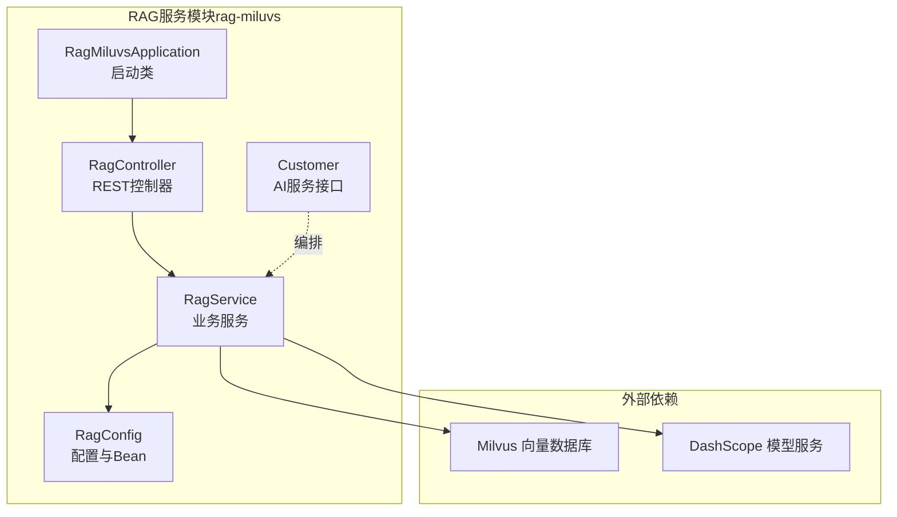
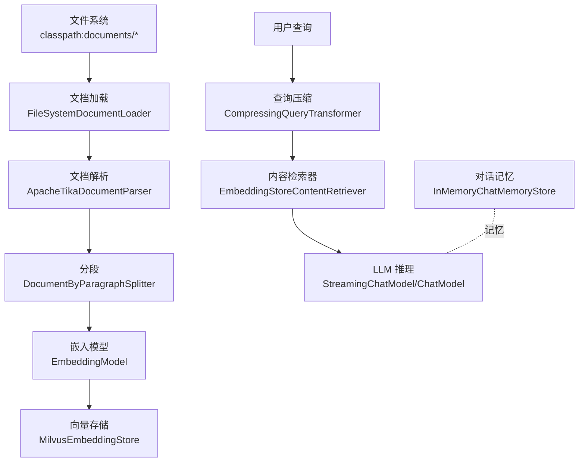
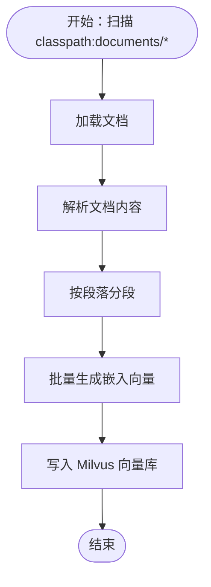
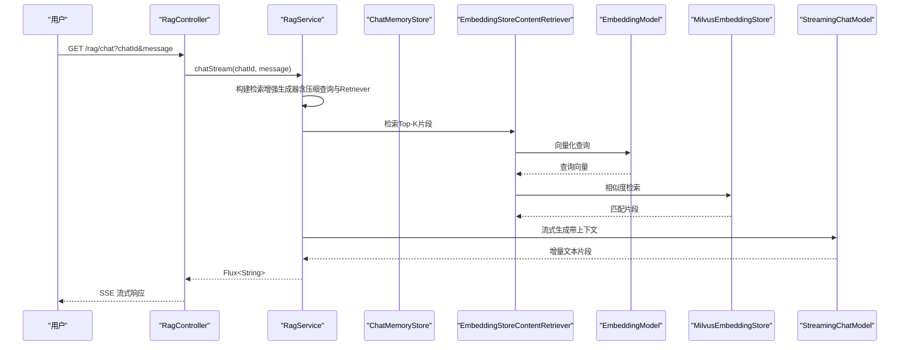
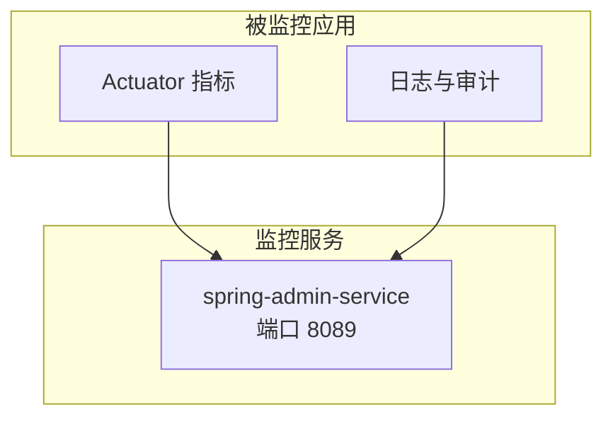
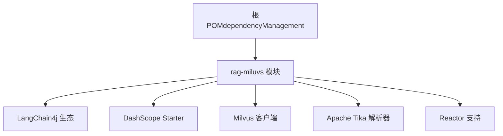

# 数据流架构

<cite>
**本文引用的文件**
- [RagMiluvsApplication.java](file://rag-miluvs/src/main/java/cn/project/base/ragmiluvs/RagMiluvsApplication.java)
- [RagController.java](file://rag-miluvs/src/main/java/cn/project/base/ragmiluvs/controller/RagController.java)
- [RagService.java](file://rag-miluvs/src/main/java/cn/project/base/ragmiluvs/service/RagService.java)
- [Customer.java](file://rag-miluvs/src/main/java/cn/project/base/ragmiluvs/service/Customer.java)
- [RagConfig.java](file://rag-miluvs/src/main/java/cn/project/base/ragmiluvs/config/RagConfig.java)
- [application.yml（rag-miluvs）](file://rag-miluvs/src/main/resources/application.yml)
- [application.yml（spring-admin-service）](file://spring-admin-service/src/main/resources/application.yml)
- [pom.xml（根工程）](file://pom.xml)
- [pom.xml（rag-miluvs 模块）](file://rag-miluvs/pom.xml)
</cite>

## 目录
1. [引言](#引言)
2. [项目结构](#项目结构)
3. [核心组件](#核心组件)
4. [架构总览](#架构总览)
5. [详细组件分析](#详细组件分析)
6. [依赖分析](#依赖分析)
7. [性能考虑](#性能考虑)
8. [故障排查指南](#故障排查指南)
9. [结论](#结论)
10. [附录](#附录)

## 引言
本文件面向RAG系统的数据流架构，聚焦两条主线：
- 文档导入流程：从文件系统读取文档，经解析、分段、向量化，最终写入向量数据库（Milvus）的完整数据路径。
- 问答处理流程：用户查询经压缩变换、相似度检索、上下文构建，再由LLM进行流式推理输出的连续数据处理。
同时覆盖监控数据流的采集与展示、数据缓存与一致性策略、安全与合规要点，并给出可操作的性能优化建议。

## 项目结构
该仓库采用多模块聚合工程组织，RAG能力集中在 rag-miluvs 模块，通过Spring Boot启动入口暴露REST接口，使用LangChain4j进行RAG编排，Milvus作为向量存储，DashScope提供嵌入与对话模型服务。

图表来源
- [RagMiluvsApplication.java:1-14](file://rag-miluvs/src/main/java/cn/project/base/ragmiluvs/RagMiluvsApplication.java#L1-L14)
- [RagController.java:1-29](file://rag-miluvs/src/main/java/cn/project/base/ragmiluvs/controller/RagController.java#L1-L29)
- [RagService.java:1-118](file://rag-miluvs/src/main/java/cn/project/base/ragmiluvs/service/RagService.java#L1-L118)
- [RagConfig.java:1-55](file://rag-miluvs/src/main/java/cn/project/base/ragmiluvs/config/RagConfig.java#L1-L55)

章节来源
- [pom.xml（根工程）:11-22](file://pom.xml#L11-L22)
- [application.yml（rag-miluvs）:1-24](file://rag-miluvs/src/main/resources/application.yml#L1-L24)

## 核心组件
- 启动类：负责模块引导与上下文加载。
- 控制器：对外提供“初始化向量库”和“流式问答”的HTTP端点。
- 服务层：封装RAG主流程与文档导入流程；通过LangChain4j的检索增强生成器、嵌入模型、内容检索器与压缩查询转换器协同工作。
- 配置类：定义Milvus连接参数、集合字段映射、一致性级别等；注册内存对话存储与Milvus嵌入存储。
- AI服务接口：以注解驱动的方式声明系统提示词与用户消息，配合流式模型返回增量文本。

章节来源
- [RagMiluvsApplication.java:1-14](file://rag-miluvs/src/main/java/cn/project/base/ragmiluvs/RagMiluvsApplication.java#L1-L14)
- [RagController.java:1-29](file://rag-miluvs/src/main/java/cn/project/base/ragmiluvs/controller/RagController.java#L1-L29)
- [RagService.java:35-118](file://rag-miluvs/src/main/java/cn/project/base/ragmiluvs/service/RagService.java#L35-L118)
- [RagConfig.java:17-55](file://rag-miluvs/src/main/java/cn/project/base/ragmiluvs/config/RagConfig.java#L17-L55)
- [Customer.java:8-17](file://rag-miluvs/src/main/java/cn/project/base/ragmiluvs/service/Customer.java#L8-L17)

## 架构总览
下图展示了RAG系统在数据层面的关键交互：文件系统→解析与分段→嵌入生成→向量入库→查询→检索→上下文构建→LLM流式生成。

图表来源
- [RagService.java:95-116](file://rag-miluvs/src/main/java/cn/project/base/ragmiluvs/service/RagService.java#L95-L116)
- [RagService.java:57-90](file://rag-miluvs/src/main/java/cn/project/base/ragmiluvs/service/RagService.java#L57-L90)
- [RagConfig.java:32-53](file://rag-miluvs/src/main/java/cn/project/base/ragmiluvs/config/RagConfig.java#L32-L53)

## 详细组件分析

### 文档导入流程（从文件系统到向量存储）
- 输入：classpath:documents/* 下的各类文档资源。
- 处理链路：
  - 加载：从文件系统加载为文档对象。
  - 解析：使用Apache Tika解析器提取文本。
  - 分段：按段落切分为TextSegment列表。
  - 嵌入：调用EmbeddingModel批量生成向量。
  - 写入：将向量与元数据写入Milvus。
- 关键参数：分段长度、重叠、向量维度、索引类型、度量方式、一致性级别等均在配置中定义。

图表来源
- [RagService.java:95-116](file://rag-miluvs/src/main/java/cn/project/base/ragmiluvs/service/RagService.java#L95-L116)
- [RagConfig.java:32-53](file://rag-miluvs/src/main/java/cn/project/base/ragmiluvs/config/RagConfig.java#L32-L53)

章节来源
- [RagService.java:95-116](file://rag-miluvs/src/main/java/cn/project/base/ragmiluvs/service/RagService.java#L95-L116)
- [application.yml（rag-miluvs）:7-23](file://rag-miluvs/src/main/resources/application.yml#L7-L23)

### 问答处理流程（查询→检索→上下文→LLM）
- 输入：用户查询与会话ID。
- 处理链路：
  - 查询压缩：使用压缩查询转换器将历史对话与当前问题压缩为高质量查询。
  - 相似度检索：基于EmbeddingStoreContentRetriever在Milvus中检索Top-K高分片段。
  - 上下文构建：将检索结果注入到LangChain4j的检索增强生成器中。
  - LLM推理：通过StreamingChatModel进行流式输出，结合MessageWindowChatMemory维护会话。
- 输出：SSE流式返回增量文本。

图表来源
- [RagController.java:24-27](file://rag-miluvs/src/main/java/cn/project/base/ragmiluvs/controller/RagController.java#L24-L27)
- [RagService.java:57-90](file://rag-miluvs/src/main/java/cn/project/base/ragmiluvs/service/RagService.java#L57-L90)
- [Customer.java:8-17](file://rag-miluvs/src/main/java/cn/project/base/ragmiluvs/service/Customer.java#L8-L17)

章节来源
- [RagController.java:18-27](file://rag-miluvs/src/main/java/cn/project/base/ragmiluvs/controller/RagController.java#L18-L27)
- [RagService.java:57-90](file://rag-miluvs/src/main/java/cn/project/base/ragmiluvs/service/RagService.java#L57-L90)
- [RagConfig.java:26-29](file://rag-miluvs/src/main/java/cn/project/base/ragmiluvs/config/RagConfig.java#L26-L29)

### 监控数据流（采集、传输与可视化）
- 应用状态采集：各模块通过Spring Boot Actuator暴露健康检查、指标与运行状态。
- 传输与可视化：spring-admin-service提供管理端点，spring-admin-client用于客户端侧监控集成与展示。
- 端口与命名：管理服务默认端口8089，可通过配置调整。

图表来源
- [application.yml（spring-admin-service）:1-6](file://spring-admin-service/src/main/resources/application.yml#L1-L6)

章节来源
- [application.yml（spring-admin-service）:1-6](file://spring-admin-service/src/main/resources/application.yml#L1-L6)

## 依赖分析
- 聚合工程：根POM统一管理Spring Boot、Spring AI、LangChain4j与第三方依赖版本。
- rag-miluvs 模块：
  - LangChain4j生态：核心RAG编排、嵌入模型、文档解析、Milvus存储适配、Reactor响应式支持。
  - DashScope集成：嵌入与对话模型服务。
  - Milvus：向量存储后端，配置索引类型、度量方式、一致性级别与字段映射。

图表来源
- [pom.xml（根工程）:36-101](file://pom.xml#L36-L101)
- [pom.xml（rag-miluvs 模块）:70-95](file://rag-miluvs/pom.xml#L70-L95)

章节来源
- [pom.xml（根工程）:24-101](file://pom.xml#L24-L101)
- [pom.xml（rag-miluvs 模块）:70-95](file://rag-miluvs/pom.xml#L70-L95)

## 性能考虑
- 向量检索优化
  - 调整检索参数：maxResults（Top-K）、minScore（阈值），平衡召回与速度。
  - 索引与度量：根据数据规模选择合适IndexType与MetricType，必要时启用更高阶索引。
  - 批量写入：导入阶段使用批量嵌入与批量插入，减少网络往返。
- 文档预处理
  - 分段策略：控制段长与重叠，兼顾语义完整性与检索精度。
  - 解析器选择：优先使用稳定高效的Apache Tika解析器，避免大文件导致内存压力。
- LLM与流式输出
  - 使用StreamingChatModel进行增量输出，降低首字延迟。
  - 压缩查询变换：提升检索质量，间接减少无关上下文带来的推理开销。
- 存储与一致性
  - ConsistencyLevel：根据实时性要求选择最终一致或更强一致性。
  - 自动刷新：insert后自动flush简化写入流程，但可能影响吞吐，可按场景权衡。
- 并发与限流
  - 控制并发请求与检索并发度，避免向量库与模型服务过载。
- 日志与观测
  - 结合Actuator指标与日志采样，定位慢查询与异常路径。

## 故障排查指南
- 文档导入失败
  - 症状：导入日志报错或未写入向量库。
  - 排查：确认classpath:documents/*是否存在有效文件；检查解析器兼容性；核对嵌入维度与Milvus字段映射一致。
- 检索命中率低
  - 症状：问答结果不相关或无关片段过多。
  - 排查：调整minScore与maxResults；评估分段粒度；确认压缩查询是否生效。
- 流式输出中断
  - 症状：SSE响应提前结束或无增量输出。
  - 排查：检查StreamingChatModel可用性与网络连通；确认RagService构建的检索增强生成器配置正确。
- 向量库连接异常
  - 症状：连接超时或无法建立集合。
  - 排查：核对Milvus主机与端口配置；确认网络可达与防火墙放行；检查API Key与鉴权设置。
- 监控不可见
  - 症状：管理端无法看到应用状态。
  - 排查：确认Actuator端点已启用；spring-admin-service端口与访问路径正确；客户端配置与服务端一致。

章节来源
- [RagService.java:112-116](file://rag-miluvs/src/main/java/cn/project/base/ragmiluvs/service/RagService.java#L112-L116)
- [RagConfig.java:20-23](file://rag-miluvs/src/main/java/cn/project/base/ragmiluvs/config/RagConfig.java#L20-L23)
- [application.yml（spring-admin-service）:4-6](file://spring-admin-service/src/main/resources/application.yml#L4-L6)

## 结论
本架构以LangChain4j为核心编排RAG流程，结合DashScope提供嵌入与对话能力，Milvus承载高维向量检索，通过SSE实现流式问答输出。文档导入与问答处理两条主数据流清晰分离，便于分别优化与治理。通过合理的分段策略、检索参数与存储配置，可在准确性与性能之间取得良好平衡。结合Spring Boot Admin实现可观测性，有助于持续改进系统稳定性与用户体验。

## 附录
- 数据缓存策略
  - 对话记忆：使用内存ChatMemoryStore短期缓存会话上下文，适合单实例部署；生产环境建议替换为分布式存储。
  - 向量库：Milvus内置缓存与索引，结合批量写入与flush策略提升吞吐。
- 数据一致性
  - 写入：autoFlushOnInsert开启时，插入即刷新；关闭时可合并刷新，提升吞吐。
  - 读取：ConsistencyLevel可选EVENTUALLY等，依据实时性需求权衡。
- 数据安全
  - API密钥：通过配置文件集中管理，避免硬编码；建议使用环境变量或密钥管理服务。
  - 网络：限制Milvus与DashScope访问白名单；启用TLS与认证。
  - 日志：脱敏敏感字段，控制日志级别，避免泄露上下文与密钥。