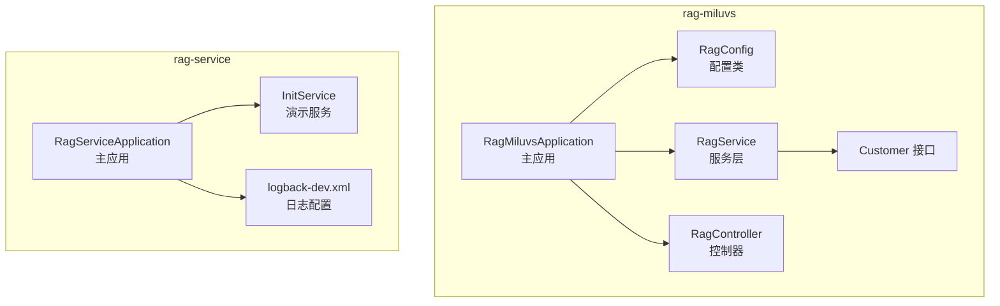
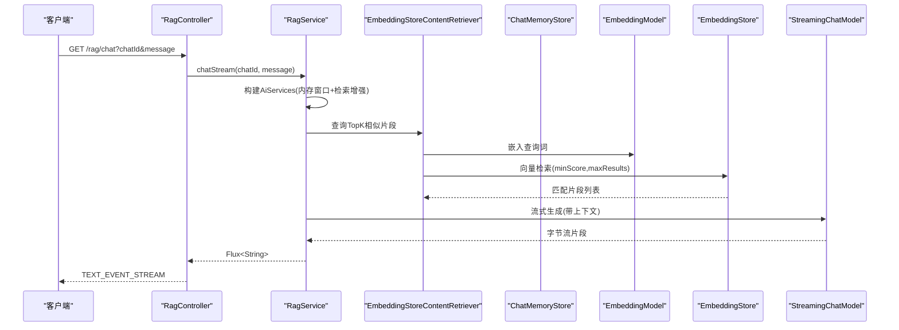
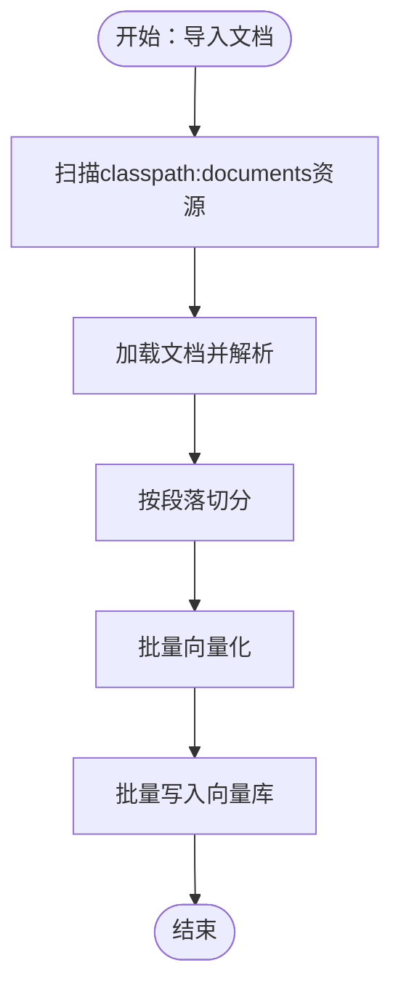
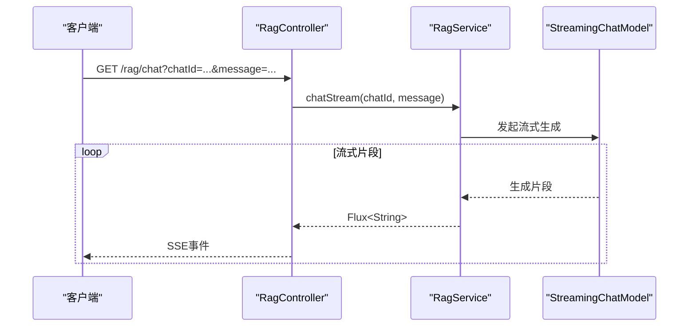
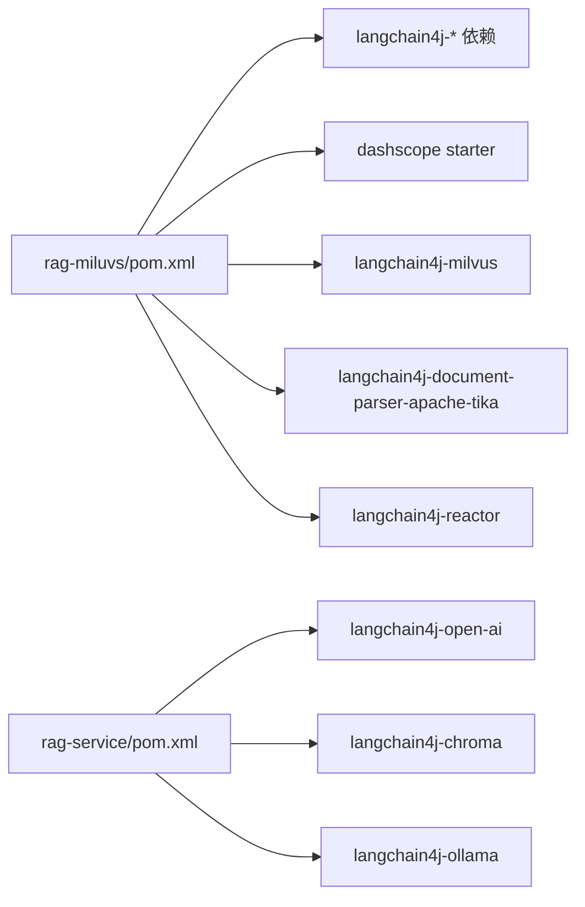

# 核心服务架构

<cite>
**本文引用的文件**
- [RagMiluvsApplication.java](file://rag-miluvs/src/main/java/cn/project/base/ragmiluvs/RagMiluvsApplication.java)
- [RagConfig.java](file://rag-miluvs/src/main/java/cn/project/base/ragmiluvs/config/RagConfig.java)
- [RagService.java](file://rag-miluvs/src/main/java/cn/project/base/ragmiluvs/service/RagService.java)
- [RagController.java](file://rag-miluvs/src/main/java/cn/project/base/ragmiluvs/controller/RagController.java)
- [Customer.java](file://rag-miluvs/src/main/java/cn/project/base/ragmiluvs/service/Customer.java)
- [application.yml](file://rag-miluvs/src/main/resources/application.yml)
- [RagServiceApplication.java](file://rag-service/src/main/java/cn/project/base/ragservice/RagServiceApplication.java)
- [InitService.java](file://rag-service/src/main/java/cn/project/base/ragservice/service/InitService.java)
- [application.yml](file://rag-service/src/main/resources/application.yml)
- [logback-dev.xml](file://rag-service/src/main/resources/logback-dev.xml)
- [pom.xml（rag-miluvs）](file://rag-miluvs/pom.xml)
- [pom.xml（rag-service）](file://rag-service/pom.xml)
</cite>

## 目录
1. [引言](#引言)
2. [项目结构](#项目结构)
3. [核心组件](#核心组件)
4. [架构总览](#架构总览)
5. [详细组件分析](#详细组件分析)
6. [依赖分析](#依赖分析)
7. [性能考虑](#性能考虑)
8. [故障排查指南](#故障排查指南)
9. [结论](#结论)
10. [附录](#附录)

## 引言
本技术文档聚焦于RAG核心服务架构，围绕以下目标展开：  
- 深入解析RagServiceApplication主应用类的设计与启动流程  
- 详解RagConfig配置类中的向量数据库配置、聊天记忆配置与嵌入模型配置  
- 阐述RagService服务层核心算法：文档向量化、相似度检索、上下文构建与问答生成  
- 解释RagController控制器层的REST API设计与SSE流式响应机制  
- 提供核心组件交互关系图与数据流转图  
- 给出配置参数说明、性能优化策略与故障处理机制  

## 项目结构
本仓库包含多个子模块，其中与RAG核心相关的模块为：
- rag-miluvs：采用LangChain4j与Milvus的RAG实现，提供REST接口与SSE流式返回
- rag-service：包含演示性的InitService与日志配置，展示从文档到向量库再到检索与问答的完整链路

图表来源
- [RagMiluvsApplication.java:1-14](file://rag-miluvs/src/main/java/cn/project/base/ragmiluvs/RagMiluvsApplication.java#L1-L14)
- [RagConfig.java:1-55](file://rag-miluvs/src/main/java/cn/project/base/ragmiluvs/config/RagConfig.java#L1-L55)
- [RagService.java:1-118](file://rag-miluvs/src/main/java/cn/project/base/ragmiluvs/service/RagService.java#L1-L118)
- [RagController.java:1-29](file://rag-miluvs/src/main/java/cn/project/base/ragmiluvs/controller/RagController.java#L1-L29)
- [Customer.java:1-17](file://rag-miluvs/src/main/java/cn/project/base/ragmiluvs/service/Customer.java#L1-L17)
- [RagServiceApplication.java:1-14](file://rag-service/src/main/java/cn/project/base/ragservice/RagServiceApplication.java#L1-L14)
- [InitService.java:1-153](file://rag-service/src/main/java/cn/project/base/ragservice/service/InitService.java#L1-L153)
- [logback-dev.xml:1-208](file://rag-service/src/main/resources/logback-dev.xml#L1-L208)

章节来源
- [RagMiluvsApplication.java:1-14](file://rag-miluvs/src/main/java/cn/project/base/ragmiluvs/RagMiluvsApplication.java#L1-L14)
- [RagServiceApplication.java:1-14](file://rag-service/src/main/java/cn/project/base/ragservice/RagServiceApplication.java#L1-L14)

## 核心组件
- 主应用与启动
  - rag-miluvs：通过Spring Boot启动，暴露HTTP与WebFlux能力，配合LangChain4j生态
  - rag-service：提供演示性InitService与日志配置，展示端到端RAG流程
- 配置中心
  - rag-miluvs：通过application.yml注入Milvus地址、LangChain4j DashScope模型参数
  - rag-service：通过application.yml设置应用名与日志配置，logback-dev.xml定义滚动日志策略
- 服务层
  - rag-miluvs：RagService封装RAG主流程，包含文档导入、向量化、检索与流式问答
  - rag-service：InitService演示从文档加载、切分、向量化、写入Chroma、检索与问答
- 控制器层
  - rag-miluvs：提供/dbinit初始化向量库与/chat SSE流式问答接口

章节来源
- [application.yml:1-24](file://rag-miluvs/src/main/resources/application.yml#L1-L24)
- [application.yml:1-9](file://rag-service/src/main/resources/application.yml#L1-L9)
- [logback-dev.xml:1-208](file://rag-service/src/main/resources/logback-dev.xml#L1-L208)
- [RagService.java:1-118](file://rag-miluvs/src/main/java/cn/project/base/ragmiluvs/service/RagService.java#L1-L118)
- [RagController.java:1-29](file://rag-miluvs/src/main/java/cn/project/base/ragmiluvs/controller/RagController.java#L1-L29)

## 架构总览
下图展示了RAG核心服务在rag-miluvs中的整体交互：控制器接收请求，调用服务层，服务层通过LangChain4j的检索增强生成（RAG）流程，结合嵌入模型、向量数据库与聊天模型，最终以SSE流式返回。

图表来源
- [RagController.java:24-27](file://rag-miluvs/src/main/java/cn/project/base/ragmiluvs/controller/RagController.java#L24-L27)
- [RagService.java:57-90](file://rag-miluvs/src/main/java/cn/project/base/ragmiluvs/service/RagService.java#L57-L90)
- [RagConfig.java:31-53](file://rag-miluvs/src/main/java/cn/project/base/ragmiluvs/config/RagConfig.java#L31-L53)

## 详细组件分析

### 主应用类：RagServiceApplication 与 RagMiluvsApplication
- 设计要点
  - 采用Spring Boot注解声明式启动，简化容器装配
  - 将应用作为Spring上下文入口，交由容器管理Bean与自动配置
- 启动流程
  - 读取application.yml配置，加载LangChain4j与DashScope等外部依赖
  - 初始化RagConfig中定义的Bean（如ChatMemoryStore、EmbeddingStore）
  - 启动Web与WebFlux，暴露REST与SSE端点

章节来源
- [RagServiceApplication.java:1-14](file://rag-service/src/main/java/cn/project/base/ragservice/RagServiceApplication.java#L1-L14)
- [RagMiluvsApplication.java:1-14](file://rag-miluvs/src/main/java/cn/project/base/ragmiluvs/RagMiluvsApplication.java#L1-L14)

### 配置类：RagConfig
- 职责
  - 定义聊天记忆存储（InMemoryChatMemoryStore）
  - 构建Milvus向量数据库连接与集合参数（集合名、维度、索引类型、度量方式、一致性级别等）
- 关键参数说明
  - milvus.host/port：Milvus服务地址与端口
  - collectionName/dimension/indexType/metricType：向量集合的命名与特征空间参数
  - consistencyLevel：查询一致性级别
  - autoFlushOnInsert：插入后是否自动刷新
  - id/text/metadata/vector字段名：向量库字段映射
- 依赖注入
  - ChatMemoryStore与EmbeddingStore作为Spring Bean供服务层使用

章节来源
- [RagConfig.java:1-55](file://rag-miluvs/src/main/java/cn/project/base/ragmiluvs/config/RagConfig.java#L1-L55)
- [application.yml:7-23](file://rag-miluvs/src/main/resources/application.yml#L7-L23)

### 服务层：RagService
- 核心算法流程
  - 文档导入与向量化
    - 扫描classpath:documents目录下的资源
    - 使用Apache Tika解析文档，按段落切分
    - 通过EmbeddingModel生成向量，批量写入EmbeddingStore
  - 相似度检索
    - 使用EmbeddingStoreContentRetriever执行向量检索
    - 参数：maxResults、minScore控制召回数量与相似度阈值
  - 上下文构建与问答生成
    - 通过CompressingQueryTransformer将用户问题与历史消息压缩为独立查询
    - 使用DefaultRetrievalAugmentor整合检索结果与查询
    - 通过AiServices绑定StreamingChatModel与ChatMemoryStore，实现流式生成
- 数据结构与复杂度
  - 文档切分：O(n)遍历与切分
  - 向量化：O(m)批量嵌入（m为切片数）
  - 检索：取决于向量库实现与索引类型，通常为近似最近邻搜索
- 错误处理
  - 导入流程包含try-catch捕获异常，便于定位I/O或解析错误

图表来源
- [RagService.java:95-116](file://rag-miluvs/src/main/java/cn/project/base/ragmiluvs/service/RagService.java#L95-L116)

章节来源
- [RagService.java:1-118](file://rag-miluvs/src/main/java/cn/project/base/ragmiluvs/service/RagService.java#L1-L118)

### 控制器层：RagController
- REST API设计
  - GET /rag/dbinit：触发文档导入流程
  - GET /rag/chat（SSE）：流式问答接口，支持chatId会话标识
- SSE流式响应
  - 返回类型为Flux<String>，由StreamingChatModel驱动的AiServices逐步产生片段
  - 客户端以TEXT_EVENT_STREAM持续接收增量输出

图表来源
- [RagController.java:24-27](file://rag-miluvs/src/main/java/cn/project/base/ragmiluvs/controller/RagController.java#L24-L27)
- [RagService.java:57-90](file://rag-miluvs/src/main/java/cn/project/base/ragmiluvs/service/RagService.java#L57-L90)

章节来源
- [RagController.java:1-29](file://rag-miluvs/src/main/java/cn/project/base/ragmiluvs/controller/RagController.java#L1-L29)

### 演示服务：InitService（来自rag-service）
- 展示从文档到向量库再到问答的完整链路
  - 文档加载与切分：基于行的切分策略
  - 向量化与写入：使用Ollama EmbeddingModel与ChromaEmbeddingStore
  - 检索与问答：构造Prompt模板，调用Ollama ChatModel生成回答
- 适用场景
  - 本地开发与演示，便于理解RAG各环节的衔接

章节来源
- [InitService.java:1-153](file://rag-service/src/main/java/cn/project/base/ragservice/service/InitService.java#L1-L153)

## 依赖分析
- rag-miluvs
  - Web/WebFlux：提供REST与SSE能力
  - LangChain4j生态：Spring Boot Starter、DashScope集成、Milvus向量库适配、Apache Tika文档解析、Reactor响应式支持
- rag-service
  - OpenAI/Chroma/Ollama：演示不同嵌入与LLM后端
  - 日志：logback-dev.xml定义多级别滚动日志

图表来源
- [pom.xml（rag-miluvs）:36-95](file://rag-miluvs/pom.xml#L36-L95)
- [pom.xml（rag-service）:23-80](file://rag-service/pom.xml#L23-L80)

章节来源
- [pom.xml（rag-miluvs）:1-163](file://rag-miluvs/pom.xml#L1-L163)
- [pom.xml（rag-service）:1-100](file://rag-service/pom.xml#L1-L100)

## 性能考虑
- 向量检索性能
  - 选择合适的IndexType与MetricType，FLAT/COSINE适合小规模或高精度需求
  - 合理设置maxResults与minScore，平衡召回与延迟
- 内存与会话
  - ChatMemoryStore为内存实现，建议结合业务场景评估持久化方案
  - MessageWindowChatMemory的maxMessages应与上下文长度限制相匹配
- 流式输出
  - SSE模式降低首字节延迟，提升用户体验
  - 控制生成步长与批次大小，避免过载
- 日志与可观测性
  - 使用logback-dev.xml的滚动策略，避免磁盘占用过大
  - 在生产环境开启必要的追踪ID与采样策略

## 故障排查指南
- 启动与配置
  - 检查application.yml中的milvus.host/port与DashScope配置是否正确
  - 确认LangChain4j Starter与对应后端依赖版本兼容
- 运行时异常
  - 文档导入阶段：检查classpath:documents路径是否存在、文件权限与解析器支持格式
  - 向量检索：确认集合已创建且字段映射一致（id/text/metadata/vector）
- 日志定位
  - 使用logback-dev.xml输出到指定路径，结合级别过滤快速定位问题
- 常见问题
  - SSE无输出：确认客户端正确订阅TEXT_EVENT_STREAM，服务端StreamingChatModel可用
  - 检索命中率低：调整minScore与maxResults，必要时更换索引类型

章节来源
- [application.yml:1-24](file://rag-miluvs/src/main/resources/application.yml#L1-L24)
- [logback-dev.xml:1-208](file://rag-service/src/main/resources/logback-dev.xml#L1-L208)
- [RagService.java:112-116](file://rag-miluvs/src/main/java/cn/project/base/ragmiluvs/service/RagService.java#L112-L116)

## 结论
本架构以LangChain4j为核心，结合Milvus向量数据库与DashScope/Ollama等模型后端，实现了从文档导入、向量化、相似度检索到流式问答的完整RAG链路。通过清晰的分层设计与SSE流式响应，既保证了可扩展性，也提升了用户体验。建议在生产环境中进一步完善持久化、监控与容量规划，并根据业务规模选择更高效的索引与检索策略。

## 附录
- 关键Bean与职责
  - ChatMemoryStore：聊天记忆存储（内存）
  - EmbeddingStore：向量数据库（Milvus）
  - EmbeddingModel/StreamingChatModel：嵌入与对话模型
- API一览
  - GET /rag/dbinit：初始化向量库
  - GET /rag/chat：SSE流式问答，参数chatId与message

章节来源
- [RagConfig.java:25-53](file://rag-miluvs/src/main/java/cn/project/base/ragmiluvs/config/RagConfig.java#L25-L53)
- [RagController.java:18-27](file://rag-miluvs/src/main/java/cn/project/base/ragmiluvs/controller/RagController.java#L18-L27)