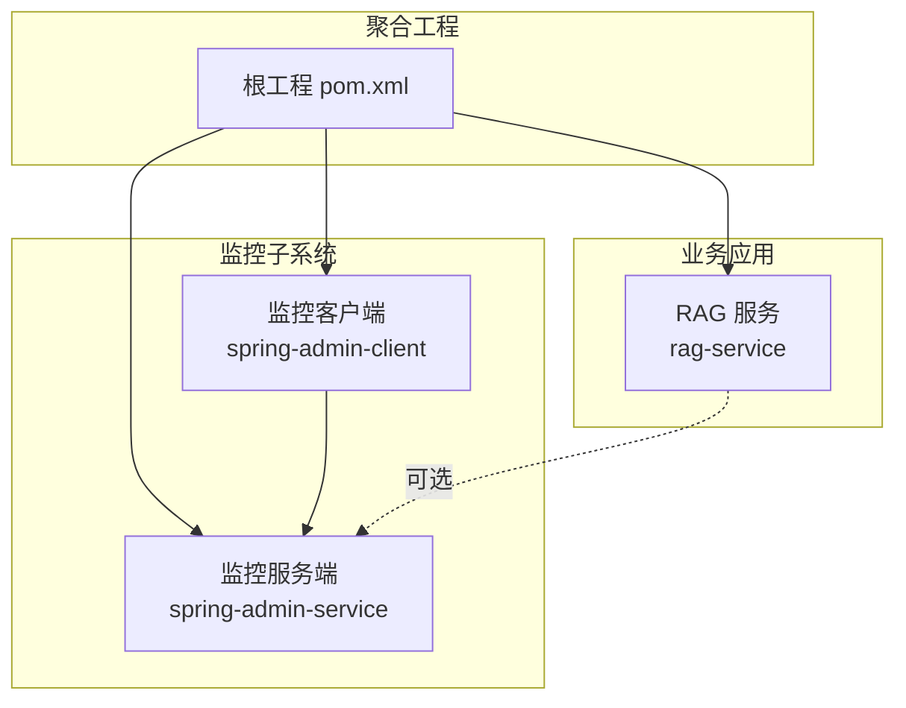
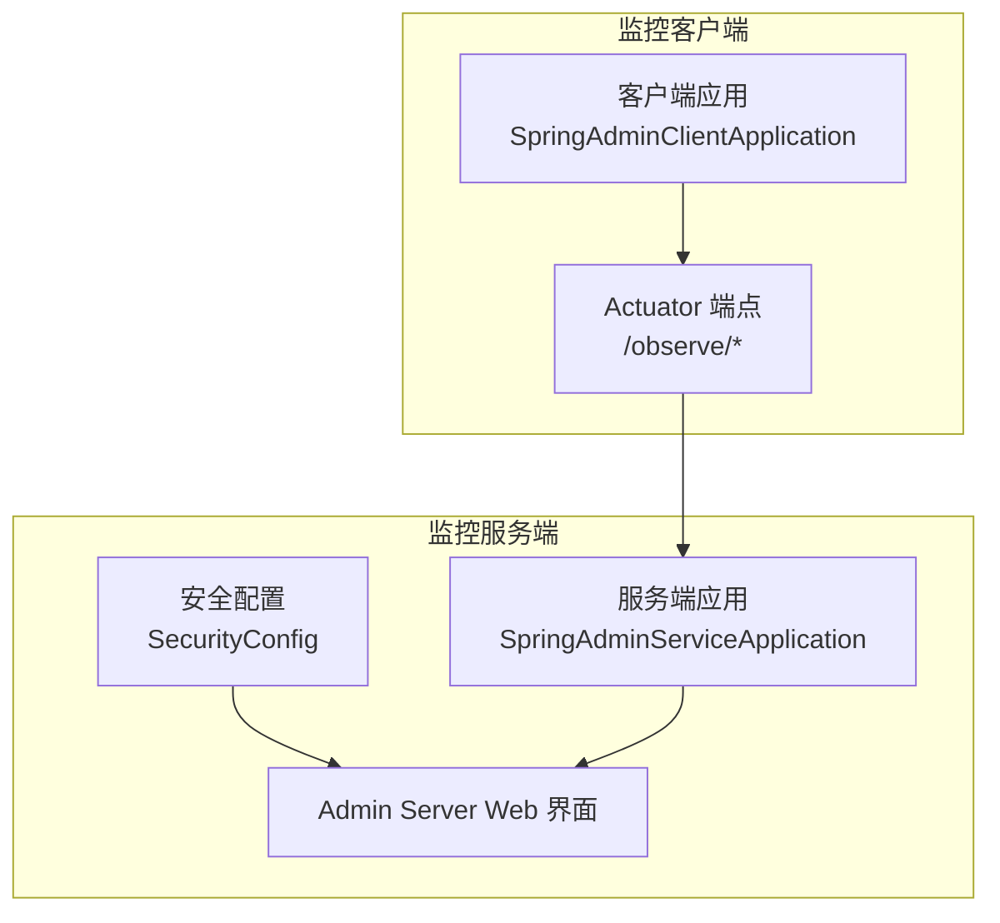
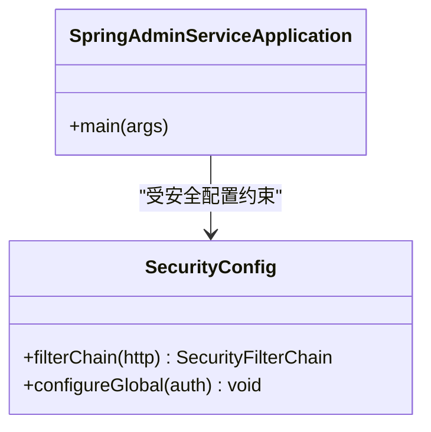
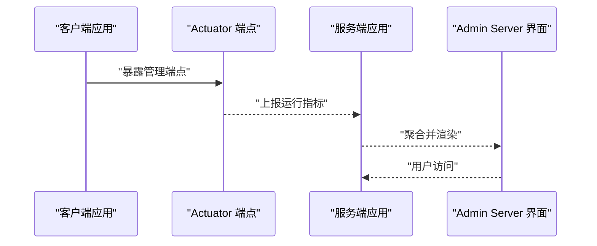
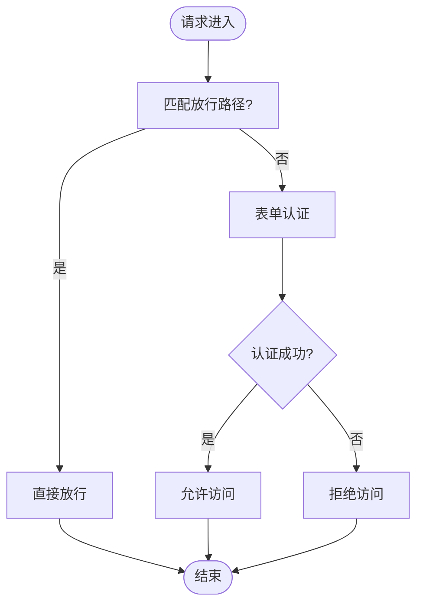
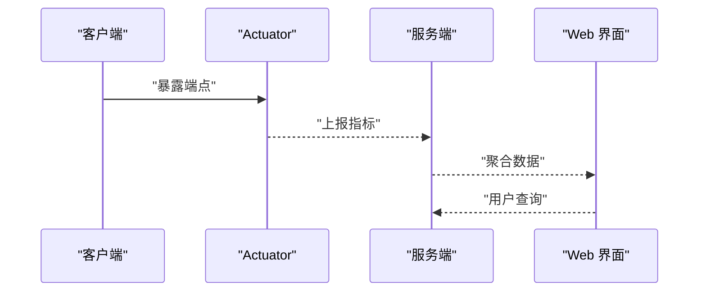
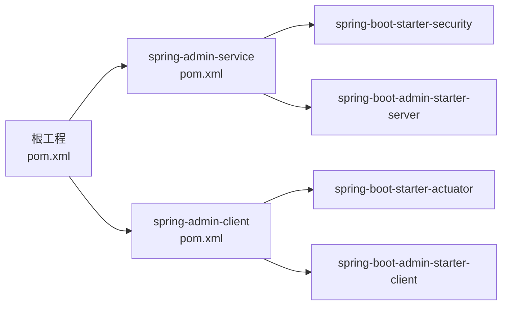

# 监控架构

<cite>
**本文引用的文件**
- [SecurityConfig.java](file://spring-admin-service/src/main/java/cn/project/base/springadminservice/config/SecurityConfig.java)
- [SpringAdminServiceApplication.java](file://spring-admin-service/src/main/java/cn/project/base/springadminservice/SpringAdminServiceApplication.java)
- [application.yml（监控服务端）](file://spring-admin-service/src/main/resources/application.yml)
- [pom.xml（监控服务端）](file://spring-admin-service/pom.xml)
- [SpringAdminClientApplication.java](file://spring-admin-client/src/main/java/cn/project/base/springadminclient/SpringAdminClientApplication.java)
- [application.yml（监控客户端）](file://spring-admin-client/src/main/resources/application.yml)
- [pom.xml（监控客户端）](file://spring-admin-client/pom.xml)
- [pom.xml（根工程）](file://pom.xml)
- [TestController.java](file://rag-service/src/main/java/cn/project/base/ragservice/controller/TestController.java)
- [InitService.java](file://rag-service/src/main/java/cn/project/base/ragservice/service/InitService.java)
- [application.yml（RAG服务）](file://rag-service/src/main/resources/application.yml)
- [logback-dev.xml（RAG服务）](file://rag-service/src/main/resources/logback-dev.xml)
</cite>

## 目录
1. [引言](#引言)
2. [项目结构](#项目结构)
3. [核心组件](#核心组件)
4. [架构总览](#架构总览)
5. [详细组件分析](#详细组件分析)
6. [依赖分析](#依赖分析)
7. [性能考虑](#性能考虑)
8. [故障排查指南](#故障排查指南)
9. [结论](#结论)
10. [附录](#附录)

## 引言
本技术文档围绕 Spring Boot Admin 监控管理架构展开，系统性阐述监控服务端与监控客户端的双端架构设计、安全配置、监控数据采集与展示流程、界面功能特性、部署配置与扩展建议，以及监控数据的存储与备份策略。读者可据此快速理解并落地该监控体系。

## 项目结构
该仓库采用多模块聚合工程组织，监控子系统由“监控服务端”和“监控客户端”两大模块构成，分别负责集中展示与数据上报。根工程统一管理版本与依赖。

图表来源
- [pom.xml（根工程）:11-22](file://pom.xml#L11-L22)
- [pom.xml（监控服务端）:5-10](file://spring-admin-service/pom.xml#L5-L10)
- [pom.xml（监控客户端）:5-10](file://spring-admin-client/pom.xml#L5-L10)

章节来源
- [pom.xml（根工程）:11-22](file://pom.xml#L11-L22)
- [pom.xml（监控服务端）:5-10](file://spring-admin-service/pom.xml#L5-L10)
- [pom.xml（监控客户端）:5-10](file://spring-admin-client/pom.xml#L5-L10)

## 核心组件
- 监控服务端（Server）
  - 负责启动 Admin Server，提供 Web 界面与 REST 接口，接收来自客户端的注册与指标上报，统一展示服务状态、健康检查、性能指标等。
  - 关键点：启用 Admin Server 注解、内置安全配置（表单登录、基本 CSRF 禁用）、默认端口配置。
- 监控客户端（Client）
  - 负责向服务端注册自身，并暴露 Actuator 指标端点，供服务端拉取监控数据。
  - 关键点：配置服务端地址、暴露管理端点、基础路径与健康检查细节策略。
- 安全配置（SecurityConfig）
  - 基于 Spring Security 的安全链路，定义放行路径、登录页、登出、CSRF 策略，并内置内存用户认证。
- 日志与观测（RAG 服务）
  - 提供日志配置与示例控制器，便于验证日志采集与接口行为。

章节来源
- [SpringAdminServiceApplication.java:7-9](file://spring-admin-service/src/main/java/cn/project/base/springadminservice/SpringAdminServiceApplication.java#L7-L9)
- [application.yml（监控服务端）:1-6](file://spring-admin-service/src/main/resources/application.yml#L1-L6)
- [SecurityConfig.java:18-29](file://spring-admin-service/src/main/java/cn/project/base/springadminservice/config/SecurityConfig.java#L18-L29)
- [application.yml（监控客户端）:1-36](file://spring-admin-client/src/main/resources/application.yml#L1-L36)
- [TestController.java:12-15](file://rag-service/src/main/java/cn/project/base/ragservice/controller/TestController.java#L12-L15)
- [logback-dev.xml（RAG服务）:1-208](file://rag-service/src/main/resources/logback-dev.xml#L1-L208)

## 架构总览
下图展示了监控双端的交互关系与数据流向：客户端向服务端注册，服务端通过 Actuator 拉取指标，最终在 Web 界面呈现。

图表来源
- [SpringAdminClientApplication.java:7-11](file://spring-admin-client/src/main/java/cn/project/base/springadminclient/SpringAdminClientApplication.java#L7-L11)
- [application.yml（监控客户端）:10-17](file://spring-admin-client/src/main/resources/application.yml#L10-L17)
- [SpringAdminServiceApplication.java:7-9](file://spring-admin-service/src/main/java/cn/project/base/springadminservice/SpringAdminServiceApplication.java#L7-L9)
- [SecurityConfig.java:18-29](file://spring-admin-service/src/main/java/cn/project/base/springadminservice/config/SecurityConfig.java#L18-L29)

## 详细组件分析

### 监控服务端（Server）
- 启动与注册
  - 应用入口启用 Admin Server，使服务端具备注册中心与 Web 展示能力。
  - 默认监听端口由配置文件指定。
- 安全机制
  - 定义放行路径（登录页、静态资源、管理端、Actuator），其余请求需认证。
  - 表单登录页与登出接口开放，CSRF 禁用以简化客户端集成。
  - 全局内存用户认证，示例用户用于演示登录。
- 数据展示
  - 通过 Admin Server Web 界面集中展示各客户端的服务状态、健康检查、指标与日志信息。

图表来源
- [SpringAdminServiceApplication.java:7-9](file://spring-admin-service/src/main/java/cn/project/base/springadminservice/SpringAdminServiceApplication.java#L7-L9)
- [SecurityConfig.java:18-42](file://spring-admin-service/src/main/java/cn/project/base/springadminservice/config/SecurityConfig.java#L18-L42)

章节来源
- [SpringAdminServiceApplication.java:7-9](file://spring-admin-service/src/main/java/cn/project/base/springadminservice/SpringAdminServiceApplication.java#L7-L9)
- [application.yml（监控服务端）:1-6](file://spring-admin-service/src/main/resources/application.yml#L1-L6)
- [SecurityConfig.java:18-42](file://spring-admin-service/src/main/java/cn/project/base/springadminservice/config/SecurityConfig.java#L18-L42)

### 监控客户端（Client）
- 注册与上报
  - 客户端通过配置指向服务端地址，完成自动注册。
  - 暴露 Actuator 管理端点，设置基础路径与健康检查细节策略。
- 端点配置
  - 管理端点全部暴露，便于服务端拉取指标。
  - 健康检查始终显示详情，便于快速定位问题。
- 与服务端协作
  - 服务端通过 Actuator 拉取客户端指标，统一在 Web 界面展示。

图表来源
- [application.yml（监控客户端）:10-24](file://spring-admin-client/src/main/resources/application.yml#L10-L24)
- [SpringAdminClientApplication.java:7-11](file://spring-admin-client/src/main/java/cn/project/base/springadminclient/SpringAdminClientApplication.java#L7-L11)
- [SpringAdminServiceApplication.java:7-9](file://spring-admin-service/src/main/java/cn/project/base/springadminservice/SpringAdminServiceApplication.java#L7-L9)

章节来源
- [application.yml（监控客户端）:1-36](file://spring-admin-client/src/main/resources/application.yml#L1-L36)
- [SpringAdminClientApplication.java:7-11](file://spring-admin-client/src/main/java/cn/project/base/springadminclient/SpringAdminClientApplication.java#L7-L11)

### 安全配置（SecurityConfig）
- 放行策略
  - 登录页、静态资源、管理端、Actuator 端点无需认证即可访问。
- 认证与会话
  - 表单登录页与登出接口开放，默认禁用 CSRF。
- 用户管理
  - 示例用户“admin”，明文密码用于演示，生产环境需使用加密密码。
- 权限控制
  - 任何未明确放行的请求均需认证，确保 Admin Server 界面的安全访问。

图表来源
- [SecurityConfig.java:18-29](file://spring-admin-service/src/main/java/cn/project/base/springadminservice/config/SecurityConfig.java#L18-L29)
- [SecurityConfig.java:37-42](file://spring-admin-service/src/main/java/cn/project/base/springadminservice/config/SecurityConfig.java#L37-L42)

章节来源
- [SecurityConfig.java:18-42](file://spring-admin-service/src/main/java/cn/project/base/springadminservice/config/SecurityConfig.java#L18-L42)

### 监控数据采集、传输与展示
- 采集
  - 客户端通过 Actuator 暴露运行指标与健康检查信息。
- 传输
  - 服务端定期或按需从客户端拉取指标，完成数据聚合。
- 展示
  - Admin Server Web 界面集中展示服务状态、健康检查、性能指标与日志信息。

图表来源
- [application.yml（监控客户端）:10-24](file://spring-admin-client/src/main/resources/application.yml#L10-L24)
- [SpringAdminServiceApplication.java:7-9](file://spring-admin-service/src/main/java/cn/project/base/springadminservice/SpringAdminServiceApplication.java#L7-L9)

章节来源
- [application.yml（监控客户端）:10-24](file://spring-admin-client/src/main/resources/application.yml#L10-L24)

### 监控界面功能特性
- 服务状态监控
  - 展示客户端服务的在线/离线状态、最后心跳时间、启动时间等。
- 资源使用情况
  - 展示 CPU、内存、堆栈、线程、JVM 运行时等关键指标。
- 健康检查
  - 健康详情始终显示，便于快速定位依赖（如数据库、消息队列、外部服务）可用性。
- 日志管理
  - 可在界面查看日志片段，结合后端日志文件实现远程审计与排障。

章节来源
- [application.yml（监控客户端）:19-24](file://spring-admin-client/src/main/resources/application.yml#L19-L24)

### 部署配置与扩展指南
- 端口与域名
  - 服务端端口在配置文件中设定，建议在生产环境绑定内网或反向代理。
- 安全加固
  - 生产环境替换明文密码为加密密码；开启 CSRF；限制放行路径；仅暴露必要端点。
- 高可用与扩展
  - 多实例部署服务端，结合负载均衡与共享存储；客户端按需扩展，统一接入服务端。
- 与业务系统集成
  - 业务应用可复用客户端依赖与配置，快速接入监控体系。

章节来源
- [application.yml（监控服务端）:1-6](file://spring-admin-service/src/main/resources/application.yml#L1-L6)
- [SecurityConfig.java:18-29](file://spring-admin-service/src/main/java/cn/project/base/springadminservice/config/SecurityConfig.java#L18-L29)
- [pom.xml（监控客户端）:32-45](file://spring-admin-client/pom.xml#L32-L45)
- [pom.xml（监控服务端）:32-41](file://spring-admin-service/pom.xml#L32-L41)

### 监控数据的存储策略与备份方案
- 存储策略
  - Actuator 指标为瞬时数据，主要在服务端内存中聚合展示；适合短期观测与告警触发。
- 备份与持久化
  - 建议将 Actuator 指标导出至时序数据库或日志平台，实现长期留存与趋势分析。
  - 结合业务日志策略，统一归档与轮转，满足合规与审计需求。

章节来源
- [logback-dev.xml（RAG服务）:25-188](file://rag-service/src/main/resources/logback-dev.xml#L25-L188)

## 依赖分析
- 版本与依赖管理
  - 根工程统一管理 Spring Boot、Spring AI、LangChain4j、Spring Boot Admin 等版本。
  - 监控服务端引入 Admin Server 与安全依赖；监控客户端引入 Actuator 与 Admin Client 依赖。
- 模块耦合
  - 客户端依赖服务端，服务端依赖安全与 Admin Server；RAG 服务为业务示例，可选接入监控。

图表来源
- [pom.xml（根工程）:24-35](file://pom.xml#L24-L35)
- [pom.xml（监控服务端）:32-56](file://spring-admin-service/pom.xml#L32-L56)
- [pom.xml（监控客户端）:32-45](file://spring-admin-client/pom.xml#L32-L45)

章节来源
- [pom.xml（根工程）:24-35](file://pom.xml#L24-L35)
- [pom.xml（监控服务端）:32-56](file://spring-admin-service/pom.xml#L32-L56)
- [pom.xml（监控客户端）:32-45](file://spring-admin-client/pom.xml#L32-L45)

## 性能考虑
- Actuator 暴露范围
  - 当前示例将管理端点全部暴露，便于调试但可能带来性能与安全风险；生产环境建议按需暴露。
- 日志与观测
  - RAG 服务的日志配置采用滚动与阈值过滤，避免日志风暴；建议结合采样与异步写入优化 IO。
- 客户端注册频率
  - 服务端与客户端的心跳与注册频率应与业务规模匹配，避免过度拉取导致资源消耗。

章节来源
- [application.yml（监控客户端）:10-17](file://spring-admin-client/src/main/resources/application.yml#L10-L17)
- [logback-dev.xml（RAG服务）:171-188](file://rag-service/src/main/resources/logback-dev.xml#L171-L188)

## 故障排查指南
- 登录与认证
  - 若无法登录，检查安全配置中的放行路径与用户配置；确认浏览器 Cookie 与会话状态。
- 客户端注册
  - 若服务端未显示客户端，检查客户端配置的服务端地址、网络连通性与端口映射。
- Actuator 端点
  - 若指标缺失，确认管理端点是否正确暴露与基础路径是否一致。
- 日志与审计
  - 利用日志文件与界面日志片段定位异常；结合日志轮转策略避免磁盘压力。

章节来源
- [SecurityConfig.java:18-29](file://spring-admin-service/src/main/java/cn/project/base/springadminservice/config/SecurityConfig.java#L18-L29)
- [application.yml（监控客户端）:1-36](file://spring-admin-client/src/main/resources/application.yml#L1-L36)
- [logback-dev.xml（RAG服务）:1-208](file://rag-service/src/main/resources/logback-dev.xml#L1-L208)

## 结论
该监控架构以 Spring Boot Admin 为核心，通过服务端与客户端的清晰分工，实现了集中化监控与可视化展示。配合安全配置与日志策略，可在开发与生产环境中快速落地。建议在生产环境强化安全与性能配置，并结合外部时序数据库实现指标持久化与长期分析。

## 附录
- 快速验证
  - 启动监控服务端与客户端，访问服务端 Web 界面，确认客户端已注册并展示健康状态。
- 示例接口
  - 业务应用可通过示例控制器发起请求，结合日志与监控界面验证链路。

章节来源
- [TestController.java:12-15](file://rag-service/src/main/java/cn/project/base/ragservice/controller/TestController.java#L12-L15)
- [application.yml（RAG服务）:1-9](file://rag-service/src/main/resources/application.yml#L1-L9)