# 系统架构

<cite>
**本文引用的文件**
- [pom.xml](file://pom.xml)
- [RagMiluvsApplication.java](file://rag-miluvs/src/main/java/cn/project/base/ragmiluvs/RagMiluvsApplication.java)
- [RagConfig.java](file://rag-miluvs/src/main/java/cn/project/base/ragmiluvs/config/RagConfig.java)
- [RagService.java](file://rag-miluvs/src/main/java/cn/project/base/ragmiluvs/service/RagService.java)
- [RagController.java](file://rag-miluvs/src/main/java/cn/project/base/ragmiluvs/controller/RagController.java)
- [FunctionApplication.java](file://function/src/main/java/cn/project/base/function/FunctionApplication.java)
- [FunctionCallController.java](file://function/src/main/java/cn/project/base/function/controller/FunctionCallController.java)
- [FunctionTools.java](file://function/src/main/java/cn/project/base/function/config/FunctionTools.java)
- [LangchainAiApplication.java](file://langchain-ai/src/main/java/cn/project/base/langchainai/LangchainAiApplication.java)
- [SpringAiModelApplication.java](file://spring-ai-model/src/main/java/cn/project/base/springaimodel/SpringAiModelApplication.java)
- [SpringAiServiceApplication.java](file://spring-ai-service/src/main/java/cn/project/base/springaiservice/SpringAiServiceApplication.java)
- [SpringAdminServiceApplication.java](file://spring-admin-service/src/main/java/cn/project/base/springadminservice/SpringAdminServiceApplication.java)
- [SpringAdminClientApplication.java](file://spring-admin-client/src/main/java/cn/project/base/springadminclient/SpringAdminClientApplication.java)
- [SpringAiMcpApplication.java](file://spring-ai-mcp/src/main/java/cn/project/base/springaimcp/SpringAiMcpApplication.java)
- [SpringAiMcpServerApplication.java](file://spring-ai-mcp-server/src/main/java/cn/project/base/springaimcpserver/SpringAiMcpServerApplication.java)
</cite>

## 目录
1. [引言](#引言)
2. [项目结构](#项目结构)
3. [核心组件](#核心组件)
4. [架构总览](#架构总览)
5. [详细组件分析](#详细组件分析)
6. [依赖分析](#依赖分析)
7. [性能考虑](#性能考虑)
8. [故障排查指南](#故障排查指南)
9. [结论](#结论)
10. [附录](#附录)

## 引言
本架构文档面向RAG服务系统，基于多模块微服务设计，覆盖11个独立模块的职责划分与交互关系。重点解析核心组件RagService、RagConfig、AI模型集成层、函数调用系统与监控管理系统，并阐明数据流与控制流（文档处理、问答处理、监控数据流）。同时给出系统边界图、组件关系图、技术选型与权衡、可扩展性与性能优化策略。

## 项目结构
该仓库采用Maven聚合工程组织，父POM统一管理版本与依赖，子模块按功能域拆分，形成清晰的微服务边界：
- rag-service：顶层引导与示例服务
- rag-miluvs：RAG主流程与Milvus向量存储集成
- function：函数调用与工具注册
- langchain-ai：LangChain集成示例
- spring-ai-model：模型能力封装（文本/图像/TTS）
- spring-ai-service：外部模型服务适配（DeepSeek/Ollama等）
- spring-admin-service：Spring Boot Admin服务端
- spring-admin-client：各业务模块的Admin客户端
- spring-ai-mcp：MCP客户端示例
- spring-ai-mcp-server：MCP工具服务端

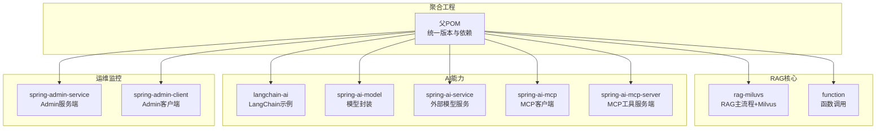

图表来源
- [pom.xml:11-22](file://pom.xml#L11-L22)

章节来源
- [pom.xml:1-171](file://pom.xml#L1-L171)

## 核心组件
- RagService：负责RAG问答流式输出、知识库导入与嵌入、检索增强生成（RAG）编排。
- RagConfig：负责Milvus向量集合创建、一致性级别、字段映射与聊天记忆存储配置。
- 函数调用系统：通过工具注册与ChatClient函数绑定，实现LLM与工具的协同。
- AI模型集成层：以Spring AI与LangChain4j为核心，适配本地与云端模型，支持流式与非流式对话。
- 监控管理系统：基于Spring Boot Admin，集中展示各模块运行状态与指标。

章节来源
- [RagService.java:36-118](file://rag-miluvs/src/main/java/cn/project/base/ragmiluvs/service/RagService.java#L36-L118)
- [RagConfig.java:17-55](file://rag-miluvs/src/main/java/cn/project/base/ragmiluvs/config/RagConfig.java#L17-L55)
- [FunctionCallController.java:25-76](file://function/src/main/java/cn/project/base/function/controller/FunctionCallController.java#L25-L76)
- [FunctionTools.java:11-40](file://function/src/main/java/cn/project/base/function/config/FunctionTools.java#L11-L40)

## 架构总览
系统采用“模块化微服务 + 统一依赖治理”的架构模式。RAG主流程位于rag-miluvs，结合LangChain4j的嵌入模型、向量检索与聊天模型；function模块提供函数工具注册与调用；spring-ai-*系列模块分别承担模型封装、外部服务适配与MCP工具链；spring-admin-*模块提供集中监控与运维。

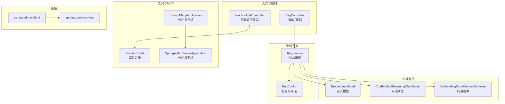

图表来源
- [RagController.java:12-29](file://rag-miluvs/src/main/java/cn/project/base/ragmiluvs/controller/RagController.java#L12-L29)
- [RagService.java:36-90](file://rag-miluvs/src/main/java/cn/project/base/ragmiluvs/service/RagService.java#L36-L90)
- [RagConfig.java:25-53](file://rag-miluvs/src/main/java/cn/project/base/ragmiluvs/config/RagConfig.java#L25-L53)
- [FunctionCallController.java:25-49](file://function/src/main/java/cn/project/base/function/controller/FunctionCallController.java#L25-L49)
- [FunctionTools.java:21-37](file://function/src/main/java/cn/project/base/function/config/FunctionTools.java#L21-L37)
- [SpringAiMcpApplication.java:14-36](file://spring-ai-mcp/src/main/java/cn/project/base/springaimcp/SpringAiMcpApplication.java#L14-L36)
- [SpringAiMcpServerApplication.java:17-22](file://spring-ai-mcp-server/src/main/java/cn/project/base/springaimcpserver/SpringAiMcpServerApplication.java#L17-L22)
- [SpringAdminServiceApplication.java:7-9](file://spring-admin-service/src/main/java/cn/project/base/springadminservice/SpringAdminServiceApplication.java#L7-L9)
- [SpringAdminClientApplication.java:6-7](file://spring-admin-client/src/main/java/cn/project/base/springadminclient/SpringAdminClientApplication.java#L6-L7)

## 详细组件分析

### RAG服务模块（rag-miluvs）
- 职责
  - 文档导入：扫描资源目录、解析文档、分段、计算嵌入并写入Milvus。
  - 问答流式：构建AiServices，配置聊天记忆、压缩查询、向量检索与RAG增强，返回流式响应。
- 关键类关系

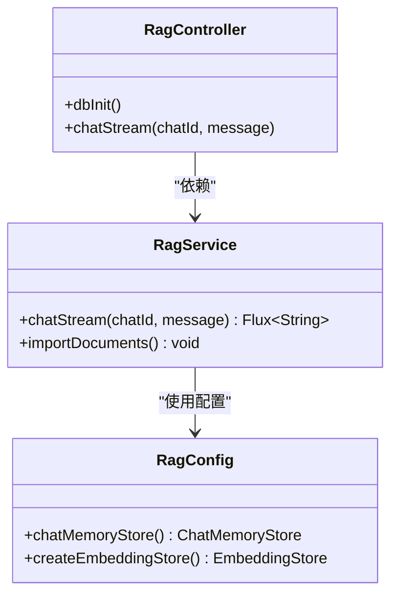

图表来源
- [RagController.java:12-29](file://rag-miluvs/src/main/java/cn/project/base/ragmiluvs/controller/RagController.java#L12-L29)
- [RagService.java:36-118](file://rag-miluvs/src/main/java/cn/project/base/ragmiluvs/service/RagService.java#L36-L118)
- [RagConfig.java:17-55](file://rag-miluvs/src/main/java/cn/project/base/ragmiluvs/config/RagConfig.java#L17-L55)

章节来源
- [RagController.java:12-29](file://rag-miluvs/src/main/java/cn/project/base/ragmiluvs/controller/RagController.java#L12-L29)
- [RagService.java:36-118](file://rag-miluvs/src/main/java/cn/project/base/ragmiluvs/service/RagService.java#L36-L118)
- [RagConfig.java:17-55](file://rag-miluvs/src/main/java/cn/project/base/ragmiluvs/config/RagConfig.java#L17-L55)

### 函数调用系统（function）
- 职责
  - 注册自定义函数（加法、乘法），并通过ChatClient在对话中启用函数调用，实现LLM与工具的协作。
- 关键类关系

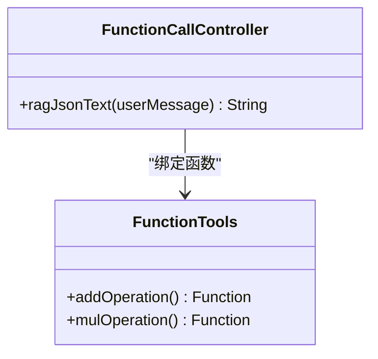

图表来源
- [FunctionCallController.java:25-49](file://function/src/main/java/cn/project/base/function/controller/FunctionCallController.java#L25-L49)
- [FunctionTools.java:21-37](file://function/src/main/java/cn/project/base/function/config/FunctionTools.java#L21-L37)

章节来源
- [FunctionCallController.java:25-76](file://function/src/main/java/cn/project/base/function/controller/FunctionCallController.java#L25-L76)
- [FunctionTools.java:11-40](file://function/src/main/java/cn/project/base/function/config/FunctionTools.java#L11-L40)

### AI模型集成层
- LangChain4j与Spring AI
  - 通过EmbeddingModel与ChatModel/StreamingChatModel对接本地或云端模型，支持嵌入、对话与流式输出。
- 模块边界
  - spring-ai-model：封装文本、图像、TTS等能力。
  - spring-ai-service：适配DeepSeek、Ollama等外部服务。
  - langchain-ai：LangChain示例应用。

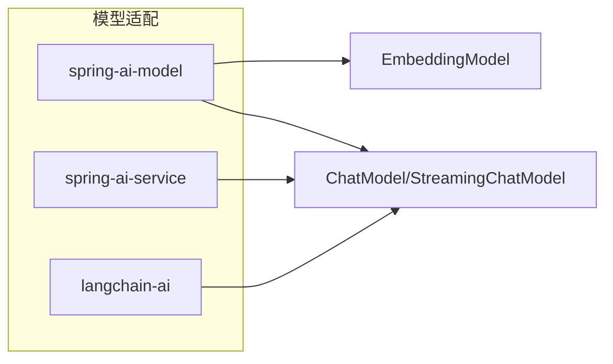

图表来源
- [SpringAiModelApplication.java:6-7](file://spring-ai-model/src/main/java/cn/project/base/springaimodel/SpringAiModelApplication.java#L6-L7)
- [SpringAiServiceApplication.java:6-7](file://spring-ai-service/src/main/java/cn/project/base/springaiservice/SpringAiServiceApplication.java#L6-L7)
- [LangchainAiApplication.java:11-12](file://langchain-ai/src/main/java/cn/project/base/langchainai/LangchainAiApplication.java#L11-L12)

章节来源
- [SpringAiModelApplication.java:1-14](file://spring-ai-model/src/main/java/cn/project/base/springaimodel/SpringAiModelApplication.java#L1-L14)
- [SpringAiServiceApplication.java:1-14](file://spring-ai-service/src/main/java/cn/project/base/springaiservice/SpringAiServiceApplication.java#L1-L14)
- [LangchainAiApplication.java:1-31](file://langchain-ai/src/main/java/cn/project/base/langchainai/LangchainAiApplication.java#L1-L31)

### 监控管理系统（spring-admin-*）
- spring-admin-service：启用Admin服务端，统一收集各客户端指标。
- spring-admin-client：各业务模块作为Admin客户端上报状态。
- 集成方式：通过Admin客户端自动注册与服务端发现。

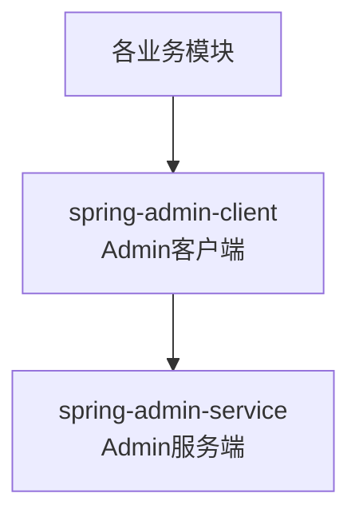

图表来源
- [SpringAdminServiceApplication.java:7-9](file://spring-admin-service/src/main/java/cn/project/base/springadminservice/SpringAdminServiceApplication.java#L7-L9)
- [SpringAdminClientApplication.java:6-7](file://spring-admin-client/src/main/java/cn/project/base/springadminclient/SpringAdminClientApplication.java#L6-L7)

章节来源
- [SpringAdminServiceApplication.java:1-16](file://spring-admin-service/src/main/java/cn/project/base/springadminservice/SpringAdminServiceApplication.java#L1-L16)
- [SpringAdminClientApplication.java:1-14](file://spring-admin-client/src/main/java/cn/project/base/springadminclient/SpringAdminClientApplication.java#L1-L14)

### 数据流与控制流

#### 文档处理流程
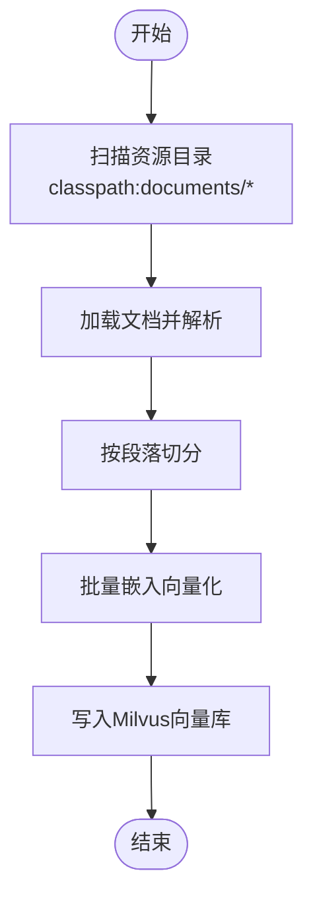

图表来源
- [RagService.java:95-116](file://rag-miluvs/src/main/java/cn/project/base/ragmiluvs/service/RagService.java#L95-L116)

章节来源
- [RagService.java:95-116](file://rag-miluvs/src/main/java/cn/project/base/ragmiluvs/service/RagService.java#L95-L116)

#### 问答处理流程
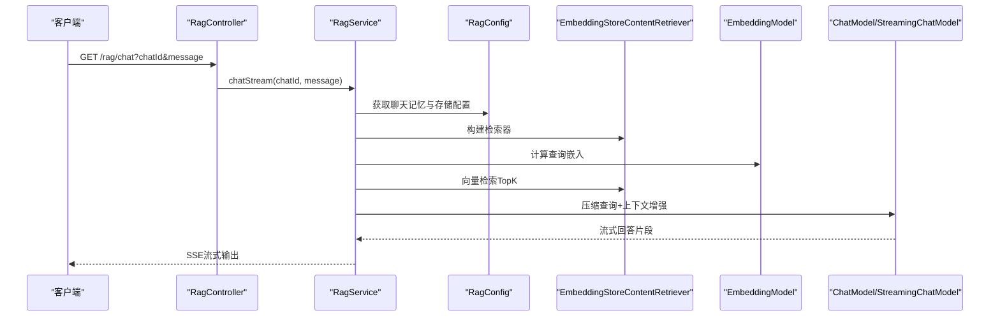

图表来源
- [RagController.java:24-27](file://rag-miluvs/src/main/java/cn/project/base/ragmiluvs/controller/RagController.java#L24-L27)
- [RagService.java:57-90](file://rag-miluvs/src/main/java/cn/project/base/ragmiluvs/service/RagService.java#L57-L90)
- [RagConfig.java:25-53](file://rag-miluvs/src/main/java/cn/project/base/ragmiluvs/config/RagConfig.java#L25-L53)

章节来源
- [RagController.java:12-29](file://rag-miluvs/src/main/java/cn/project/base/ragmiluvs/controller/RagController.java#L12-L29)
- [RagService.java:57-90](file://rag-miluvs/src/main/java/cn/project/base/ragmiluvs/service/RagService.java#L57-L90)

#### 函数调用流程
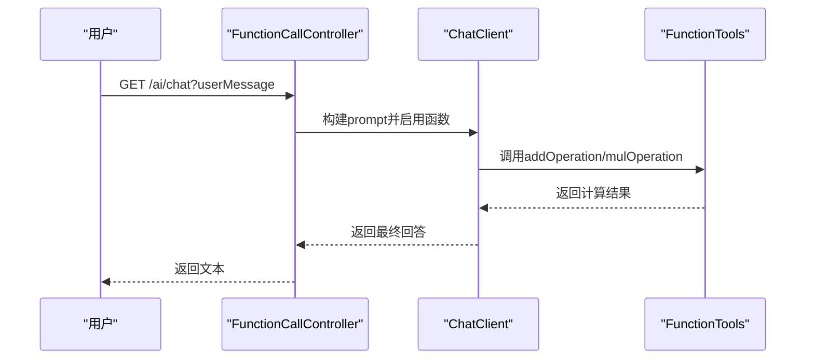

图表来源
- [FunctionCallController.java:33-49](file://function/src/main/java/cn/project/base/function/controller/FunctionCallController.java#L33-L49)
- [FunctionTools.java:21-37](file://function/src/main/java/cn/project/base/function/config/FunctionTools.java#L21-L37)

章节来源
- [FunctionCallController.java:25-76](file://function/src/main/java/cn/project/base/function/controller/FunctionCallController.java#L25-L76)
- [FunctionTools.java:11-40](file://function/src/main/java/cn/project/base/function/config/FunctionTools.java#L11-L40)

#### 监控数据流
- 客户端模块启动后自动向Admin服务端注册，Admin服务端统一拉取健康检查、指标与日志，形成集中可视化与告警能力。

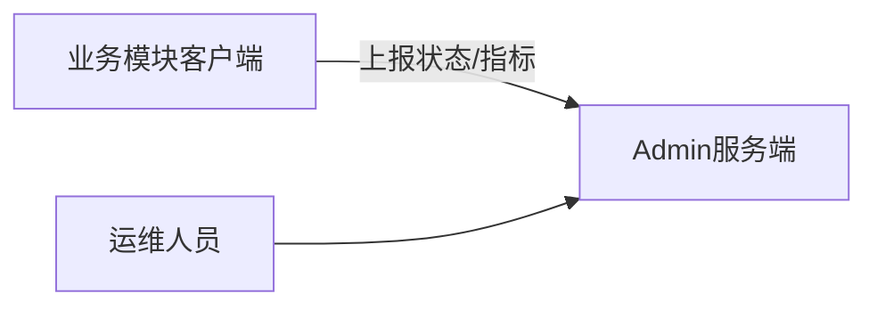

图表来源
- [SpringAdminServiceApplication.java:7-9](file://spring-admin-service/src/main/java/cn/project/base/springadminservice/SpringAdminServiceApplication.java#L7-L9)
- [SpringAdminClientApplication.java:6-7](file://spring-admin-client/src/main/java/cn/project/base/springadminclient/SpringAdminClientApplication.java#L6-L7)

章节来源
- [SpringAdminServiceApplication.java:1-16](file://spring-admin-service/src/main/java/cn/project/base/springadminservice/SpringAdminServiceApplication.java#L1-L16)
- [SpringAdminClientApplication.java:1-14](file://spring-admin-client/src/main/java/cn/project/base/springadminclient/SpringAdminClientApplication.java#L1-L14)

## 依赖分析
- 版本与依赖管理
  - 父POM统一管理Spring Boot、Spring AI、LangChain4j、Spring Boot Admin等版本，确保模块间兼容性。
  - 通过dependencyManagement集中声明，避免子模块重复指定版本。
- 模块耦合
  - rag-miluvs与function模块通过Spring容器装配模型与工具，低耦合高内聚。
  - spring-admin-*模块仅依赖Admin客户端starter，不直接依赖业务逻辑，解耦监控与业务。

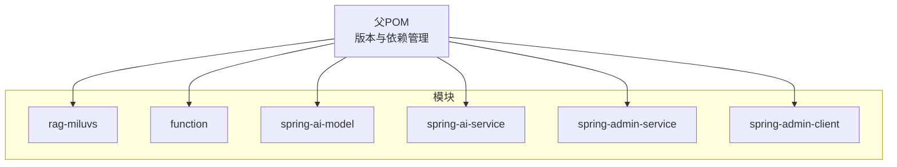

图表来源
- [pom.xml:36-102](file://pom.xml#L36-L102)

章节来源
- [pom.xml:24-102](file://pom.xml#L24-L102)

## 性能考虑
- 向量检索优化
  - 合理设置maxResults与minScore，平衡召回率与延迟。
  - 使用压缩查询Transformer降低维度与噪声，提升检索质量。
- 嵌入与存储
  - 批量嵌入与批量插入，减少网络往返与I/O开销。
  - Milvus索引类型与度量方式需根据数据规模与相似度场景调优。
- 流式输出
  - 使用Flux进行SSE流式传输，降低首字节延迟，改善用户体验。
- 缓存与会话
  - 控制聊天记忆窗口大小，避免上下文过长导致性能下降。
- 外部模型
  - 对接本地模型时建议使用流式接口，减少等待时间；对外部服务注意超时与重试策略。

## 故障排查指南
- 文档导入失败
  - 检查资源路径与权限，确认classpath:documents目录存在且可读。
  - 观察嵌入维度与向量库字段映射是否一致。
- 向量检索异常
  - 核对Milvus连接参数、集合是否存在、索引是否建立。
  - 调整minScore与maxResults，观察召回效果。
- 函数调用未生效
  - 确认ChatClient已启用对应函数名，工具方法可见且可注入。
- 流式输出中断
  - 检查模型流式接口可用性与网络稳定性。
- 监控不可见
  - 确认Admin客户端已正确引入依赖并注册，服务端已启用Admin Server。

章节来源
- [RagService.java:95-116](file://rag-miluvs/src/main/java/cn/project/base/ragmiluvs/service/RagService.java#L95-L116)
- [FunctionCallController.java:33-49](file://function/src/main/java/cn/project/base/function/controller/FunctionCallController.java#L33-L49)
- [SpringAdminServiceApplication.java:7-9](file://spring-admin-service/src/main/java/cn/project/base/springadminservice/SpringAdminServiceApplication.java#L7-L9)

## 结论
本系统通过模块化微服务与统一依赖治理，实现了RAG主流程、函数调用、AI模型集成与监控管理的清晰分离。LangChain4j与Spring AI的结合提供了灵活的模型适配能力；Milvus向量存储保障了检索性能；Admin监控体系提升了可观测性。未来可在索引策略、缓存层与弹性伸缩方面进一步优化，以满足更大规模与更高并发的需求。

## 附录
- 技术选型与权衡
  - LangChain4j：跨模型抽象与RAG增强能力成熟，适合快速迭代。
  - Spring AI：与Spring生态无缝集成，便于统一配置与部署。
  - Milvus：成熟的向量数据库，支持多种索引与度量，适合生产环境。
  - Admin：集中化监控，降低运维成本。
- 可扩展性建议
  - 引入消息队列异步化文档导入与嵌入任务。
  - 增加网关层统一鉴权、限流与路由。
  - 将工具注册抽象为插件机制，动态加载第三方工具。
  - 针对不同场景拆分模型服务，按需扩缩容。