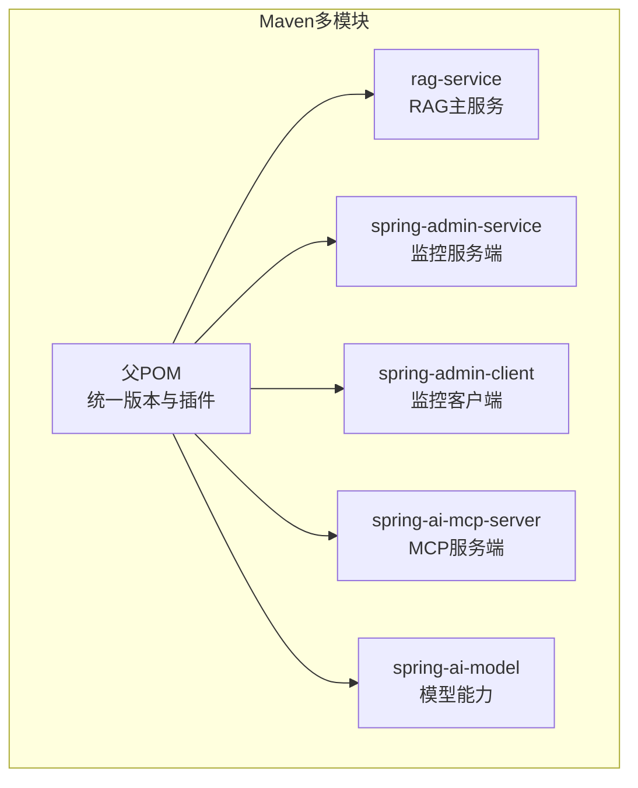
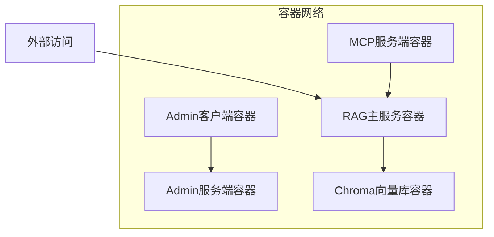
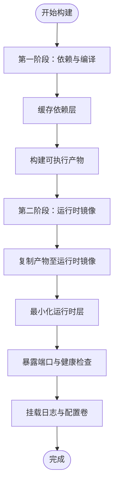
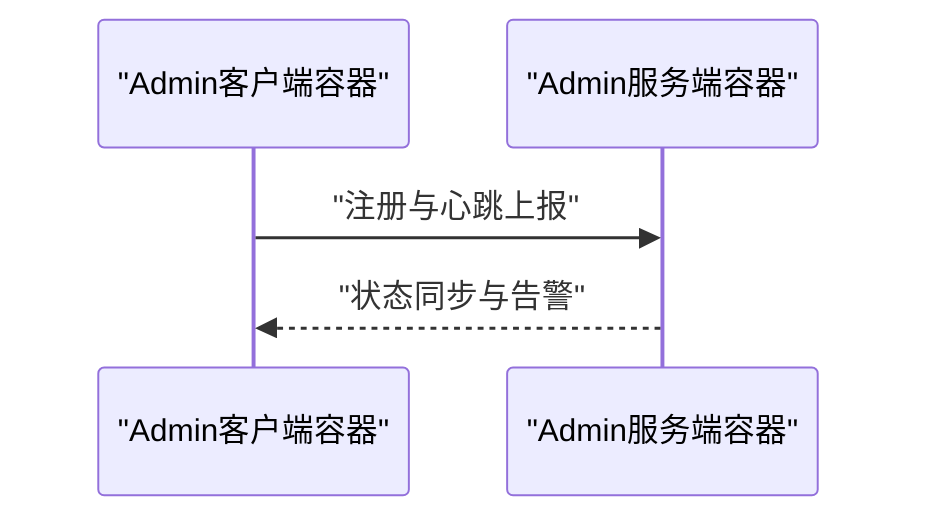
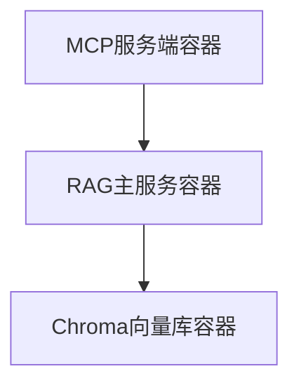
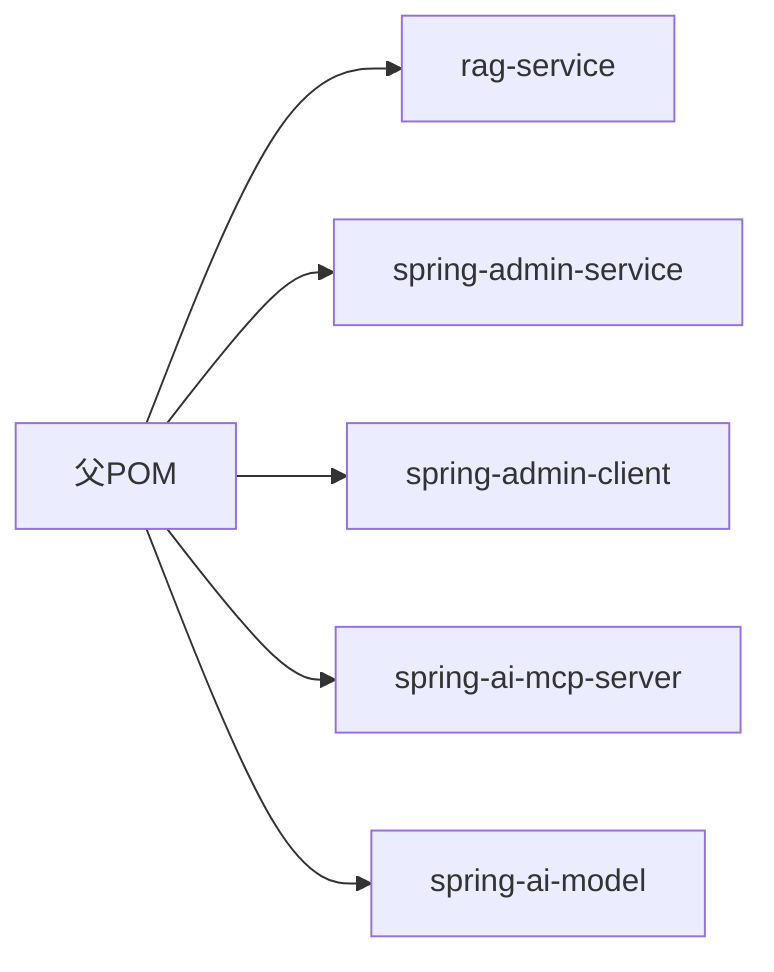

# Docker容器化部署

<cite>
**本文引用的文件**
- [pom.xml](file://pom.xml)
- [rag-service/pom.xml](file://rag-service/pom.xml)
- [rag-service/src/main/resources/application.yml](file://rag-service/src/main/resources/application.yml)
- [rag-service/src/main/resources/logback-dev.xml](file://rag-service/src/main/resources/logback-dev.xml)
- [spring-admin-service/pom.xml](file://spring-admin-service/pom.xml)
- [spring-admin-service/src/main/resources/application.yml](file://spring-admin-service/src/main/resources/application.yml)
- [spring-admin-service/src/main/java/cn/project/base/springadminservice/SpringAdminServiceApplication.java](file://spring-admin-service/src/main/java/cn/project/base/springadminservice/SpringAdminServiceApplication.java)
- [spring-admin-client/pom.xml](file://spring-admin-client/pom.xml)
- [spring-ai-mcp-server/src/main/resources/application.yml](file://spring-ai-mcp-server/src/main/resources/application.yml)
- [spring-ai-model/src/main/java/cn/project/base/springaimodel/controller/TTSController.java](file://spring-ai-model/src/main/java/cn/project/base/springaimodel/controller/TTSController.java)
</cite>

## 目录
1. [简介](#简介)
2. [项目结构](#项目结构)
3. [核心组件](#核心组件)
4. [架构总览](#架构总览)
5. [详细组件分析](#详细组件分析)
6. [依赖分析](#依赖分析)
7. [性能考虑](#性能考虑)
8. [故障排除指南](#故障排除指南)
9. [结论](#结论)
10. [附录](#附录)

## 简介
本指南面向RAG服务项目，提供从源码到Docker镜像的完整容器化部署方案。内容覆盖多阶段构建、依赖缓存策略、镜像体积优化、docker-compose编排、容器间通信与数据卷、环境变量配置、监控与日志、安全加固与资源限制，以及常见问题排查与性能调优建议。目标是帮助团队以可重复、可观测、可扩展的方式交付生产级容器化应用。

## 项目结构
该仓库采用多模块Maven工程组织，核心模块包括：
- rag-service：RAG主服务，基于Spring Boot，使用LangChain4j与Chroma向量库
- spring-admin-service：Spring Boot Admin服务端，用于集中监控
- spring-admin-client：各子服务作为客户端接入Admin服务端
- spring-ai-mcp-server：MCP服务器示例
- spring-ai-model：模型相关能力（含本地文件目录）

图表来源
- [pom.xml:11-22](file://pom.xml#L11-L22)
- [rag-service/pom.xml:5-10](file://rag-service/pom.xml#L5-L10)
- [spring-admin-service/pom.xml:5-10](file://spring-admin-service/pom.xml#L5-L10)
- [spring-admin-client/pom.xml:5-10](file://spring-admin-client/pom.xml#L5-L10)
- [spring-ai-mcp-server/pom.xml:5-10](file://spring-ai-mcp-server/pom.xml#L5-L10)
- [spring-ai-model/pom.xml:5-10](file://spring-ai-model/pom.xml#L5-L10)

章节来源
- [pom.xml:1-171](file://pom.xml#L1-L171)
- [rag-service/pom.xml:1-100](file://rag-service/pom.xml#L1-L100)

## 核心组件
- RAG主服务
  - 依赖：LangChain4j、OpenAI适配、Chroma客户端、Ollama适配
  - 运行：Spring Boot应用，暴露HTTP端口
- 监控体系
  - Admin服务端：集中展示各服务状态
  - Admin客户端：各子服务接入Admin服务端
- MCP服务端：示例MCP服务器，便于外部工具集成
- 模型能力：包含本地文件目录操作逻辑

章节来源
- [rag-service/pom.xml:23-80](file://rag-service/pom.xml#L23-L80)
- [spring-admin-service/pom.xml:32-57](file://spring-admin-service/pom.xml#L32-L57)
- [spring-admin-client/pom.xml:32-57](file://spring-admin-client/pom.xml#L32-L57)
- [spring-ai-mcp-server/src/main/resources/application.yml:1-13](file://spring-ai-mcp-server/src/main/resources/application.yml#L1-L13)
- [spring-ai-model/src/main/java/cn/project/base/springaimodel/controller/TTSController.java:89-114](file://spring-ai-model/src/main/java/cn/project/base/springaimodel/controller/TTSController.java#L89-L114)

## 架构总览
下图展示容器化后的典型拓扑：RAG主服务对外提供API；Admin服务端集中监控；Admin客户端在各子服务中启用；MCP服务端作为外部集成入口；日志通过文件落盘与采集器配合；向量数据库（Chroma）可独立部署或内嵌。

图表来源
- [spring-admin-service/src/main/resources/application.yml:1-6](file://spring-admin-service/src/main/resources/application.yml#L1-L6)
- [spring-ai-mcp-server/src/main/resources/application.yml:1-13](file://spring-ai-mcp-server/src/main/resources/application.yml#L1-L13)
- [rag-service/pom.xml:23-80](file://rag-service/pom.xml#L23-L80)

## 详细组件分析

### RAG主服务容器化要点
- 基础镜像选择：建议使用官方OpenJDK镜像，确保Java运行时一致
- 多阶段构建：
  - 第一阶段：使用Maven构建产物，启用依赖缓存策略（先复制pom再复制源码，再执行编译打包）
  - 第二阶段：仅拷贝最终可执行产物至精简运行时镜像，减少攻击面
- 端口与健康检查：暴露应用端口，配置健康检查探针
- 日志与数据卷：将日志目录映射到宿主机，便于采集与持久化
- 环境变量：通过环境变量注入配置（如数据库地址、模型服务地址等）

### Admin监控体系容器化要点
- Admin服务端：独立容器，开放管理端口
- Admin客户端：在各子服务容器中启用Actuator与客户端依赖，自动上报状态
- 网络：Admin服务端与客户端在同一Docker网络内，通过服务名互通

图表来源
- [spring-admin-service/src/main/java/cn/project/base/springadminservice/SpringAdminServiceApplication.java:1-15](file://spring-admin-service/src/main/java/cn/project/base/springadminservice/SpringAdminServiceApplication.java#L1-L15)
- [spring-admin-service/src/main/resources/application.yml:1-6](file://spring-admin-service/src/main/resources/application.yml#L1-L6)
- [spring-admin-client/pom.xml:32-57](file://spring-admin-client/pom.xml#L32-L57)

### MCP服务端容器化要点
- 独立容器运行，端口在配置中声明
- 与RAG主服务通过容器网络互通，便于外部工具调用

图表来源
- [spring-ai-mcp-server/src/main/resources/application.yml:1-13](file://spring-ai-mcp-server/src/main/resources/application.yml#L1-L13)
- [rag-service/pom.xml:23-80](file://rag-service/pom.xml#L23-L80)

### 模型能力与本地文件
- 模型能力模块包含本地文件目录创建与清理逻辑，容器化时需确保数据卷权限与路径正确映射

章节来源
- [spring-ai-model/src/main/java/cn/project/base/springaimodel/controller/TTSController.java:89-114](file://spring-ai-model/src/main/java/cn/project/base/springaimodel/controller/TTSController.java#L89-L114)

## 依赖分析
- 版本统一：父POM统一管理Spring Boot、Spring AI、LangChain4j等版本
- 模块依赖：各子模块按需引入依赖，避免冗余传递
- 插件：统一使用spring-boot-maven-plugin进行打包

图表来源
- [pom.xml:24-102](file://pom.xml#L24-L102)
- [rag-service/pom.xml:23-80](file://rag-service/pom.xml#L23-L80)
- [spring-admin-service/pom.xml:32-57](file://spring-admin-service/pom.xml#L32-L57)
- [spring-admin-client/pom.xml:32-57](file://spring-admin-client/pom.xml#L32-L57)
- [spring-ai-mcp-server/pom.xml:32-57](file://spring-ai-mcp-server/pom.xml#L32-L57)
- [spring-ai-model/pom.xml:32-57](file://spring-ai-model/pom.xml#L32-L57)

章节来源
- [pom.xml:1-171](file://pom.xml#L1-L171)
- [rag-service/pom.xml:1-100](file://rag-service/pom.xml#L1-L100)

## 性能考虑
- 多阶段构建：显著降低最终镜像体积，提升拉取与启动速度
- 依赖缓存：在CI流水线中复用依赖层缓存，缩短构建时间
- JVM参数：根据容器CPU/内存限制设置JVM堆大小与GC策略
- 端点与健康检查：合理配置存活/就绪探针，避免频繁重启
- 日志滚动：结合日志采集器，避免单文件过大影响IO

## 故障排除指南
- 启动失败
  - 检查端口占用与容器网络连通性
  - 查看应用日志与容器日志，定位异常堆栈
- 监控不可见
  - 确认Admin客户端已启用且与服务端网络互通
  - 校验Admin服务端端口与防火墙策略
- 日志未落盘
  - 确认日志配置文件中的路径映射到数据卷
  - 检查容器用户权限是否允许写入日志目录
- 向量库连接失败
  - 校验Chroma服务地址与端口
  - 确认容器网络与DNS解析

## 结论
通过多阶段构建、统一依赖管理与合理的容器编排，RAG服务项目可在保证功能完整性的同时实现高效、稳定、可观测的容器化交付。建议在生产环境中配套完善的监控、日志与安全策略，并持续进行性能调优与容量规划。

## 附录

### Dockerfile编写规范与最佳实践
- 基础镜像
  - 使用官方OpenJDK镜像，固定标签版本
- 分层优化
  - 先复制pom.xml，再复制源码，最后执行构建，充分利用缓存
  - 多阶段构建：仅在最终镜像中包含运行时所需文件
- 运行时安全
  - 使用非root用户运行应用
  - 移除不必要的开发工具与调试依赖
- 健康检查
  - 配置HTTP/GET或TCP探针，确保快速发现不可用实例
- 资源限制
  - 在compose中设置CPU与内存上限，避免资源争抢

### docker-compose.yml配置要点
- 服务定义
  - 为每个服务指定镜像、端口映射、环境变量、数据卷与网络
- 网络
  - 定义自定义网络，使服务间通过服务名互相访问
- 健康检查与重启策略
  - 为关键服务配置健康检查与重启策略
- 环境变量
  - 将敏感配置放入环境变量或密钥管理，避免硬编码

### 容器间通信、数据卷与环境变量
- 通信
  - 同一网络内的服务可通过服务名访问，无需暴露宿主端口
- 数据卷
  - 将日志目录、模型缓存目录映射到宿主机，确保数据持久化
- 环境变量
  - 通过环境变量注入数据库地址、模型服务地址、日志路径等

### 监控与日志
- 监控
  - 在各子服务启用Actuator与Admin客户端，Admin服务端集中展示
- 日志
  - 应用日志落盘到容器数据卷，结合日志采集器统一收集
  - 使用滚动策略控制单文件大小与归档数量

### 安全加固与资源限制
- 安全
  - 非root运行、只读根文件系统、最小权限原则
  - 禁止特权模式与宿主机挂载
- 资源
  - 限制CPU与内存，设置重启策略，避免雪崩效应

### 故障排除与性能调优
- 常见问题
  - 端口冲突、网络不通、权限不足、日志无法写入
- 性能调优
  - JVM参数调优、镜像体积优化、缓存策略与并发配置