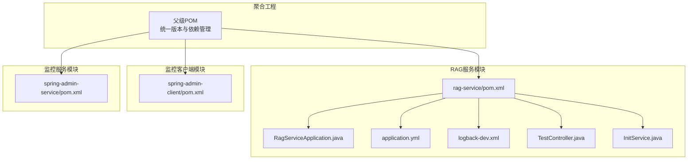
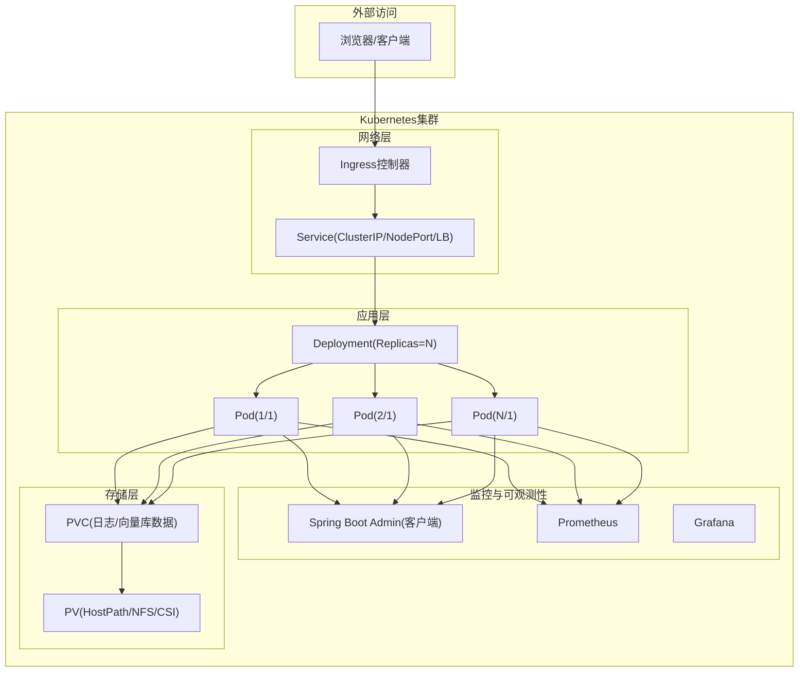
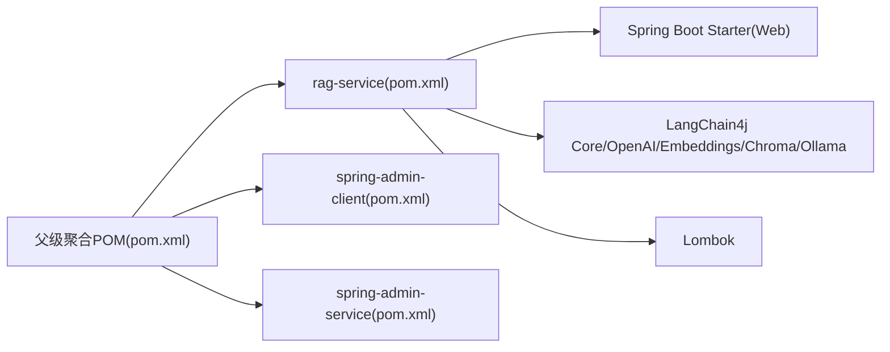

# Kubernetes集群部署

<cite>
**本文引用的文件**
- [RagServiceApplication.java](file://rag-service/src/main/java/cn/project/base/ragservice/RagServiceApplication.java)
- [application.yml](file://rag-service/src/main/resources/application.yml)
- [logback-dev.xml](file://rag-service/src/main/resources/logback-dev.xml)
- [TestController.java](file://rag-service/src/main/java/cn/project/base/ragservice/controller/TestController.java)
- [InitService.java](file://rag-service/src/main/java/cn/project/base/ragservice/service/InitService.java)
- [pom.xml](file://rag-service/pom.xml)
- [pom.xml](file://pom.xml)
- [spring-admin-client\pom.xml](file://spring-admin-client/pom.xml)
- [spring-admin-service\pom.xml](file://spring-admin-service/pom.xml)
</cite>

## 目录
1. [简介](#简介)
2. [项目结构](#项目结构)
3. [核心组件](#核心组件)
4. [架构总览](#架构总览)
5. [详细组件分析](#详细组件分析)
6. [依赖分析](#依赖分析)
7. [性能考虑](#性能考虑)
8. [故障排查指南](#故障排查指南)
9. [结论](#结论)
10. [附录](#附录)

## 简介
本指南面向在Kubernetes集群中部署RAG服务的工程实践，结合仓库中的Spring Boot应用与相关模块，给出从镜像构建、Helm Chart配置、Deployment/Service/ConfigMap/Secret资源定义，到健康检查、就绪探针、存活探针、水平Pod自动扩缩容（HPA）、Ingress控制器、持久化存储（PVC）与备份策略、集群资源规划与性能调优、以及滚动更新、回滚与故障恢复的运维操作建议。由于当前仓库未包含Kubernetes清单或Helm Chart文件，本指南提供可直接落地的配置模板与最佳实践，便于快速落地。

## 项目结构
RAG服务位于独立子模块中，采用Spring Boot构建，配合日志配置与基础控制器示例。父级聚合工程统一管理多模块依赖与版本。

图表来源
- [pom.xml:1-171](file://pom.xml#L1-L171)
- [pom.xml:1-100](file://rag-service/pom.xml#L1-L100)
- [RagServiceApplication.java:1-14](file://rag-service/src/main/java/cn/project/base/ragservice/RagServiceApplication.java#L1-L14)
- [application.yml:1-9](file://rag-service/src/main/resources/application.yml#L1-L9)
- [logback-dev.xml:1-208](file://rag-service/src/main/resources/logback-dev.xml#L1-L208)
- [TestController.java:1-17](file://rag-service/src/main/java/cn/project/base/ragservice/controller/TestController.java#L1-L17)
- [InitService.java:1-153](file://rag-service/src/main/java/cn/project/base/ragservice/service/InitService.java#L1-L153)
- [spring-admin-client\pom.xml:39-76](file://spring-admin-client/pom.xml#L39-L76)
- [spring-admin-service\pom.xml:39-76](file://spring-admin-service/pom.xml#L39-L76)

章节来源
- [pom.xml:1-171](file://pom.xml#L1-L171)
- [pom.xml:1-100](file://rag-service/pom.xml#L1-L100)

## 核心组件
- 应用入口与启动
  - 应用主类负责Spring Boot启动，暴露HTTP端口供Kubernetes Service与Ingress访问。
  - 参考路径：[RagServiceApplication.java:1-14](file://rag-service/src/main/java/cn/project/base/ragservice/RagServiceApplication.java#L1-L14)
- 基础配置
  - 应用名称与日志配置在资源目录中定义，便于容器内挂载与持久化。
  - 参考路径：[application.yml:1-9](file://rag-service/src/main/resources/application.yml#L1-L9)，[logback-dev.xml:1-208](file://rag-service/src/main/resources/logback-dev.xml#L1-L208)
- 示例控制器
  - 提供测试接口用于健康检查与功能验证。
  - 参考路径：[TestController.java:1-17](file://rag-service/src/main/java/cn/project/base/ragservice/controller/TestController.java#L1-L17)
- 初始化服务
  - 展示LangChain4j与Chroma/Ollama集成的典型流程，便于理解RAG工作流与外部依赖。
  - 参考路径：[InitService.java:1-153](file://rag-service/src/main/java/cn/project/base/ragservice/service/InitService.java#L1-L153)

章节来源
- [RagServiceApplication.java:1-14](file://rag-service/src/main/java/cn/project/base/ragservice/RagServiceApplication.java#L1-L14)
- [application.yml:1-9](file://rag-service/src/main/resources/application.yml#L1-L9)
- [logback-dev.xml:1-208](file://rag-service/src/main/resources/logback-dev.xml#L1-L208)
- [TestController.java:1-17](file://rag-service/src/main/java/cn/project/base/ragservice/controller/TestController.java#L1-L17)
- [InitService.java:1-153](file://rag-service/src/main/java/cn/project/base/ragservice/service/InitService.java#L1-L153)

## 架构总览
下图展示了RAG服务在Kubernetes中的典型部署拓扑：应用容器通过Service暴露，Ingress接收外部流量，Prometheus/Grafana用于监控，Spring Boot Admin用于管理端监控，日志通过Sidecar或HostPath持久化。

## 详细组件分析

### Deployment配置要点
- Pod模板
  - 容器镜像：基于Maven构建产物生成的JRE镜像，建议使用精简的基础镜像（如distroless或alpine）以降低攻击面。
  - 环境变量：通过ConfigMap注入应用配置；敏感参数通过Secret注入。
  - 资源请求与限制：CPU/内存按QPS与峰值内存估算设定，预留一定安全裕度。
  - 探针：存活探针与就绪探针指向应用健康端点，确保滚动更新期间流量不被切换到未就绪实例。
  - 挂载：挂载PVC用于日志与向量库数据持久化；必要时挂载ConfigMap/Secret。
- 副本数与亲和性
  - 至少2副本保证高可用；可配置Pod反亲和避免同Pod调度至同一节点。
- 更新策略
  - RollingUpdate：maxUnavailable=25%，maxSurge=25%；确保平滑切换。
- 安全上下文
  - 非root用户运行；禁用特权；只读根文件系统。

### Service配置要点
- 类型选择
  - 内部服务：ClusterIP（默认）。
  - 外部暴露：NodePort或LoadBalancer（若无Ingress）。
- 端口映射
  - 将容器端口映射到Service端口，便于Ingress或外部访问。
- 会话亲和
  - 默认无亲和；若需粘性会话，可启用sessionAffinity。

### ConfigMap与Secret
- ConfigMap
  - 存放非敏感配置（如application.yml内容），通过环境变量或挂载卷注入。
  - 建议将日志配置文件也放入ConfigMap，便于集中管理。
- Secret
  - 存放敏感信息（如第三方API密钥、数据库密码等），通过环境变量或挂载卷注入。
  - 建议启用KMS加密与最小权限访问。

### 健康检查与探针
- 存活探针（livenessProbe）
  - 检查应用进程是否存活，失败时重启容器。
  - 建议使用HTTP GET /actuator/health/liveness或应用自定义健康端点。
- 就绪探针（readinessProbe）
  - 检查应用是否已准备好接收流量，未就绪时不加入Service后端。
  - 建议使用HTTP GET /actuator/health/readiness或应用自定义健康端点。
- 探针参数
  - initialDelaySeconds：容器启动后延迟探测时间。
  - periodSeconds：探测周期。
  - timeoutSeconds：探测超时。
  - successThreshold：连续成功次数。
  - failureThreshold：连续失败次数。

### 水平Pod自动扩缩容（HPA）
- 触发条件
  - CPU利用率阈值（如70%）或自定义指标（如QPS、队列长度）。
- 最小/最大副本数
  - 结合SLA与成本控制设定合理边界。
- 扩缩策略
  - 控制扩缩步长与稳定窗口，避免频繁抖动。

### Ingress控制器与域名解析
- Ingress规则
  - 定义域名与路径转发至Service。
  - 可配置TLS证书（Ingress TLS或External-DNS+ACME）。
- 域名解析
  - 通过Cloudflare/AWS Route 53等DNS服务商将域名解析到Ingress入口IP。
- 负载均衡
  - Ingress控制器后端可对接云厂商负载均衡器（如ALB/NLB）。

### 持久化存储（PVC）与备份策略
- 存储需求
  - 日志：建议使用HostPath或NFS，容量按日志滚动策略与保留天数计算。
  - 向量库数据：若使用Chroma，建议使用持久卷（如RWO/RWX）或云存储CSI。
- PVC/StorageClass
  - 选择合适的StorageClass与访问模式（ReadWriteOnce/ReadWriteMany）。
- 备份策略
  - 日志：定期压缩归档至对象存储。
  - 向量库：导出集合或使用数据库快照，结合定时任务与对象存储归档。

### 集群资源规划与性能调优
- 资源规划
  - CPU：按QPS与模型推理耗时估算；预留20%-30%缓冲。
  - 内存：LangChain4j与Ollama推理占用较大，建议按峰值内存的1.5倍预留。
- 调优建议
  - JVM参数：设置堆大小上限与GC策略，避免Full GC。
  - 连接池：数据库/外部服务连接池按并发与超时合理配置。
  - 网络：Ingress/TLS卸载与连接复用优化吞吐。

### 滚动更新、回滚与故障恢复
- 滚动更新
  - 逐步替换Pod，确保就绪探针通过后再切换流量。
- 回滚
  - 通过Deployment历史版本回滚至稳定版本。
- 故障恢复
  - 探针失败：检查日志与依赖服务；必要时临时降级或限流。
  - 依赖不可用：熔断与降级策略，返回友好错误信息。

## 依赖分析
RAG服务模块依赖Spring Boot与LangChain4j生态，父级POM统一管理版本与依赖范围。

图表来源
- [pom.xml:23-80](file://rag-service/pom.xml#L23-L80)
- [pom.xml:36-102](file://pom.xml#L36-L102)
- [spring-admin-client\pom.xml:39-76](file://spring-admin-client/pom.xml#L39-L76)
- [spring-admin-service\pom.xml:39-76](file://spring-admin-service/pom.xml#L39-L76)

章节来源
- [pom.xml:23-80](file://rag-service/pom.xml#L23-L80)
- [pom.xml:36-102](file://pom.xml#L36-L102)
- [spring-admin-client\pom.xml:39-76](file://spring-admin-client/pom.xml#L39-L76)
- [spring-admin-service\pom.xml:39-76](file://spring-admin-service/pom.xml#L39-L76)

## 性能考虑
- 启动与冷启动
  - 预热向量库与模型加载，减少首次请求延迟。
- 并发与线程
  - 控制并发请求数与线程池大小，避免资源争用。
- 缓存与索引
  - 对热点查询结果进行缓存；优化向量库索引与分片。
- 监控与告警
  - 关键指标：P95/P99延迟、错误率、内存/CPU使用率、向量库查询耗时。

## 故障排查指南
- 健康检查失败
  - 查看就绪探针返回状态；确认应用端口与路径正确。
- 日志定位
  - 检查容器日志与持久化日志文件；关注ERROR/WARN级别。
  - 参考日志配置路径：[logback-dev.xml:1-208](file://rag-service/src/main/resources/logback-dev.xml#L1-L208)
- 依赖问题
  - 检查Chroma/Ollama服务连通性；确认URL与认证配置。
  - 参考初始化流程路径：[InitService.java:38-109](file://rag-service/src/main/java/cn/project/base/ragservice/service/InitService.java#L38-L109)
- 配置问题
  - 确认ConfigMap/Secret挂载与Key一致；避免明文配置。

章节来源
- [logback-dev.xml:1-208](file://rag-service/src/main/resources/logback-dev.xml#L1-L208)
- [InitService.java:38-109](file://rag-service/src/main/java/cn/project/base/ragservice/service/InitService.java#L38-L109)

## 结论
本指南提供了在Kubernetes中部署RAG服务的完整实践路径，涵盖资源配置、探针设置、HPA、Ingress、持久化与备份、资源规划与性能调优，以及滚动更新与故障恢复。建议结合实际集群规模与SLA目标调整参数，并持续完善监控与自动化运维流程。

## 附录
- 快速验证
  - 通过示例控制器接口进行健康检查与功能验证。
  - 参考路径：[TestController.java:12-15](file://rag-service/src/main/java/cn/project/base/ragservice/controller/TestController.java#L12-L15)
- 参考实现位置
  - 应用入口与配置：[RagServiceApplication.java:1-14](file://rag-service/src/main/java/cn/project/base/ragservice/RagServiceApplication.java#L1-L14)，[application.yml:1-9](file://rag-service/src/main/resources/application.yml#L1-L9)
  - 日志配置：[logback-dev.xml:1-208](file://rag-service/src/main/resources/logback-dev.xml#L1-L208)
  - RAG工作流示例：[InitService.java:38-109](file://rag-service/src/main/java/cn/project/base/ragservice/service/InitService.java#L38-L109)