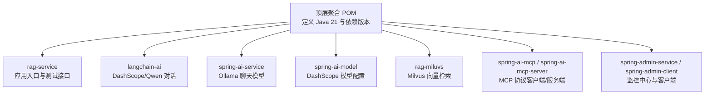
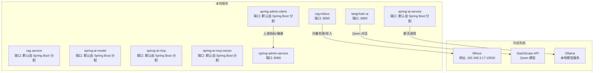
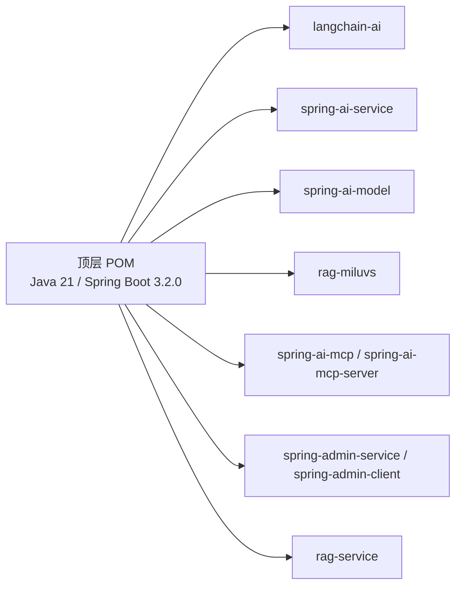
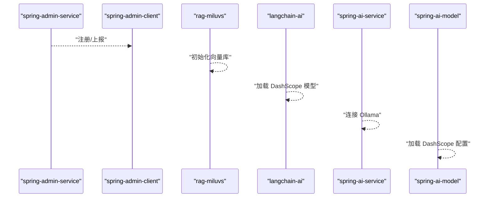

# 本地部署

<cite>
**本文引用的文件**
- [pom.xml](file://pom.xml)
- [RagServiceApplication.java](file://rag-service/src/main/java/cn/project/base/ragservice/RagServiceApplication.java)
- [application.yml（rag-service）](file://rag-service/src/main/resources/application.yml)
- [RagMiluvsApplication.java](file://rag-miluvs/src/main/java/cn/project/base/ragmiluvs/RagMiluvsApplication.java)
- [application.yml（rag-miluvs）](file://rag-miluvs/src/main/resources/application.yml)
- [RagController.java](file://rag-miluvs/src/main/java/cn/project/base/ragmiluvs/controller/RagController.java)
- [SpringAiServiceApplication.java](file://spring-ai-service/src/main/java/cn/project/base/springaiservice/SpringAiServiceApplication.java)
- [application.yml（spring-ai-service）](file://spring-ai-service/src/main/resources/application.yml)
- [SpringAiModelApplication.java](file://spring-ai-model/src/main/java/cn/project/base/springaimodel/SpringAiModelApplication.java)
- [application.yml（spring-ai-model）](file://spring-ai-model/src/main/resources/application.yml)
- [SpringAiMcpApplication.java](file://spring-ai-mcp/src/main/java/cn/project/base/springaimcp/SpringAiMcpApplication.java)
- [application.yml（spring-ai-mcp）](file://spring-ai-mcp/src/main/resources/application.yml)
- [SpringAiMcpServerApplication.java](file://spring-ai-mcp-server/src/main/java/cn/project/base/springaimcpserver/SpringAiMcpServerApplication.java)
- [application.yml（spring-ai-mcp-server）](file://spring-ai-mcp-server/src/main/resources/application.yml)
- [LangchainAiApplication.java](file://langchain-ai/src/main/java/cn/project/base/langchainai/LangchainAiApplication.java)
- [application.yml（langchain-ai）](file://langchain-ai/src/main/resources/application.yml)
- [ChatController.java](file://langchain-ai/src/main/java/cn/project/base/langchainai/controller/ChatController.java)
- [SpringAdminServiceApplication.java](file://spring-admin-service/src/main/java/cn/project/base/springadminservice/SpringAdminServiceApplication.java)
- [application.yml（spring-admin-service）](file://spring-admin-service/src/main/resources/application.yml)
- [SpringAdminClientApplication.java](file://spring-admin-client/src/main/java/cn/project/base/springadminclient/SpringAdminClientApplication.java)
- [application.yml（spring-admin-client）](file://spring-admin-client/src/main/resources/application.yml)
</cite>

## 目录
1. [简介](#简介)
2. [项目结构](#项目结构)
3. [核心组件](#核心组件)
4. [架构总览](#架构总览)
5. [详细组件分析](#详细组件分析)
6. [依赖分析](#依赖分析)
7. [性能考虑](#性能考虑)
8. [故障排查指南](#故障排查指南)
9. [结论](#结论)
10. [附录](#附录)

## 简介
本指南面向在本地部署 RAG 服务项目的用户，目标是帮助你在 Windows 环境下完成从 JDK 21 到 Maven 构建与运行的全流程操作，并明确各模块的启动顺序与依赖关系。你将获得：
- 完整的环境准备步骤（JDK 21、Maven、系统依赖）
- 项目克隆、编译与运行命令
- 各模块启动顺序与依赖关系说明
- 本地配置文件修改要点（数据库、向量库、AI 模型参数）
- 健康检查与基础功能验证方法
- 常见本地部署问题排查与解决思路

## 项目结构
该仓库采用多模块聚合工程组织，顶层 POM 定义了统一的 Java 版本与依赖版本管理，子模块按功能拆分：RAG 核心、LangChain AI、Spring AI、向量数据库 Milvus 集成、Spring Boot Admin 监控等。

图表来源
- [pom.xml:11-22](file://pom.xml#L11-L22)
- [pom.xml:24-35](file://pom.xml#L24-L35)

章节来源
- [pom.xml:1-171](file://pom.xml#L1-L171)

## 核心组件
- rag-service：应用入口与基础测试接口，用于验证本地服务可用性。
- langchain-ai：基于 DashScope 的 Qwen 对话能力，提供简单 GET 接口。
- spring-ai-service：通过 Ollama 运行本地大模型，支持聊天请求。
- spring-ai-model：DashScope 模型参数配置示例。
- rag-miluvs：集成 Milvus 向量数据库，提供初始化与流式对话接口。
- spring-ai-mcp / spring-ai-mcp-server：MCP 协议相关模块。
- spring-admin-service / spring-admin-client：Spring Boot Admin 监控体系。

章节来源
- [RagServiceApplication.java:1-14](file://rag-service/src/main/java/cn/project/base/ragservice/RagServiceApplication.java#L1-L14)
- [LangchainAiApplication.java:1-14](file://langchain-ai/src/main/java/cn/project/base/langchainai/LangchainAiApplication.java#L1-L14)
- [SpringAiServiceApplication.java:1-14](file://spring-ai-service/src/main/java/cn/project/base/springaiservice/SpringAiServiceApplication.java#L1-L14)
- [SpringAiModelApplication.java:1-14](file://spring-ai-model/src/main/java/cn/project/base/springaimodel/SpringAiModelApplication.java#L1-L14)
- [RagMiluvsApplication.java:1-14](file://rag-miluvs/src/main/java/cn/project/base/ragmiluvs/RagMiluvsApplication.java#L1-L14)
- [SpringAiMcpApplication.java:1-14](file://spring-ai-mcp/src/main/java/cn/project/base/springaimcp/SpringAiMcpApplication.java#L1-L14)
- [SpringAiMcpServerApplication.java:1-14](file://spring-ai-mcp-server/src/main/java/cn/project/base/springaimcpserver/SpringAiMcpServerApplication.java#L1-L14)
- [SpringAdminServiceApplication.java:1-14](file://spring-admin-service/src/main/java/cn/project/base/springadminservice/SpringAdminServiceApplication.java#L1-L14)
- [SpringAdminClientApplication.java:1-14](file://spring-admin-client/src/main/java/cn/project/base/springadminclient/SpringAdminClientApplication.java#L1-L14)

## 架构总览
下图展示了本地部署时各模块的角色与端口分配，以及与外部系统的交互（Milvus、DashScope、Ollama）。

图表来源
- [application.yml（rag-miluvs）:4-23](file://rag-miluvs/src/main/resources/application.yml#L4-L23)
- [application.yml（langchain-ai）:4-14](file://langchain-ai/src/main/resources/application.yml#L4-L14)
- [application.yml（spring-ai-service）:4-12](file://spring-ai-service/src/main/resources/application.yml#L4-L12)
- [application.yml（spring-admin-client）:4-24](file://spring-admin-client/src/main/resources/application.yml#L4-L24)
- [application.yml（spring-admin-service）:4-5](file://spring-admin-service/src/main/resources/application.yml#L4-L5)

## 详细组件分析

### rag-service
- 角色：应用入口与基础测试接口，便于快速验证本地服务可用性。
- 启动方式：直接运行主类。
- 配置要点：日志配置指向开发环境配置文件；可在此基础上扩展本地化配置。

章节来源
- [RagServiceApplication.java:1-14](file://rag-service/src/main/java/cn/project/base/ragservice/RagServiceApplication.java#L1-L14)
- [application.yml（rag-service）:1-9](file://rag-service/src/main/resources/application.yml#L1-L9)

### langchain-ai
- 角色：提供基于 DashScope 的 Qwen 对话能力，包含简单 GET 接口。
- 端口：8080
- 配置要点：DashScope API Key 与模型名称在配置文件中定义；可通过参数调整温度、TopK、TopP 等。

章节来源
- [LangchainAiApplication.java:1-14](file://langchain-ai/src/main/java/cn/project/base/langchainai/LangchainAiApplication.java#L1-L14)
- [application.yml（langchain-ai）:1-15](file://langchain-ai/src/main/resources/application.yml#L1-L15)
- [ChatController.java:1-36](file://langchain-ai/src/main/java/cn/project/base/langchainai/controller/ChatController.java#L1-L36)

### spring-ai-service
- 角色：通过 Ollama 运行本地大模型，支持聊天请求。
- 端口：默认由 Spring Boot 分配
- 配置要点：Ollama 基础地址与模型名在配置文件中定义；日志级别已开启调试输出。

章节来源
- [SpringAiServiceApplication.java:1-14](file://spring-ai-service/src/main/java/cn/project/base/springaiservice/SpringAiServiceApplication.java#L1-L14)
- [application.yml（spring-ai-service）:1-13](file://spring-ai-service/src/main/resources/application.yml#L1-L13)

### spring-ai-model
- 角色：DashScope 模型参数配置示例，包含 API Key 与模型选项。
- 端口：默认由 Spring Boot 分配

章节来源
- [SpringAiModelApplication.java:1-14](file://spring-ai-model/src/main/java/cn/project/base/springaimodel/SpringAiModelApplication.java#L1-L14)
- [application.yml（spring-ai-model）:1-10](file://spring-ai-model/src/main/resources/application.yml#L1-L10)

### rag-miluvs
- 角色：集成 Milvus 向量数据库，提供初始化与流式对话接口。
- 端口：8099
- 配置要点：Milvus 地址与端口、DashScope API Key、Embedding 模型名称等。

章节来源
- [RagMiluvsApplication.java:1-14](file://rag-miluvs/src/main/java/cn/project/base/ragmiluvs/RagMiluvsApplication.java#L1-L14)
- [application.yml（rag-miluvs）:1-24](file://rag-miluvs/src/main/resources/application.yml#L1-L24)
- [RagController.java:1-29](file://rag-miluvs/src/main/java/cn/project/base/ragmiluvs/controller/RagController.java#L1-L29)

### spring-ai-mcp 与 spring-ai-mcp-server
- 角色：MCP 协议相关模块，分别作为客户端与服务端。
- 端口：默认由 Spring Boot 分配

章节来源
- [SpringAiMcpApplication.java:1-14](file://spring-ai-mcp/src/main/java/cn/project/base/springaimcp/SpringAiMcpApplication.java#L1-L14)
- [application.yml（spring-ai-mcp）:1-10](file://spring-ai-mcp/src/main/resources/application.yml#L1-L10)
- [SpringAiMcpServerApplication.java:1-14](file://spring-ai-mcp-server/src/main/java/cn/project/base/springaimcpserver/SpringAiMcpServerApplication.java#L1-L14)
- [application.yml（spring-ai-mcp-server）:1-10](file://spring-ai-mcp-server/src/main/resources/application.yml#L1-L10)

### spring-admin-service 与 spring-admin-client
- 角色：Spring Boot Admin 监控中心与客户端，客户端负责暴露管理端点并上报状态。
- 端口：服务端 8089，客户端默认由 Spring Boot 分配
- 配置要点：客户端需正确指向 Admin 服务地址；管理端点全部开放以便观察。

章节来源
- [SpringAdminServiceApplication.java:1-14](file://spring-admin-service/src/main/java/cn/project/base/springadminservice/SpringAdminServiceApplication.java#L1-L14)
- [application.yml（spring-admin-service）:1-6](file://spring-admin-service/src/main/resources/application.yml#L1-L6)
- [SpringAdminClientApplication.java:1-14](file://spring-admin-client/src/main/java/cn/project/base/springadminclient/SpringAdminClientApplication.java#L1-L14)
- [application.yml（spring-admin-client）:1-36](file://spring-admin-client/src/main/resources/application.yml#L1-L36)

## 依赖分析
- 版本与工具链
  - Java：21
  - Maven：使用 Maven Wrapper（每个模块自带 mvnw.cmd）
  - Spring Boot：3.2.0
  - Spring AI / LangChain4j：版本在顶层 POM 中统一管理
- 模块间依赖
  - rag-miluvs 依赖 Milvus 与 DashScope
  - spring-ai-service 依赖 Ollama
  - spring-admin-client 依赖 spring-admin-service
  - 其余模块为独立服务，无直接循环依赖

图表来源
- [pom.xml:24-35](file://pom.xml#L24-L35)
- [pom.xml:11-22](file://pom.xml#L11-L22)

章节来源
- [pom.xml:1-171](file://pom.xml#L1-L171)

## 性能考虑
- 日志级别：部分模块已开启调试日志，建议在生产或压测场景下调低日志级别以减少 IO 开销。
- 向量检索：Milvus 初始化与查询耗时与数据规模、索引策略相关，建议在本地测试时控制样本规模。
- 本地模型：Ollama 模型加载与推理受本地硬件影响较大，建议在资源充足时进行测试。

## 故障排查指南
- 端口冲突
  - 现象：服务启动失败，提示端口占用
  - 处理：修改对应模块的 server.port 或释放占用端口
  - 参考：各模块 application.yml 中的 server.port 配置
- 外部服务不可达
  - Milvus：确认地址与端口正确，网络可达
  - DashScope：确认 API Key 正确且网络可达
  - Ollama：确认本地服务地址与模型存在
- 管理端点无法访问
  - 现象：Admin 客户端无法上报或查看健康状态
  - 处理：确保 Admin 客户端正确指向 Admin 服务地址，管理端点已全部开放
- 日志定位
  - 使用各模块 application.yml 中的日志配置，结合控制台输出定位问题

章节来源
- [application.yml（rag-miluvs）:4-23](file://rag-miluvs/src/main/resources/application.yml#L4-L23)
- [application.yml（spring-admin-client）:10-24](file://spring-admin-client/src/main/resources/application.yml#L10-L24)

## 结论
通过本指南，你可以完成从 JDK 21 到 Maven 构建与运行的全流程，并掌握各模块的启动顺序与依赖关系。建议先验证独立模块的可用性，再逐步联调跨模块功能（如 rag-miluvs 与 Milvus、DashScope、Ollama 的组合）。遇到问题时，优先检查端口、外部服务连通性与配置文件中的关键参数。

## 附录

### 环境准备与安装
- JDK 21
  - 下载并安装 JDK 21
  - 配置 JAVA_HOME 与 PATH
- Maven
  - 使用项目自带的 Maven Wrapper（每个模块包含 mvnw.cmd）
  - 无需全局安装 Maven，直接使用 ./mvnw.cmd 即可
- 系统依赖
  - Windows 环境下确保防火墙允许所需端口通信
  - 如需 Milvus：确保本地或远端 Milvus 服务可用
  - 如需 DashScope：确保网络可达并具备有效 API Key
  - 如需 Ollama：确保本地 Ollama 服务已启动并可访问

### 项目克隆、编译与运行
- 克隆仓库后，在根目录执行构建与运行
  - 构建：./mvnw.cmd clean install
  - 运行：进入任一模块目录，执行 ./mvnw.cmd spring-boot:run
- 或在根目录一次性构建所有模块并运行指定模块

章节来源
- [pom.xml:111-138](file://pom.xml#L111-L138)

### 启动顺序与依赖关系
- 建议顺序
  1) 启动 spring-admin-service（监控中心）
  2) 启动 spring-admin-client（监控客户端）
  3) 启动 rag-miluvs（向量检索）
  4) 启动 langchain-ai（DashScope 对话）
  5) 启动 spring-ai-service（Ollama 聊天）
  6) 启动 spring-ai-model（DashScope 模型配置）
  7) 启动 spring-ai-mcp / spring-ai-mcp-server（MCP 协议）
  8) 启动 rag-service（基础测试接口）

图表来源
- [SpringAdminServiceApplication.java:1-14](file://spring-admin-service/src/main/java/cn/project/base/springadminservice/SpringAdminServiceApplication.java#L1-L14)
- [SpringAdminClientApplication.java:1-14](file://spring-admin-client/src/main/java/cn/project/base/springadminclient/SpringAdminClientApplication.java#L1-L14)
- [RagMiluvsApplication.java:1-14](file://rag-miluvs/src/main/java/cn/project/base/ragmiluvs/RagMiluvsApplication.java#L1-L14)
- [LangchainAiApplication.java:1-14](file://langchain-ai/src/main/java/cn/project/base/langchainai/LangchainAiApplication.java#L1-L14)
- [SpringAiServiceApplication.java:1-14](file://spring-ai-service/src/main/java/cn/project/base/springaiservice/SpringAiServiceApplication.java#L1-L14)
- [SpringAiModelApplication.java:1-14](file://spring-ai-model/src/main/java/cn/project/base/springaimodel/SpringAiModelApplication.java#L1-L14)

### 本地配置文件修改示例
- 数据库连接
  - 若模块涉及数据库，请在对应模块的 application.yml 中添加数据源配置项（如驱动、URL、用户名、密码），并确保本地数据库服务可用
- 向量数据库配置
  - 修改 Milvus 地址与端口，确保网络可达
  - 示例路径：[application.yml（rag-miluvs）:7-9](file://rag-miluvs/src/main/resources/application.yml#L7-L9)
- AI 模型参数
  - DashScope API Key 与模型名称
    - 示例路径：[application.yml（rag-miluvs）:14-22](file://rag-miluvs/src/main/resources/application.yml#L14-L22)
    - 示例路径：[application.yml（langchain-ai）:10-12](file://langchain-ai/src/main/resources/application.yml#L10-L12)
    - 示例路径：[application.yml（spring-ai-model）:5-9](file://spring-ai-model/src/main/resources/application.yml#L5-L9)
  - Ollama 基础地址与模型名
    - 示例路径：[application.yml（spring-ai-service）:5-8](file://spring-ai-service/src/main/resources/application.yml#L5-L8)
- 监控与管理端点
  - Admin 客户端需正确指向 Admin 服务地址
    - 示例路径：[application.yml（spring-admin-client）:4-5](file://spring-admin-client/src/main/resources/application.yml#L4-L5)
  - 管理端点全部开放以便观察
    - 示例路径：[application.yml（spring-admin-client）:11-15](file://spring-admin-client/src/main/resources/application.yml#L11-L15)

### 验证服务是否正常运行
- 健康检查
  - 访问 Admin 客户端的健康端点，确认服务状态为 UP
  - 示例路径：[application.yml（spring-admin-client）:18-21](file://spring-admin-client/src/main/resources/application.yml#L18-L21)
- 基础功能测试
  - rag-service：访问模块内测试接口，确认日志输出
    - 示例路径：[TestController.java:12-15](file://rag-service/src/main/java/cn/project/base/ragservice/controller/TestController.java#L12-L15)
  - langchain-ai：访问 GET 接口，确认返回内容
    - 示例路径：[ChatController.java:18-21](file://langchain-ai/src/main/java/cn/project/base/langchainai/controller/ChatController.java#L18-L21)
  - rag-miluvs：调用初始化与流式对话接口，确认向量导入与回答输出
    - 示例路径：[RagController.java:18-27](file://rag-miluvs/src/main/java/cn/project/base/ragmiluvs/controller/RagController.java#L18-L27)