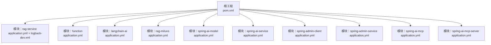
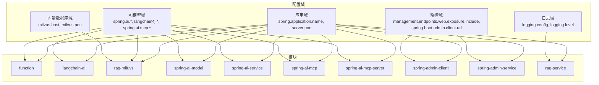
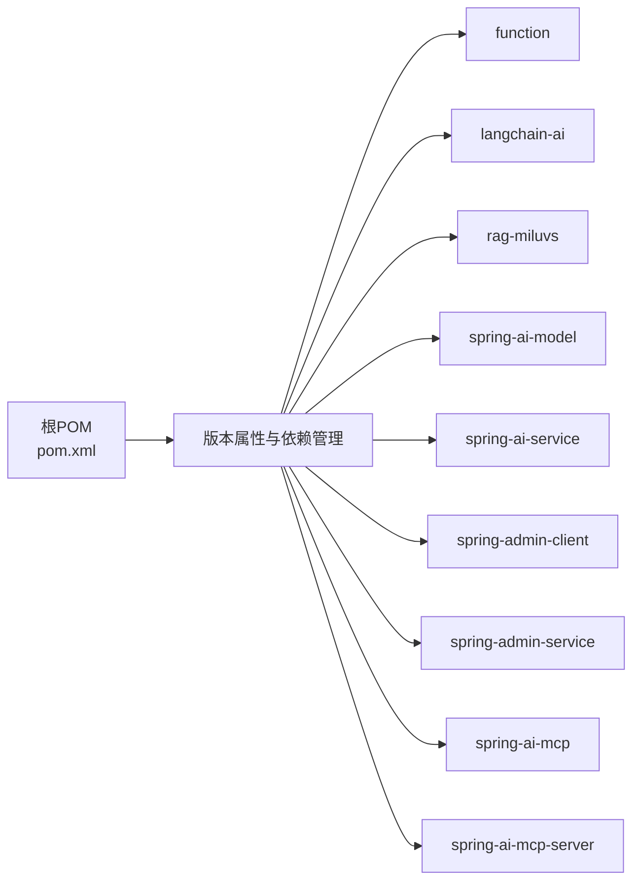

# 环境配置

<cite>
**本文引用的文件**
- [pom.xml](file://pom.xml)
- [application.yml（rag-service）](file://rag-service/src/main/resources/application.yml)
- [logback-dev.xml（rag-service）](file://rag-service/src/main/resources/logback-dev.xml)
- [application.yml（function）](file://function/src/main/resources/application.yml)
- [application.yml（langchain-ai）](file://langchain-ai/src/main/resources/application.yml)
- [application.yml（rag-miluvs）](file://rag-miluvs/src/main/resources/application.yml)
- [application.yml（spring-ai-model）](file://spring-ai-model/src/main/resources/application.yml)
- [application.yml（spring-ai-service）](file://spring-ai-service/src/main/resources/application.yml)
- [application.yml（spring-ai-mcp）](file://spring-ai-mcp/src/main/resources/application.yml)
- [application.yml（spring-ai-mcp-server）](file://spring-ai-mcp-server/src/main/resources/application.yml)
- [application.yml（spring-admin-client）](file://spring-admin-client/src/main/resources/application.yml)
- [application.yml（spring-admin-service）](file://spring-admin-service/src/main/resources/application.yml)
- [SecurityConfig（spring-admin-service）](file://spring-admin-service/src/main/java/cn/project/base/springadminservice/config/SecurityConfig.java)
</cite>

## 目录
1. [简介](#简介)
2. [项目结构](#项目结构)
3. [核心组件](#核心组件)
4. [架构总览](#架构总览)
5. [详细组件分析](#详细组件分析)
6. [依赖分析](#依赖分析)
7. [性能考虑](#性能考虑)
8. [故障排查指南](#故障排查指南)
9. [结论](#结论)
10. [附录](#附录)

## 简介
本指南面向RAG服务项目的环境配置与运维，聚焦以下目标：
- 提供开发、测试、生产三类环境的配置文件模板与最佳实践
- 明确数据库连接、向量数据库连接与AI模型API密钥的配置要点
- 解释配置文件优先级与覆盖规则
- 规范敏感信息保护与密钥管理策略
- 说明环境变量与配置中心的集成思路
- 提供配置热更新与动态配置管理的可行方案
- 给出配置验证与常见问题排查工具与技巧

## 项目结构
该仓库采用多模块Maven聚合工程组织，各子模块独立配置，便于按功能拆分部署与治理。

图表来源
- [pom.xml:11-22](file://pom.xml#L11-L22)

章节来源
- [pom.xml:11-22](file://pom.xml#L11-L22)

## 核心组件
- 配置文件类型与位置
  - YAML配置：各模块的资源目录下存在 application.yml，用于定义应用名称、端口、日志、AI模型、向量数据库等运行期参数
  - XML日志配置：开发环境通过 logback-dev.xml 指定日志格式、滚动策略与输出目标
- 关键配置域
  - 应用域：spring.application.name、server.port
  - 日志域：logging.config、logging.level
  - AI模型域：spring.ai.* 或 langchain4j.* 或 spring.ai.mcp.*
  - 向量数据库域：milvus.host/port
  - 监控与管理域：management.endpoints.web.exposure.include、spring.boot.admin.client.url

章节来源
- [application.yml（rag-service）:1-9](file://rag-service/src/main/resources/application.yml#L1-L9)
- [logback-dev.xml（rag-service）:1-208](file://rag-service/src/main/resources/logback-dev.xml#L1-L208)
- [application.yml（function）:1-14](file://function/src/main/resources/application.yml#L1-L14)
- [application.yml（langchain-ai）:1-15](file://langchain-ai/src/main/resources/application.yml#L1-L15)
- [application.yml（rag-miluvs）:1-24](file://rag-miluvs/src/main/resources/application.yml#L1-L24)
- [application.yml（spring-ai-model）:1-10](file://spring-ai-model/src/main/resources/application.yml#L1-L10)
- [application.yml（spring-ai-service）:1-13](file://spring-ai-service/src/main/resources/application.yml#L1-L13)
- [application.yml（spring-ai-mcp）:1-35](file://spring-ai-mcp/src/main/resources/application.yml#L1-L35)
- [application.yml（spring-ai-mcp-server）:1-13](file://spring-ai-mcp-server/src/main/resources/application.yml#L1-L13)
- [application.yml（spring-admin-client）:1-36](file://spring-admin-client/src/main/resources/application.yml#L1-L36)
- [application.yml（spring-admin-service）:1-6](file://spring-admin-service/src/main/resources/application.yml#L1-L6)

## 架构总览
下图展示各模块的配置关系与关键参数域：

图表来源
- [application.yml（function）:1-14](file://function/src/main/resources/application.yml#L1-L14)
- [application.yml（langchain-ai）:1-15](file://langchain-ai/src/main/resources/application.yml#L1-L15)
- [application.yml（rag-miluvs）:1-24](file://rag-miluvs/src/main/resources/application.yml#L1-L24)
- [application.yml（spring-ai-model）:1-10](file://spring-ai-model/src/main/resources/application.yml#L1-L10)
- [application.yml（spring-ai-service）:1-13](file://spring-ai-service/src/main/resources/application.yml#L1-L13)
- [application.yml（spring-ai-mcp）:1-35](file://spring-ai-mcp/src/main/resources/application.yml#L1-L35)
- [application.yml（spring-ai-mcp-server）:1-13](file://spring-ai-mcp-server/src/main/resources/application.yml#L1-L13)
- [application.yml（spring-admin-client）:1-36](file://spring-admin-client/src/main/resources/application.yml#L1-L36)
- [application.yml（spring-admin-service）:1-6](file://spring-admin-service/src/main/resources/application.yml#L1-L6)
- [application.yml（rag-service）:1-9](file://rag-service/src/main/resources/application.yml#L1-L9)
- [logback-dev.xml（rag-service）:1-208](file://rag-service/src/main/resources/logback-dev.xml#L1-L208)

## 详细组件分析

### 开发环境配置模板与最佳实践
- 建议在本地开发使用YAML配置，并结合环境变量进行最小化覆盖
- 日志建议启用控制台输出与按级别滚动文件输出，便于快速定位问题
- 对于需要本地模型的服务，可使用Ollama或DashScope等本地/云侧模型进行联调

章节来源
- [application.yml（rag-service）:1-9](file://rag-service/src/main/resources/application.yml#L1-L9)
- [logback-dev.xml（rag-service）:1-208](file://rag-service/src/main/resources/logback-dev.xml#L1-L208)
- [application.yml（spring-ai-service）:1-13](file://spring-ai-service/src/main/resources/application.yml#L1-L13)

### 测试环境配置模板与最佳实践
- 将敏感参数（如API密钥、数据库连接串）置于环境变量或配置中心
- 使用较严格的日志级别，开启必要的健康检查与指标暴露
- 向量数据库建议使用与生产隔离的实例地址与端口

章节来源
- [application.yml（spring-admin-client）:1-36](file://spring-admin-client/src/main/resources/application.yml#L1-L36)
- [application.yml（rag-miluvs）:1-24](file://rag-miluvs/src/main/resources/application.yml#L1-L24)

### 生产环境配置模板与最佳实践
- 所有敏感参数必须通过环境变量或配置中心注入，禁止硬编码
- 管理端点仅暴露必要接口，设置基础路径与访问控制
- 日志输出建议落盘并开启压缩与容量上限，避免磁盘打满
- 安全配置建议禁用明文密码，采用加密存储与强口令策略

章节来源
- [application.yml（spring-admin-client）:1-36](file://spring-admin-client/src/main/resources/application.yml#L1-L36)
- [application.yml（spring-admin-service）:1-6](file://spring-admin-service/src/main/resources/application.yml#L1-L6)
- [SecurityConfig（spring-admin-service）:37-42](file://spring-admin-service/src/main/java/cn/project/base/springadminservice/config/SecurityConfig.java#L37-L42)

### 数据库连接配置
- 当前仓库未发现数据库连接相关配置，建议在各模块的 application.yml 中新增 spring.datasource.* 或 spring.r2dbc.* 相关键值，并通过环境变量注入URL、用户名、密码
- 建议使用连接池参数（如最大连接数、空闲超时、连接超时）以提升稳定性

[本节为通用配置建议，不直接分析具体文件，故无“章节来源”]

### 向量数据库连接参数
- Milvus连接参数位于 application.yml 的 milvus 节点，包含 host 与 port
- 建议将 host/port 通过环境变量注入，以便在不同环境切换

章节来源
- [application.yml（rag-miluvs）:7-10](file://rag-miluvs/src/main/resources/application.yml#L7-L10)

### AI模型API密钥设置
- DashScope API密钥与模型名称在多个模块中出现，建议统一从环境变量读取并在启动时校验
- Ollama本地模型通过 base-url 与 model 配置，建议同样使用环境变量覆盖

章节来源
- [application.yml（function）:7-12](file://function/src/main/resources/application.yml#L7-L12)
- [application.yml（langchain-ai）:7-12](file://langchain-ai/src/main/resources/application.yml#L7-L12)
- [application.yml（rag-miluvs）:13-22](file://rag-miluvs/src/main/resources/application.yml#L13-L22)
- [application.yml（spring-ai-model）:4-9](file://spring-ai-model/src/main/resources/application.yml#L4-L9)
- [application.yml（spring-ai-service）:5-8](file://spring-ai-service/src/main/resources/application.yml#L5-L8)

### 配置文件优先级与覆盖规则
- Spring Boot配置优先级（从高到低）：
  1) 命令行参数
  2) SPRING_APPLICATION_JSON
  3) 操作系统环境变量
  4) application-{profile}.yml
  5) application.yml
  6) @PropertySource
  7) 默认属性
- profile覆盖：可通过激活profile（如 dev/test/prod）加载对应文件，再由环境变量进行最终覆盖
- 多模块场景：每个模块独立生效，若需跨模块共享配置，建议集中到公共模块或配置中心

章节来源
- [application.yml（rag-service）:1-9](file://rag-service/src/main/resources/application.yml#L1-L9)
- [application.yml（spring-admin-client）:1-36](file://spring-admin-client/src/main/resources/application.yml#L1-L36)

### 敏感信息保护与密钥管理
- 禁止将密钥写入版本控制；使用环境变量或配置中心注入
- 生产环境禁用明文密码；使用加密算法与密钥管理服务
- 建议对日志输出进行脱敏处理，避免打印敏感字段

章节来源
- [SecurityConfig（spring-admin-service）:37-42](file://spring-admin-service/src/main/java/cn/project/base/springadminservice/config/SecurityConfig.java#L37-L42)

### 环境变量与配置中心集成
- 环境变量：通过 SPRING_APPLICATION_JSON 或直接设置环境变量覆盖配置项
- 配置中心：建议对接Spring Cloud Config或Nacos，按模块拉取配置并支持灰度发布
- 动态刷新：结合Spring Cloud Bus或@RefreshScope实现配置热更新

[本节为通用集成建议，不直接分析具体文件，故无“章节来源”]

### 配置热更新与动态配置管理
- Spring Cloud生态：使用Config + Bus实现配置变更广播与刷新
- 本地热更新：通过Actuator的refresh端点触发刷新（需谨慎评估影响范围）
- 建议：对关键配置（如AI模型密钥、数据库连接）增加校验与回滚机制

[本节为通用实现建议，不直接分析具体文件，故无“章节来源”]

### 配置验证与错误排查
- 启动阶段：检查关键配置是否加载成功（如端口占用、日志路径可写、AI密钥可用）
- 运行阶段：利用管理端点查看健康状态、配置信息与环境详情
- 日志排查：结合logback-dev.xml的多级别输出定位问题；生产环境关注滚动策略与磁盘空间

章节来源
- [application.yml（spring-admin-client）:10-28](file://spring-admin-client/src/main/resources/application.yml#L10-L28)
- [logback-dev.xml（rag-service）:171-196](file://rag-service/src/main/resources/logback-dev.xml#L171-L196)

## 依赖分析
- 依赖版本集中在根POM的属性与依赖管理中，确保各模块版本一致
- 各模块按需引入AI相关starter，避免不必要的依赖冲突

图表来源
- [pom.xml:24-102](file://pom.xml#L24-L102)

章节来源
- [pom.xml:24-102](file://pom.xml#L24-L102)

## 性能考虑
- 日志滚动策略：合理设置单文件大小与归档数量，避免I/O瓶颈
- 连接池参数：数据库与向量库连接池需根据QPS与延迟调优
- 模型推理：本地模型与云端模型的并发与超时配置需平衡吞吐与响应时间

[本节为通用性能建议，不直接分析具体文件，故无“章节来源”]

## 故障排查指南
- 端口冲突：确认server.port未被占用，或通过环境变量覆盖
- 日志不可写：检查logback-dev.xml中文件路径权限与磁盘空间
- AI密钥无效：核对环境变量注入与模型配置项是否一致
- 管理端点不可达：检查management端点暴露与基础路径配置

章节来源
- [application.yml（spring-admin-client）:10-18](file://spring-admin-client/src/main/resources/application.yml#L10-L18)
- [logback-dev.xml（rag-service）:171-196](file://rag-service/src/main/resources/logback-dev.xml#L171-L196)

## 结论
- 通过模块化配置与环境变量/配置中心，可实现开发、测试、生产的灵活切换
- 敏感信息必须脱敏与加密，生产环境严格限制管理端点暴露
- 建议引入配置热更新与动态刷新能力，配合完善的验证与回滚机制

[本节为总结性内容，不直接分析具体文件，故无“章节来源”]

## 附录

### 配置文件模板清单
- 应用域模板
  - spring.application.name
  - server.port
- 日志域模板
  - logging.config
  - logging.level.*
- AI模型域模板
  - spring.ai.* 或 langchain4j.* 或 spring.ai.mcp.*
- 向量数据库域模板
  - milvus.host
  - milvus.port
- 监控域模板
  - management.endpoints.web.exposure.include
  - spring.boot.admin.client.url

[本节为模板说明，不直接分析具体文件，故无“章节来源”]