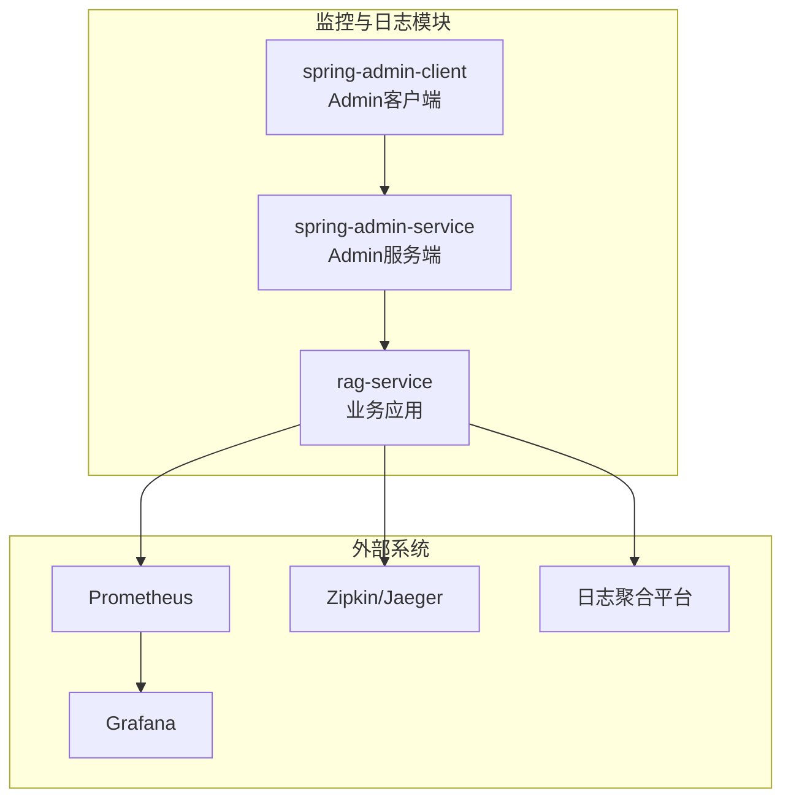
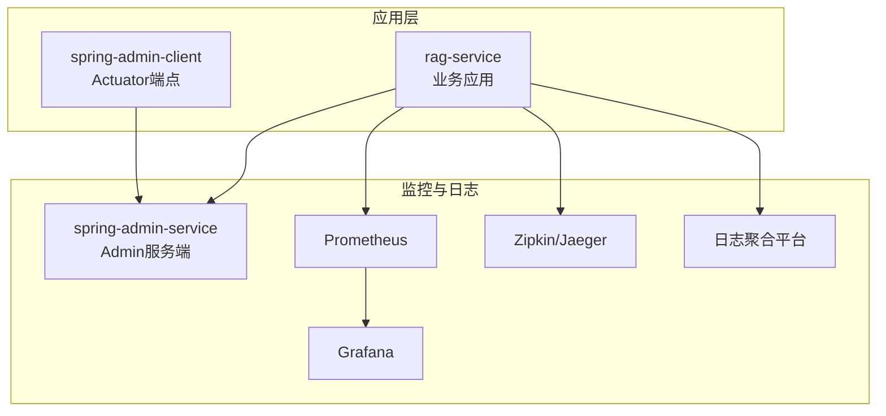
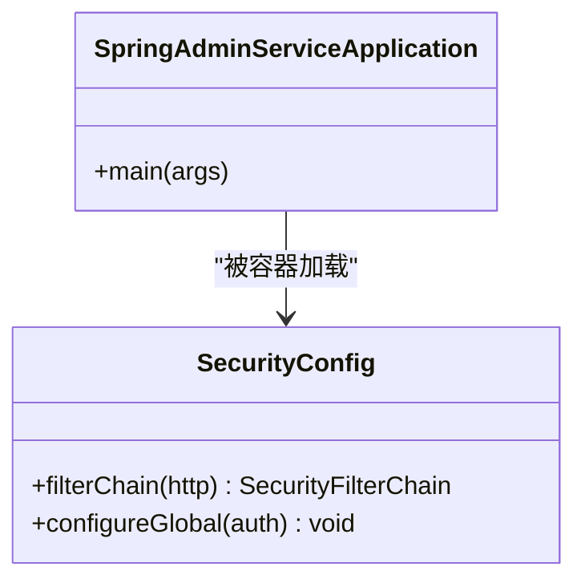
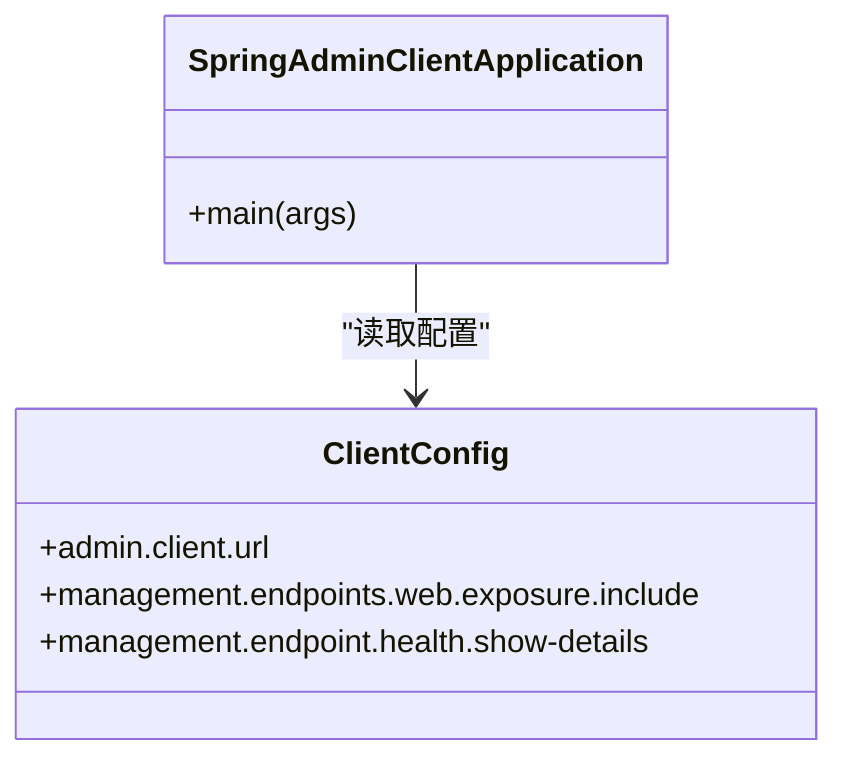
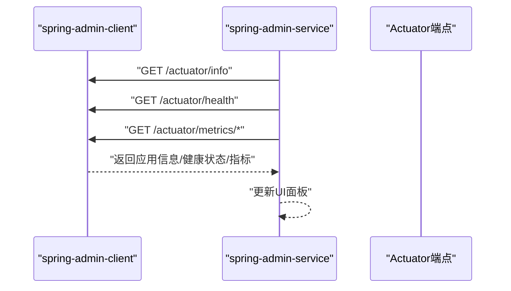
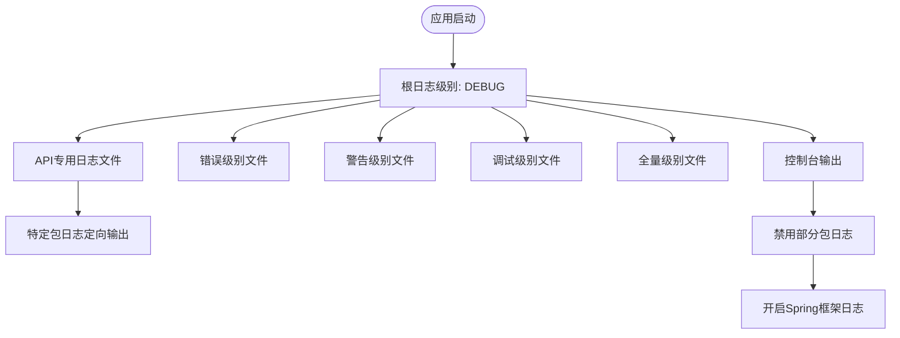
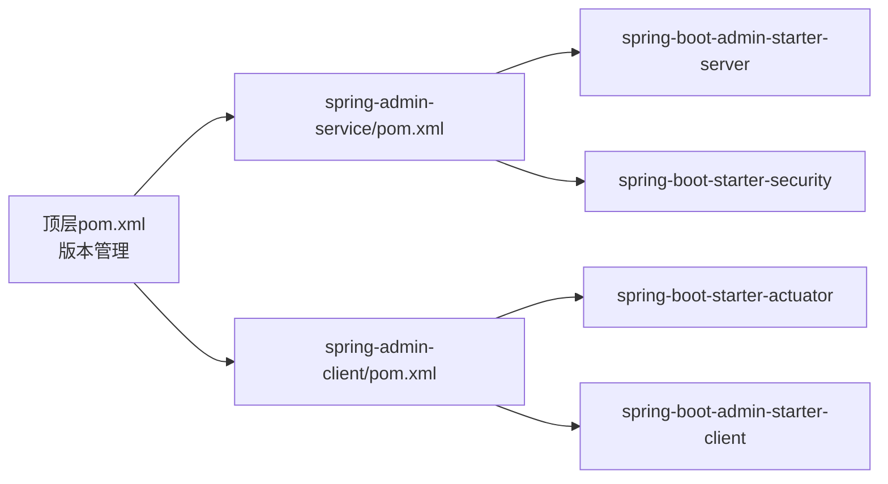

# 监控与日志

<cite>
**本文引用的文件**
- [pom.xml](file://pom.xml)
- [spring-admin-service/pom.xml](file://spring-admin-service/pom.xml)
- [spring-admin-client/pom.xml](file://spring-admin-client/pom.xml)
- [spring-admin-service/src/main/resources/application.yml](file://spring-admin-service/src/main/resources/application.yml)
- [spring-admin-client/src/main/resources/application.yml](file://spring-admin-client/src/main/resources/application.yml)
- [spring-admin-service/src/main/java/cn/project/base/springadminservice/SpringAdminServiceApplication.java](file://spring-admin-service/src/main/java/cn/project/base/springadminservice/SpringAdminServiceApplication.java)
- [spring-admin-service/src/main/java/cn/project/base/springadminservice/config/SecurityConfig.java](file://spring-admin-service/src/main/java/cn/project/base/springadminservice/config/SecurityConfig.java)
- [spring-admin-client/src/main/java/cn/project/base/springadminclient/SpringAdminClientApplication.java](file://spring-admin-client/src/main/java/cn/project/base/springadminclient/SpringAdminClientApplication.java)
- [rag-service/src/main/resources/application.yml](file://rag-service/src/main/resources/application.yml)
- [rag-service/src/main/resources/logback-dev.xml](file://rag-service/src/main/resources/logback-dev.xml)
</cite>

## 目录
1. [简介](#简介)
2. [项目结构](#项目结构)
3. [核心组件](#核心组件)
4. [架构总览](#架构总览)
5. [详细组件分析](#详细组件分析)
6. [依赖分析](#依赖分析)
7. [性能考虑](#性能考虑)
8. [故障排查指南](#故障排查指南)
9. [结论](#结论)
10. [附录](#附录)

## 简介
本指南面向RAG服务项目的监控与日志配置，围绕以下目标展开：
- 部署与配置Spring Boot Admin服务端与客户端，启用Actuator监控端点与UI界面
- 提供Prometheus与Grafana的集成思路与配置要点
- 解释应用日志的结构化配置与日志级别管理
- 说明分布式追踪系统的集成方法（Zipkin或Jaeger）
- 提供告警规则配置与通知渠道设置建议
- 介绍性能指标监控与业务指标统计方法
- 说明日志聚合与分析平台的集成方案
- 设计监控仪表板与关键指标定义

当前仓库已具备Spring Boot Admin服务端与客户端的基础配置，Actuator端点已启用，日志采用Logback结构化配置。后续可在现有基础上扩展Prometheus/Grafana、Tracing与告警平台。

## 项目结构
本项目采用多模块Maven聚合工程组织，监控与日志相关的关键模块如下：
- spring-admin-service：Spring Boot Admin服务端，提供UI与管理界面
- spring-admin-client：Spring Boot Admin客户端，暴露Actuator端点并注册到服务端
- rag-service：示例业务模块，包含日志配置与基础应用配置

图表来源
- [spring-admin-service/pom.xml:39-41](file://spring-admin-service/pom.xml#L39-L41)
- [spring-admin-client/pom.xml:42-44](file://spring-admin-client/pom.xml#L42-L44)
- [spring-admin-service/src/main/resources/application.yml:1-5](file://spring-admin-service/src/main/resources/application.yml#L1-L5)
- [spring-admin-client/src/main/resources/application.yml:1-35](file://spring-admin-client/src/main/resources/application.yml#L1-L35)

章节来源
- [pom.xml:11-22](file://pom.xml#L11-L22)

## 核心组件
- Spring Boot Admin服务端
  - 作用：提供统一的监控UI，展示各客户端实例状态、健康检查、指标与日志
  - 关键配置：端口、安全认证、Actuator访问策略
- Spring Boot Admin客户端
  - 作用：暴露Actuator端点，向服务端注册自身状态
  - 关键配置：Admin服务端地址、Actuator端点暴露范围、基础路径
- Actuator端点
  - 作用：提供健康检查、指标、环境信息等运行时数据
  - 当前配置：端点全部暴露，基础路径为/observe
- 日志系统（Logback）
  - 作用：结构化输出日志，按级别分文件滚动，支持trace_id上下文
  - 当前配置：控制台+多级别文件输出，特定包定向到API日志文件

章节来源
- [spring-admin-service/src/main/resources/application.yml:1-5](file://spring-admin-service/src/main/resources/application.yml#L1-L5)
- [spring-admin-client/src/main/resources/application.yml:10-35](file://spring-admin-client/src/main/resources/application.yml#L10-L35)
- [rag-service/src/main/resources/application.yml:1-9](file://rag-service/src/main/resources/application.yml#L1-L9)
- [rag-service/src/main/resources/logback-dev.xml:1-208](file://rag-service/src/main/resources/logback-dev.xml#L1-L208)

## 架构总览
下图展示了监控与日志的整体架构：客户端应用通过Actuator暴露运行时数据，Admin服务端统一汇聚并呈现；Prometheus抓取指标，Grafana可视化；Zipkin/Jaeger收集链路追踪；日志由Logback结构化输出并可接入日志聚合平台。

图表来源
- [spring-admin-client/pom.xml:34-36](file://spring-admin-client/pom.xml#L34-L36)
- [spring-admin-service/pom.xml:37-41](file://spring-admin-service/pom.xml#L37-L41)
- [spring-admin-client/src/main/resources/application.yml:10-17](file://spring-admin-client/src/main/resources/application.yml#L10-L17)
- [spring-admin-service/src/main/java/cn/project/base/springadminservice/config/SecurityConfig.java:18-29](file://spring-admin-service/src/main/java/cn/project/base/springadminservice/config/SecurityConfig.java#L18-L29)

## 详细组件分析

### Spring Boot Admin 服务端
- 启动类注解：启用Admin服务端功能
- 安全配置：基于内存认证，开放部分路径放行，关闭CSRF
- 端口与名称：默认端口与应用名已在配置文件中定义

图表来源
- [spring-admin-service/src/main/java/cn/project/base/springadminservice/SpringAdminServiceApplication.java:7-14](file://spring-admin-service/src/main/java/cn/project/base/springadminservice/SpringAdminServiceApplication.java#L7-L14)
- [spring-admin-service/src/main/java/cn/project/base/springadminservice/config/SecurityConfig.java:18-42](file://spring-admin-service/src/main/java/cn/project/base/springadminservice/config/SecurityConfig.java#L18-L42)

章节来源
- [spring-admin-service/src/main/java/cn/project/base/springadminservice/SpringAdminServiceApplication.java:7-14](file://spring-admin-service/src/main/java/cn/project/base/springadminservice/SpringAdminServiceApplication.java#L7-L14)
- [spring-admin-service/src/main/java/cn/project/base/springadminservice/config/SecurityConfig.java:18-42](file://spring-admin-service/src/main/java/cn/project/base/springadminservice/config/SecurityConfig.java#L18-L42)
- [spring-admin-service/src/main/resources/application.yml:1-5](file://spring-admin-service/src/main/resources/application.yml#L1-L5)

### Spring Boot Admin 客户端
- Actuator依赖：启用运行时监控端点
- Admin客户端依赖：连接Admin服务端进行注册
- 端点配置：全部端点暴露，基础路径为/observe，健康检查显示细节

图表来源
- [spring-admin-client/src/main/java/cn/project/base/springadminclient/SpringAdminClientApplication.java:7-13](file://spring-admin-client/src/main/java/cn/project/base/springadminclient/SpringAdminClientApplication.java#L7-L13)
- [spring-admin-client/src/main/resources/application.yml:1-35](file://spring-admin-client/src/main/resources/application.yml#L1-L35)

章节来源
- [spring-admin-client/src/main/java/cn/project/base/springadminclient/SpringAdminClientApplication.java:7-13](file://spring-admin-client/src/main/java/cn/project/base/springadminclient/SpringAdminClientApplication.java#L7-L13)
- [spring-admin-client/src/main/resources/application.yml:10-35](file://spring-admin-client/src/main/resources/application.yml#L10-L35)

### Actuator端点调用时序
以下时序图展示了客户端应用启动后，Admin服务端如何通过Actuator端点拉取运行时信息。

图表来源
- [spring-admin-client/src/main/resources/application.yml:10-17](file://spring-admin-client/src/main/resources/application.yml#L10-L17)
- [spring-admin-service/src/main/java/cn/project/base/springadminservice/config/SecurityConfig.java:18-29](file://spring-admin-service/src/main/java/cn/project/base/springadminservice/config/SecurityConfig.java#L18-L29)

### 日志结构化与级别管理
- 结构化模式：包含时间戳、日志级别、trace_id、线程名、Logger位置与消息
- 多级别文件：按ERROR/WARN/INFO/DEBUG/TRACE/ALL分别输出
- API专用日志：特定包日志定向输出到API文件
- 包级过滤：禁用Tomcat与Swagger文档相关日志，开启Spring框架日志

图表来源
- [rag-service/src/main/resources/logback-dev.xml:189-208](file://rag-service/src/main/resources/logback-dev.xml#L189-L208)

章节来源
- [rag-service/src/main/resources/application.yml:4-8](file://rag-service/src/main/resources/application.yml#L4-L8)
- [rag-service/src/main/resources/logback-dev.xml:1-208](file://rag-service/src/main/resources/logback-dev.xml#L1-L208)

### 分布式追踪集成（Zipkin/Jaeger）
- 建议在业务应用中引入Tracing依赖（如OpenTelemetry或Spring Cloud Sleuth），并配置Zipkin/Jaeger导出器
- 将trace_id注入到日志上下文中，便于日志与链路关联
- 在Grafana中通过Tracing数据源构建端到端链路视图

[本节为通用实践说明，未直接分析具体文件，故不附加章节来源]

### Prometheus 与 Grafana 集成
- Prometheus抓取：配置Prometheus以/observe为基础路径抓取Actuator指标端点
- Grafana可视化：创建数据源指向Prometheus，基于指标构建仪表板
- 关键指标建议：JVM内存、GC、HTTP请求速率/延迟、线程池、数据库连接池、业务自定义指标

[本节为通用实践说明，未直接分析具体文件，故不附加章节来源]

### 告警规则与通知渠道
- 告警规则：基于Prometheus告警规则定义CPU/内存/请求失败率/延迟阈值
- 通知渠道：集成邮件、Slack、企业微信或PagerDuty等
- 建议：结合Admin UI的健康状态与Grafana仪表板进行联动

[本节为通用实践说明，未直接分析具体文件，故不附加章节来源]

## 依赖分析
- Admin服务端与客户端均通过Maven依赖引入，版本由顶层pom统一管理
- 客户端需引入Actuator依赖以暴露端点
- 服务端引入安全依赖用于保护UI与登录

图表来源
- [pom.xml:24-35](file://pom.xml#L24-L35)
- [spring-admin-client/pom.xml:34-44](file://spring-admin-client/pom.xml#L34-L44)
- [spring-admin-service/pom.xml:37-41](file://spring-admin-service/pom.xml#L37-L41)

章节来源
- [pom.xml:24-35](file://pom.xml#L24-L35)
- [spring-admin-client/pom.xml:34-44](file://spring-admin-client/pom.xml#L34-L44)
- [spring-admin-service/pom.xml:37-41](file://spring-admin-service/pom.xml#L37-L41)

## 性能考虑
- 日志级别：生产环境建议提升至INFO/WARN，避免过多DEBUG/TRACE日志
- 指标采集：合理设置Prometheus抓取间隔，避免对应用造成压力
- Tracing采样：根据流量规模调整采样率，降低开销
- 文件滚动：确保日志文件大小与保留策略适配磁盘容量

[本节为通用指导，未直接分析具体文件]

## 故障排查指南
- Admin UI无法访问
  - 检查服务端端口与安全配置是否允许访问
  - 确认客户端Admin服务端URL配置正确
- Actuator端点不可见
  - 检查端点暴露范围与基础路径配置
  - 确认客户端已引入Actuator依赖
- 日志未按级别输出
  - 检查Logback配置文件路径与级别过滤器
  - 确认特定包日志定向输出配置生效

章节来源
- [spring-admin-service/src/main/java/cn/project/base/springadminservice/config/SecurityConfig.java:18-29](file://spring-admin-service/src/main/java/cn/project/base/springadminservice/config/SecurityConfig.java#L18-L29)
- [spring-admin-client/src/main/resources/application.yml:10-17](file://spring-admin-client/src/main/resources/application.yml#L10-L17)
- [rag-service/src/main/resources/logback-dev.xml:189-208](file://rag-service/src/main/resources/logback-dev.xml#L189-L208)

## 结论
本项目已具备Spring Boot Admin监控与日志的基础能力：Admin服务端与客户端配置就绪，Actuator端点暴露，Logback结构化日志配置完成。建议在此基础上继续集成Prometheus/Grafana、Zipkin/Jaeger与日志聚合平台，完善告警与仪表板设计，形成完整的可观测性体系。

[本节为总结性内容，未直接分析具体文件]

## 附录

### 快速部署清单
- 启动Admin服务端：确认端口与安全配置
- 启动Admin客户端：确认Admin服务端URL与Actuator端点
- 访问Admin UI：在浏览器打开服务端地址
- 配置Prometheus：添加抓取任务，基础路径为/observe
- 配置Grafana：添加Prometheus数据源，导入常用模板
- 集成Tracing：引入Zipkin/Jaeger导出器，配置trace_id日志上下文
- 告警配置：编写Prometheus告警规则并接入通知渠道

[本节为操作指引，未直接分析具体文件]