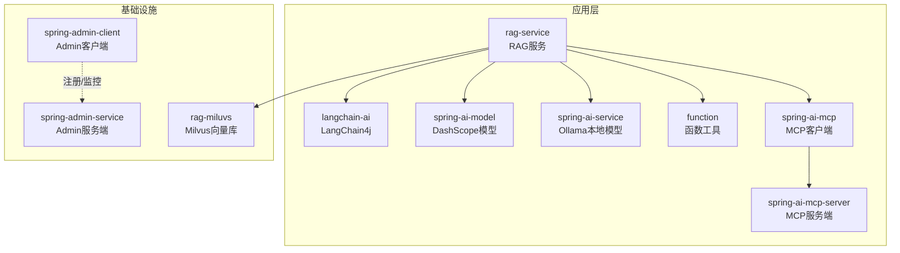
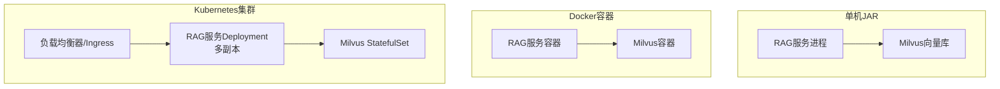
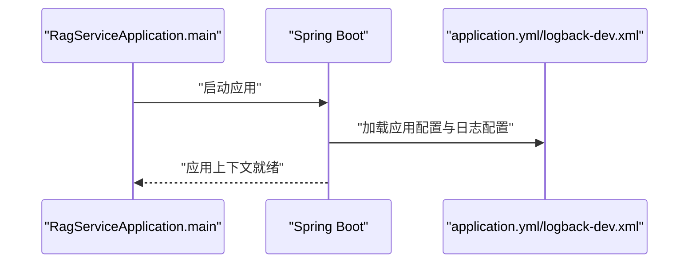
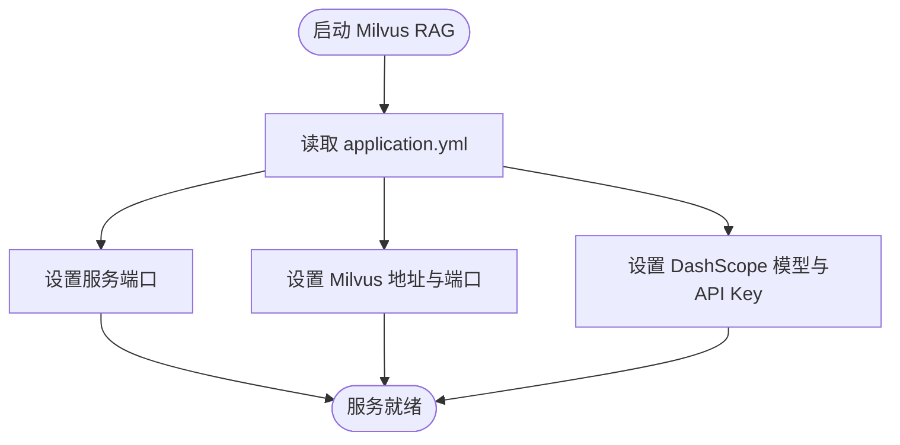
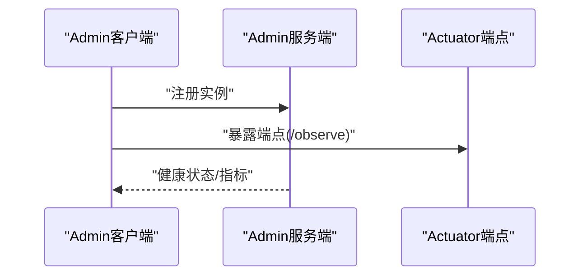
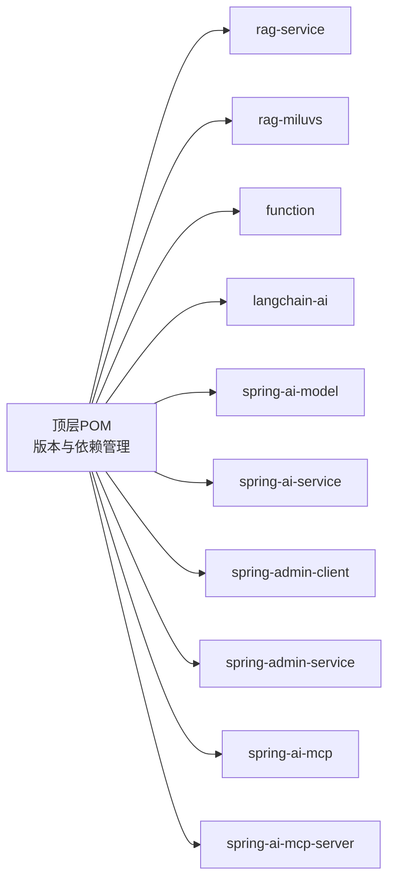

# 部署指南

<cite>
**本文引用的文件**
- [pom.xml](file://pom.xml)
- [RagServiceApplication.java](file://rag-service/src/main/java/cn/project/base/ragservice/RagServiceApplication.java)
- [application.yml（RAG服务）](file://rag-service/src/main/resources/application.yml)
- [logback-dev.xml（RAG服务日志）](file://rag-service/src/main/resources/logback-dev.xml)
- [application.yml（Milvus RAG）](file://rag-miluvs/src/main/resources/application.yml)
- [application.yml（Spring Boot Admin 服务端）](file://spring-admin-service/src/main/resources/application.yml)
- [application.yml（Spring Boot Admin 客户端）](file://spring-admin-client/src/main/resources/application.yml)
- [application.yml（Function 模块）](file://function/src/main/resources/application.yml)
- [application.yml（LangChain AI 模块）](file://langchain-ai/src/main/resources/application.yml)
- [application.yml（Spring AI Model 模块）](file://spring-ai-model/src/main/resources/application.yml)
- [application.yml（Spring AI Service 模块）](file://spring-ai-service/src/main/resources/application.yml)
- [application.yml（Spring AI MCP 客户端）](file://spring-ai-mcp/src/main/resources/application.yml)
</cite>

## 目录
1. [简介](#简介)
2. [项目结构](#项目结构)
3. [核心组件](#核心组件)
4. [架构总览](#架构总览)
5. [详细组件分析](#详细组件分析)
6. [依赖关系分析](#依赖关系分析)
7. [性能与资源规划](#性能与资源规划)
8. [监控与日志](#监控与日志)
9. [自动化部署与CI/CD](#自动化部署与cicd)
10. [高可用、负载均衡与容灾](#高可用负载均衡与容灾)
11. [故障排查](#故障排查)
12. [结论](#结论)

## 简介
本指南面向RAG服务项目，提供从单机JAR部署到Docker容器化再到Kubernetes集群部署的完整落地方案。内容涵盖环境准备、依赖安装、配置设置、自动化部署脚本与CI/CD流水线示例、高可用与容灾策略、监控与日志、性能调优与资源规划，以及常见问题排查。

## 项目结构
该仓库采用多模块Maven聚合工程组织，包含RAG服务主体、向量数据库对接、AI模型服务、监控与管理等子模块。核心模块如下：
- rag-service：RAG服务主模块，负责对外HTTP接口与业务编排
- rag-miluvs：对接Milvus向量数据库的RAG实现
- function：函数工具与调用能力
- langchain-ai：基于LangChain4j的AI能力封装
- spring-ai-model：DashScope模型调用示例
- spring-ai-service：Ollama本地模型服务集成
- spring-admin-service：Spring Boot Admin服务端
- spring-admin-client：Spring Boot Admin客户端
- spring-ai-mcp / spring-ai-mcp-server：MCP协议客户端与服务端示例

图表来源
- [pom.xml:11-22](file://pom.xml#L11-L22)
- [application.yml（RAG服务）:1-9](file://rag-service/src/main/resources/application.yml#L1-L9)
- [application.yml（Milvus RAG）:1-24](file://rag-miluvs/src/main/resources/application.yml#L1-L24)
- [application.yml（Spring Boot Admin 服务端）:1-6](file://spring-admin-service/src/main/resources/application.yml#L1-L6)
- [application.yml（Spring Boot Admin 客户端）:1-36](file://spring-admin-client/src/main/resources/application.yml#L1-L36)
- [application.yml（LangChain AI 模块）:1-15](file://langchain-ai/src/main/resources/application.yml#L1-L15)
- [application.yml（Spring AI Model 模块）:1-10](file://spring-ai-model/src/main/resources/application.yml#L1-L10)
- [application.yml（Spring AI Service 模块）:1-13](file://spring-ai-service/src/main/resources/application.yml#L1-L13)
- [application.yml（Spring AI MCP 客户端）:1-35](file://spring-ai-mcp/src/main/resources/application.yml#L1-L35)

章节来源
- [pom.xml:11-22](file://pom.xml#L11-L22)

## 核心组件
- RAG服务主模块：提供对外HTTP接口与业务编排，入口类负责启动Spring Boot应用。
- Milvus对接模块：配置向量库地址、模型密钥与嵌入模型参数。
- AI能力模块：
  - LangChain4j：DashScope聊天、流式聊天与Embedding模型配置
  - DashScope模型：通过API Key与模型名称进行调用
  - Ollama本地模型：通过本地HTTP服务访问模型
- 监控与管理：Spring Boot Admin服务端与客户端，用于健康检查、指标暴露与集中管理
- MCP协议：MCP客户端与服务端示例，支持异步连接与SSE

章节来源
- [RagServiceApplication.java:1-14](file://rag-service/src/main/java/cn/project/base/ragservice/RagServiceApplication.java#L1-L14)
- [application.yml（Milvus RAG）:1-24](file://rag-miluvs/src/main/resources/application.yml#L1-L24)
- [application.yml（LangChain AI 模块）:1-15](file://langchain-ai/src/main/resources/application.yml#L1-L15)
- [application.yml（Spring AI Model 模块）:1-10](file://spring-ai-model/src/main/resources/application.yml#L1-L10)
- [application.yml（Spring AI Service 模块）:1-13](file://spring-ai-service/src/main/resources/application.yml#L1-L13)
- [application.yml（Spring Boot Admin 服务端）:1-6](file://spring-admin-service/src/main/resources/application.yml#L1-L6)
- [application.yml（Spring Boot Admin 客户端）:1-36](file://spring-admin-client/src/main/resources/application.yml#L1-L36)
- [application.yml（Spring AI MCP 客户端）:1-35](file://spring-ai-mcp/src/main/resources/application.yml#L1-L35)

## 架构总览
下图展示RAG服务在不同部署形态下的典型拓扑：单机JAR、Docker容器化与Kubernetes集群。

图表来源
- [application.yml（Milvus RAG）:1-24](file://rag-miluvs/src/main/resources/application.yml#L1-L24)
- [application.yml（RAG服务）:1-9](file://rag-service/src/main/resources/application.yml#L1-L9)

## 详细组件分析

### RAG服务（rag-service）
- 启动入口：Spring Boot应用入口类负责启动应用上下文
- 日志配置：使用自定义Logback配置，支持按级别滚动与API专用日志文件
- 应用配置：指定应用名称与日志配置文件位置

图表来源
- [RagServiceApplication.java:9-11](file://rag-service/src/main/java/cn/project/base/ragservice/RagServiceApplication.java#L9-L11)
- [application.yml（RAG服务）:1-9](file://rag-service/src/main/resources/application.yml#L1-L9)
- [logback-dev.xml:189-208](file://rag-service/src/main/resources/logback-dev.xml#L189-L208)

章节来源
- [RagServiceApplication.java:1-14](file://rag-service/src/main/java/cn/project/base/ragservice/RagServiceApplication.java#L1-L14)
- [application.yml（RAG服务）:1-9](file://rag-service/src/main/resources/application.yml#L1-L9)
- [logback-dev.xml:1-208](file://rag-service/src/main/resources/logback-dev.xml#L1-L208)

### Milvus RAG（rag-miluvs）
- 端口与服务地址：配置服务端口与Milvus主机与端口
- 模型配置：DashScope API Key与聊天/嵌入模型名称

图表来源
- [application.yml（Milvus RAG）:4-24](file://rag-miluvs/src/main/resources/application.yml#L4-L24)

章节来源
- [application.yml（Milvus RAG）:1-24](file://rag-miluvs/src/main/resources/application.yml#L1-L24)

### Spring Boot Admin（监控与管理）
- Admin服务端：提供Web界面与管理端点
- Admin客户端：注册到Admin服务端，暴露管理端点供统一查看

图表来源
- [application.yml（Spring Boot Admin 服务端）:1-6](file://spring-admin-service/src/main/resources/application.yml#L1-L6)
- [application.yml（Spring Boot Admin 客户端）:10-24](file://spring-admin-client/src/main/resources/application.yml#L10-L24)

章节来源
- [application.yml（Spring Boot Admin 服务端）:1-6](file://spring-admin-service/src/main/resources/application.yml#L1-L6)
- [application.yml（Spring Boot Admin 客户端）:1-36](file://spring-admin-client/src/main/resources/application.yml#L1-L36)

### LangChain AI（LangChain4j）
- 配置DashScope聊天模型、流式聊天模型与Embedding模型
- 日志级别可调，便于开发调试

章节来源
- [application.yml（LangChain AI 模块）:1-15](file://langchain-ai/src/main/resources/application.yml#L1-L15)

### Spring AI Model（DashScope模型）
- 通过DashScope API Key与模型名称进行调用
- 支持不同模型切换以满足不同场景

章节来源
- [application.yml（Spring AI Model 模块）:1-10](file://spring-ai-model/src/main/resources/application.yml#L1-L10)

### Spring AI Service（Ollama本地模型）
- 通过本地HTTP服务访问模型，适合离线或低延迟场景
- 日志级别可按包名细化

章节来源
- [application.yml（Spring AI Service 模块）:1-13](file://spring-ai-service/src/main/resources/application.yml#L1-L13)

### Function（函数工具）
- 提供函数工具与调用能力，端口默认8080
- 集成DashScope API Key与模型选项

章节来源
- [application.yml（Function 模块）:1-14](file://function/src/main/resources/application.yml#L1-L14)

### Spring AI MCP（MCP协议）
- 客户端启用MCP协议，支持异步类型与SSE连接
- 字符集编码与日志级别可配置

章节来源
- [application.yml（Spring AI MCP 客户端）:1-35](file://spring-ai-mcp/src/main/resources/application.yml#L1-L35)

## 依赖关系分析
- Maven聚合工程统一管理版本与依赖，核心版本属性集中在顶层POM中
- 各模块独立运行，通过配置文件与外部服务（Milvus、DashScope、Ollama）交互
- Admin客户端依赖Admin服务端进行统一监控

图表来源
- [pom.xml:24-102](file://pom.xml#L24-L102)

章节来源
- [pom.xml:11-22](file://pom.xml#L11-L22)
- [pom.xml:24-102](file://pom.xml#L24-L102)

## 性能与资源规划
- JVM与语言版本：Java 21，建议在生产环境使用JDK 21 LTS
- 内存与GC：根据模型大小与并发量评估堆内存；优先选择G1或ZGC以降低停顿
- 并发与线程：依据CPU核数与I/O密集度调整线程池大小；对Milvus与DashScope调用建议使用连接池
- 模型选择：大模型（如deepseek-r1:14b）需更大内存与显存；小模型（如text-embedding-v2）对资源要求较低
- 存储与IO：Milvus数据目录与日志目录应位于高性能磁盘；日志滚动策略避免磁盘打满
- 网络与带宽：DashScope与Ollama网络延迟直接影响响应时间，建议就近部署或内网直连

## 监控与日志
- 日志配置：RAG服务使用自定义Logback配置，按级别滚动并输出至固定路径，同时提供API专用日志文件
- 管理端点：Admin客户端暴露管理端点，Health详情可配置为Always显示
- 建议：结合Prometheus/Grafana采集指标，集中化日志收集（如Filebeat+ES/Elasticsearch），并设置告警阈值

章节来源
- [logback-dev.xml:1-208](file://rag-service/src/main/resources/logback-dev.xml#L1-L208)
- [application.yml（Spring Boot Admin 客户端）:10-24](file://spring-admin-client/src/main/resources/application.yml#L10-L24)

## 自动化部署与CI/CD
以下为通用流水线思路，具体实现请结合团队CI/CD平台（如Jenkins、GitLab CI、GitHub Actions、ArgoCD等）进行适配。

- 环境准备
  - JDK 21、Maven、Docker（可选）、kubectl（可选）
  - 准备外部服务：Milvus、DashScope API Key、Ollama服务（如需要）

- 构建阶段
  - 切换到仓库根目录，执行Maven构建生成各模块产物
  - 如需打包为可执行JAR，可在对应模块目录执行构建命令

- Docker镜像构建（可选）
  - 为每个服务模块编写Dockerfile，基于官方JRE镜像，复制JAR与配置文件
  - 推送镜像至私有仓库或公共仓库

- Kubernetes部署（可选）
  - 编写Deployment与Service YAML，暴露必要端口
  - 使用ConfigMap/Secret管理配置与密钥
  - 配置Ingress/LoadBalancer实现外部访问

- 回滚与发布
  - 使用蓝绿/金丝雀发布策略，结合HPA与就绪探针保障平滑升级

[本节为通用流程说明，未直接分析具体文件，故无“章节来源”]

## 高可用、负载均衡与容灾
- 负载均衡
  - Nginx/HAProxy/云厂商LB：将流量分发至多个RAG服务实例
  - 健康检查：基于Admin端点或HTTP 200返回判断实例健康

- 高可用
  - 多副本部署：RAG服务至少2个以上副本，配合就绪/存活探针
  - 数据持久化：Milvus使用StatefulSet与持久卷，确保元数据与向量数据安全

- 容灾
  - 多可用区部署：跨AZ部署，避免单点故障
  - 备份策略：定期备份Milvus数据与日志；配置异地容灾

- 一致性与缓存
  - 对于非实时场景，可引入分布式缓存（Redis）减少重复计算
  - 注意缓存失效策略与热点数据处理

[本节为通用架构建议，未直接分析具体文件，故无“章节来源”]

## 故障排查
- 启动失败
  - 检查JDK版本与Maven依赖是否正确解析
  - 查看RAG服务日志文件定位异常堆栈

- 连接外部服务失败
  - Milvus：确认主机、端口与网络连通性
  - DashScope：确认API Key有效与网络可达
  - Ollama：确认本地HTTP服务地址与模型已拉取

- 监控不可见
  - 确认Admin客户端URL指向Admin服务端，且管理端点已暴露

- 日志过大或磁盘不足
  - 检查日志滚动策略与保留天数，必要时调整maxFileSize与maxHistory

章节来源
- [logback-dev.xml:26-50](file://rag-service/src/main/resources/logback-dev.xml#L26-L50)
- [application.yml（Spring Boot Admin 客户端）:4-6](file://spring-admin-client/src/main/resources/application.yml#L4-L6)

## 结论
本指南提供了从单机JAR到容器化与Kubernetes的全链路部署方案，并结合监控、日志、性能与高可用策略给出实践建议。建议在正式上线前完成压测与演练，确保在目标硬件与网络环境下达到预期SLA。