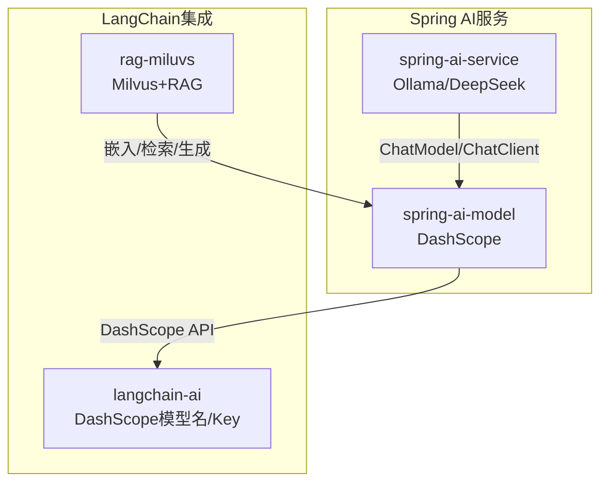
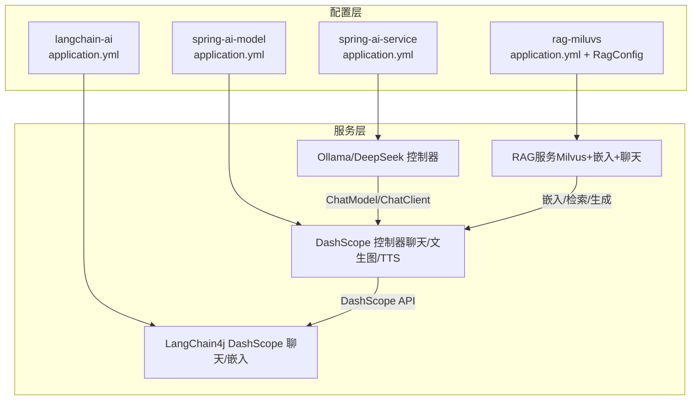
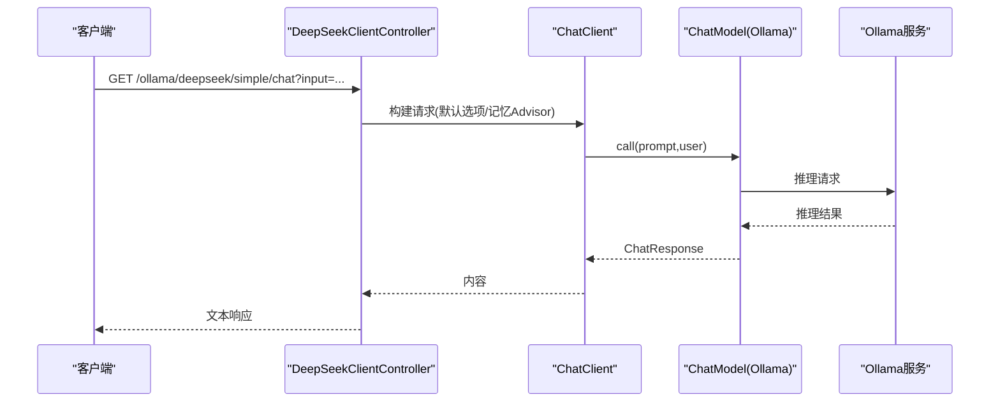
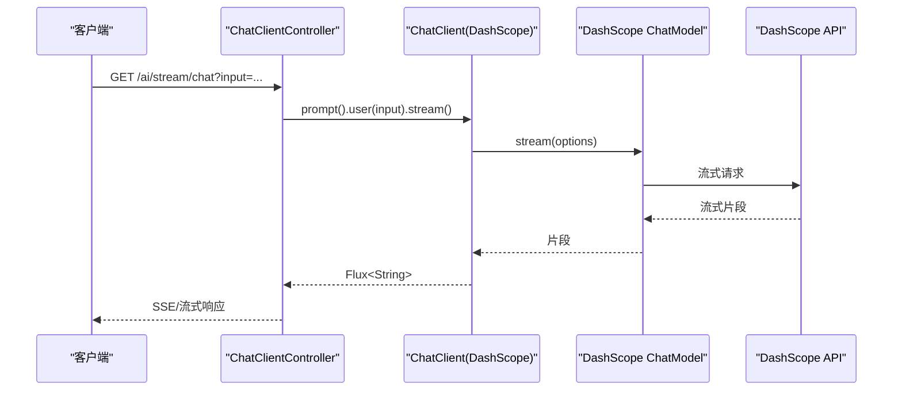
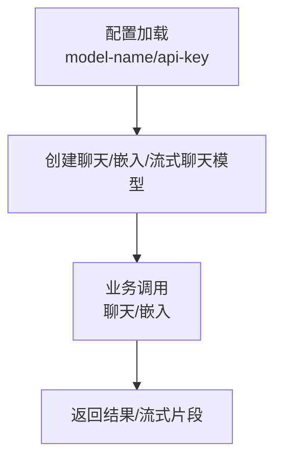
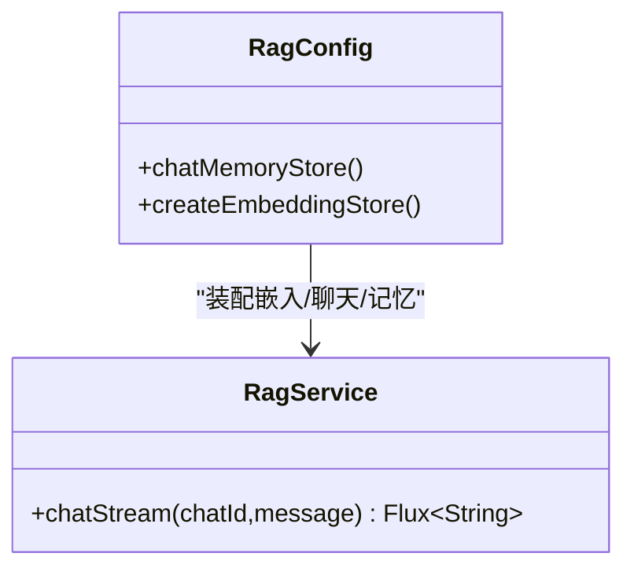
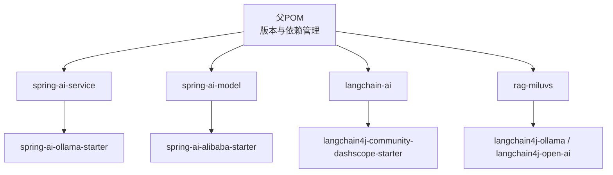

# AI模型配置

<cite>
**本文引用的文件**
- [pom.xml](file://pom.xml)
- [application.yml（spring-ai-service）](file://spring-ai-service/src/main/resources/application.yml)
- [application.yml（spring-ai-model）](file://spring-ai-model/src/main/resources/application.yml)
- [application.yml（langchain-ai）](file://langchain-ai/src/main/resources/application.yml)
- [application.yml（rag-miluvs）](file://rag-miluvs/src/main/resources/application.yml)
- [OllamaChatModelController.java](file://spring-ai-service/src/main/java/cn/project/base/springaiservice/controller/OllamaChatModelController.java)
- [DeepSeekClientController.java](file://spring-ai-service/src/main/java/cn/project/base/springaiservice/controller/DeepSeekClientController.java)
- [ChatClientController.java](file://spring-ai-model/src/main/java/cn/project/base/springaimodel/controller/ChatClientController.java)
- [ImageController.java](file://spring-ai-model/src/main/java/cn/project/base/springaimodel/controller/ImageController.java)
- [TTSController.java](file://spring-ai-model/src/main/java/cn/project/base/springaimodel/controller/TTSController.java)
- [RagConfig.java](file://rag-miluvs/src/main/java/cn/project/base/ragmiluvs/config/RagConfig.java)
- [RagService.java](file://rag-miluvs/src/main/java/cn/project/base/ragmiluvs/service/RagService.java)
</cite>

## 目录
1. [简介](#简介)
2. [项目结构](#项目结构)
3. [核心组件](#核心组件)
4. [架构总览](#架构总览)
5. [详细组件分析](#详细组件分析)
6. [依赖分析](#依赖分析)
7. [性能考虑](#性能考虑)
8. [故障排查指南](#故障排查指南)
9. [结论](#结论)
10. [附录](#附录)

## 简介
本指南面向RAG服务项目中的AI模型配置，覆盖以下目标：
- 解释Ollama、DeepSeek、DashScope等模型在本仓库中的配置方式与关键参数（模型名称、API密钥、端点/基础地址等）
- 说明流式与非流式响应的配置差异与使用路径
- 提供模型切换与负载均衡的可扩展思路
- 给出性能调优建议与监控指标设置方向

## 项目结构
本仓库采用多模块聚合工程，AI相关能力分布在多个子模块中：
- spring-ai-service：基于Spring AI的Ollama与DeepSeek集成示例，包含ChatClient与ChatModel的简单/流式调用
- spring-ai-model：基于Spring AI Alibaba的DashScope模型集成，包含聊天、文生图、TTS以及内存对话
- langchain-ai：LangChain4j与DashScope集成示例，展示DashScope模型名与API Key配置
- rag-miluvs：RAG流程整合，包含Milvus嵌入向量库、嵌入模型、聊天模型与流式聊天模型的装配与RAG主流程

**图表来源**
- [pom.xml:11-22](file://pom.xml#L11-L22)
- [application.yml（spring-ai-service）:4-12](file://spring-ai-service/src/main/resources/application.yml#L4-L12)
- [application.yml（spring-ai-model）:4-9](file://spring-ai-model/src/main/resources/application.yml#L4-L9)
- [application.yml（langchain-ai）:7-12](file://langchain-ai/src/main/resources/application.yml#L7-L12)
- [application.yml（rag-miluvs）:7-23](file://rag-miluvs/src/main/resources/application.yml#L7-L23)

**章节来源**
- [pom.xml:11-22](file://pom.xml#L11-L22)
- [application.yml（spring-ai-service）:1-13](file://spring-ai-service/src/main/resources/application.yml#L1-L13)
- [application.yml（spring-ai-model）:1-10](file://spring-ai-model/src/main/resources/application.yml#L1-L10)
- [application.yml（langchain-ai）:1-15](file://langchain-ai/src/main/resources/application.yml#L1-L15)
- [application.yml（rag-miluvs）:1-24](file://rag-miluvs/src/main/resources/application.yml#L1-L24)

## 核心组件
- Ollama模型配置与调用
  - 配置项：基础URL、模型名称
  - 调用方式：ChatModel直接调用、ChatClient带选项与流式调用
- DashScope模型配置与调用
  - 配置项：API Key、模型名、流式/非流式模型名
  - 调用方式：ChatClient默认选项、文生图、TTS
- LangChain4j/DashScope集成
  - 配置项：模型名、API Key
  - 调用方式：聊天、嵌入、流式聊天
- RAG与Milvus
  - 配置项：Milvus主机/端口、集合名、维度、索引类型、度量方式、一致性级别
  - 调用方式：嵌入模型、聊天模型、流式聊天模型、聊天记忆

**章节来源**
- [application.yml（spring-ai-service）:4-12](file://spring-ai-service/src/main/resources/application.yml#L4-L12)
- [application.yml（spring-ai-model）:4-9](file://spring-ai-model/src/main/resources/application.yml#L4-L9)
- [application.yml（langchain-ai）:7-12](file://langchain-ai/src/main/resources/application.yml#L7-L12)
- [application.yml（rag-miluvs）:7-23](file://rag-miluvs/src/main/resources/application.yml#L7-L23)
- [RagConfig.java:25-53](file://rag-miluvs/src/main/java/cn/project/base/ragmiluvs/config/RagConfig.java#L25-L53)

## 架构总览
下图展示了各模块间的关系与数据流向，以及关键配置位置。

**图表来源**
- [application.yml（spring-ai-service）:4-12](file://spring-ai-service/src/main/resources/application.yml#L4-L12)
- [application.yml（spring-ai-model）:4-9](file://spring-ai-model/src/main/resources/application.yml#L4-L9)
- [application.yml（langchain-ai）:7-12](file://langchain-ai/src/main/resources/application.yml#L7-L12)
- [application.yml（rag-miluvs）:7-23](file://rag-miluvs/src/main/resources/application.yml#L7-L23)
- [RagConfig.java:25-53](file://rag-miluvs/src/main/java/cn/project/base/ragmiluvs/config/RagConfig.java#L25-L53)

## 详细组件分析

### Ollama配置与调用
- 关键配置
  - 基础URL：用于指向本地或远程Ollama服务
  - 模型名称：用于选择具体的推理模型
- 调用方式
  - 非流式：通过ChatModel直接调用
  - 流式：通过ChatClient.stream进行增量输出
- 最佳实践
  - 在ChatClient中设置默认选项（如采样参数），提升稳定性
  - 使用对话记忆Advisor实现多轮上下文
  - 明确字符集编码，避免中文乱码

**图表来源**
- [DeepSeekClientController.java:24-41](file://spring-ai-service/src/main/java/cn/project/base/springaiservice/controller/DeepSeekClientController.java#L24-L41)
- [DeepSeekClientController.java:46-49](file://spring-ai-service/src/main/java/cn/project/base/springaiservice/controller/DeepSeekClientController.java#L46-L49)
- [OllamaChatModelController.java:18-22](file://spring-ai-service/src/main/java/cn/project/base/springaiservice/controller/OllamaChatModelController.java#L18-L22)

**章节来源**
- [application.yml（spring-ai-service）:4-12](file://spring-ai-service/src/main/resources/application.yml#L4-L12)
- [OllamaChatModelController.java:1-24](file://spring-ai-service/src/main/java/cn/project/base/springaiservice/controller/OllamaChatModelController.java#L1-L24)
- [DeepSeekClientController.java:1-60](file://spring-ai-service/src/main/java/cn/project/base/springaiservice/controller/DeepSeekClientController.java#L1-L60)

### DashScope配置与调用
- 关键配置
  - API Key：访问DashScope服务的凭证
  - 模型名称：聊天/嵌入/流式聊天模型名
- 调用方式
  - ChatClient默认选项（如采样参数）
  - 文生图：ImageModel
  - TTS：SpeechSynthesisModel，支持非流式与流式
- 最佳实践
  - 在ChatClient中设置默认选项，统一采样策略
  - 文生图与TTS分别使用对应模型，避免混用
  - 流式输出需设置字符集编码，确保客户端正确解析

**图表来源**
- [ChatClientController.java:43-49](file://spring-ai-model/src/main/java/cn/project/base/springaimodel/controller/ChatClientController.java#L43-L49)
- [ChatClientController.java:63-68](file://spring-ai-model/src/main/java/cn/project/base/springaimodel/controller/ChatClientController.java#L63-L68)

**章节来源**
- [application.yml（spring-ai-model）:4-9](file://spring-ai-model/src/main/resources/application.yml#L4-L9)
- [ChatClientController.java:1-142](file://spring-ai-model/src/main/java/cn/project/base/springaimodel/controller/ChatClientController.java#L1-L142)
- [ImageController.java:1-61](file://spring-ai-model/src/main/java/cn/project/base/springaimodel/controller/ImageController.java#L1-L61)
- [TTSController.java:1-115](file://spring-ai-model/src/main/java/cn/project/base/springaimodel/controller/TTSController.java#L1-L115)

### LangChain4j/DashScope集成
- 关键配置
  - 模型名：聊天/嵌入模型
  - API Key：访问凭证
- 调用方式
  - 聊天模型、嵌入模型、流式聊天模型
- 最佳实践
  - 明确区分普通聊天与流式聊天模型名
  - 合理设置日志级别，便于问题定位

**图表来源**
- [application.yml（langchain-ai）:7-12](file://langchain-ai/src/main/resources/application.yml#L7-L12)

**章节来源**
- [application.yml（langchain-ai）:1-15](file://langchain-ai/src/main/resources/application.yml#L1-L15)

### RAG与Milvus
- 关键配置
  - Milvus主机/端口
  - 集合名、维度、索引类型、度量方式、一致性级别
- 调用方式
  - 嵌入模型、聊天模型、流式聊天模型、聊天记忆
- 最佳实践
  - 明确嵌入维度与索引类型匹配
  - 使用流式聊天模型提升用户体验
  - 结合聊天记忆实现多轮对话

**图表来源**
- [RagConfig.java:25-53](file://rag-miluvs/src/main/java/cn/project/base/ragmiluvs/config/RagConfig.java#L25-L53)
- [RagService.java:57-61](file://rag-miluvs/src/main/java/cn/project/base/ragmiluvs/service/RagService.java#L57-L61)

**章节来源**
- [application.yml（rag-miluvs）:7-23](file://rag-miluvs/src/main/resources/application.yml#L7-L23)
- [RagConfig.java:1-55](file://rag-miluvs/src/main/java/cn/project/base/ragmiluvs/config/RagConfig.java#L1-L55)
- [RagService.java:35-61](file://rag-miluvs/src/main/java/cn/project/base/ragmiluvs/service/RagService.java#L35-L61)

## 依赖分析
- 版本与模块
  - Spring Boot版本、Spring AI版本、Spring AI Alibaba版本、LangChain4j版本均在父POM中统一管理
  - 子模块按需引入对应Starter，如Ollama、DashScope、LangChain4j等
- 依赖关系示意

**图表来源**
- [pom.xml:36-101](file://pom.xml#L36-L101)

**章节来源**
- [pom.xml:24-101](file://pom.xml#L24-L101)

## 性能考虑
- 流式与非流式
  - 流式响应适合长文本生成与实时交互，需注意客户端缓冲与字符集设置
  - 非流式响应适合短文本与批处理场景
- 模型参数
  - 采样参数（如topP/topK）影响生成质量与速度，建议在ChatClient默认选项中统一配置
- 资源与并发
  - 合理设置线程池与超时时间，避免阻塞
  - 对外部API调用增加重试与熔断策略
- 日志与监控
  - 建议开启调用链追踪与关键指标埋点（耗时、错误率、吞吐）

## 故障排查指南
- 常见问题与定位
  - API Key错误：检查DashScope配置中的API Key是否正确
  - 模型名不匹配：确认聊天/嵌入/流式聊天模型名一致且可用
  - 字符集问题：确保流式响应设置UTF-8编码
  - 端口冲突：检查各模块端口配置，避免冲突
- 建议的日志级别
  - 适当提高AI相关包的日志级别，便于定位问题

**章节来源**
- [application.yml（spring-ai-model）:4-9](file://spring-ai-model/src/main/resources/application.yml#L4-L9)
- [application.yml（langchain-ai）:13-15](file://langchain-ai/src/main/resources/application.yml#L13-L15)
- [ChatClientController.java:63-68](file://spring-ai-model/src/main/java/cn/project/base/springaimodel/controller/ChatClientController.java#L63-L68)

## 结论
本指南梳理了RAG服务项目中Ollama、DeepSeek、DashScope等模型的配置要点与调用方式，明确了流式与非流式的差异与最佳实践，并给出了模型切换与负载均衡的扩展思路及性能调优建议。结合各模块的配置文件与控制器实现，可快速落地并优化AI服务能力。

## 附录
- 配置清单（按模块）
  - spring-ai-service
    - 基础URL、模型名称
  - spring-ai-model
    - API Key、模型名、流式/非流式模型名
  - langchain-ai
    - 模型名、API Key
  - rag-miluvs
    - Milvus主机/端口、集合名、维度、索引类型、度量方式、一致性级别