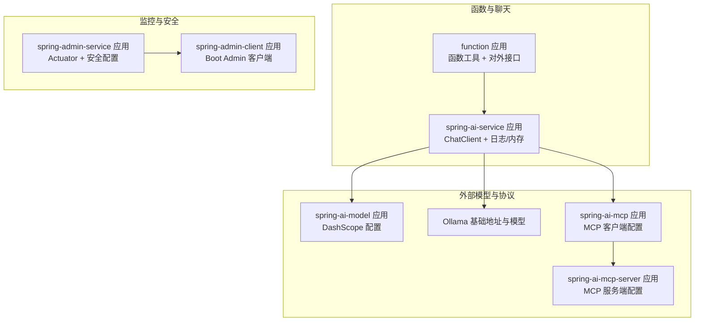
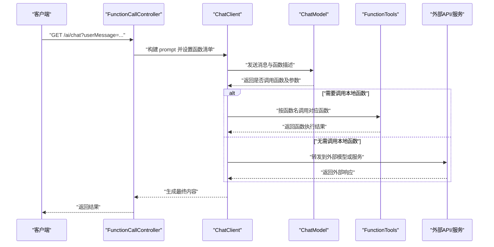
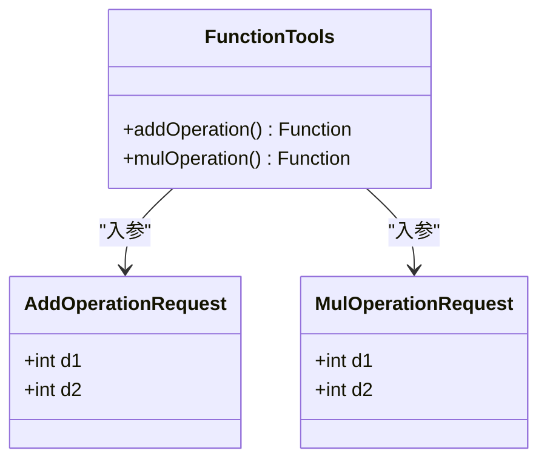
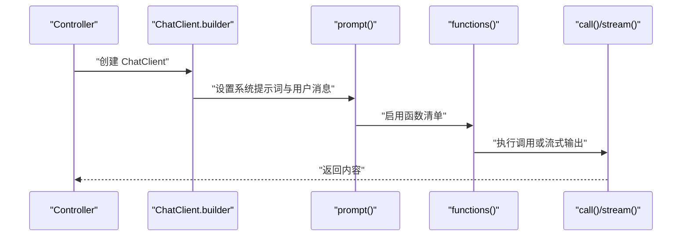
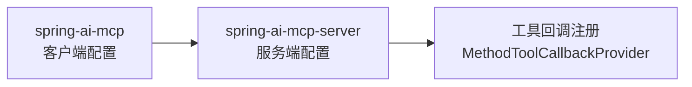
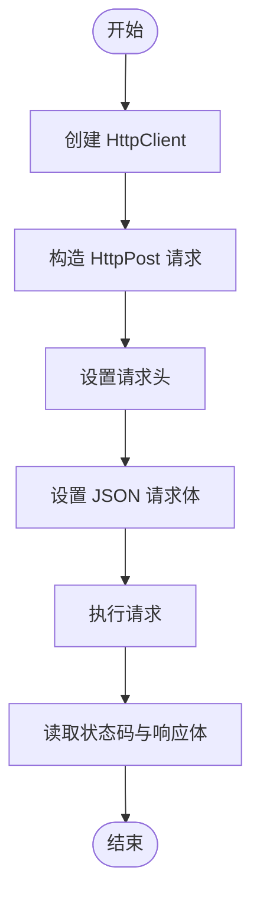
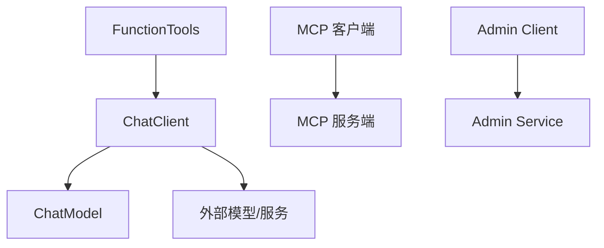

# 函数调用配置

<cite>
**本文引用的文件**
- [FunctionTools.java](file://function/src/main/java/cn/project/base/function/config/FunctionTools.java)
- [FunctionCallController.java](file://function/src/main/java/cn/project/base/function/controller/FunctionCallController.java)
- [application.yml（function）](file://function/src/main/resources/application.yml)
- [FunctionApplication.java](file://function/src/main/java/cn/project/base/function/FunctionApplication.java)
- [application.yml（rag-service）](file://rag-service/src/main/resources/application.yml)
- [application.yml（spring-ai-service）](file://spring-ai-service/src/main/resources/application.yml)
- [DeepSeekClientController.java](file://spring-ai-service/src/main/java/cn/project/base/springaiservice/controller/DeepSeekClientController.java)
- [application.yml（spring-ai-model）](file://spring-ai-model/src/main/resources/application.yml)
- [application.yml（spring-ai-mcp）](file://spring-ai-mcp/src/main/resources/application.yml)
- [application.yml（spring-ai-mcp-server）](file://spring-ai-mcp-server/src/main/resources/application.yml)
- [OpenMeteoService.java](file://spring-ai-mcp-server/src/main/java/cn/project/base/springaimcpserver/OpenMeteoService.java)
- [SecurityConfig.java（spring-admin-service）](file://spring-admin-service/src/main/java/cn/project/base/springadminservice/config/SecurityConfig.java)
- [application.yml（spring-admin-client)】](file://spring-admin-client/src/main/resources/application.yml)
</cite>

## 目录
1. [简介](#简介)
2. [项目结构](#项目结构)
3. [核心组件](#核心组件)
4. [架构总览](#架构总览)
5. [详细组件分析](#详细组件分析)
6. [依赖分析](#依赖分析)
7. [性能考虑](#性能考虑)
8. [故障排查指南](#故障排查指南)
9. [结论](#结论)
10. [附录](#附录)

## 简介
本指南围绕 RAG 服务项目中的“函数调用配置”展开，目标是帮助开发者系统地完成以下任务：
- 函数工具的配置与注册：如何定义工具函数、命名与描述、以及在调用端启用这些函数。
- API 调用配置：如何通过 Spring AI ChatClient 或原生 HTTP 客户端进行外部 API 调用，包括请求格式、认证方式与响应处理。
- HTTP 客户端配置：超时、重试、连接池等可配置项的落地方式与最佳实践。
- 不同外部 API 的集成示例：涵盖 DashScope、Ollama、MCP 等。
- 安全与权限控制：基于 Spring Security 的登录与放行策略。
- 监控与日志：日志级别、Actuator 暴露与调试建议。
- 最佳实践与配置模板：便于快速复制与扩展。

## 项目结构
本仓库包含多个子模块，其中与“函数调用配置”直接相关的关键模块如下：
- function：函数工具定义与对外聊天接口，演示如何注册工具函数并在 ChatClient 中启用。
- spring-ai-service：展示 ChatClient 的使用、流式输出、内存对话与日志 Advisor 的配置。
- spring-ai-model：DashScope API Key 配置与模型选择。
- spring-ai-mcp / spring-ai-mcp-server：MCP 协议客户端与服务端配置示例。
- spring-admin-service / spring-admin-client：Actuator 暴露与 Spring Boot Admin 客户端配置示例。

**图表来源**
- [FunctionApplication.java:1-14](file://function/src/main/java/cn/project/base/function/FunctionApplication.java#L1-L14)
- [application.yml（function）:1-14](file://function/src/main/resources/application.yml#L1-L14)
- [application.yml（spring-ai-service）:1-13](file://spring-ai-service/src/main/resources/application.yml#L1-L13)
- [application.yml（spring-ai-model）:1-10](file://spring-ai-model/src/main/resources/application.yml#L1-L10)
- [application.yml（spring-ai-mcp）:1-35](file://spring-ai-mcp/src/main/resources/application.yml#L1-L35)
- [application.yml（spring-ai-mcp-server）:1-13](file://spring-ai-mcp-server/src/main/resources/application.yml#L1-L13)
- [application.yml（spring-admin-client）:1-35](file://spring-admin-client/src/main/resources/application.yml#L1-L35)
- [SecurityConfig.java（spring-admin-service）:1-45](file://spring-admin-service/src/main/java/cn/project/base/springadminservice/config/SecurityConfig.java#L1-L45)

**章节来源**
- [FunctionApplication.java:1-14](file://function/src/main/java/cn/project/base/function/FunctionApplication.java#L1-L14)
- [application.yml（function）:1-14](file://function/src/main/resources/application.yml#L1-L14)
- [application.yml（spring-ai-service）:1-13](file://spring-ai-service/src/main/resources/application.yml#L1-L13)
- [application.yml（spring-ai-model）:1-10](file://spring-ai-model/src/main/resources/application.yml#L1-L10)
- [application.yml（spring-ai-mcp）:1-35](file://spring-ai-mcp/src/main/resources/application.yml#L1-L35)
- [application.yml（spring-ai-mcp-server）:1-13](file://spring-ai-mcp-server/src/main/resources/application.yml#L1-L13)
- [application.yml（spring-admin-client）:1-35](file://spring-admin-client/src/main/resources/application.yml#L1-L35)
- [SecurityConfig.java（spring-admin-service）:1-45](file://spring-admin-service/src/main/java/cn/project/base/springadminservice/config/SecurityConfig.java#L1-L45)

## 核心组件
- 函数工具定义与注册
  - 在 function 模块中，通过配置类注册工具函数 Bean，并使用描述注解标注用途，便于在调用端识别与启用。
  - 工具函数以 Java 函数式接口形式存在，入参与出参类型明确，便于与 LLM 的函数调用能力对接。
- ChatClient 调用与函数启用
  - 在对外接口中，通过 ChatClient 构建器启用已注册的函数名列表，从而允许模型在对话中触发本地函数。
- 外部 API 集成
  - DashScope：通过 API Key 与模型选项进行配置。
  - Ollama：通过基础地址与模型名称进行配置。
  - MCP：客户端与服务端分别配置名称、版本、请求超时、连接类型与 SSE 服务器地址。
- HTTP 客户端与原生调用
  - 提供了基于 Apache HttpClient 的示例，展示请求头设置、JSON 请求体与响应读取流程。
- 监控与日志
  - 通过 application.yml 配置日志级别与 Actuator 暴露端点，便于运行时观测。
- 安全控制
  - 基于 Spring Security 的 Web 安全链与内存认证配置，示例中放行部分路径并要求其他请求认证。

**章节来源**
- [FunctionTools.java:1-40](file://function/src/main/java/cn/project/base/function/config/FunctionTools.java#L1-L40)
- [FunctionCallController.java:1-76](file://function/src/main/java/cn/project/base/function/controller/FunctionCallController.java#L1-L76)
- [application.yml（function）:1-14](file://function/src/main/resources/application.yml#L1-L14)
- [application.yml（spring-ai-model）:1-10](file://spring-ai-model/src/main/resources/application.yml#L1-L10)
- [application.yml（spring-ai-service）:1-13](file://spring-ai-service/src/main/resources/application.yml#L1-L13)
- [application.yml（spring-ai-mcp）:1-35](file://spring-ai-mcp/src/main/resources/application.yml#L1-L35)
- [application.yml（spring-ai-mcp-server）:1-13](file://spring-ai-mcp-server/src/main/resources/application.yml#L1-L13)
- [application.yml（spring-admin-client）:1-35](file://spring-admin-client/src/main/resources/application.yml#L1-L35)
- [SecurityConfig.java（spring-admin-service）:1-45](file://spring-admin-service/src/main/java/cn/project/base/springadminservice/config/SecurityConfig.java#L1-L45)

## 架构总览
下图展示了函数调用在系统中的整体流转：前端或上层服务发起请求，ChatClient 将消息与函数清单交给模型；模型决定是否调用本地函数；函数执行后返回结果，再由 ChatClient 组织回复。

**图表来源**
- [FunctionCallController.java:33-49](file://function/src/main/java/cn/project/base/function/controller/FunctionCallController.java#L33-L49)
- [FunctionTools.java:21-37](file://function/src/main/java/cn/project/base/function/config/FunctionTools.java#L21-L37)

**章节来源**
- [FunctionCallController.java:33-49](file://function/src/main/java/cn/project/base/function/controller/FunctionCallController.java#L33-L49)
- [FunctionTools.java:21-37](file://function/src/main/java/cn/project/base/function/config/FunctionTools.java#L21-L37)

## 详细组件分析

### 函数工具配置与注册
- 工具函数注册
  - 在配置类中以 Bean 形式注册函数，每个函数具备唯一名称与描述，便于模型识别与调用。
  - 入参与返回类型采用记录类（record），确保参数结构清晰且不可变。
- 函数启用
  - 在 ChatClient 的 prompt 构建阶段，通过函数名列表启用本地函数，使模型可在对话中触发。
- 日志与可观测性
  - 工具函数内部记录调用日志，有助于问题定位与审计。

**图表来源**
- [FunctionTools.java:15-37](file://function/src/main/java/cn/project/base/function/config/FunctionTools.java#L15-L37)

**章节来源**
- [FunctionTools.java:15-37](file://function/src/main/java/cn/project/base/function/config/FunctionTools.java#L15-L37)

### ChatClient 与函数调用启用
- ChatClient 构建
  - 通过 ChatClient.builder(chatModel) 创建客户端实例。
  - 可设置系统提示词、用户消息、函数清单与默认选项。
- 函数启用
  - 在 prompt 后调用函数启用方法，传入函数名数组，使模型可调用本地函数。
- 流式输出
  - 支持流式输出场景，便于实时展示生成内容。

**图表来源**
- [FunctionCallController.java:33-49](file://function/src/main/java/cn/project/base/function/controller/FunctionCallController.java#L33-L49)

**章节来源**
- [FunctionCallController.java:33-49](file://function/src/main/java/cn/project/base/function/controller/FunctionCallController.java#L33-L49)

### 外部 API 集成配置示例

#### DashScope 配置
- 认证方式
  - 通过 API Key 进行认证，需在配置文件中正确填写。
- 请求格式
  - 通过 ChatModel 与模型选项进行请求封装，具体请求细节由框架处理。
- 响应处理
  - ChatClient 返回内容，便于在控制器中直接使用。

**章节来源**
- [application.yml（spring-ai-model）:1-10](file://spring-ai-model/src/main/resources/application.yml#L1-L10)
- [application.yml（function）:7-13](file://function/src/main/resources/application.yml#L7-L13)

#### Ollama 配置
- 基础地址与模型
  - 在配置文件中设置基础地址与模型名称，用于 ChatModel 初始化。
- 控制器示例
  - 展示了 ChatClient 的简单与流式调用方式，便于对比与选择。

**章节来源**
- [application.yml（spring-ai-service）:4-8](file://spring-ai-service/src/main/resources/application.yml#L4-L8)
- [DeepSeekClientController.java:15-59](file://spring-ai-service/src/main/java/cn/project/base/springaiservice/controller/DeepSeekClientController.java#L15-L59)

#### MCP 客户端与服务端配置
- 客户端配置
  - 包含启用标志、客户端名称与版本、请求超时、异步类型与 SSE 服务器地址等。
- 服务端配置
  - 包含服务端名称与版本、应用名称与主程序行为等。
- 工具回调
  - 服务端通过 ToolCallbackProvider 注册工具对象，使客户端可发现并调用。

**图表来源**
- [application.yml（spring-ai-mcp）:9-20](file://spring-ai-mcp/src/main/resources/application.yml#L9-L20)
- [application.yml（spring-ai-mcp-server）:6-9](file://spring-ai-mcp-server/src/main/resources/application.yml#L6-L9)
- [OpenMeteoService.java:17-27](file://spring-ai-mcp-server/src/main/java/cn/project/base/springaimcpserver/OpenMeteoService.java#L17-L27)

**章节来源**
- [application.yml（spring-ai-mcp）:9-20](file://spring-ai-mcp/src/main/resources/application.yml#L9-L20)
- [application.yml（spring-ai-mcp-server）:6-9](file://spring-ai-mcp-server/src/main/resources/application.yml#L6-L9)
- [OpenMeteoService.java:17-27](file://spring-ai-mcp-server/src/main/java/cn/project/base/springaimcpserver/OpenMeteoService.java#L17-L27)

### HTTP 客户端配置与原生调用
- Apache HttpClient 示例
  - 展示了创建默认客户端、构造 POST 请求、设置请求头与 JSON 请求体、执行请求与读取响应的基本流程。
- 配置要点
  - 超时：可通过 HttpClient 配置连接与套接字超时。
  - 重试：可结合重试策略或指数退避机制实现。
  - 连接池：通过 HttpClient 的连接管理器配置最大连接数、每路由最大连接数等。

**图表来源**
- [FunctionCallController.java:50-74](file://function/src/main/java/cn/project/base/function/controller/FunctionCallController.java#L50-L74)

**章节来源**
- [FunctionCallController.java:50-74](file://function/src/main/java/cn/project/base/function/controller/FunctionCallController.java#L50-L74)

### 安全与权限控制
- 安全过滤链
  - 放行登录页、静态资源、管理端点与 Actuator，其他请求均需认证。
- 认证配置
  - 示例使用内存认证，配置用户名与角色；生产环境应使用加密密码。
- Actuator 暴露
  - 客户端应用暴露 Actuator 端点，便于远程监控与健康检查。

**章节来源**
- [SecurityConfig.java（spring-admin-service）:18-42](file://spring-admin-service/src/main/java/cn/project/base/springadminservice/config/SecurityConfig.java#L18-L42)
- [application.yml（spring-admin-client）:10-24](file://spring-admin-client/src/main/resources/application.yml#L10-L24)

### 监控与日志配置
- 日志级别
  - 通过 application.yml 设置日志级别，如针对特定包或框架进行调试输出。
- Actuator 暴露
  - 暴露健康检查、指标与运行信息，便于运维监控。
- ChatClient 日志 Advisor
  - 可通过 SimpleLoggerAdvisor 输出请求与响应的调试信息，辅助问题定位。

**章节来源**
- [application.yml（rag-service）:4-8](file://rag-service/src/main/resources/application.yml#L4-L8)
- [application.yml（spring-admin-client）:10-24](file://spring-admin-client/src/main/resources/application.yml#L10-L24)
- [DeepSeekClientController.java:30-33](file://spring-ai-service/src/main/java/cn/project/base/springaiservice/controller/DeepSeekClientController.java#L30-L33)

## 依赖分析
- 模块间耦合
  - function 模块依赖 ChatModel 与 ChatClient，用于函数调用与对话交互。
  - spring-ai-service 作为 ChatClient 的使用方，依赖 DashScope/Ollama 等外部模型。
  - spring-ai-mcp 与 spring-ai-mcp-server 通过 MCP 协议进行工具发现与调用。
- 外部依赖
  - DashScope API Key、Ollama 基础地址、MCP 服务器地址等均为外部配置项，需在各自 application.yml 中维护。

**图表来源**
- [FunctionTools.java:21-37](file://function/src/main/java/cn/project/base/function/config/FunctionTools.java#L21-L37)
- [FunctionCallController.java:33-49](file://function/src/main/java/cn/project/base/function/controller/FunctionCallController.java#L33-L49)
- [application.yml（spring-ai-mcp）:9-20](file://spring-ai-mcp/src/main/resources/application.yml#L9-L20)
- [application.yml（spring-ai-mcp-server）:6-9](file://spring-ai-mcp-server/src/main/resources/application.yml#L6-L9)
- [application.yml（spring-admin-client）:10-24](file://spring-admin-client/src/main/resources/application.yml#L10-L24)
- [SecurityConfig.java（spring-admin-service）:18-28](file://spring-admin-service/src/main/java/cn/project/base/springadminservice/config/SecurityConfig.java#L18-L28)

**章节来源**
- [FunctionTools.java:21-37](file://function/src/main/java/cn/project/base/function/config/FunctionTools.java#L21-L37)
- [FunctionCallController.java:33-49](file://function/src/main/java/cn/project/base/function/controller/FunctionCallController.java#L33-L49)
- [application.yml（spring-ai-mcp）:9-20](file://spring-ai-mcp/src/main/resources/application.yml#L9-L20)
- [application.yml（spring-ai-mcp-server）:6-9](file://spring-ai-mcp-server/src/main/resources/application.yml#L6-L9)
- [application.yml（spring-admin-client）:10-24](file://spring-admin-client/src/main/resources/application.yml#L10-L24)
- [SecurityConfig.java（spring-admin-service）:18-28](file://spring-admin-service/src/main/java/cn/project/base/springadminservice/config/SecurityConfig.java#L18-L28)

## 性能考虑
- 超时与重试
  - 对外部 API 调用建议设置合理的连接与读取超时；对于易失败的下游，可引入指数退避与最大重试次数。
- 连接池
  - 通过 HttpClient 的连接管理器限制并发连接数，避免对下游造成压力峰值。
- 流式输出
  - 在需要实时性的场景优先使用流式输出，减少等待时间并提升用户体验。
- 日志级别
  - 生产环境建议降低日志级别，仅保留必要的错误与关键事件日志，避免 IO 压力。

## 故障排查指南
- 函数未被调用
  - 检查 ChatClient 是否正确启用了函数名；确认函数名与注册名称一致。
  - 查看工具函数日志，确认是否被触发。
- 外部模型调用异常
  - 检查 DashScope/Ollama 的 API Key 与基础地址配置；查看 ChatClient 的日志 Advisor 输出。
- Actuator 无法访问
  - 确认端点暴露配置与安全放行规则；检查防火墙与网络策略。
- 安全认证失败
  - 确认用户名与密码配置；生产环境使用加密密码替代明文。

**章节来源**
- [FunctionCallController.java:33-49](file://function/src/main/java/cn/project/base/function/controller/FunctionCallController.java#L33-L49)
- [FunctionTools.java:24-26](file://function/src/main/java/cn/project/base/function/config/FunctionTools.java#L24-L26)
- [application.yml（spring-ai-model）:5-9](file://spring-ai-model/src/main/resources/application.yml#L5-L9)
- [application.yml（spring-ai-service）:4-8](file://spring-ai-service/src/main/resources/application.yml#L4-L8)
- [application.yml（spring-admin-client）:10-24](file://spring-admin-client/src/main/resources/application.yml#L10-L24)
- [SecurityConfig.java（spring-admin-service）:38-42](file://spring-admin-service/src/main/java/cn/project/base/springadminservice/config/SecurityConfig.java#L38-L42)

## 结论
本指南梳理了函数调用配置在项目中的落地方式，覆盖了工具注册、函数启用、外部 API 集成、HTTP 客户端配置、安全与监控等关键环节。建议在生产环境中进一步完善超时与重试策略、连接池参数、日志分级与安全认证机制，并结合 Actuator 与日志体系进行持续监控与优化。

## 附录

### 配置模板与最佳实践
- 函数工具注册模板
  - 在配置类中以 Bean 方式注册函数，使用描述注解说明用途，入参与返回类型采用记录类。
- ChatClient 启用函数模板
  - 在 prompt 构建后调用函数启用方法，传入函数名数组。
- DashScope 配置模板
  - 在配置文件中设置 API Key 与模型选项。
- Ollama 配置模板
  - 设置基础地址与模型名称，结合 ChatClient 的默认选项进行调用。
- MCP 客户端模板
  - 开启 MCP 客户端、设置请求超时、异步类型与 SSE 服务器地址。
- MCP 服务端模板
  - 配置服务端名称与版本，注册工具回调提供者。
- HTTP 客户端模板
  - 使用 HttpClient 设置超时、重试与连接池参数；POST 请求设置 JSON 头与请求体。
- 安全与监控模板
  - 放行必要路径，其他请求认证；开启 Actuator 暴露端点；合理设置日志级别。

**章节来源**
- [FunctionTools.java:21-37](file://function/src/main/java/cn/project/base/function/config/FunctionTools.java#L21-L37)
- [FunctionCallController.java:33-49](file://function/src/main/java/cn/project/base/function/controller/FunctionCallController.java#L33-L49)
- [application.yml（spring-ai-model）:5-9](file://spring-ai-model/src/main/resources/application.yml#L5-L9)
- [application.yml（spring-ai-service）:4-8](file://spring-ai-service/src/main/resources/application.yml#L4-L8)
- [application.yml（spring-ai-mcp）:9-20](file://spring-ai-mcp/src/main/resources/application.yml#L9-L20)
- [application.yml（spring-ai-mcp-server）:6-9](file://spring-ai-mcp-server/src/main/resources/application.yml#L6-L9)
- [application.yml（spring-admin-client）:10-24](file://spring-admin-client/src/main/resources/application.yml#L10-L24)
- [SecurityConfig.java（spring-admin-service）:18-28](file://spring-admin-service/src/main/java/cn/project/base/springadminservice/config/SecurityConfig.java#L18-L28)