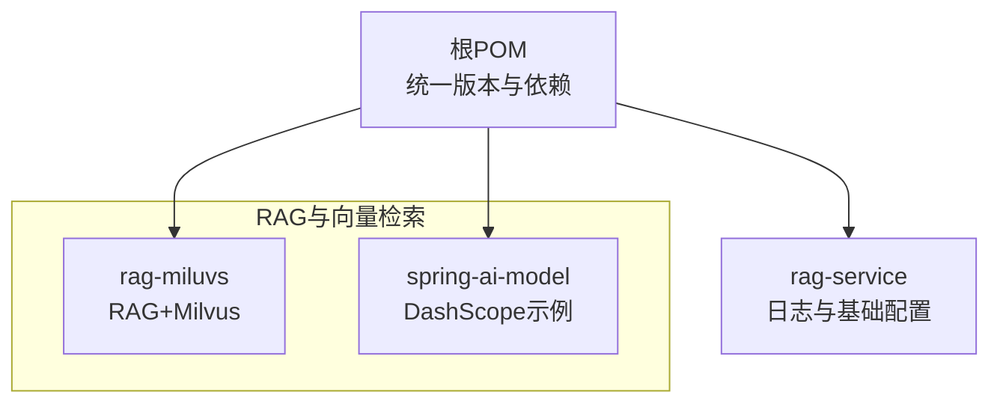
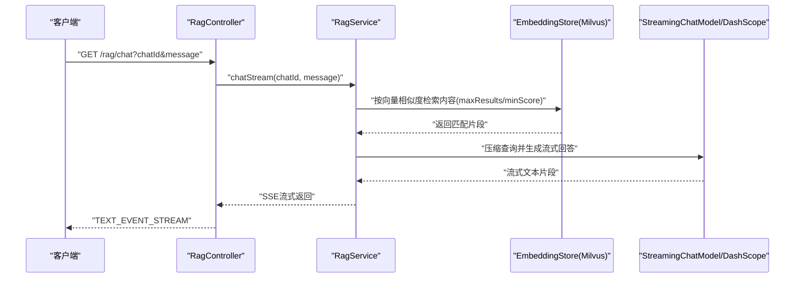
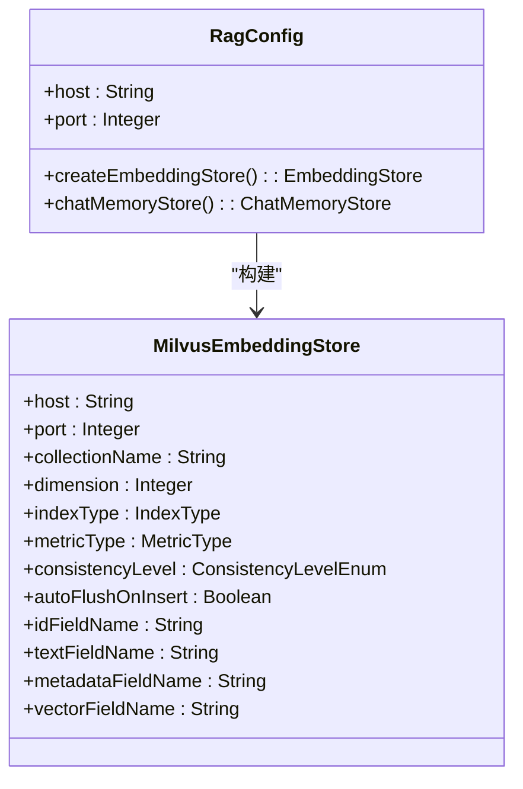
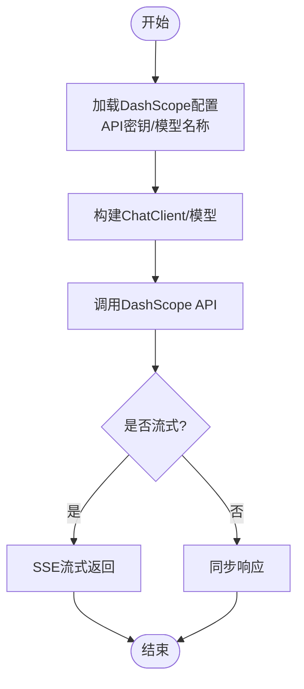
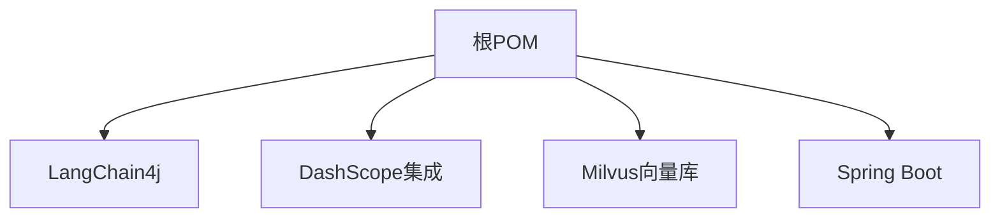

# 数据库配置

<cite>
**本文引用的文件**
- [application.yml](file://rag-miluvs/src/main/resources/application.yml)
- [RagConfig.java](file://rag-miluvs/src/main/java/cn/project/base/ragmiluvs/config/RagConfig.java)
- [RagService.java](file://rag-miluvs/src/main/java/cn/project/base/ragmiluvs/service/RagService.java)
- [RagController.java](file://rag-miluvs/src/main/java/cn/project/base/ragmiluvs/controller/RagController.java)
- [application.yml](file://rag-service/src/main/resources/application.yml)
- [logback-dev.xml](file://rag-service/src/main/resources/logback-dev.xml)
- [pom.xml](file://pom.xml)
- [application.yml](file://spring-ai-model/src/main/resources/application.yml)
- [ChatClientController.java](file://spring-ai-model/src/main/java/cn/project/base/springaimodel/controller/ChatClientController.java)
- [application.yml](file://spring-ai-mcp/src/main/resources/application.yml)
</cite>

## 目录
1. [简介](#简介)
2. [项目结构](#项目结构)
3. [核心组件](#核心组件)
4. [架构总览](#架构总览)
5. [详细组件分析](#详细组件分析)
6. [依赖分析](#依赖分析)
7. [性能考虑](#性能考虑)
8. [故障排查指南](#故障排查指南)
9. [结论](#结论)
10. [附录](#附录)

## 简介
本指南聚焦于RAG服务项目中的数据库配置，重点覆盖以下方面：
- Milvus向量数据库的配置参数与行为，包括主机地址、端口、一致性级别、索引类型、度量方式等。
- DashScope API的配置，包括API密钥、模型名称、嵌入模型、流式模型等。
- 不同部署环境（本地开发、测试、生产）的配置差异与建议。
- 配置参数的含义与影响范围，并结合实际硬件资源给出调优建议。
- 配置验证方法与常见错误排查。

## 项目结构
本仓库采用多模块Maven工程组织，与RAG和向量检索直接相关的模块包括：
- rag-miluvs：集成LangChain4j与Milvus，提供RAG检索与流式对话能力。
- spring-ai-model：演示DashScope模型调用与ChatClient配置。
- rag-service：通用服务与日志配置示例。
- 其他模块用于功能扩展或工具链支持。

图表来源
- [pom.xml:11-22](file://pom.xml#L11-L22)

章节来源
- [pom.xml:11-22](file://pom.xml#L11-L22)

## 核心组件
- Milvus配置与连接
  - 配置项：主机地址、端口、集合名、维度、索引类型、度量方式、一致性级别、字段映射等。
  - 默认集合名为“langchain_01”，维度为1536，索引类型为FLAT，度量方式为COSINE。
  - 一致性级别默认EVENTUALLY，自动插入后刷新开启。
  - 字段映射：id、text、metadata、vector。
- DashScope配置
  - 聊天模型与流式聊天模型：模型名称、API密钥。
  - 嵌入模型：模型名称、API密钥。
  - ChatClient默认选项可通过DashScopeChatOptions进行配置（如top_p）。

章节来源
- [RagConfig.java:32-53](file://rag-miluvs/src/main/java/cn/project/base/ragmiluvs/config/RagConfig.java#L32-L53)
- [application.yml:7-23](file://rag-miluvs/src/main/resources/application.yml#L7-L23)
- [application.yml:1-9](file://spring-ai-model/src/main/resources/application.yml#L1-L9)
- [ChatClientController.java:44-48](file://spring-ai-model/src/main/java/cn/project/base/springaimodel/controller/ChatClientController.java#L44-L48)

## 架构总览
下图展示了RAG服务中向量检索与大模型调用的关键交互：

图表来源
- [RagController.java:24-27](file://rag-miluvs/src/main/java/cn/project/base/ragmiluvs/controller/RagController.java#L24-L27)
- [RagService.java:57-90](file://rag-miluvs/src/main/java/cn/project/base/ragmiluvs/service/RagService.java#L57-L90)

## 详细组件分析

### Milvus向量数据库配置
- 关键参数与含义
  - 主机地址与端口：用于建立与Milvus服务的连接。
  - 集合名：默认“langchain_01”，用于存放向量与元数据。
  - 维度：默认1536，需与所用嵌入模型一致。
  - 索引类型：默认FLAT；可选IVF_FLAT/IVF_SQ8/HNSW等以平衡检索速度与精度。
  - 度量方式：默认COSINE；可选L2/IP/HAMMING等。
  - 一致性级别：默认EVENTUALLY；可选CONSISTENT/SESSION/BOUNDED/STRONG。
  - 自动刷新：默认true，插入后自动flush，适合低延迟写入场景。
  - 字段映射：id、text、metadata、vector，确保与导入流程一致。
- 影响范围
  - 性能：索引类型与度量方式直接影响检索速度与精度。
  - 数据一致性：一致性级别越高，读取越准确但可能增加延迟。
  - 存储与网络：连接参数错误会导致连接失败或超时。
- 硬件与资源建议
  - CPU/内存：高并发检索时建议提升JVM堆与线程池配置。
  - 存储：选择SSD以降低I/O延迟；合理规划集合分片与副本。
  - 网络：内网直连，避免跨地域访问；必要时启用连接池与重试策略。

图表来源
- [RagConfig.java:20-53](file://rag-miluvs/src/main/java/cn/project/base/ragmiluvs/config/RagConfig.java#L20-L53)

章节来源
- [RagConfig.java:32-53](file://rag-miluvs/src/main/java/cn/project/base/ragmiluvs/config/RagConfig.java#L32-L53)
- [application.yml:7-23](file://rag-miluvs/src/main/resources/application.yml#L7-L23)

### DashScope API配置
- 配置要点
  - API密钥：聊天模型、流式聊天模型、嵌入模型均需配置。
  - 模型名称：聊天模型与嵌入模型分别指定。
  - ChatClient默认选项：可通过DashScopeChatOptions设置（如top_p）。
- 影响范围
  - 费用与配额：不同模型价格与额度不同，需结合业务量评估。
  - 响应质量：模型选择与参数（如top_p）影响回答稳定性与多样性。
  - 连接与超时：网络不稳定时需配置合理的超时与重试策略。
- 硬件与资源建议
  - 并发：高并发场景建议使用异步/流式接口，减少阻塞。
  - 缓存：对重复问题可引入本地缓存以降低API调用次数。

图表来源
- [application.yml:4-9](file://spring-ai-model/src/main/resources/application.yml#L4-L9)
- [ChatClientController.java:44-48](file://spring-ai-model/src/main/java/cn/project/base/springaimodel/controller/ChatClientController.java#L44-L48)

章节来源
- [application.yml:1-9](file://spring-ai-model/src/main/resources/application.yml#L1-L9)
- [ChatClientController.java:44-48](file://spring-ai-model/src/main/java/cn/project/base/springaimodel/controller/ChatClientController.java#L44-L48)
- [application.yml:7-15](file://spring-ai-mcp/src/main/resources/application.yml#L7-L15)

### 部署环境配置示例与差异
- 本地开发
  - Milvus：使用本机或容器化服务，端口19530，集合名保持默认。
  - DashScope：使用个人API密钥与免费/试用模型，便于快速验证。
  - 日志：开启DEBUG级别，便于定位问题。
- 测试环境
  - Milvus：独立实例，配置较低一致性级别以提升吞吐。
  - DashScope：使用测试账户与受限额度模型，控制成本。
  - 日志：按需开启关键模块日志，避免日志风暴。
- 生产环境
  - Milvus：高可用集群，配置强一致性或会话一致性；索引类型按QPS与精度要求选择。
  - DashScope：使用正式账户与稳定模型，配置超时与重试策略。
  - 日志：分级落盘，控制单文件大小与归档数量，避免磁盘压力。

章节来源
- [application.yml:7-23](file://rag-miluvs/src/main/resources/application.yml#L7-L23)
- [application.yml:4-8](file://rag-service/src/main/resources/application.yml#L4-L8)
- [logback-dev.xml:190-208](file://rag-service/src/main/resources/logback-dev.xml#L190-L208)

## 依赖分析
- 核心依赖
  - LangChain4j与Milvus：通过MilvusEmbeddingStore连接向量数据库。
  - Spring AI Alibaba：提供DashScope模型接入与ChatClient封装。
  - Spring Boot：统一配置与启动。
- 版本与兼容性
  - 根POM统一管理Spring Boot、Spring AI、LangChain4j等版本，确保模块间兼容。

图表来源
- [pom.xml:36-102](file://pom.xml#L36-L102)

章节来源
- [pom.xml:36-102](file://pom.xml#L36-L102)

## 性能考虑
- Milvus
  - 索引选择：小规模/低延迟优先FLAT；大规模/高吞吐可考虑IVF或HNSW。
  - 度量方式：COSINE适用于文本嵌入；若使用特定归一化需评估IP/L2。
  - 一致性：生产环境建议SESSION或更强一致性，避免脏读。
  - 刷新策略：autoFlushOnInsert适合写入频繁场景；批量写入可关闭自动刷新以提升吞吐。
- DashScope
  - 模型选择：根据任务复杂度与SLA选择合适模型。
  - 参数调优：top_p、温度等参数影响生成稳定性与多样性。
  - 超时与重试：在网络波动环境下配置合理超时与指数退避重试。
- 日志与监控
  - 合理的日志级别与落盘策略，避免IO瓶颈。
  - 结合Spring Boot Admin或Prometheus/Grafana监控关键指标（QPS、P95/P99、错误率）。

## 故障排查指南
- Milvus连接失败
  - 检查主机地址与端口是否正确，确认防火墙与网络策略放通。
  - 若使用用户名/密码，确认凭据配置与权限。
  - 观察集合是否存在，维度与索引配置是否与嵌入模型一致。
- DashScope调用异常
  - 确认API密钥有效且未过期，检查模型名称拼写与可用性。
  - 检查网络连通性与代理设置，必要时配置超时与重试。
- 日志与诊断
  - 开启DEBUG级别日志，定位异常堆栈与关键流程。
  - 使用RagController提供的/dbinit与/chat接口验证端到端链路。
  - 关注日志滚动策略，避免磁盘空间不足导致服务中断。

章节来源
- [RagController.java:18-27](file://rag-miluvs/src/main/java/cn/project/base/ragmiluvs/controller/RagController.java#L18-L27)
- [logback-dev.xml:190-208](file://rag-service/src/main/resources/logback-dev.xml#L190-L208)

## 结论
本指南梳理了RAG服务中Milvus与DashScope的关键配置点与实践建议。通过合理选择索引与一致性级别、规范API密钥与模型配置、区分环境的资源配置与日志策略，可在保证性能的同时提升系统的稳定性与可维护性。建议在上线前完成端到端验证与压测，并持续监控关键指标以指导后续优化。

## 附录
- 快速核验清单
  - Milvus：主机/端口连通、集合存在、维度与索引匹配、一致性级别满足需求。
  - DashScope：API密钥有效、模型名称正确、网络可达、超时与重试配置合理。
  - 日志：级别与落盘策略符合当前环境，磁盘空间充足。
- 参考接口
  - 初始化向量库：GET /rag/dbinit
  - 流式对话：GET /rag/chat?chatId&message

章节来源
- [RagController.java:18-27](file://rag-miluvs/src/main/java/cn/project/base/ragmiluvs/controller/RagController.java#L18-L27)