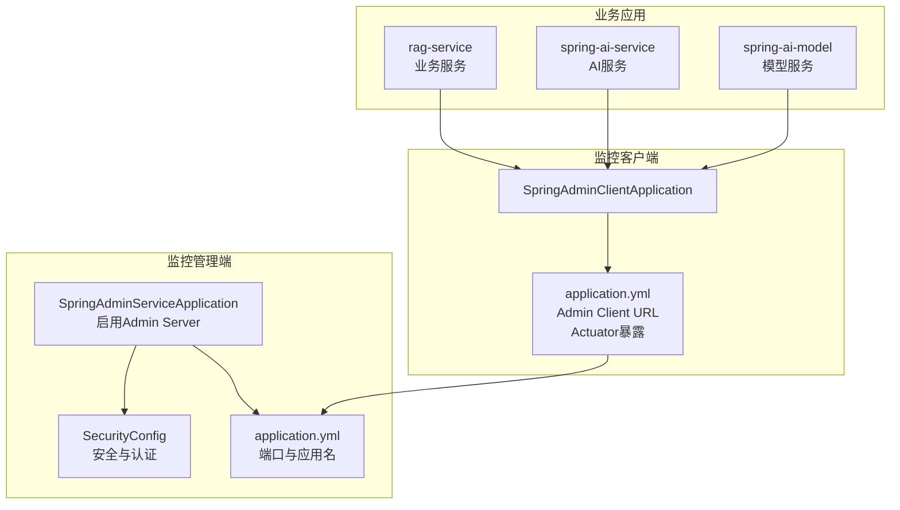
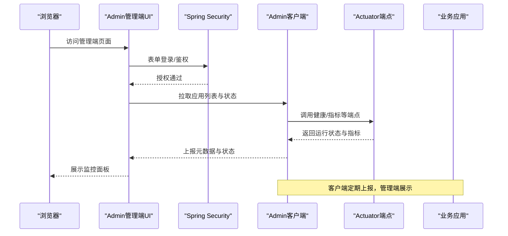
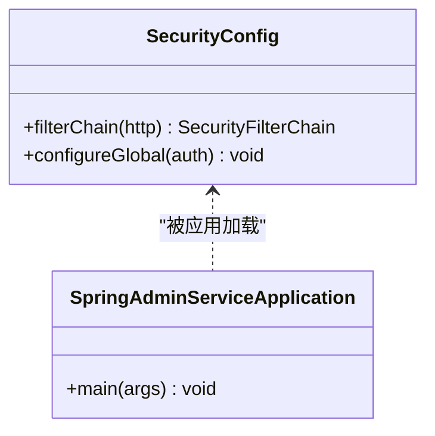
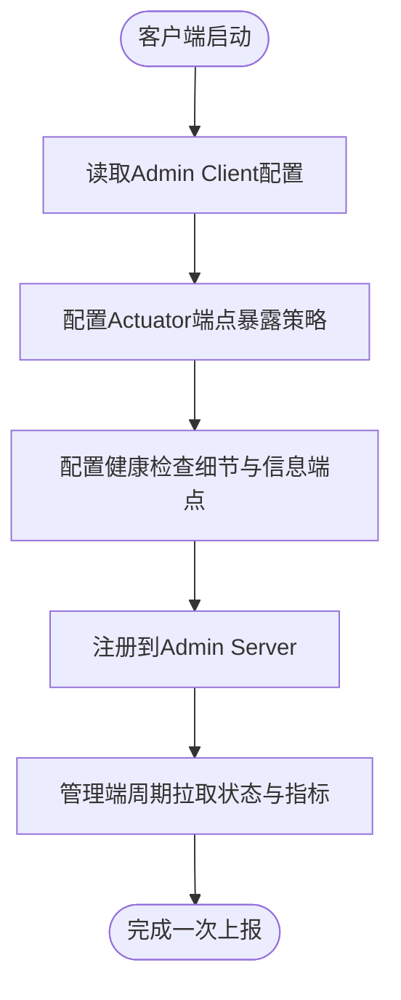
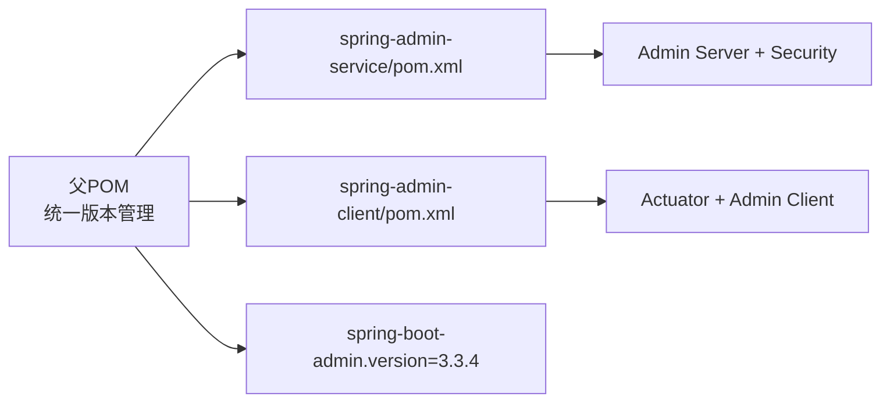

# 监控配置

<cite>
**本文引用的文件**
- [spring-admin-service/src/main/resources/application.yml](file://spring-admin-service/src/main/resources/application.yml)
- [spring-admin-service/src/main/java/cn/project/base/springadminservice/config/SecurityConfig.java](file://spring-admin-service/src/main/java/cn/project/base/springadminservice/config/SecurityConfig.java)
- [spring-admin-service/src/main/java/cn/project/base/springadminservice/SpringAdminServiceApplication.java](file://spring-admin-service/src/main/java/cn/project/base/springadminservice/SpringAdminServiceApplication.java)
- [spring-admin-client/src/main/resources/application.yml](file://spring-admin-client/src/main/resources/application.yml)
- [spring-admin-client/src/main/java/cn/project/base/springadminclient/SpringAdminClientApplication.java](file://spring-admin-client/src/main/java/cn/project/base/springadminclient/SpringAdminClientApplication.java)
- [spring-admin-client/pom.xml](file://spring-admin-client/pom.xml)
- [spring-admin-service/pom.xml](file://spring-admin-service/pom.xml)
- [pom.xml](file://pom.xml)
- [rag-service/src/main/resources/application.yml](file://rag-service/src/main/resources/application.yml)
- [rag-service/src/main/resources/logback-dev.xml](file://rag-service/src/main/resources/logback-dev.xml)
- [spring-ai-service/src/main/resources/application.yml](file://spring-ai-service/src/main/resources/application.yml)
- [spring-ai-model/src/main/resources/application.yml](file://spring-ai-model/src/main/resources/application.yml)
</cite>

## 目录
1. [简介](#简介)
2. [项目结构](#项目结构)
3. [核心组件](#核心组件)
4. [架构总览](#架构总览)
5. [详细组件分析](#详细组件分析)
6. [依赖关系分析](#依赖关系分析)
7. [性能考虑](#性能考虑)
8. [故障排除指南](#故障排除指南)
9. [结论](#结论)
10. [附录](#附录)

## 简介
本指南面向RAG服务项目的监控与运维团队，系统性说明如何基于Spring Boot Admin搭建统一监控平台，覆盖管理端与客户端的配置要点、安全认证、健康检查、指标采集、存储与展示、告警配置以及故障排除与性能优化建议。文档同时给出单节点与集群部署的配置差异与最佳实践，帮助快速落地可观察性体系。

## 项目结构
本仓库采用多模块聚合工程组织，Spring Boot Admin相关模块位于顶层目录：
- spring-admin-service：监控管理端（Server）
- spring-admin-client：被监控应用（Client）
- 其他业务模块（如 rag-service、spring-ai-service、spring-ai-model 等）可作为被监控目标按需接入

图表来源
- [spring-admin-service/src/main/java/cn/project/base/springadminservice/SpringAdminServiceApplication.java:1-15](file://spring-admin-service/src/main/java/cn/project/base/springadminservice/SpringAdminServiceApplication.java#L1-L15)
- [spring-admin-service/src/main/java/cn/project/base/springadminservice/config/SecurityConfig.java:1-45](file://spring-admin-service/src/main/java/cn/project/base/springadminservice/config/SecurityConfig.java#L1-L45)
- [spring-admin-service/src/main/resources/application.yml:1-6](file://spring-admin-service/src/main/resources/application.yml#L1-L6)
- [spring-admin-client/src/main/java/cn/project/base/springadminclient/SpringAdminClientApplication.java:1-13](file://spring-admin-client/src/main/java/cn/project/base/springadminclient/SpringAdminClientApplication.java#L1-L13)
- [spring-admin-client/src/main/resources/application.yml:1-36](file://spring-admin-client/src/main/resources/application.yml#L1-L36)
- [rag-service/src/main/resources/application.yml:1-9](file://rag-service/src/main/resources/application.yml#L1-L9)
- [spring-ai-service/src/main/resources/application.yml:1-13](file://spring-ai-service/src/main/resources/application.yml#L1-L13)
- [spring-ai-model/src/main/resources/application.yml:1-10](file://spring-ai-model/src/main/resources/application.yml#L1-L10)

章节来源
- [spring-admin-service/src/main/resources/application.yml:1-6](file://spring-admin-service/src/main/resources/application.yml#L1-L6)
- [spring-admin-client/src/main/resources/application.yml:1-36](file://spring-admin-client/src/main/resources/application.yml#L1-L36)
- [spring-admin-service/src/main/java/cn/project/base/springadminservice/config/SecurityConfig.java:1-45](file://spring-admin-service/src/main/java/cn/project/base/springadminservice/config/SecurityConfig.java#L1-L45)
- [spring-admin-service/src/main/java/cn/project/base/springadminservice/SpringAdminServiceApplication.java:1-15](file://spring-admin-service/src/main/java/cn/project/base/springadminservice/SpringAdminServiceApplication.java#L1-L15)
- [spring-admin-client/src/main/java/cn/project/base/springadminclient/SpringAdminClientApplication.java:1-13](file://spring-admin-client/src/main/java/cn/project/base/springadminclient/SpringAdminClientApplication.java#L1-L13)
- [pom.xml:1-171](file://pom.xml#L1-L171)

## 核心组件
- 监控管理端（Server）
  - 启用Admin Server并提供Web界面与安全控制
  - 默认端口与应用名配置
  - 基于Spring Security的登录与访问控制
- 监控客户端（Client）
  - 通过Admin Client自动上报运行状态
  - Actuator端点暴露策略与基础路径配置
  - 健康检查细节与信息端点开关
- 业务应用
  - 作为被监控目标，按需引入Actuator与Admin Client依赖
  - 日志与运行参数配置影响可观测性

章节来源
- [spring-admin-service/src/main/resources/application.yml:1-6](file://spring-admin-service/src/main/resources/application.yml#L1-L6)
- [spring-admin-service/src/main/java/cn/project/base/springadminservice/config/SecurityConfig.java:1-45](file://spring-admin-service/src/main/java/cn/project/base/springadminservice/config/SecurityConfig.java#L1-L45)
- [spring-admin-client/src/main/resources/application.yml:1-36](file://spring-admin-client/src/main/resources/application.yml#L1-L36)

## 架构总览
Spring Boot Admin采用“Server-Client”模式：管理端负责展示与安全，客户端负责上报与暴露端点。下图展示了典型交互流程。

图表来源
- [spring-admin-service/src/main/java/cn/project/base/springadminservice/config/SecurityConfig.java:1-45](file://spring-admin-service/src/main/java/cn/project/base/springadminservice/config/SecurityConfig.java#L1-L45)
- [spring-admin-client/src/main/resources/application.yml:1-36](file://spring-admin-client/src/main/resources/application.yml#L1-L36)

## 详细组件分析

### 管理端（Server）配置
- 应用与端口
  - 应用名称与监听端口在管理端配置文件中定义
- 安全认证
  - 使用Spring Security进行表单登录与访问控制
  - 放行登录页、静态资源与Actuator端点
  - 示例中内置内存用户用于演示，生产需替换为加密密码与外部认证源
- 启用Admin Server
  - 通过注解启用Admin Server功能

图表来源
- [spring-admin-service/src/main/java/cn/project/base/springadminservice/config/SecurityConfig.java:1-45](file://spring-admin-service/src/main/java/cn/project/base/springadminservice/config/SecurityConfig.java#L1-L45)
- [spring-admin-service/src/main/java/cn/project/base/springadminservice/SpringAdminServiceApplication.java:1-15](file://spring-admin-service/src/main/java/cn/project/base/springadminservice/SpringAdminServiceApplication.java#L1-L15)

章节来源
- [spring-admin-service/src/main/resources/application.yml:1-6](file://spring-admin-service/src/main/resources/application.yml#L1-L6)
- [spring-admin-service/src/main/java/cn/project/base/springadminservice/config/SecurityConfig.java:1-45](file://spring-admin-service/src/main/java/cn/project/base/springadminservice/config/SecurityConfig.java#L1-L45)
- [spring-admin-service/src/main/java/cn/project/base/springadminservice/SpringAdminServiceApplication.java:1-15](file://spring-admin-service/src/main/java/cn/project/base/springadminservice/SpringAdminServiceApplication.java#L1-L15)

### 客户端（Client）配置
- Admin Client地址
  - 指向管理端URL，确保网络可达
- Actuator端点暴露
  - 暴露所有端点以供管理端拉取
  - 自定义基础路径便于隔离或反向代理
- 健康检查与信息端点
  - 显示健康详情与信息端点开关
  - 关闭shutdown端点或仅在受控环境下开启
- 应用元信息
  - 应用名、版本、描述等信息端点

图表来源
- [spring-admin-client/src/main/resources/application.yml:1-36](file://spring-admin-client/src/main/resources/application.yml#L1-L36)

章节来源
- [spring-admin-client/src/main/resources/application.yml:1-36](file://spring-admin-client/src/main/resources/application.yml#L1-L36)

### 业务应用与日志
- 应用基础配置
  - 应用名、日志配置等
- 日志与可观测性
  - 使用Logback配置文件集中管理日志滚动与输出
  - 建议在业务应用中引入Actuator以便统一监控

章节来源
- [rag-service/src/main/resources/application.yml:1-9](file://rag-service/src/main/resources/application.yml#L1-L9)
- [rag-service/src/main/resources/logback-dev.xml:1-199](file://rag-service/src/main/resources/logback-dev.xml#L1-L199)
- [spring-ai-service/src/main/resources/application.yml:1-13](file://spring-ai-service/src/main/resources/application.yml#L1-L13)
- [spring-ai-model/src/main/resources/application.yml:1-10](file://spring-ai-model/src/main/resources/application.yml#L1-L10)

## 依赖关系分析
- 版本统一
  - 父POM统一管理Spring Boot Admin版本
- 管理端依赖
  - Web、Admin Server、Security等
- 客户端依赖
  - Actuator、Web、Admin Client等
- 传递依赖
  - Admin依赖管理由父POM导入

图表来源
- [pom.xml:24-35](file://pom.xml#L24-L35)
- [spring-admin-service/pom.xml:32-57](file://spring-admin-service/pom.xml#L32-L57)
- [spring-admin-client/pom.xml:32-57](file://spring-admin-client/pom.xml#L32-L57)

章节来源
- [pom.xml:24-35](file://pom.xml#L24-L35)
- [spring-admin-service/pom.xml:32-57](file://spring-admin-service/pom.xml#L32-L57)
- [spring-admin-client/pom.xml:32-57](file://spring-admin-client/pom.xml#L32-L57)

## 性能考虑
- 端点暴露范围
  - 生产环境建议最小化暴露端点，仅开放必要端点，降低攻击面与资源消耗
- Actuator基础路径
  - 将Actuator基础路径与业务接口分离，便于反向代理与安全策略隔离
- 健康检查细节
  - 在高负载场景下谨慎开启详细健康检查，避免额外开销
- 日志级别与滚动策略
  - 合理设置日志级别与滚动策略，避免磁盘与IO压力过大
- 客户端上报频率
  - 管理端默认轮询策略可在生产中结合实际规模调优

## 故障排除指南
- 登录失败或权限不足
  - 检查安全配置是否正确放行登录页与静态资源
  - 确认用户角色与密码配置是否生效（生产环境请使用加密密码）
- 客户端无法连接管理端
  - 校验Admin Client URL是否正确且网络可达
  - 确认管理端防火墙与反向代理配置
- Actuator端点不可见
  - 检查端点暴露策略与基础路径配置
  - 确认Actuator依赖已引入
- 健康检查异常
  - 查看健康详情与自定义健康指示器实现
  - 结合业务日志定位问题
- 日志过多导致磁盘压力
  - 调整日志级别与滚动策略
  - 分离业务日志与系统日志，设置合理的保留天数与大小上限

章节来源
- [spring-admin-service/src/main/java/cn/project/base/springadminservice/config/SecurityConfig.java:1-45](file://spring-admin-service/src/main/java/cn/project/base/springadminservice/config/SecurityConfig.java#L1-L45)
- [spring-admin-client/src/main/resources/application.yml:1-36](file://spring-admin-client/src/main/resources/application.yml#L1-L36)
- [rag-service/src/main/resources/logback-dev.xml:1-199](file://rag-service/src/main/resources/logback-dev.xml#L1-L199)

## 结论
通过Spring Boot Admin可以快速构建统一的监控平台。管理端负责安全与展示，客户端负责上报与端点暴露。结合合理的端点暴露策略、安全认证与日志配置，可在单节点与集群环境下稳定运行。建议在生产中进一步完善认证、审计与告警机制，并持续优化端点与日志策略以提升性能与可靠性。

## 附录

### A. 安全认证配置要点
- 管理端安全
  - 放行登录页、静态资源与Actuator端点
  - 使用加密密码与外部认证源替代内存用户
- 客户端安全
  - 仅在可信网络内暴露Actuator端点
  - 结合反向代理与WAF限制访问

章节来源
- [spring-admin-service/src/main/java/cn/project/base/springadminservice/config/SecurityConfig.java:1-45](file://spring-admin-service/src/main/java/cn/project/base/springadminservice/config/SecurityConfig.java#L1-L45)

### B. 健康检查与指标采集
- 健康检查
  - 开启健康详情显示，便于快速定位问题
- 指标采集
  - 引入Actuator后即可通过管理端拉取JVM、进程、业务指标
  - 如需Prometheus等外部系统，可另行集成

章节来源
- [spring-admin-client/src/main/resources/application.yml:1-36](file://spring-admin-client/src/main/resources/application.yml#L1-L36)

### C. 存储与展示
- 管理端内置存储
  - Admin Server会缓存客户端上报的状态与事件
- 外部存储
  - 可通过扩展或集成外部存储（如数据库）持久化监控数据
- 展示
  - 管理端UI提供应用列表、健康状态、日志与指标视图

章节来源
- [spring-admin-service/src/main/resources/application.yml:1-6](file://spring-admin-service/src/main/resources/application.yml#L1-L6)
- [spring-admin-client/src/main/resources/application.yml:1-36](file://spring-admin-client/src/main/resources/application.yml#L1-L36)

### D. 告警配置方法
- 管理端内置通知
  - 可通过扩展添加邮件、Webhook等通知渠道
- 外部告警系统
  - 将指标导出至Prometheus/Grafana或企业级监控平台
  - 基于阈值与规则触发告警

[本节为通用指导，无需特定文件引用]

### E. 不同部署环境的配置示例

- 单节点环境
  - 管理端与客户端在同一主机或容器内
  - Admin Client URL指向本地或容器内管理端地址
  - Actuator基础路径与端口避免冲突
- 集群环境
  - 管理端独立部署，客户端通过域名或负载均衡暴露
  - Actuator基础路径与反向代理配合，确保跨节点一致访问
  - 安全认证与证书配置需满足集群访问要求

章节来源
- [spring-admin-client/src/main/resources/application.yml:1-36](file://spring-admin-client/src/main/resources/application.yml#L1-L36)
- [spring-admin-service/src/main/resources/application.yml:1-6](file://spring-admin-service/src/main/resources/application.yml#L1-L6)

### F. 业务应用接入建议
- 引入Actuator与Admin Client依赖
- 配置Actuator端点暴露策略与基础路径
- 设置合理日志级别与滚动策略
- 在生产环境关闭危险端点（如shutdown）

章节来源
- [spring-admin-client/pom.xml:32-57](file://spring-admin-client/pom.xml#L32-L57)
- [spring-admin-service/pom.xml:32-57](file://spring-admin-service/pom.xml#L32-L57)
- [pom.xml:24-35](file://pom.xml#L24-L35)
- [spring-admin-client/src/main/resources/application.yml:1-36](file://spring-admin-client/src/main/resources/application.yml#L1-L36)
- [rag-service/src/main/resources/application.yml:1-9](file://rag-service/src/main/resources/application.yml#L1-L9)
- [rag-service/src/main/resources/logback-dev.xml:1-199](file://rag-service/src/main/resources/logback-dev.xml#L1-L199)