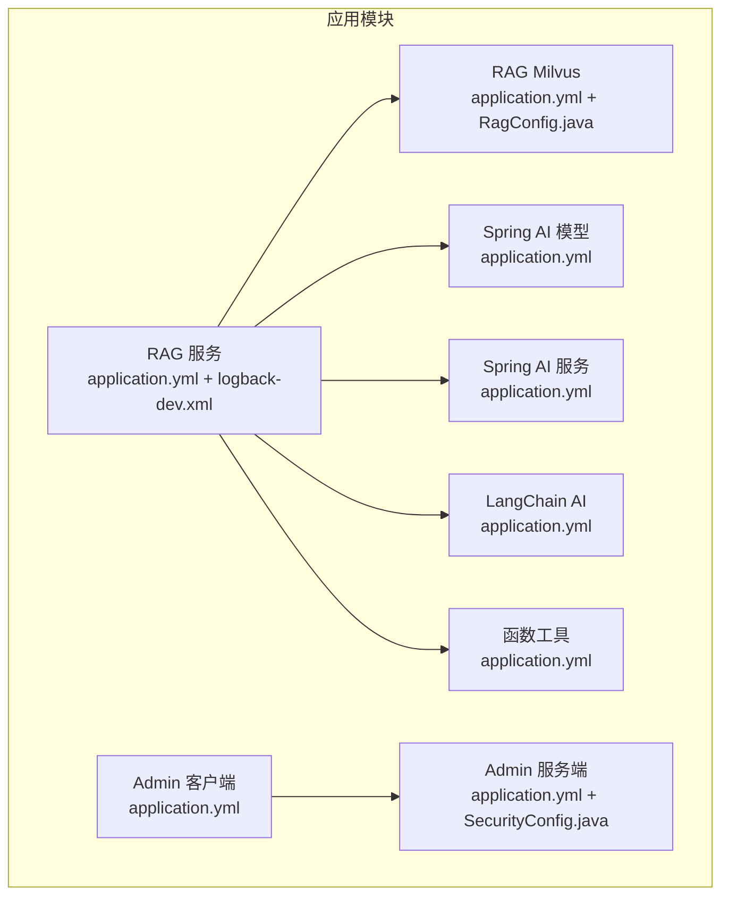
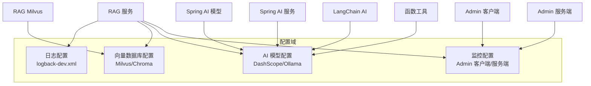
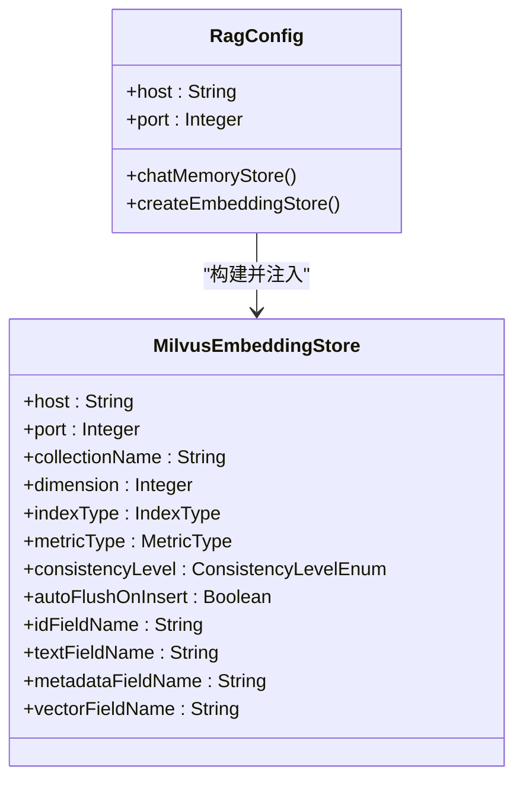
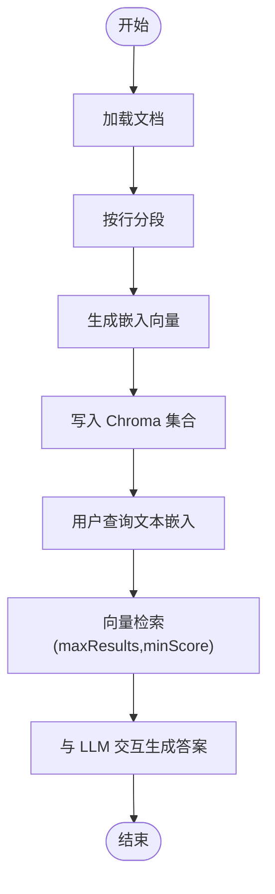
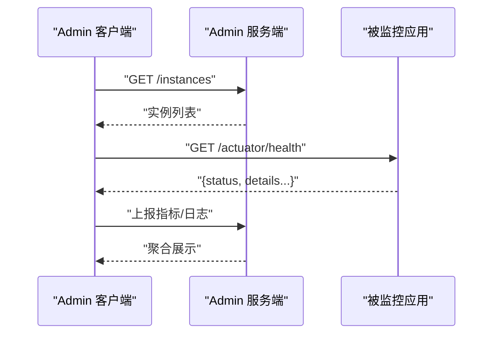
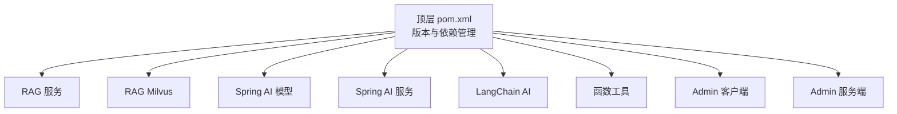

# 配置指南

<cite>
**本文引用的文件**
- [pom.xml](file://pom.xml)
- [application.yml（RAG服务）](file://rag-service/src/main/resources/application.yml)
- [logback-dev.xml（RAG服务）](file://rag-service/src/main/resources/logback-dev.xml)
- [application.yml（RAG Milvus）](file://rag-miluvs/src/main/resources/application.yml)
- [RagConfig.java（RAG Milvus）](file://rag-miluvs/src/main/java/cn/project/base/ragmiluvs/config/RagConfig.java)
- [application.yml（Spring AI 模型）](file://spring-ai-model/src/main/resources/application.yml)
- [application.yml（Spring AI 服务）](file://spring-ai-service/src/main/resources/application.yml)
- [application.yml（LangChain AI）](file://langchain-ai/src/main/resources/application.yml)
- [application.yml（函数工具）](file://function/src/main/resources/application.yml)
- [application.yml（Spring Boot Admin 客户端）](file://spring-admin-client/src/main/resources/application.yml)
- [application.yml（Spring Boot Admin 服务端）](file://spring-admin-service/src/main/resources/application.yml)
- [SecurityConfig.java（Spring Boot Admin 服务端）](file://spring-admin-service/src/main/java/cn/project/base/springadminservice/config/SecurityConfig.java)
- [application.properties（Demo 示例）](file://demo/src/main/resources/application.properties)
- [InitService.java（RAG 服务）](file://rag-service/src/main/java/cn/project/base/ragservice/service/InitService.java)
</cite>

## 目录
1. [简介](#简介)
2. [项目结构](#项目结构)
3. [核心组件](#核心组件)
4. [架构总览](#架构总览)
5. [详细组件分析](#详细组件分析)
6. [依赖分析](#依赖分析)
7. [性能考虑](#性能考虑)
8. [故障排除指南](#故障排除指南)
9. [结论](#结论)
10. [附录](#附录)

## 简介
本指南面向 RAG 服务项目，系统性说明各模块的配置文件结构与关键配置项，涵盖数据库连接、向量数据库、AI 模型与监控配置，并提供开发、测试、生产三类环境的最佳实践、配置优先级与覆盖机制、配置验证方法、故障排除步骤、配置模板与常用组合示例，以及如何在不重启服务的前提下动态调整配置。

## 项目结构
该项目采用多模块 Maven 结构，每个子模块拥有独立的 Spring 配置文件与功能职责。核心模块包括：
- RAG 服务：提供演示与初始化流程，包含日志配置与基础应用信息
- RAG Milvus：集成 Milvus 向量数据库，提供嵌入向量存储与检索能力
- Spring AI 模型：对接 DashScope 等模型服务
- Spring AI 服务：对接本地 Ollama 推理服务
- LangChain AI：基于 LangChain4J 的 DashScope 集成
- 函数工具：DashScope 聊天模型示例
- Spring Boot Admin 客户端/服务端：微服务治理与监控

图表来源
- [application.yml（RAG服务）:1-9](file://rag-service/src/main/resources/application.yml#L1-L9)
- [logback-dev.xml（RAG服务）:1-208](file://rag-service/src/main/resources/logback-dev.xml#L1-L208)
- [application.yml（RAG Milvus）:1-24](file://rag-miluvs/src/main/resources/application.yml#L1-L24)
- [RagConfig.java（RAG Milvus）:1-55](file://rag-miluvs/src/main/java/cn/project/base/ragmiluvs/config/RagConfig.java#L1-L55)
- [application.yml（Spring AI 模型）:1-10](file://spring-ai-model/src/main/resources/application.yml#L1-L10)
- [application.yml（Spring AI 服务）:1-13](file://spring-ai-service/src/main/resources/application.yml#L1-L13)
- [application.yml（LangChain AI）:1-15](file://langchain-ai/src/main/resources/application.yml#L1-L15)
- [application.yml（函数工具）:1-14](file://function/src/main/resources/application.yml#L1-L14)
- [application.yml（Spring Boot Admin 客户端）:1-36](file://spring-admin-client/src/main/resources/application.yml#L1-L36)
- [application.yml（Spring Boot Admin 服务端）:1-6](file://spring-admin-service/src/main/resources/application.yml#L1-L6)
- [SecurityConfig.java（Spring Boot Admin 服务端）:1-31](file://spring-admin-service/src/main/java/cn/project/base/springadminservice/config/SecurityConfig.java#L1-L31)

章节来源
- [pom.xml:11-22](file://pom.xml#L11-L22)

## 核心组件
本节概述各模块的关键配置点与职责边界：
- 应用与日志
  - 应用名称、端口、日志配置与级别
- 数据库与向量库
  - Milvus 连接参数与集合配置
  - Chroma 向量库连接与集合名
- AI 模型与推理
  - DashScope API Key、模型名与选项
  - Ollama 基础地址与模型名
- 监控与治理
  - Admin 客户端/服务端端点暴露与安全策略

章节来源
- [application.yml（RAG服务）:1-9](file://rag-service/src/main/resources/application.yml#L1-L9)
- [logback-dev.xml（RAG服务）:1-208](file://rag-service/src/main/resources/logback-dev.xml#L1-L208)
- [application.yml（RAG Milvus）:1-24](file://rag-miluvs/src/main/resources/application.yml#L1-L24)
- [RagConfig.java（RAG Milvus）:1-55](file://rag-miluvs/src/main/java/cn/project/base/ragmiluvs/config/RagConfig.java#L1-L55)
- [application.yml（Spring AI 模型）:1-10](file://spring-ai-model/src/main/resources/application.yml#L1-L10)
- [application.yml（Spring AI 服务）:1-13](file://spring-ai-service/src/main/resources/application.yml#L1-L13)
- [application.yml（LangChain AI）:1-15](file://langchain-ai/src/main/resources/application.yml#L1-L15)
- [application.yml（函数工具）:1-14](file://function/src/main/resources/application.yml#L1-L14)
- [application.yml（Spring Boot Admin 客户端）:1-36](file://spring-admin-client/src/main/resources/application.yml#L1-L36)
- [application.yml（Spring Boot Admin 服务端）:1-6](file://spring-admin-service/src/main/resources/application.yml#L1-L6)
- [SecurityConfig.java（Spring Boot Admin 服务端）:1-31](file://spring-admin-service/src/main/java/cn/project/base/springadminservice/config/SecurityConfig.java#L1-L31)

## 架构总览
下图展示配置在整体架构中的位置与影响范围，包括日志、向量库、AI 模型与监控等关键配置域。

图表来源
- [logback-dev.xml（RAG服务）:1-208](file://rag-service/src/main/resources/logback-dev.xml#L1-L208)
- [application.yml（RAG Milvus）:1-24](file://rag-miluvs/src/main/resources/application.yml#L1-L24)
- [RagConfig.java（RAG Milvus）:1-55](file://rag-miluvs/src/main/java/cn/project/base/ragmiluvs/config/RagConfig.java#L1-L55)
- [application.yml（Spring AI 模型）:1-10](file://spring-ai-model/src/main/resources/application.yml#L1-L10)
- [application.yml（Spring AI 服务）:1-13](file://spring-ai-service/src/main/resources/application.yml#L1-L13)
- [application.yml（LangChain AI）:1-15](file://langchain-ai/src/main/resources/application.yml#L1-L15)
- [application.yml（函数工具）:1-14](file://function/src/main/resources/application.yml#L1-L14)
- [application.yml（Spring Boot Admin 客户端）:1-36](file://spring-admin-client/src/main/resources/application.yml#L1-L36)
- [application.yml（Spring Boot Admin 服务端）:1-6](file://spring-admin-service/src/main/resources/application.yml#L1-L6)

## 详细组件分析

### 日志配置（RAG 服务）
- 关键点
  - 应用名称与日志配置文件路径
  - MyBatis 日志级别
  - Logback 开发环境配置：控制台与滚动文件输出、按级别分文件、阈值过滤、特定包日志开关
- 参数说明
  - spring.application.name：应用名
  - logging.config：Logback 配置文件路径
  - logging.level.*：包或类的日志级别
  - logback 属性：文件路径、日期模式、级别文件前缀、编码、滚动策略、历史保留与总大小限制
- 最佳实践
  - 开发环境开启 DEBUG/TRACE 以便问题定位
  - 生产环境建议仅保留 ERROR/WARN/INFO，避免过量 IO
  - 对关键业务包单独配置输出，便于审计与排障

章节来源
- [application.yml（RAG服务）:1-9](file://rag-service/src/main/resources/application.yml#L1-L9)
- [logback-dev.xml（RAG服务）:1-208](file://rag-service/src/main/resources/logback-dev.xml#L1-L208)

### 向量数据库配置（Milvus）
- 关键点
  - 连接参数：主机、端口
  - 集合配置：名称、维度、索引类型、相似度度量、一致性级别、字段名映射
  - 注入 Bean：聊天记忆与嵌入存储
- 参数说明
  - milvus.host/port：向量数据库地址与端口
  - collectionName/dimension/indexType/metricType：集合与索引参数
  - consistencyLevel/autoFlushOnInsert：一致性与写入行为
  - id/text/metadata/vector 字段名：向量存储字段映射
- 最佳实践
  - 生产环境启用用户名/密码认证
  - 根据数据规模选择合适索引类型与度量方式
  - 写入批处理与自动刷新策略需结合吞吐与延迟目标调优

图表来源
- [RagConfig.java（RAG Milvus）:1-55](file://rag-miluvs/src/main/java/cn/project/base/ragmiluvs/config/RagConfig.java#L1-L55)
- [application.yml（RAG Milvus）:1-24](file://rag-miluvs/src/main/resources/application.yml#L1-L24)

章节来源
- [application.yml（RAG Milvus）:1-24](file://rag-miluvs/src/main/resources/application.yml#L1-L24)
- [RagConfig.java（RAG Milvus）:1-55](file://rag-miluvs/src/main/java/cn/project/base/ragmiluvs/config/RagConfig.java#L1-L55)

### 向量数据库配置（Chroma，RAG 服务演示）
- 关键点
  - Chroma 嵌入存储：基础 URL、集合名
  - 文档加载与分段：按行分段、嵌入模型（Ollama）
  - 查询与检索：嵌入向量查询、最大返回条数
- 参数说明
  - Chroma baseUrl/collectionName：向量库连接与集合
  - Ollama baseUrl/modelName：嵌入模型与推理模型
  - maxResults/minScore：检索参数
- 最佳实践
  - 在导入阶段批量写入，减少多次往返
  - 根据业务场景调整分段长度与重叠度
  - 生产环境建议将集合名与租户/业务域解耦

图表来源
- [InitService.java（RAG 服务）:38-109](file://rag-service/src/main/java/cn/project/base/ragservice/service/InitService.java#L38-L109)

章节来源
- [InitService.java（RAG 服务）:38-109](file://rag-service/src/main/java/cn/project/base/ragservice/service/InitService.java#L38-L109)

### AI 模型配置（DashScope）
- Spring AI 模型模块
  - spring.ai.dashscope.api-key：API 密钥
  - spring.ai.dashscope.chat.options.model：默认聊天模型
- LangChain AI 模块
  - langchain4j.community.dashscope.chat-model.model-name/api-key：聊天模型
  - langchain4j.community.dashscope.embedding-model.model-name/api-key：嵌入模型
- 函数工具模块
  - spring.ai.dashscope.chat.options.model：默认聊天模型
- 最佳实践
  - 将密钥置于环境变量或外部化配置中心，避免硬编码
  - 根据场景选择合适的模型（如更长上下文或更强推理能力）

章节来源
- [application.yml（Spring AI 模型）:1-10](file://spring-ai-model/src/main/resources/application.yml#L1-L10)
- [application.yml（LangChain AI）:1-15](file://langchain-ai/src/main/resources/application.yml#L1-L15)
- [application.yml（函数工具）:1-14](file://function/src/main/resources/application.yml#L1-L14)

### AI 推理配置（Ollama）
- Spring AI 服务模块
  - spring.ai.ollama.base-url：本地推理服务地址
  - spring.ai.ollama.chat.model：默认聊天模型
  - logging.level.*：调试日志级别
- 最佳实践
  - 本地开发可直接使用 Ollama；生产建议迁移到云端模型服务
  - 调整日志级别以平衡可观测性与性能

章节来源
- [application.yml（Spring AI 服务）:1-13](file://spring-ai-service/src/main/resources/application.yml#L1-L13)

### 监控与治理（Spring Boot Admin）
- Admin 客户端
  - spring.boot.admin.client.url：Admin 服务端地址
  - management.endpoints.web.exposure.include：端点暴露策略
  - management.endpoint.health.show-details：健康检查详情
  - info.*：应用信息元数据
- Admin 服务端
  - server.port：Admin 服务端口
  - SecurityConfig：安全过滤链（登录页、放行路径、CSRF 关闭）
- 最佳实践
  - 仅在受控网络内暴露 Admin 端点
  - 生产环境启用鉴权与 HTTPS

图表来源
- [application.yml（Spring Boot Admin 客户端）:1-36](file://spring-admin-client/src/main/resources/application.yml#L1-L36)
- [application.yml（Spring Boot Admin 服务端）:1-6](file://spring-admin-service/src/main/resources/application.yml#L1-L6)
- [SecurityConfig.java（Spring Boot Admin 服务端）:1-31](file://spring-admin-service/src/main/java/cn/project/base/springadminservice/config/SecurityConfig.java#L1-L31)

章节来源
- [application.yml（Spring Boot Admin 客户端）:1-36](file://spring-admin-client/src/main/resources/application.yml#L1-L36)
- [application.yml（Spring Boot Admin 服务端）:1-6](file://spring-admin-service/src/main/resources/application.yml#L1-L6)
- [SecurityConfig.java（Spring Boot Admin 服务端）:1-31](file://spring-admin-service/src/main/java/cn/project/base/springadminservice/config/SecurityConfig.java#L1-L31)

## 依赖分析
- 版本统一与依赖管理
  - 顶层 pom 统一管理 Spring Boot、Spring AI、LangChain4J、Admin 等版本
  - 子模块按需引入对应 Starter 或依赖
- 关键依赖
  - LangChain4J：嵌入、向量存储、模型集成
  - Spring AI Alibaba：DashScope 集成
  - Spring AI Ollama：本地推理集成
  - Spring Boot Admin：监控与治理

图表来源
- [pom.xml:24-101](file://pom.xml#L24-L101)

章节来源
- [pom.xml:24-101](file://pom.xml#L24-L101)

## 性能考虑
- 日志
  - 生产环境建议关闭 TRACE/DEBUG，仅保留 ERROR/WARN/INFO
  - 合理设置滚动策略与历史保留，避免磁盘压力
- 向量库
  - Milvus：根据数据规模与查询延迟目标选择索引类型与度量方式
  - Chroma：批量写入与分段策略直接影响检索质量与性能
- AI 推理
  - 本地 Ollama 适合开发；生产建议云端模型服务，提升稳定性与扩展性
  - 合理设置检索 topK 与 minScore，平衡召回与准确率

## 故障排除指南
- 日志无法输出或级别不生效
  - 检查 application.yml 中 logging.config 与 logback 配置是否正确
  - 确认 logback 属性（路径、前缀、编码）是否可写
- 向量库连接失败
  - 校验 milvus.host/port 与网络连通性
  - 确认集合名、字段映射与索引配置一致
- AI 模型调用异常
  - 校验 DashScope API Key 是否有效
  - 确认模型名与可用区域匹配
- Admin 无法访问
  - 检查 Admin 客户端是否正确指向 Admin 服务端地址
  - 确认端点暴露策略与安全配置允许访问

章节来源
- [application.yml（RAG服务）:1-9](file://rag-service/src/main/resources/application.yml#L1-L9)
- [logback-dev.xml（RAG服务）:1-208](file://rag-service/src/main/resources/logback-dev.xml#L1-L208)
- [application.yml（RAG Milvus）:1-24](file://rag-miluvs/src/main/resources/application.yml#L1-L24)
- [application.yml（Spring AI 模型）:1-10](file://spring-ai-model/src/main/resources/application.yml#L1-L10)
- [application.yml（Spring AI 服务）:1-13](file://spring-ai-service/src/main/resources/application.yml#L1-L13)
- [application.yml（Spring Boot Admin 客户端）:1-36](file://spring-admin-client/src/main/resources/application.yml#L1-L36)
- [application.yml（Spring Boot Admin 服务端）:1-6](file://spring-admin-service/src/main/resources/application.yml#L1-L6)

## 结论
本指南从配置文件结构、关键参数、最佳实践、优先级与覆盖机制、验证与故障排除等方面，全面梳理了 RAG 服务项目的配置要点。建议在开发、测试、生产三类环境中分别采用不同的日志级别、模型与向量库策略，并通过 Admin 实现统一监控与治理。

## 附录

### 配置优先级与覆盖机制
- Spring Boot 配置优先级（从高到低）
  1) 命令行参数
  2) SPRING_APPLICATION_JSON
  3) 系统环境变量
  4) 操作系统属性
  5) application-{profile}.yml
  6) application.yml
  7) @PropertySource
  8) 默认属性
- 覆盖原则
  - Profile 与非 Profile 文件按上述顺序叠加，后加载项覆盖先加载项同名键
  - 环境变量与系统属性常用于生产覆盖，避免修改代码与资源文件

### 不同环境配置示例（模板）
- 开发环境
  - application.yml：开启 DEBUG 日志、本地 Ollama、DashScope 测试模型
  - logback-dev.xml：控制台输出 + 滚动文件 + TRACE/DEBUG
- 测试环境
  - application.yml：中等日志级别、隔离的向量库集合、受限端点暴露
- 生产环境
  - application.yml：仅 ERROR/WARN/INFO、启用 Admin 安全策略、密钥来自环境变量
  - logback-dev.xml：按级别分文件、滚动策略与历史保留上限

### 动态调整配置（无需重启）
- Admin Actuator
  - 通过 Admin 客户端暴露的 /observe/* 端点查看运行状态与指标
  - 在线调整日志级别（需支持动态刷新的实现）
- 外部化配置中心
  - 将敏感与高频变更项（如模型名、API Key、阈值）迁移至配置中心，实现热更新
- 环境变量覆盖
  - 使用环境变量覆盖 application.yml 中的敏感或可变项，适用于 CI/CD 场景

### 常用配置组合示例
- 本地开发（Ollama + Chroma）
  - spring-ai-service：base-url 指向本地 Ollama，chat.model 指定本地模型
  - rag-service：InitService 中 Chroma baseUrl/collectionName 与嵌入模型
- 云端推理（DashScope + Milvus）
  - spring-ai-model：dashscope.api-key 与 chat.options.model
  - rag-miluvs：milvus.host/port 与 RagConfig 中集合参数

章节来源
- [application.yml（Spring AI 服务）:1-13](file://spring-ai-service/src/main/resources/application.yml#L1-L13)
- [InitService.java（RAG 服务）:38-109](file://rag-service/src/main/java/cn/project/base/ragservice/service/InitService.java#L38-L109)
- [application.yml（Spring AI 模型）:1-10](file://spring-ai-model/src/main/resources/application.yml#L1-L10)
- [application.yml（RAG Milvus）:1-24](file://rag-miluvs/src/main/resources/application.yml#L1-L24)
- [RagConfig.java（RAG Milvus）:1-55](file://rag-miluvs/src/main/java/cn/project/base/ragmiluvs/config/RagConfig.java#L1-L55)