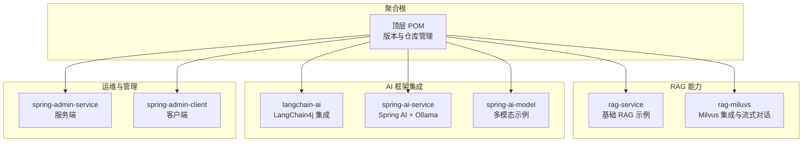
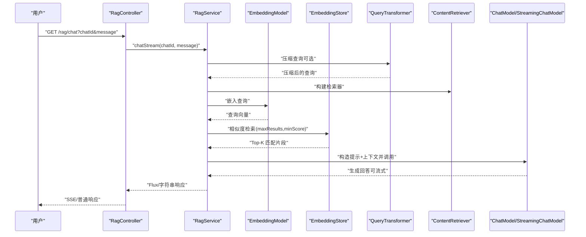
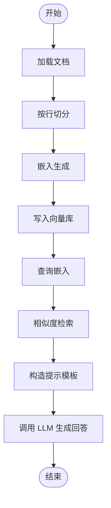
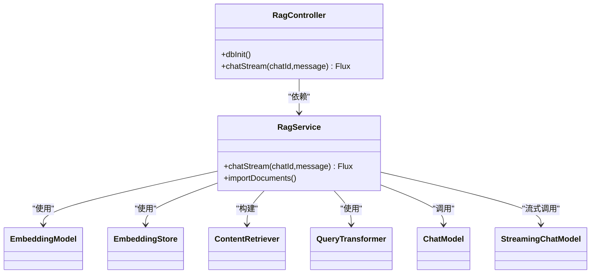
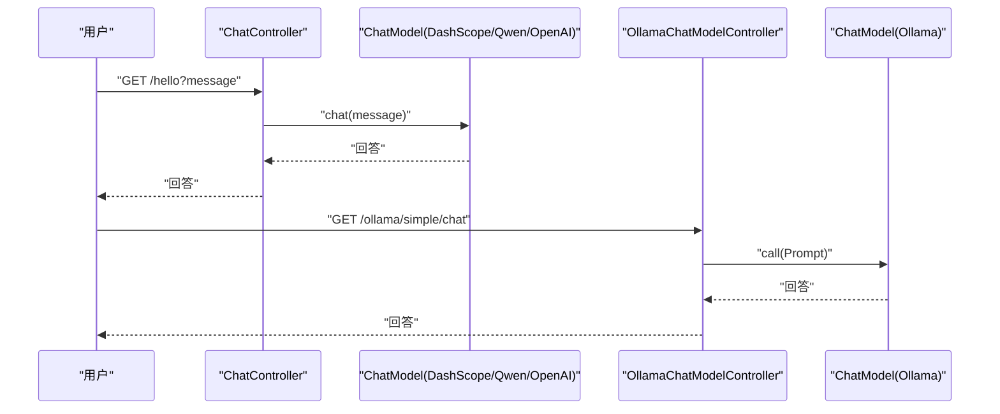
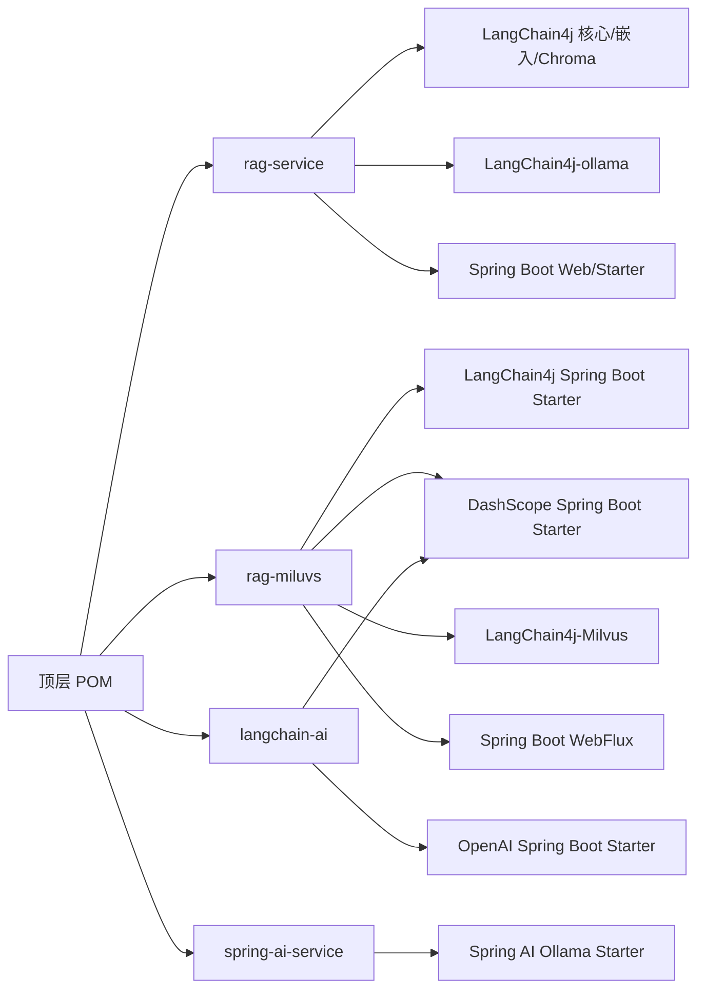

# 项目概述

<cite>
**本文引用的文件**
- [pom.xml](file://pom.xml)
- [rag-service/pom.xml](file://rag-service/pom.xml)
- [rag-miluvs/pom.xml](file://rag-miluvs/pom.xml)
- [langchain-ai/pom.xml](file://langchain-ai/pom.xml)
- [spring-ai-service/pom.xml](file://spring-ai-service/pom.xml)
- [RagServiceApplication.java](file://rag-service/src/main/java/cn/project/base/ragservice/RagServiceApplication.java)
- [RagMiluvsApplication.java](file://rag-miluvs/src/main/java/cn/project/base/ragmiluvs/RagMiluvsApplication.java)
- [LangchainAiApplication.java](file://langchain-ai/src/main/java/cn/project/base/langchainai/LangchainAiApplication.java)
- [SpringAiServiceApplication.java](file://spring-ai-service/src/main/java/cn/project/base/springaiservice/SpringAiServiceApplication.java)
- [InitService.java](file://rag-service/src/main/java/cn/project/base/ragservice/service/InitService.java)
- [RagService.java](file://rag-miluvs/src/main/java/cn/project/base/ragmiluvs/service/RagService.java)
- [RagController.java](file://rag-miluvs/src/main/java/cn/project/base/ragmiluvs/controller/RagController.java)
- [ChatController.java](file://langchain-ai/src/main/java/cn/project/base/langchainai/controller/ChatController.java)
- [OllamaChatModelController.java](file://spring-ai-service/src/main/java/cn/project/base/springaiservice/controller/OllamaChatModelController.java)
</cite>

## 目录
1. [引言](#引言)
2. [项目结构](#项目结构)
3. [核心组件](#核心组件)
4. [架构总览](#架构总览)
5. [详细组件分析](#详细组件分析)
6. [依赖分析](#依赖分析)
7. [性能考虑](#性能考虑)
8. [故障排查指南](#故障排查指南)
9. [结论](#结论)
10. [附录](#附录)

## 引言
本项目是一个基于 Spring Boot 与多套 AI 框架的 RAG（检索增强生成）服务工程，旨在演示如何将文档向量化、相似度检索与 LLM 对话相结合，形成可扩展的知识增强问答系统。项目采用模块化设计，覆盖从本地向量数据库（Chroma/Milvus）到多种大模型提供商（OpenAI、DashScope、Ollama）的完整链路，既适合初学者快速上手，也为进阶开发者提供了可裁剪、可扩展的技术参考。

## 项目结构
项目采用 Maven 多模块聚合结构，顶层 POM 管理统一版本与仓库，各子模块聚焦不同能力域：
- rag-service：展示基础 RAG 流程（文档加载、切分、向量化、检索、提示工程与对话）
- rag-miluvs：基于 LangChain4j 的 Milvus 向量数据库集成与流式对话
- langchain-ai：LangChain4j 集成 DashScope/Qwen 与 OpenAI 的示例
- spring-ai-service：Spring AI 与 Ollama 的简单调用示例
- spring-ai-model：多模态（文本/图像/TTS）能力的示例模块
- spring-admin-service/client：监控与管理端的基础示例

图表来源
- [pom.xml:11-22](file://pom.xml#L11-L22)
- [pom.xml:24-35](file://pom.xml#L24-L35)

章节来源
- [pom.xml:1-171](file://pom.xml#L1-L171)

## 核心组件
- 应用入口与启动
  - 各模块均提供标准的 Spring Boot 启动类，用于独立运行与集成测试。
- RAG 基础流程（rag-service）
  - 文档加载与切分：将本地文档按行或段落切分为可嵌入的片段。
  - 向量化与存储：使用嵌入模型生成向量，并写入向量数据库（Chroma）。
  - 相似度检索：对用户查询进行向量化后在向量库中检索最相关片段。
  - 上下文增强问答：将检索到的上下文拼接到提示模板，调用 LLM 生成回答。
- 流式对话与检索增强（rag-miluvs）
  - 使用 LangChain4j 的 AiServices 与 RetrievalAugmentor 实现“查询压缩 + 向量检索 + LLM 对话”的一体化流式输出。
  - 支持多轮对话记忆与可配置的检索参数（最大结果数、最小分数）。
- 多模型集成（langchain-ai / spring-ai-service）
  - 提供 DashScope/Qwen 与 OpenAI 的直接调用示例。
  - 提供 Ollama 的本地推理调用示例，便于离线与低延迟场景。

章节来源
- [RagServiceApplication.java:1-14](file://rag-service/src/main/java/cn/project/base/ragservice/RagServiceApplication.java#L1-L14)
- [RagMiluvsApplication.java:1-14](file://rag-miluvs/src/main/java/cn/project/base/ragmiluvs/RagMiluvsApplication.java#L1-L14)
- [LangchainAiApplication.java:1-31](file://langchain-ai/src/main/java/cn/project/base/langchainai/LangchainAiApplication.java#L1-L31)
- [SpringAiServiceApplication.java:1-14](file://spring-ai-service/src/main/java/cn/project/base/springaiservice/SpringAiServiceApplication.java#L1-L14)

## 架构总览
下图展示了 RAG 的端到端工作流：从文档入库、向量化与存储，到查询检索与 LLM 生成，以及流式响应输出。

图表来源
- [RagController.java:18-27](file://rag-miluvs/src/main/java/cn/project/base/ragmiluvs/controller/RagController.java#L18-L27)
- [RagService.java:57-90](file://rag-miluvs/src/main/java/cn/project/base/ragmiluvs/service/RagService.java#L57-L90)

## 详细组件分析

### 组件 A：RAG 基础流程（rag-service）
- 功能要点
  - 文档加载与切分：支持按行切分，便于小步处理与调试。
  - 向量化与存储：使用 Ollama 嵌入模型生成向量并写入 Chroma。
  - 检索与问答：对查询进行嵌入，检索 Top-1 片段，拼接提示模板后调用 LLM。
- 关键路径
  - 初始化与主流程：[InitService.java:38-109](file://rag-service/src/main/java/cn/project/base/ragservice/service/InitService.java#L38-L109)
  - 文档加载与切分：[InitService.java:43-56](file://rag-service/src/main/java/cn/project/base/ragservice/service/InitService.java#L43-L56)
  - 向量化与存储：[InitService.java:59-76](file://rag-service/src/main/java/cn/project/base/ragservice/service/InitService.java#L59-L76)
  - 检索与问答：[InitService.java:78-108](file://rag-service/src/main/java/cn/project/base/ragservice/service/InitService.java#L78-L108)

图表来源
- [InitService.java:38-109](file://rag-service/src/main/java/cn/project/base/ragservice/service/InitService.java#L38-L109)

章节来源
- [InitService.java:1-153](file://rag-service/src/main/java/cn/project/base/ragservice/service/InitService.java#L1-L153)

### 组件 B：流式检索增强对话（rag-miluvs）
- 功能要点
  - 使用 AiServices 构建“检索增强生成”对话服务。
  - 支持查询压缩（QueryTransformer）提升检索质量。
  - 支持多轮对话记忆（MessageWindowChatMemory）与 SSE 流式输出。
- 关键路径
  - 控制器接口：[RagController.java:18-27](file://rag-miluvs/src/main/java/cn/project/base/ragmiluvs/controller/RagController.java#L18-L27)
  - 流式对话实现：[RagService.java:57-90](file://rag-miluvs/src/main/java/cn/project/base/ragmiluvs/service/RagService.java#L57-L90)
  - 文档导入与向量入库：[RagService.java:95-116](file://rag-miluvs/src/main/java/cn/project/base/ragmiluvs/service/RagService.java#L95-L116)

图表来源
- [RagController.java:12-28](file://rag-miluvs/src/main/java/cn/project/base/ragmiluvs/controller/RagController.java#L12-L28)
- [RagService.java:35-90](file://rag-miluvs/src/main/java/cn/project/base/ragmiluvs/service/RagService.java#L35-L90)

章节来源
- [RagController.java:1-29](file://rag-miluvs/src/main/java/cn/project/base/ragmiluvs/controller/RagController.java#L1-L29)
- [RagService.java:1-118](file://rag-miluvs/src/main/java/cn/project/base/ragmiluvs/service/RagService.java#L1-L118)

### 组件 C：多模型集成（langchain-ai / spring-ai-service）
- LangChain4j 集成
  - DashScope/Qwen 与 OpenAI 的 ChatModel 使用示例。
- Spring AI + Ollama
  - 通过 Spring AI Starter 快速注入 ChatModel，执行简单对话。
- 关键路径
  - DashScope/Qwen 调用示例：[ChatController.java:18-34](file://langchain-ai/src/main/java/cn/project/base/langchainai/controller/ChatController.java#L18-L34)
  - Ollama 调用示例：[OllamaChatModelController.java:18-22](file://spring-ai-service/src/main/java/cn/project/base/springaiservice/controller/OllamaChatModelController.java#L18-L22)

图表来源
- [ChatController.java:18-34](file://langchain-ai/src/main/java/cn/project/base/langchainai/controller/ChatController.java#L18-L34)
- [OllamaChatModelController.java:18-22](file://spring-ai-service/src/main/java/cn/project/base/springaiservice/controller/OllamaChatModelController.java#L18-L22)

章节来源
- [ChatController.java:1-36](file://langchain-ai/src/main/java/cn/project/base/langchainai/controller/ChatController.java#L1-L36)
- [OllamaChatModelController.java:1-24](file://spring-ai-service/src/main/java/cn/project/base/springaiservice/controller/OllamaChatModelController.java#L1-L24)

## 依赖分析
- 技术栈概览
  - Spring Boot 3.2.0：提供 Web、WebFlux、自动装配与启动能力。
  - Spring AI 1.0.0-M6：简化与多家大模型提供商的集成。
  - LangChain4j 1.9.1：提供文档解析、嵌入、检索、RAG 增强器与流式模型等能力。
  - 向量数据库：Chroma（Java 客户端）与 Milvus（LangChain4j 集成）。
  - 本地推理：Ollama（通过 LangChain4j-ollama 或 Spring AI Ollama Starter）。
- 版本与仓库
  - 顶层 POM 统一管理版本与仓库（含阿里云镜像与 Spring Snapshots）。
  - 各模块按需引入 LangChain4j、Spring AI、Ollama、DashScope 等依赖。

图表来源
- [pom.xml:24-101](file://pom.xml#L24-L101)
- [rag-service/pom.xml:23-79](file://rag-service/pom.xml#L23-L79)
- [rag-miluvs/pom.xml:36-95](file://rag-miluvs/pom.xml#L36-L95)
- [langchain-ai/pom.xml:19-58](file://langchain-ai/pom.xml#L19-L58)
- [spring-ai-service/pom.xml:20-44](file://spring-ai-service/pom.xml#L20-L44)

章节来源
- [pom.xml:1-171](file://pom.xml#L1-L171)
- [rag-service/pom.xml:1-100](file://rag-service/pom.xml#L1-L100)
- [rag-miluvs/pom.xml:1-163](file://rag-miluvs/pom.xml#L1-L163)
- [langchain-ai/pom.xml:1-99](file://langchain-ai/pom.xml#L1-L99)
- [spring-ai-service/pom.xml:1-65](file://spring-ai-service/pom.xml#L1-L65)

## 性能考虑
- 向量检索
  - 合理设置 maxResults 与 minScore，避免过多候选导致上下文过长与延迟上升。
  - 对长文档建议使用段落级切分，提升检索精度与上下文长度控制。
- 嵌入与存储
  - 批量嵌入与批量写入可减少网络往返与 IO 开销。
  - 向量维度与索引策略直接影响检索速度，需结合硬件与数据规模权衡。
- 流式输出
  - 使用 WebFlux 与 SSE 输出可降低首字节延迟，改善用户体验。
- 模型选择
  - 本地 Ollama 适合低延迟与隐私场景；云端模型适合更高质量与多模态场景。

## 故障排查指南
- 启动与端口
  - LangChain4j 应用会在启动时打印访问地址与端口，确认端口占用与防火墙。
- 向量数据库连通性
  - Chroma/Milvus 地址与集合名需与配置一致；检查容器/服务状态与网络可达。
- 嵌入与检索
  - 若检索为空，检查嵌入模型是否可用、向量是否成功写入、minScore 是否过高。
- LLM 连接
  - API Key、模型名与温度等参数需正确配置；本地 Ollama 需确保服务运行。
- 日志与错误
  - 使用模块内日志输出定位问题；必要时开启更详细的日志级别。

章节来源
- [LangchainAiApplication.java:15-28](file://langchain-ai/src/main/java/cn/project/base/langchainai/LangchainAiApplication.java#L15-L28)
- [RagService.java:95-116](file://rag-miluvs/src/main/java/cn/project/base/ragmiluvs/service/RagService.java#L95-L116)
- [InitService.java:131-139](file://rag-service/src/main/java/cn/project/base/ragservice/service/InitService.java#L131-L139)

## 结论
本项目以模块化方式呈现了 RAG 的完整闭环：从文档入库、向量化与检索，到上下文增强与流式对话，覆盖了多模型与多向量库的集成路径。通过 Spring Boot 与 Spring AI/LangChain4j 的组合，既满足快速验证与教学演示，也具备进一步扩展为生产级知识增强问答平台的基础。

## 附录
- 实际使用场景与业务价值
  - 智能客服：基于企业知识库进行精准问答，降低人工成本。
  - 辅助研发：在代码与文档中检索相关信息，提升研发效率。
  - 内容创作：以知识库为背景素材，辅助生成高质量内容。
- 最佳实践
  - 分层设计：将“文档导入/向量入库”与“在线对话”解耦，便于异步与批处理。
  - 参数调优：针对不同业务场景调整切分粒度、检索阈值与提示模板。
  - 监控与可观测：接入日志与指标，持续跟踪检索命中率与响应时间。